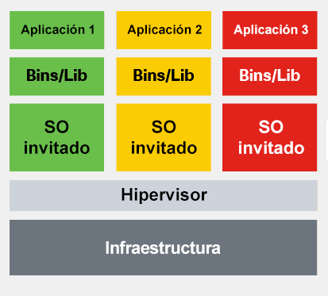
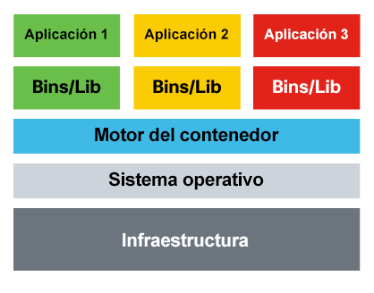
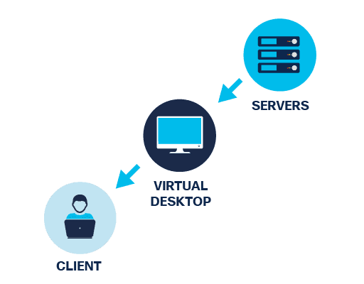
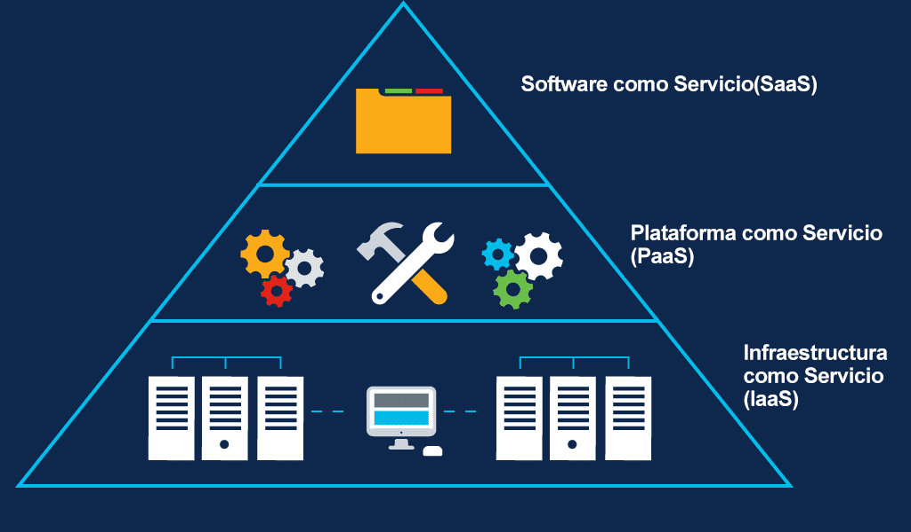

<a href="./00-Curso.md"><< Menú principal del módulo</a>

# 7. Seguridad en la nube
# Virtualización y computación en la nube
El uso de máquinas virtuales y el almacenamiento en la nube son solo algunas de las formas en las que las organizaciones pueden ahorrar tiempo y dinero. Implica mover las aplicaciones y el almacenamiento de los dispositivos físicos al ámbito digital.

Pero, ¿cuáles son los riesgos de seguridad que surgen de la virtualización y cómo podemos administrarlos?

## El entorno virtual
La virtualización beneficia a una organización al disminuir la cantidad de máquinas físicas (por ejemplo, servidores y estaciones de trabajo) necesarias en el entorno de TI. Existen diferentes elementos que pueden conformar un sistema virtual.

### Máquinas virtuales
Un hipervisor es un programa de software o hardware que le permite ejecutar varios sistemas operativos independientes en un sistema físico. Es un componente clave de la virtualización. Hay dos métodos de virtualización:
* Virtualización de hardware (hipervisor de tipo I): el sistema operativo invitado se ejecuta directamente en una plataforma de hardware, bajo el control del sistema host. 
* Virtualización en host (hipervisor de tipo II): una aplicación que se ejecuta en la máquina host se utiliza para crear máquinas virtuales que consisten enteramente en software y no contienen componentes de hardware.

Los entornos de máquinas virtuales utilizan un sistema operativo, por lo que deben parchearse. Las máquinas virtuales comparten hardware y se ejecutan con privilegios muy altos. Tenga en cuenta que un atacante que compromete una máquina virtual puede comprometer la máquina host.

	

### Contenedores
A diferencia de una máquina virtual, un contenedor consiste solo en la aplicación y sus dependencias. Un contenedor utiliza un motor para la emulación del sistema operativo. Docker es una plataforma abierta que utiliza la virtualización a nivel del sistema operativo para distribuir software en paquetes (contenedores). Puede mover contenedores fácilmente y la aplicación se ejecutará. Un software especializado como Kubernetes le permite administrar sus contenedores.

Si un usuario o aplicación tiene privilegios elevados dentro de un contenedor, el sistema operativo subyacente puede verse comprometido.

	

### Infraestructura de equipo de escritorio virtual (VDI)
Los entornos de escritorio de los usuarios se pueden almacenar de forma remota en un servidor utilizando _thin client_ o escritorios virtuales. Esto hace que sea muy fácil crear, eliminar, copiar, archivar o descargar rápidamente configuraciones a través de una red. La virtualización de equipos de escritorio requiere alta disponibilidad y capacidad de almacenamiento.

	

Tenga en cuenta que hay algunas desventajas asociadas con los entornos virtuales. La expansión de máquinas virtuales se produce cuando demasiados servidores virtualizados y poco utilizados consumen más recursos y espacio del necesario para el trabajo que realizan. También es importante protegerse contra la fuga de máquinas virtuales. Esto sucede cuando la máquina virtual se rompe e interactúa con el sistema operativo del host.

## Tecnología basada en la nube
Las tecnologías basadas en la nube permiten a organizaciones como @Apollo acceder a la informática, el almacenamiento, el software y los servidores a través de Internet. Traslada el componente tecnológico de la organización al proveedor de la nube.

Repasemos del módulo 1 los tres modelos principales de servicios de computación que se conocen colectivamente como XaaS ("todo como servicio").

	

### Software como Servicio (SaaS)
El software como servicio (SaaS) permite a los usuarios acceder a las aplicaciones y bases de datos. Los proveedores de la nube administran la infraestructura mientras que los usuarios almacenan datos en los servidores del proveedor de la nube.

### Plataforma como Servicio (PaaS)
La plataforma como servicio (PaaS) permite a una organización acceder de forma remota a las herramientas y servicios de desarrollo utilizados para ofrecer dichas aplicaciones mediante una suscripción.

### Infraestructura como Servicio (IaaS)
Infraestructura como servicio (IaaS) proporciona recursos informáticos virtualizados a través de Internet. El proveedor aloja el hardware, el software, los servidores y los componentes de almacenamiento, y el usuario paga por una suscripción a estos recursos.

## Computación en la nube
Las clasificaciones de computación en la nube se basan en cómo se implementan los modelos de servicio.

### Nube privada
También llamada nube interna, corporativa o empresarial,una nube privada está alojada en una plataforma privada. Una nube privada ofrece a una organización más control sobre sus datos, pero puede ser más costosa que otros servicios de nube debido a los costos de infreaestructura, mantenimiento y administración.

### Nube pública
Una nube pública es alojada por un aproveedor de servicios en una instalación externa. Los usuarios pagan una tarifa mensual o anual para acceder a la nube. Esta opción le cuesta a la organización menos infraestructura, mantenimiento y administración; sin embargo, la organización tiene menos control sobre sus datos.

### Nube híbrida
Una nube híbrida combian la nube privada y la pública ofreciendo el control de los datos de la organización, que siguen alojados en una nube pública.

### Nube comunitaria
Una nube comunitaria es un esfuerzo de colaboración en el que más de una organización comparte y utiliza la misma plataforma. Este tipo de nube está dirigido a las necesidades de un sector como el de servicios de salud o energía.

## Principales amenzas para la computación en la nube
La explosión de dispositivos IoT ha llevado a la computación en la niebla y en el borde.

La __computación en la niebla__ distribuye la computación entre el dispositivo y el centro de datos en la nube. Desempeña un papel fundamental en aplicaciones donde los milisegundos importan, tales como vehículos autónomos, líneas aéreas y aplicaciones de fabricación.

En la computación en la niebla los datos se procesan dentro de un gateway de IoT, o nodo de niebla, que se encuentra dentro de la red de área local. En la __computación de borde__ los datos se procesan en el dispositivo o sensor sin ser transferidos a un centro de datos.

La computación en nube es susceptible de sufrir muchas de las mismas amenazas que afectan a las redes físicas de las empresas. Sin embargo, el entorno de la nube también presenta amenazas únicas.

Por ejemplo, si un atacante compromete con éxito un recurso en la nube, podría hacer lo siguiente:
* Utilizar los recursos de computación en la nube para dirigirse a otras entidades en línea.
* Alojar malware en proveedores de nube respetados que parecerán inofensivos o incluso legítimos.
* Abusar de los servicios en la nube para lanzar ataques DDoS, alojar contenido pirateado, enviar correos electrónicos no deseados y realizar campañas de suplantación de identidad.

A continuación se enumeran algunas amenazas asociadas con la computación en la nube.
* __Violaciones de datos__. Esto ocurre cuando una entidad no autorizada accede a datos confidenciales protegidos.
* __Configuración errónea de la nube__. Esto ocurre cuando el recurso de computación en la nube está configurado incorrectamente, lo que lo hace vulnerable a los ataques.
* __Estrategia deficiente de la arquitectura de seguridad en la nube__. La seguridad de la nube privada es responsabilidad de la organización. Sin embargo, la seguridad de las nubes públicas, las nubes híbridas y las nubes comunitarias se convierte en una responsabilidad compartida entre la organización y el proveedor. Esto puede introducir vulnerabilidades si la arquitectura de seguridad en la nube no se comprende completamente o se implementa correctamente.
* __Credenciales de cuentas comprometidas__. Esto ocurre cuando las cuentas de usuario o los privilegios de acceso no están bien protegidos y son secuestrados por los atacantes. Esto puede generar una importante amenaza a la seguridad si la cuenta tiene altos privilegios. Por ejemplo, en las nubes públicas, una cuenta de servicio tiene el privilegio más alto para acceder y administrar los recursos de la nube. Una cuenta de servicio secuestrada permitiría a un atacante controlar todos los recursos de la nube.
* __Amenaza interna__. Se produce cuando un empleado, contratista o socio comercial pone en peligro el servicio en la nube de forma maliciosa o involuntaria.
* __Interfaz de usuario de software (UI) o interfaz de programación de aplicaciones (API) inseguras__. La computación en la nube utiliza UI y API de software para que los clientes interactúen con sus servicios en la nube. Estas interfaces son los puntos más expuestos a Internet y, por lo tanto, son el objetivo de los atacantes.
* __Visibilidad limitada del uso de la nube__. Esto ocurre cuando el cliente de la nube no tiene visibilidad completa del servicio en la nube, lo que dificulta la identificación de archivos seguros o maliciosos.

# Los dominios de la seguridad en la nube
## Dominios de seguridad en la nube
Hay muchos recursos disponibles que promueven la seguridad de la computación en la nube. Un recurso ampliamente respetado y referenciado es el documento Security Guidance for Critical Areas of Focus in Cloud Computing v4. Desarrollado por Cloud Security Alliance (CSA), promueve las mejores prácticas para garantizar la seguridad dentro de los dominios de computación en la nube. Específicamente, el documento cubre 14 dominios de seguridad en la nube.
* __Conceptos y arquitecturas de la computación en nube__. El dominio define la terminología de la computación en la nube y detalla los marcos lógicos y arquitectónicos generales utilizados en el documento Security Guidance.
* __Gobernanza y gestión del riesgo empresarial__. El dominio describe cuatro áreas afectadas por la computación en la nube:
	* Gestión
	* Administración de riesgos empresariales
	* Administración de riesgos de la información
	* Seguridad de la información
* __Problemas legales, contratos y detección electrónica__. El dominio describe problemas legales asociados con la computación en la nube, incluido el traslado de datos a la nube, la contratación con proveedores de servicios en la nube y el manejo de solicitudes de detección electrónica en litigios.
* __Gestión de Cumplimiento y Auditoría__. El dominio describe los desafíos de ofrecer, medir y comunicar los cumplimientos cuando las organizaciones migran de los centros de datos tradicionales a la nube.
* __Gobernanza de la información__. El dominio describe la necesidad de garantizar que el uso de datos e información cumpla con las políticas, los estándares y la estrategia de la organización, incluidos los objetivos normativos, contractuales y comerciales.
* __Plano de administración y continuuidad comercial__. El dominio describe la necesidad de proteger el plano de administración de computación en la nube (es decir, los protocolos y los recursos utilizados para administrar la nube). También describe la continuidad del negocio y los procedimientos de recuperación de desastres que deben utilizar el proveedor y el cliente de la nube.
* __Seguridad como Servicio__. El dominio cubre los servicios de seguridad en constante evolución que se ofrecen desde la nube.
* __Seguridad de la infraestructura__. El dominio describe los aspectos específicos de seguridad de la infraestructura en la nube y los fundamentos para operar con seguridad en la nube.
* __Virtualización y contenedores__. El dominio describe la necesidad de proteger la tecnología de virtualización y los recursos virtuales que son la base para la computación en la nube.
* __Respuesta ante los incidentes__. El dominio describe los aspectos críticos de la respuesta a incidentes (IR), incluyendo el ciclo de vida de la respuesta a incidentes y las consideraciones para los que responden cuando trabajan en un entorno de nube.
* __Seguridad de aplicación__. El dominio proporciona orientación sobre cómo crear e implementar de manera segura aplicaciones en entornos de computación en la nube, específicamente para PaaS e IaaS.
* __Seguridad y cifrado de datos__. La seguridad de los datos debe basarse en el riesgo, ya que no es apropiado proteger todo por igual. El dominio describe los controles relacionados con la seguridad de los datos en sí, de los cuales el cifrado es uno de los más importantes.
* __Gestión de identidad, derechos y acceso (IAM)__. El dominio describe cómo la identidad de la nube es diferente de la administración de identidad tradicional.
* __Tecnologías relacionadas__. El dominio proporciona antecedentes y recomendaciones para las tecnologías que dependen casi exclusivamente de la computación en nube para funcionar y para las tecnologías que no dependen necesariamente de la nube pero que se ven habitualmente en las implementaciones de la nube.

En el siguiente tema analizaremos tres de estos dominios con más detalle.

# Seguridad de la infraestructura en la nube
## Seguridad de la infraestructura
El dominio de seguridad de la infraestructura describe aspectos específicos de la seguridad de la infraestructura en la nube y la base para operar de manera segura en la nube.

La infraestructura de la nube es la base sobre la cual se construyen e implementan los recursos de la nube virtualizados, tales como cómputo, redes y almacenamiento de datos.

La infraestructura en la computación en la nube tiene dos capas principales:
* El cómputo físico y lógico (CPU, memoria, etc.), las redes y el almacenamiento se combinan para crear una nube.
* La infraestructura virtual administrada por un usuario de la nube, es decir, los recursos de cómputo, red y almacenamiento a los que accede desde los conjuntos de recursos.

Debido a la naturaleza de la computación en la nube, las medidas de seguridad de la infraestructura tradicional basadas en el control de rutas de comunicación física y la inserción de dispositivos de seguridad no funcionan.

Las herramientas personalizadas de seguridad en la nube incluyen dispositivos virtuales y agentes de software que se utilizan para proteger los entornos virtuales. Sin embargo, estas herramientas pueden introducir cuellos de botella al acceder a los recursos o llevar a una sobrecarga del procesador. Por lo tanto, el uso de dispositivos virtuales debe evaluarse e implementarse cuidadosamente.

Las redes definidas por software (SDN) permiten nuevos tipos de controles de seguridad y proporcionan una ganancia general para la seguridad de la red, incluyendo:
* Fácil aislamiento de la red sin restricciones de hardware físico. 
* Los firewalls de SDN (grupos de seguridad en la computación en la nube) se aplican a los activos según criterios más flexibles que los firewalls de hardware. 

## Responsabilidades de seguridad en la nube
La computación en la nube implica clientes y proveedores de servicios en la nube (CSP). Por lo tanto, la seguridad de la nube funciona en un modelo de responsabilidad compartida.

Un CSP es responsable de los servicios en la nube para el cliente, pero el cliente es responsable del resto de los servicios. El reparto de responsabilidades varía seg´un el tipo de implementación en la nube.

La siguiente tabla muestra la responsabilidad de implementación de seguridad entre un cliente y un CSP en diferentes modelos de servicio en la nube.

__Responsabilidad sobre la seguridad__|__En las instalaciones__|__IaaS__|__PaaS__|__SaaS__
:-|:-|:-|:-|:-|
Datos|Cliente|Cliente|Cliente|Cliente
Puntos finales|Cliente|Cliente|Cliente|Compartido
Gestión de identidades|Cliente|Cliente|Compartido|Compartido
Aplicación|Cliente|Cliente|Compartido|CSP
Control de la red|Cliente|Cliente|Compartido|CSP
Sistema operativo|Cliente|Cliente|CSP|CSP
Infraestructura física|Cliente|CSP|CSP|CSP

## Otras consideraciones sobre la seguridad de la infraestrucutra en la nube
Estas son otras consideraciones de seguridad
* __Políticas de seguridad de la compañía__. Una organización puede permitir que los usuarios descarguen herramientas de software desconocidas. Estas aplicaciones no autorizadas pueden aumentar la productividad de los empleados al permitirles descargar y usar sus herramientas de software favoritas. Sin embargo, las aplicaciones no supervisadas pueden crear brechas de seguridad y puntos ciegos. Las políticas de seguridad establecidas y bien definidas por la empresa y la formación de los usuarios son formas eficaces de gestionar las aplicaciones desconocidas.
* __Seguridad en capas__. Los recursos de la nube se pueden ver en cuatro capas: hardware, infraestructura, plataforma y capas de aplicaciones. Se pueden aplicar estrategias de defensa en profundidad a cada una de estas capas. Algunas opciones de seguridad por capas son:
	* Las plataformas en la nube generalmente tienen seguridad integrada a nivel de la plataforma para proteger los recursos de la nube del cliente. Por ejemplo, algunos CSP proporcionan un servicio DDoS integrado que los clientes no necesitan configurar.
	* Una nube privada virtual asigna subredes privadas que están lógicamente aisladas de Internet.
	* Si bien los clientes no tendrán acceso para configurar dispositivos de firewall físicos, los CSP generalmente proporcionan funciones de firewall equivalentes, o firewalls virtuales, tales como reglas de denegación y permiso y grupos de seguridad a nivel de host.
	* Los registros de flujo se utilizan para supervisar el tráfico que cruza las interfaces de red individuales.
	* Las VPN se utilizan para proporcionar a los usuarios remotos acceso a los recursos de la nube, así como conexiones de sitio a sitio utilizadas en escenarios multi-nube, o conexiones entre una nube y los centros de datos locales.
	* Los servicios de gestión de identidades y accesos (IAM) permiten gestionar las credenciales de los usuarios y la autenticación y autorización de los mismos. El uso adecuado de IAM es fundamental para proteger los recursos de la nube contra los abusos.
* __Microsegmentación__. La microsegmentación (también denominada hipersegregación) aprovecha las topologías de red virtuales para ejecutar redes múltiples, más pequeñas y aisladas, sin incurrir en costos adicionales de hardware. Dado que las redes están totalmente definidas en software sin muchos de los problemas tradicionales de direccionamiento, es mucho más factible ejecutar estos entornos múltiples definidos por software. Las técnicas de microsegmentación permiten un control más granular de la seguridad del tráfico y los flujos de trabajo dentro de la nube.

# Seguridad de aplicaciones en la nube
## Desarrollo de aplicaciones
Para mantener la seguridad en todas las etapas del desarrollo de aplicaciones es necesario seguir un proceso sólido.

### Desarrollo y prueba
El software se desarrolla y actualiza en un entorno de desarrollo, donde se puede desarrollar, probar y depurar antes de implementarlo. Un entorno de desarrollo es menos restrictivo que el entorno real y tiene un nivel de seguridad más bajo. El software de control de versiones ayuda a seguir y gestionar los cambios en el código del software. Los desarrolladores también pueden trabajar en un entorno aislado (sandbox) para que el código no se sobrescriba mientras lo desarrollan. 

Durante las pruebas, los desarrolladores observan cómo interactúa el código con el entorno normal. El control de calidad (QA) puede encontrar defectos en el software. Es mucho más fácil corregir cualquier defecto encontrado en esta fase.

### Ensayo y producción
Los entornos de ensayo deben coincidir con el entorno de producción de la organización.

Al realizar las pruebas en un entorno de ensayo, los desarrolladores pueden verificar que el software se ejecuta con la configuración de seguridad requerida. Después de que el desarrollador ejecute y pruebe la seguridad, el programa puede desplegarse en producción.

### Aprovisionamiento y desaprovisionamiento
El aprovisionamiento es la creación o actualización de software. El desaprovisionamiento es su eliminación. Una organización puede utilizar un portal de autoservicio para automatizar el aprovisionamiento y desaprovisionamiento de software.

## Técnicas de codificación de seguridad
Al codificar las aplicaciones, los desarrolladores utilizan varias técnicas para validar que se cumplen todos los requisitos de seguridad.
* __Normalización__. La normalización se utiliza para organizar los datos en una base de datos y ayudar a mantener su integridad. La normalización convierte una cadena de entrada a su forma más simple conocida para garantizar que todas las cadenas tengan representaciones binarias únicas y que se identifique cualquier entrada maliciosa.
* __Procedimientos almacenados__. Un procedimientoa almacenado es un grupo de sentencias SQL precompiladas almacenadas en una base de datos que ejecutan una tarea. Si utiliza un stored procedure para aceptar parámetros de entrada de clientes que utilizan datos de entrada diferentes, reducirá el tráfico de red y obtendrá resultados más rápidos.
* __Ofuscación y camuflaje__. Un desarrollador puede utilizar la ofuscación y el camuflaje para evitar que el software sea objeto de ingeniería inversa. La ofuscación oculta los datos originales con caracteres o datos aleatorios. El camuflaje sustituye los datos sensibles por datos ficticios realistas.
* __Reutilización del código__. La reutilización del código significa utilizar el software existente para construir un nuevo software, ahorrando tiempo y costos de desarrollo. Sin embargo, hay que tener cuidado para evitar la introducción de vulnerabilidades.
* __SDK__. Las bibliotecas de terceros y los kits de desarrollo de software (SDK) proporcionan un repositorio de código útil para que el desarrollo de aplicaciones sea más rápido y barato. El inconveniente es que cualquier vulnerabilidad en los SDK o en las bibliotecas de terceros puede afectar potencialmente a muchas aplicaciones.

## Validación de entrada
El control del proceso de introducción de datos es fundamental para mantener la integridad de la base de datos. Muchos ataques se ejecutan contra una base de datos e insertan datos con formato incorrecto. Estos ataques pueden confundir, bloquear o hacer que la aplicación divulgue demasiada información al atacante. Desplácese hacia abajo para ver un ejemplo - en este caso, un ataque de entrada automatizado.

Los clientes rellenan un formulario web para suscribirse a un boletín de noticias. Una aplicación de base de datos genera y envía automáticamente confirmaciones por correo electrónico a los clientes. Cuando los clientes reciben el correo electrónico con un enlace URL para confirmar su suscripción, los atacantes han modificado el enlace URL. 

Estas modificaciones pueden cambiar el nombre de usuario, la dirección de correo electrónico o el estado de suscripción de los clientes cuando hacen clic para confirmar su suscripción. De este modo, cuando el correo electrónico es devuelto al host, éste recibe información falsa de la que podría no ser consciente si no comprueba cada dirección de correo electrónico con la información de suscripción.

Los hackers pueden automatizar este ataque para inundar la aplicación web con miles de suscriptores no válidos a la base de datos del boletín.

## Reglas de validación
Una regla de validación verifica que los datos se incluyan en los parámetros definidos por el diseñador de la base de datos. Una regla de validación ayuda a garantizar la integridad, la precisión y la coherencia de los datos. Los criterios utilizados en una regla de validación incluyen los siguientes:
* Tamaño: Controla la cantidad de caracteres en un elemento de datos
* Formato: Controla que los datos se ajusten a un formato específico
* Coherencia: Controla la coherencia de los códigos en los elementos de datos relacionados
* Rango: Controla que los datos se encuentran dentro de un valor mínimo y un valor máximo
* Dígito de control: Proporciona un cálculo adicional para generar un dígito de control para la detección de errores.

## Controles de integridad

	

* __Cómo funciona una suma de comprobación (checksum)__. Una suma de comprobación verifica la integridad de los archivos, o cadenas de caracteres, antes y después de que se transfieran entre dispositivos a través de una red local o de Internet. Las sumas de comprobación convierten cada pieza de información en un valor y suman el total. Para comprobar la integridad de los datos, un sistema receptor repite el proceso. Si las dos sumas son iguales, los datos son válidos. Si no, se ha producido un cambio en algún lugar a lo largo de la línea.
* __Funciones de _hash___. Las funciones de hash comunes incluyen MD5, SHA-1, SHA-256 y SHA-512. Estos utilizan algoritmos matemáticos complejos para comparar datos con un valor hash. Por ejemplo, después de descargar un archivo, el usuario puede verificar la integridad del mismo comparando los valores hash de la fuente con los generados por cualquier calculadora de hash.
* __Control de versiones__. Las organizaciones utilizan el control de versiones para evitar cambios accidentales realizados por usuarios autorizados. El control de versiones significa que dos usuarios no pueden actualizar el mismo objeto, como un archivo, un registro de base de datos o una transacción, exactamente al mismo tiempo. Por ejemplo, el primer usuario que abre un documento tiene permiso para modificarlo; la segunda persona que intente abrirlo mientras el primer usuario sigue trabajando en él sólo podrá acceder a una versión de solo lectura.
* __Copias de respaldo__. Las copias de respaldo precisas permiten mantener la integridad de datos si los datos se dañan. Una organización necesita verificar su proceso de copia de seguridad para garantizar la integridad de la misma.
* __Autorización__. La autorización determina quién tiene acceso a los recursos de una organización según lo que necesita saber. Por ejemplo, los permisos de archivos y los controles de acceso del usuario garantizan que solo ciertos usuarios pueden modificar los datos. Un administrador puede configurar permisos de solo lectura para un archivo. Como resultado, un usuario con acceso a ese archivo no puede realizar ningún cambio.

Los datos comprometidos pueden amenazar la seguridad de sus dispositivos y sistemas.

Una verificación de integridad puede medir la consistencia de los datos en un archivo, imagen o registro para garantizar que no se haya dañado. La verificación de integridad realiza una función hash para tomar una instantánea de los datos y luego usarla para garantizar que los datos no hayan cambiado. Un checksum es un ejemplo de una función de hash.

## Otras prácticas de seguridad de las aplicaciones
¿Cómo puede estar seguro de que un software que está instalando es auténtico o de que la información es segura cuando navega por Internet?

### Firma de código
La firma del código ayuda a demostrar que una pieza de software es auténtica.

Los ejecutables deseñados para instalarse y ejecutarse en un dispositivo se firman digitalmente para validar la identidad del autor y garantizar que el código del software no ha cambiado desde que se firmó.

### Cookies seguras
El uso de cookies seguras protege la informació alamacenada en las cookies de los piratas informáticos.

Cuando sus sistema cliente interactúa con un servidor, el servidor envía una respuesta HTTP que indica a su navegador que cree al menos una cookie. La cookie almacena entonces los datos para futuras solicitudes mientras usted navega por ese sitio web.

Los desarrolladores web deberían utilizar cookies con HTTPS para asegurar las cookies y evitar que se transmitan a través de HTTP sin cifrar.

## Práctica de Laboratorio - Recomendar una solución de seguridad en la nube
* <a href="./notes/lab_solucion_seguridad_nube.md" target="_blank">Congurar ACL de IPv4 estándar con nombre</a>

# Seguridad de datos en la nube
## Estado de los datos
El Dominio de Estados de los Datos describe los controles relacionados con la seguridad de los datos en sí, de los cuales el cifrado y el hash son los más importantes.

Los datos del cliente deben estar protegidos en los siguientes tres estados:
* __Datos en reposo__. Se refiere a los datos que están almacenados. Los datos están en este estado cuando ningún usuario o proceso accede a ellos, los solicita o los modifica. Los datos en reposo pueden almacenarse en dispositivos locales tales como un disco duro en una computadora, o en una red centralizada tal como el servidor de una organización. En la computación en nube, los datos en reposo pueden almacenarse en una nube y son accesibles desde cualquier ordenador conectado a Internet, normalmente con una suscripción. Todos los datos que no están en tránsito ni en proceso se consideran datos en reposo.
* __Datos en tránsito__. Se refiere a los datos que se transmiten. Por lo tanto, los datos no están en reposo ni se están procesando. La transmisión puede realizarse dentro de un mismo servidor a lo largo de las líneas de bus de su placa madre, entre dispositivos de una misma red, o entre redes y posiblemente a través de Internet. El uso de criptografía y hash para proteger los datos en tránsito es fundamental para la computación en la nube.
* __Datos en proceso__. Esto se refiere a los datos durante la entrada, la modificación, el cómputo o el resultado. Los datos están en este estado cuando no están en tránsito ni en reposo. Por lo tanto, se trata de datos que se están procesando.

## Criptografía
La criptografía es la ciencia de crear y descifrar códigos secretos.

Al almacenar y transmitir datos cifrados, solo el destinatario previsto puede leerlos o procesarlos, y solo si tiene el conocimiento adecuado del secreto utilizado en el algoritmo de cifrado.

La encriptación es el proceso de codificar los datos de modo que las personas no autorizadas no puedan leerlos fácilmente.

Cuando se activa la encriptación, los datos legibles se denominan texto plano, mientras que la versión encriptada es el texto cifrado o ciphertext. La encriptación convierte el mensaje legible de texto simple en texto cifrado, que es el mensaje ilegible, oculto. El descifrado invierte el proceso.

El cifrado requiere una clave que desempeña un papel fundamental a la hora de cifrar y descifrar un mensaje. Las personas que poseen la clave pueden descifrar el texto cifrado a texto simple.

Existen dos clases de algoritmos de encriptación:
* Los algoritmos de cifrado simétrico utilizan la misma clave precompartida para cifrar y descifrar datos, un método también conocido como cifrado de clave privada. El Advanced Encryption Standard (AES) es un algoritmo de cifrado simétrico que tiene un tamaño de bloque fijo de 128 bits con un tamaño de clave de 128, 192 o 256 bits. El gobierno de los EE. UU. utiliza el AES para proteger la información clasificada.
* Los algoritmos de cifrado asimétrico utilizan una clave para el cifrado que es diferente de la clave utilizada para el descifrado. Los algoritmos de cifrado asimétrico incluyen Rivest-Shamir-Adleman (RSA), Diffie-Hellman, EIGamal y la criptografía de curva elíptica (ECC).

## Hashing
El hash es una herramienta que garantiza la integridad de los datos tomando datos binarios (el mensaje) y produciendo una representación de longitud fija llamada valor hash (resumen del mensaje).

Las funciones de hash son funciones unidireccionales utilizadas para verificar y garantizar la integridad de los datos. Una herramienta de hash también puede verificar la autenticación. Funciona mediante el uso de una función de hash criptográfico para reemplazar las contraseñas de texto plano o las claves de cifrado.

Una función de hash criptográfica tiene las siguientes propiedades:
* La entrada puede ser de cualquier longitud.
* La salida tiene una longitud fija.
* La función de hash es unidireccional y es irreversible.
* Dos valores de entrada diferentes casi nunca darán como resultado el mismo hash.

Instituto Nacional de Normas y Tecnología (NIST) de los Estados Unidos desarrolló SHA, el algoritmo especificado en el Estándar de hash seguro (SHS). NIST publicó SHA-1 en 1994.
__Nota__: Message Digest 5 (MD5) era otro algoritmo de hash popular que ya no se considera seguro.

SHA-2 reemplazó a SHA-1 por cuatro funciones de hash adicionales para componer la familia SHA:
* SHA-224 (224 bits)
* SHA-256 (256 bits)
* SHA-384 (384 bits)
* SHA-512 (512 bits)

SHA-2 es un algoritmo más sólido y reemplaza a MD5. SHA-256, SHA-384 y SHA-512 son los algoritmos de próxima generación.

# Protección de máquinas virtuales
## Protección de máquinas vituales
Las máquinas virtuales (VMs o instancias VM), al igual que una computadora física, requieren parches, actualizaciones y medidas antimalware para protegerlas de amenazas externas. Dependiendo de las herramientas específicas disponibles en una plataforma, la nube ofrece opciones de seguridad adicionales para proteger las máquinas virtuales.
* __Planifique la ubicación de la subred__. Elija cuidadosamente la subred para cada instancia para que solo tenga el acceso necesario al mundo exterior.
* __Deshabilite los puertos y servicios innecesarios__. Solo habilite los puertos y servicios necesarios para reducir la exposición innecesaria al exterior.
* __Aplicar la gestión y las políticas de las cuentas__. El SO en una VM tiene cuentas de usuario predeterminadas. Desactive las cuentas de usuario predeterminadas y cree cuentas de usuario con las políticas de administración de cuentas recomendadas, tales como complejidad de contraseña y acceso con privilegios mínimos.
* __Instale software antivirus/antimalware y manténgalo actualizado__. Esto puede lograrse a través del sistema operativo de la máquina virtual o puede estar disponible como servicio desde la plataforma en la nube.
* __Instalar un firewall basado en host/software e IDS/IPS__. Esto puede lograrse a través del sistema operativo VM o puede estar disponible como servicio desde la plataforma en la nube.

## Protección de las máquinas virtuales de los ataques de expansión de máquinas virtuales
Es un proceso relativamente fácil crear instancias de máquinas virtuales en una nube. Sin embargo, esto puede llevar a un problema de expansión de máquinas virtuales, donde una organización tiene muchas instancias de máquinas virtuales que no se administran correctamente. Por ejemplo, es una práctica común crear varias instancias de máquinas virtuales cuando se inicia un proyecto solo para probar diferentes opciones. Es posible que algunas de estas máquinas virtuales ya no se utilicen pero se dejen en funcionamiento. Si estas instancias en ejecución no se monitorean y mantienen, eventualmente quedan desactualizadas y son vulnerables a los ataques.

Un cliente de computación en nube debe implementar políticas para registrar y auditar los recursos de la nube que se utilizan. La expansión de máquinas virtuales no solo presenta riesgos potenciales sino que también consume servicios en la nube innecesariamente, tales como instancias de máquinas virtuales, almacenamiento y direcciones IP públicas no asignadas. Al registrar el uso de recursos de la nube, monitorear las máquinas virtuales en ejecución y auditar su uso real, una organización puede administrar y proteger mejor las máquinas virtuales que realmente necesita.

# Resumen
## Virtualización y computación en la nube
Un hipervisor es un programa de software o hardware que tiene varios sistemas operativos independientes en un solo sistema físico. Hay dos tipos de hipervisores: el tipo 1 es virtualización por hardware y el tipo 2 es virtualización en host. Las tecnologías basadas en la nube permiten que las organizaciones accedan a la computación, el almacenamiento, el software y los servidores a través de Internet. Los tres modelos principales de servicios de computación en la nube son SaaS, PaaS e IaaS. Las clasificaciones de computación en la nube se basan en cómo se implementan los modelos de servicio. Incluyen la nubes públicas, privadas, híbridas y comunitarias. Los entornos de la nube tienen sus propias amenazas únicas, que incluyen violaciones de datos, configuración incorrecta de la nube, arquitectura de seguridad deficiente, credenciales de cuenta comprometidas, amenaza interna, API o interfaz de usuario de software insegura y uso limitado de la nube.

## Los dominios de la seguridad en la nube
El documento del CSA titulado Security Guidance for Critical Areas of Focus in Cloud Computing v4 promueve las mejores prácticas para garantizar la seguridad en los 14 dominios de computación en la nube.

## Seguridad de la infraestructura en la nube
El dominio de seguridad de la infraestructura describe aspectos específicos de la seguridad de la infraestructura en la nube y la base para operar de manera segura en la nube. La infraestructura de la computación en nube tiene dos capas principales: La computación física y lógica (CPU, memoria, etc.), las redes y el almacenamiento que se combinan para crear una nube, y la infraestructura virtual gestionada por un usuario de la nube, es decir, los activos de computación, red y almacenamiento a los que acceden desde los grupos de recursos. Un CSP es responsable de los servicios en la nube para el cliente, pero el cliente es responsable del resto de los servicios. El reparto de responsabilidades varía según el tipo de implementación en la nube. Las políticas de seguridad establecidas y bien definidas por la empresa y la formación de los usuarios son formas eficaces de gestionar las aplicaciones desconocidas. Los recursos de la nube se pueden ver en cuatro capas: hardware, infraestructura, plataforma y capas de aplicaciones. Se pueden aplicar estrategias de defensa en profundidad a cada una de estas capas. La microsegmentación aprovecha las topologías de red virtuales para ejecutar redes múltiples, más pequeñas y aisladas, sin incurrir en costos adicionales de hardware.

## Seguridad de las aplicaciones en la nube
Application Development Domain proporciona orientación sobre cómo crear e implementar de manera segura aplicaciones en entornos de computación en la nube tales como PaaS e IaaS. Existen varias técnicas para validar los requisitos de seguridad al codificar aplicaciones, entre ellas: normalización, stored procedure, ofuscación y camuflaje, reutilización de código y SDK. El control de la entrada de datos ayuda a mantener la integridad de la base de datos. Las reglas de validación ayudan a garantizar la seguridad de las bases de datos verificando si los datos cumplen con ciertas reglas cuando se ingresan en un campo. Las verificaciones de integridad miden la consistencia de los datos en un archivo, una imagen o un registro para garantizar que no se hayan dañado. Un checksum es un ejemplo de una función de hash.

## Seguridad de datos en la nube
El Dominio de Estados de los Datos describe los controles relacionados con la seguridad de los datos en sí, de los cuales el cifrado y el hash son los más importantes. Los estados de los datos son: datos en reposo, datos en tránsito y datos en proceso. La criptografía es la ciencia de crear y descifrar códigos. Hay dos clases de algoritmos de cifrado: simétrico y asimétrico. El hash es una herramienta que garantiza la integridad de los datos tomando datos binarios (el mensaje) y produciendo una representación de longitud fija llamada valor hash (resumen del mensaje). La integridad garantiza que los datos estén completos e inalterados en el momento de su adquisición.

## Protección de máquinas virtuales
Para proteger las máquinas virtuales: planifique la ubicación en la subred, desactive los puertos y servicios innecesarios, aplique políticas de gestión de cuentas, instale software antivirus/antimalware y manténgalo actualizado, e instale firewalls basados en host/software e IDS/IPS. VM Sprawl es cuando una organización tiene muchas instancias de máquinas que no se gestionan adecuadamente. Es posible que algunas de estas máquinas virtuales ya no se utilicen pero se dejen en funcionamiento. Si estas instancias en ejecución no se monitorean y mantienen, eventualmente quedan desactualizadas y son vulnerables a los ataques.

# Enlaces de interés
 
 
 
 
 
 
 
 
 
 
 
<a href="#7-seguridad-en-la-nube">⬆️</a>
<a href="./00-Curso.md"><< Menú principal del módulo</a>