<a href="./00-Curso.md"><< Menú principal del módulo</a>

# 8. Criptografía
# Confidencialidad
## Confidencialidad de los datos
Hay dos clases de encriptación utilizadas para proporcionar confidencialidad a los datos; simétrica y asimétrica Estas dos clases se diferencian en cómo utilizan las claves.

Los algoritmos de encriptación simétrica, como Encriptado Estandar de datos ( Data Encryption Standard DES), 3DES y Encriptado Avanzado de Datos ( Advanced Encryption Standard AES) se basan en la premisa de que cada parte que se comunica conoce la clave precompartida. La confidencialidad de los datos también se puede garantizar utilizando algoritmos asimétricos, incluidos Rivest, Shamir, Adleman (RSA) y la Infraestructura de Clave Pública (public key infrastructura PKI).

_Nota_: DES es un algoritmo obsoleto y no debe usarse. 3DES debe evitarse si es posible.

A continuación se destacan las diferencias entre encriptado simétrico y asimétrico.
* __Cifrado simétrico__
	* Utiliza la misma clave para cifrar y descifrar los datos.
	* Las longitudes de clave son cortas (de 40 bits a 256 bits).
	* Más rápido que la encriptación asimétrica.
	* Suele usarse para encriptar datos masivos, como el tráfico de la VPN.
* __Cifrado asimétrico__
	* Utiliza claves diferentes para cifrar y descifrar los datos.
	* Las longitudes de clave son largas (de 512 bits a 4096 bits).
	* Computationally taxing therefore slower than symmetric encryption.
	* Suele usarse para transacciones de datos rápidas, como HTTPS cuando accede a sus datos bancarios.

## Cifrado simétrico
Los algoritmos simétricos utilizan la misma clave precompartida para encriptar y desencriptar datos. Antes de que ocurra cualquier comunicación encriptada, el emisor y el receptor conocen la clave precompartida, también llamada clave secreta.

Para ayudar a ejemplificar cómo funciona la encriptación simétrica, consideremos un ejemplo en el que Alice y Bob viven en diferentes lugares y quieren intercambiar mensajes secretos entre sí mediante el sistema de correo. En este ejemplo, Alice desea enviar un mensaje secreto a Bob.

En la figura, se ve que Alice y Bob tienen claves idénticas para un único candado. Intercambiaron estas claves antes de enviar cualquier mensaje secreto. Alice escribe un mensaje privado y lo coloca en una caja pequeña que cierra con el candado y su clave. Le envía la caja a Bob. El mensaje está seguro dentro de la caja mientras esta recorre el camino del sistema de oficina postal. Cuando Bob recibe la caja, usa la clave para abrir el candado y recuperar el mensaje. Bob puede utilizar la misma caja y el mismo candado para enviar una respuesta secreta a Alice.

	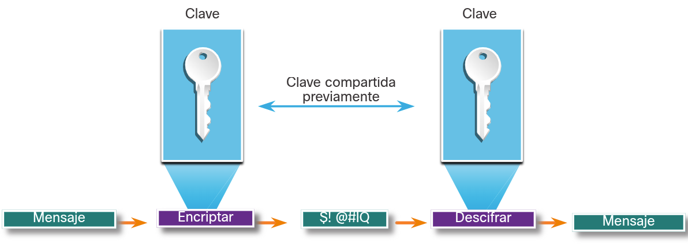

Hoy en día, los algoritmos de encriptación simétrica suelen utilizarse con el tráfico de VPN. Esto se debe a que los algoritmos simétricos utilizan menos recursos de CPU que los algoritmos de encriptación asimétrica. Esto permite encriptar y desencriptar datos rápidamente cuando se utiliza una VPN. Al utilizar algoritmos de encriptación simétrica, como ocurre con cualquier otro tipo de encriptación, mientras más prolongada sea la clave, más tiempo demorará alguien en descubrirla. La mayoría de las claves de encriptación tienen entre 112 bits y 256 bits. Para garantizar que la encriptación sea segura, se recomienda una longitud mínima de clave de 128 bits. Para comunicaciones más seguras, se aconseja el uso de claves más prolongadas.

Los algoritmos de encriptación simétrica a veces son clasificados como cifrados por bloques o cifrados de flujo. Hacer clic en los botones para obtener información sobre estos dos modos de cifrado.
* __Cifrado por bloques__. Transforman un bloque de texto plano de longitud fija en un bloque común de texto cifrado de 64 ó 128 bits. Los cifrados por bloques más comunes incluyen DES con un tamaño de bloque de 64 bits y AES con un tamaño de bloque de 128 bits.

	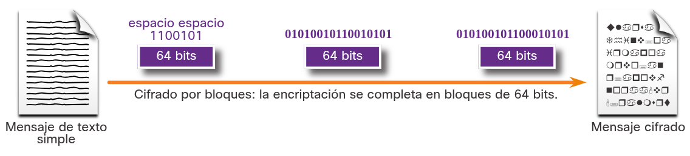

* __Cifrado de flujo__. Los cifrados de flujo encriptan el texto plano byte por byte, o bit por bit. Los cifrados de flujo son, básicamente, un cifrado por bloques con un tamaño de bloque de un byte o bit. Los cifrados de flujo suelen ser más rápidos que los cifrados por bloques, debido a que los datos se encriptan continuamente. Algunos ejemplos del cifrado de flujo son RC4 y A5, que se utiliza para encriptar comunicaciones de telefonía celular GSM.

	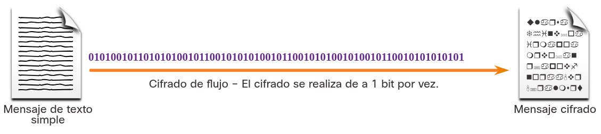

Los algoritmos de encriptación más conocidos se describen en la tabla.

__Algoritmos de cifrado simétrico__|__Descripción__
:-|:-
Estándar de cifrado de datos (DES)|Se trata de un algoritmo de cifrado simétrico heredado. Utiliza una lingitud de clave corta que lo hace inserguro para la mayoría de los usos actuales
3DES (Triple DES)|Es el sustituto de DES y repite el proceso del algoritmo DES tres veces. Debe evitarse en la medida de lo posible, ya que está previsto que se retire en 2023. Si se implementa, hay que utilizar tiempos de vida de las claves muy cortos.
Estándar de cifrado avanzado (AES)|Es un algoritmo de cifrado simétrico muy popular y recomendado. Ofrece combinaciones de claves de 128, 192, o 256 bits para cifrar bloques de datos de 128, 192 o 256 bits.
Algritmo de cifrado optimizado por software (SEAL)|Es un algoritmo de cifrado simétrico más rápido que AES. SEAL es un cifrado de flujo que utiliza una clave de cifrado de 160 bits y tiene un menor impacto en la CPU en comparación con otros algoritmos basados en software.
Algorimos de la serie de cifrado Rivest (RC)|Este algoritmo fue creado por Ron Rivest. Se han desarrollado vairas variaciones, pero RC4 ha sido el más utilizado. RC4 es un cifrado de flujo que se utilizaba para asegurar el tráfico web. Se ha descubierto que tiene múltiples vulnerabilidades que lo hacen inseguro. No se debería utilizar RC4.

## Cifrado asimétrico
Los algoritmos asimétricos, también llamados algoritmos de claves públicas, están diseñados para que la clave de encriptación y la de desencriptación sean diferentes, como se ve en la imagen. En cualquier plazo razonable, no es posible calcular la clave de desencriptación a partir de la clave de encriptación, y viceversa.

	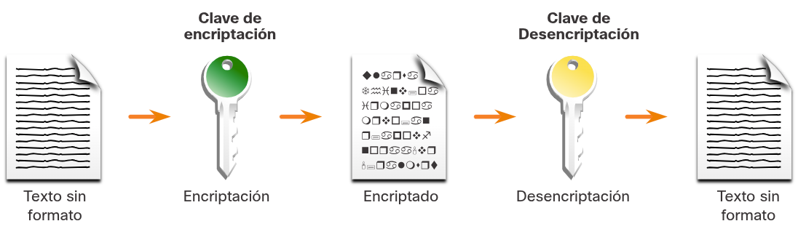

Los algoritmos asimétricos utilizan una clave pública y una privada. Ambas claves son capaces de encriptar, pero se requiere la clave complementaria para la desencriptación. El proceso también es reversible. Los datos encriptados con la clave pública requieren la clave privada para desencriptarse. Los algoritmos asimétricos logran confidencialidad y autenticidad mediante la utilización de este proceso.

Debido a que ninguno de los participantes comparte un secreto, deben usarse longitudes de clave muy prolongadas. La encriptación asimétrica puede utilizar longitudes de claves entre 512 y 4096 bits. Longitudes de clave mayores o iguales a 2048 bits son confiables, y mientras que las claves de 1024 bits o más cortas se consideran insuficientes.

Entre algunos de los ejemplos de protocolos en los que se utilizan algoritmos de claves asimétricos se incluyen los siguientes:
* __Intercambio de Claves de Internet (Internet Key Exchange IKE)__. Es un componente fundamental de las VPN con IPsec.
* __Secure Socket Layer (SSL)__. Ahora se implementa como el estándar IETF Transport Layer Security (TLS).
* __Secure Shell (SSH)__. Este protocolo proporciona una conexión segura de acceso remoto a los dispositivos de red. 
* __Pretty Good Privacy (PGP)__. Este programa informático proporciona privacidad y autenticación criptográfica. A menudo, se utiliza para aumentar la seguridad de las comunicaciones por correo electrónico.

Los algoritmos asimétricos son sustancialmente más lentos que los simétricos. Su diseño se basa en problemas informáticos, como la factorización de números demasiado grandes o el cálculo de logaritmos discretos de números demasiado grandes.

Dado que son lentos, los algoritmos asimétricos se utilizan típicamente en criptografías de poco volumen, como las firmas digitales y el intercambio de claves. Sin embargo, la gestión de claves de algoritmos asimétricos tiende a ser más simple que la de algoritmos simétricos porque, generalmente, es posible hacer pública una de las dos claves de encriptación o desencriptación.

En la tabla se describen ejemplos comunes de algoritmo de encriptación asimétrica.

__Algoritmos de cifrado asimétrico__|__Longitud de clave__|__Descripción__
:-|:-|:-
Diffie-Hellman (DH)|512, 1924, 2048, 3072, 4096|El algorimo Diffie-Hellman permite que dos partes se pongan de acuerdo sobre una clave que pueden utilizar para cifrar los mensajes que quieren enviarse mutuamente. La seguridad de este algoritmo depende de la suposición de que es fácil elevar un número a una determinada potencia, pero es difícil calcular qué potencia se ha utilizado dado el número y el resultado.
Estándar de Firma Digital (DSS) y Algoritmos de Firma Digital (DSA)|512 - 1024|DSS espècifica que DSA es el algoritmo para las firmas digitales. DSA es un algoritmo de clave pública basado en el esquema de firma digital ElGamal. La velocidad de creación de firmas es similar a la de RSA, pero es de 10 a 40 veces más lenta para la verificación.
Algoritmos de cifrado Rivest, Shamir y Adleman (RSA)|512 a 2048|RSA es una criptografía de clave pública que se basa en la dificultad actual de factorizar números muy grandes. Es el primer algoritmo conocido que sirve para firmar, además de para cifrar. Se utiliza ampliamente en los protocolos de comercio electrónico y se cree que es segruo si las claves son suficientemente largas y se utilizan implementaciones actualizadas.
ElGamal|512 - 1024|Algoritmo de cifrado de clave asimétrica para la criptografía de clave pública que se basa en el acuerdo de claves Diffie-Hellman. Una desventaja del sistema ElGamal es que el mensaje encriptado se hace muy grande, aproximadamente el dobel del tamaño del mensaje original, por lo que sólo se usa para mensajes pequeños, como las claves secretas.
Técnicas de curva elíptica|224 o superior|La criptografía de curva elíptica puede utilizarse para adaptar muchso algoritmos criptográficos, como Dilffie-Hellman o ElGamal. La principal ventaja de la criptografía de curva elíptica es que las claves pueden ser mucho más pequeñas.

## Cifrado asimétrico - Confidencialidad
Los algoritmos asimétricos se usan para brindar confidencialidad sin compartir previamente una contraseña. El objetivo de confidencialidad de los algoritmos asimétricos se inicia cuando comienza el proceso de encriptación con la clave pública.

El proceso puede resumirse con la fórmula:

__Clave Pública (Encriptar) + Clave Privada (Desencriptar) = Confidencialidad__

Cuando se utiliza la clave pública para encriptar los datos, debe utilizarse la clave privada para desencriptarlos. Solamente un host tiene la clave privada; por lo tanto, se logra la confidencialidad.

Si la clave privada está en riesgo, se debe generar otro par de claves para reemplazar la clave afectada.

En los siguientes apartados se puede ver cómo se pueden utilizar las claves privadas y públicas para proporcionar confidencialidad al intercambio de datos entre Bob y Alice.
* Alice solicita y obtiene la clave pública de Bob.

	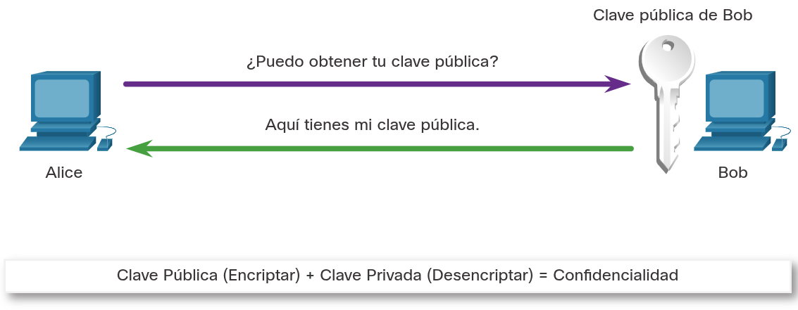

* Alice utiliza la clave pública de Bob para encriptar un mensaje con un algoritmo acordado. Alice le envía el mensaje encriptado a Bob.

	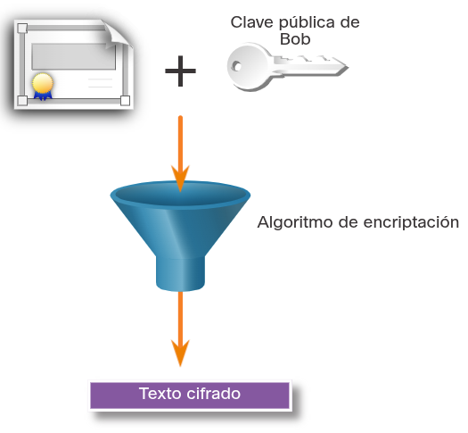

* Bob utiliza su clave privada para desencriptar el mensaje Dado que Bob es el único con la clave privada, el mensaje de Alice sólo puede ser desencriptado por Bob y así se logra la confidencialidad.

	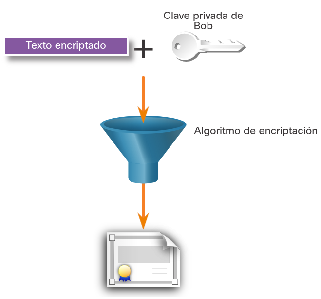

## Cifrado asimétrico - Autenticación
El objetivo de autenticación de los algoritmos asimétricos se inicia cuando comienza el proceso de cifrado con la clave privada.

El proceso puede resumirse con la fórmula:

__Clave privada (Encriptar) + Clave pública (Desencriptar) = Autenticación__

Cuando se utiliza la clave privada para encriptar los datos, debe utilizarse la clave pública correspondiente para desencriptarlos. Debido a que un solo host tiene la clave privada, ese host es el único que puede haber encriptado el mensaje, es decir, proporcionar la autenticación del remitente. Por lo general, no se intenta preservar el secreto de la clave pública, por lo que muchos hosts pueden desencriptar el mensaje. Cuando un host desencripta correctamente un mensaje con una clave pública, se confía en que la clave privada encriptó el mensaje y permite verificar quién es el remitente. Esta es una forma de autenticación.

A continuación se muestra cómo se pueden usar las claves privadas y públicas para proporcionar autenticación al intercambio de datos entre Bob y Alice.
* Alice encripta el mensaje utilizando su clave privada Alice le envía el mensaje cifrado a Bob. Bob necesita autenticar que el mensaje realmente provino de Alice.

	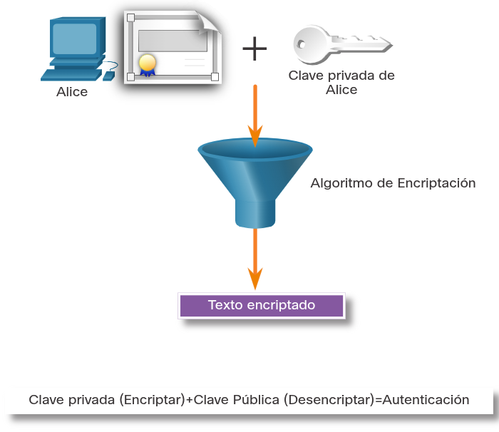

* Para autenticar el mensaje, Bob solicita la clave pública de Alice.

	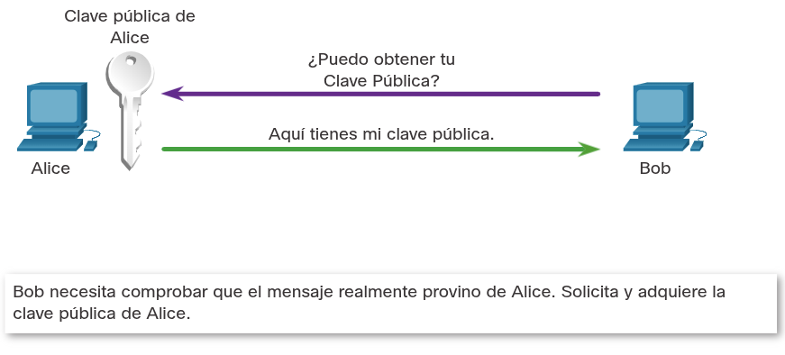

* Bob utiliza la clave pública de Alice para desencriptar el mensaje.

	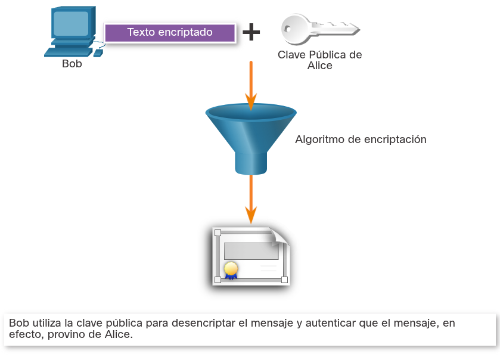

## Cifrado asimétrico - Integridad
Combinar los dos procesos de cifrado asimétrico proporciona confidencialidad, autenticación e integridad de los mensajes.

Se utilizará el siguiente ejemplo para ilustrar este proceso. En este ejemplo, se cifrará un mensaje con la clave pública de Bob y se encriptará un hash cifrado con la clave privada de Alice para proporcionar confidencialidad, autenticidad e integridad.
* Alice utiliza la clave pública de Bob
	* Alice quiere enviar un mensaje a Bob con la seguridad de que solo él podrá leerlo. En otras palabras, Alice quiere garantizar la confidencialidad del mensaje. Alice utiliza la clave pública de Bob para cifrar el mensaje. Solo Bob podrá descifrarlo usando su propia clave privada.
	

	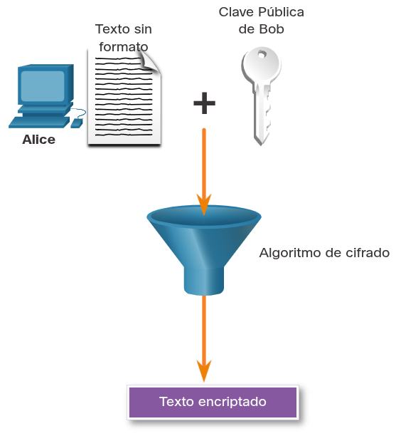

* Alice encripta un _hash_ con su propia clave privada
	* Alice también quiere garantizar la integridad y autenticación de los mensajes. La autenticación le garantiza a Bob que el documento fue enviado por Alice y la integridad asegura que no se modificó. Alice usa su propia clave privada para cifrar un hash del mensaje Alice envía el mensaje encriptado con su hash encriptado a Bob.
	

	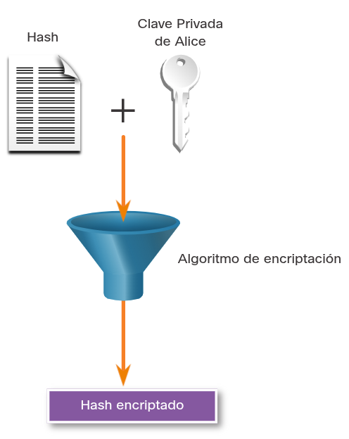

* Bob utiliza la clave pública de Alice para desencriptar el _hash_
	* Bob utiliza la clave pública de Alice para verificar que no se modificó el mensaje. El hash recibido equivale al hash determinado localmente según la clave pública de Alice. Además, esto verifica que Alice definitivamente es la remitente del mensaje, porque nadie más tiene la clave privada de Alice.

	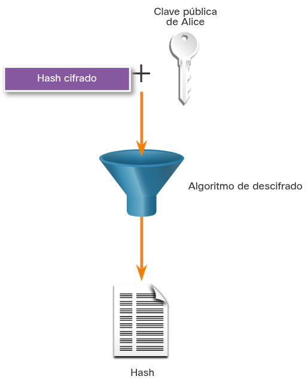

* Bob utiliza su clave privada para desencriptar el mensaje

	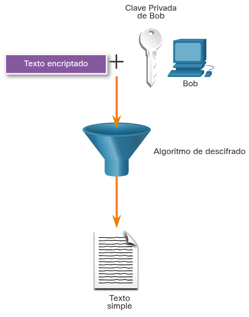

## Diffie-Hellman
Diffie-Hellman (DH) es un algoritmo matemático asimétrico que permite que dos computadoras generen un secreto compartido idéntico sin antes haberse comunicado. El emisor y el receptor nunca intercambian realmente la nueva clave compartida. Sin embargo, dado que ambos participantes la conocen, un algoritmo de encriptación puede utilizarla para encriptar el tráfico entre los dos sistemas.

Estos son dos ejemplos de casos en los que el algoritmo de DH suele utilizarse:
* Se intercambian datos mediante una VPN con IPsec.
* Se intercambian datos de SSH.

Para ayudar a ejemplificar cómo funciona el algoritmo de DH, consulte la figura.

	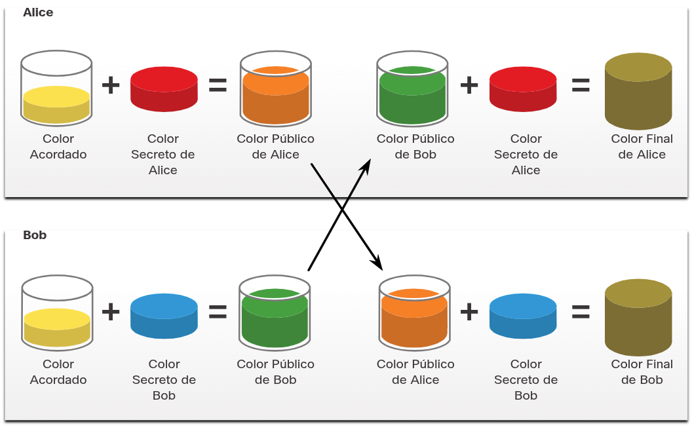

Los colores en la figura se utilizarán en lugar de números largos y complejos para simplificar el proceso de acuerdo de claves del algoritmo de DH. El intercambio de claves del algoritmo de DH comienza con Alice y Bob eligiendo arbitrariamente un color en común que no deben mantener en secreto. El color acordado en nuestro ejemplo es el amarillo.

Luego, Alice y Bob seleccionan un color secreto cada uno. Alice eligió rojo y Bob, azul. Nunca compartirán estos colores secretos con nadie. El color secreto representa la clave privada secreta que cada participante eligió.

Ahora, Alice y Bob mezclan el color común compartido (amarillo) con su color secreto respectivo para producir un color público. Por lo tanto, Alice mezcla el amarillo con el rojo para obtener el anaranjado como color público. Bob mezcla el amarillo y el azul para obtener verde como color público

Alice envía su color público (anaranjado) a Bob y Bob le envía el suyo (verde) a Alice.

Alice y Bob mezclan cada uno el color que recibieron con su propio color secreto original (rojo para Alice y azul para Bob). El resultado es una mezcla final de color marrón que es idéntica a la mezcla final del otro participante. El color marrón representa la clave secreta que comparten Bob y Alice.

La seguridad del algoritmo de DH se basa en el hecho de que utiliza números increíblemente grandes en sus cálculos. Por ejemplo, un número del algoritmo de DH de 1024 bits es aproximadamente igual a un número decimal de 309 dígitos. Considerando que mil millones tiene 10 dígitos decimales (1,000,000,000), es posible imaginar fácilmente la complejidad de trabajar no con uno, sino con varios números decimales de 309 dígitos.

Diffie-Hellman utiliza grupos de DH diferentes para determinar la solidez de la clave que se utiliza en el proceso de acuerdo de clave. Los grupos superiores de números son más seguros, pero requieren tiempo adicional para calcular la clave. A continuación, se identifican los grupos de DH compatibles con el software Cisco IOS y su valor asociado de número primo:
* DH Grupo 1: 768 bits
* DH Grupo 2: 1024 bits
* DH Grupo 5: 1536 bits
* DH Grupo 14: 2048 bits
* DH Grupo 15: 3072 bits
* DH Grupo 16: 4096 bits

__Nota__: Un acuerdo de clave de DH también puede estar basado en la criptografía de curva elíptica. Los grupos de DH 19, 20 y 24, los cuales están basados en la criptografía de curva elíptica, son compatibles con el software Cisco IOS.

Desafortunadamente, los sistemas de clave asimétrica son extremadamente lentos para cualquier tipo de encriptación masiva. Por esto, es común encriptar la mayor parte del tráfico utilizando un algoritmo simétrico (como 3DES o AES) y dejar el algoritmo de DH para crear claves que serán utilizadas por el algoritmo de encriptación.

## Práctica de laboratorio: Uso de algoritmos de cifrado clásicos y modernos POR HACER
* <a href="./notes/lab_algoritmos_clasicos_modernos.md" target="_blank">Uso de algoritmos de cifrado clásicos y modernos</a>

## Práctica de laboratorio: Cifrar y descifrar datos con OpenSSL POR HACER
* <a href="./notes/lab_cifrado_openssl.md" target="_blank">Cifrar y descifrar datos con OpenSSL</a>

## Práctica de laboratorio: Cifrar y descifrar datos con una herramienta de hacker POR HACER
* <a href="./notes/lab_cifrando_hacking_tools.md" target="_blank">Cifrar y descifrar datos con una herramienta de hacker</a>

## Práctica de laboratorio: Examinar Telnet y SSH en Wireshark POR HACER
* <a href="./notes/lab_telnet_ssh_wireshark.md" target="_blank">Examinar Telnet y SSH en Wireshark</a>

## Práctica de laboratorio: Determinar el algoritmo de cifrado que se utilizará POR HACER
* <a href="./notes/lab_determinar_algoritmo.md" target="_blank">Determinar el algoritmo de cifrado que se utilizará</a>

# Ocultamiento de datos
Aquí exploraremos las técnicas de enmascaramiento de datos y esteganografía, que son métodos utilizados para oscurecer u ocultar datos.

## Técnicas de enmascaramiento de datos
La tecnología de enmascaramiento de datos protege los datos al reemplazar la información confidencial con versiones no confidenciales de la misma. La versión no confidencial se ve y actúa como la original para que un proceso organizacional pueda usar datos no confidenciales sin necesidad de cambios en las aplicaciones de soporte o las instalaciones de almacenamiento de datos.

El enmascaramiento suele limitar la propagación de datos sensibles dentro de los sistemas informáticos mediante la distribución de conjuntos de datos sustitutos para su comprobación y análisis. La información puede enmascararse dinámicamente en el momento si el sistema o la aplicación detectan una solicitud de información sensible por parte de un usuario de riesgo.

El enmascaramiento de datos puede reemplazar los datos confidenciales en los entornos no productivos para proteger la información subyacente. Se pueden utilizar varias técnicas de enmascaramiento de datos.

Todos los métodos que se mencionan a continuación garantizan que los datos sigan siendo significativos pero que se han modificado lo suficiente como para protegerlos.
* La sustitución reemplaza los datos por valores que parecen auténticos para aplicar el anonimato a los registros de datos.
* La mezcla deriva un conjunto de sustitución de la misma columna de datos que un usuario desea enmascarar. Esta técnica funciona bien para la información financiera en una base de datos de prueba, por ejemplo.
* La anulación aplica un valor nulo a un campo específico, lo cual evita completamente la visibilidad de los datos.

## Esteganografía
La esteganografía oculta datos (por ejemplo, un mensaje) en otro archivo, tal como un archivo gráfico, de audio o de video.

La ventaja de la esteganografía con respecto a la criptografía es que el mensaje secreto no atrae ninguna atención especial. Nadie sabría nunca que una imagen contenía un mensaje secreto si simplemente viera el archivo, ya sea electrónicamente o en forma impresa.

Existen varios componentes involucrados en el ocultamiento de datos: Primero, existen los datos integrados, que es el mensaje secreto. El texto portador (o la imagen portadora o el audio portador) oculta los datos incrustados que producen el estego texto (o estego imagen o estego audio). Una estegoclave controla el proceso de ocultamiento.

### Técnicas de esteganografía
El enfoque utilizado para incrustar datos en una imagen de portada es el uso de los bits menos significativos (LSB: Least Significant Bits). Este método utiliza bits de cada píxel en la imagen.
* Un píxel es la unidad básica de color programable en una imagen de computadora.
* El color específico de un píxel es una combinación de tres colores: rojo, verde y azul (RGB).
* Tres bytes de datos especifican el color de un píxel (un byte para cada color). Ocho bits constituyen un byte, por lo que un sistema de color de 24 bits utiliza los tres bytes.
* LSB utiliza un bit de cada uno de los componentes rojo, verde y azul. Cada píxel puede almacenar tres bits.

	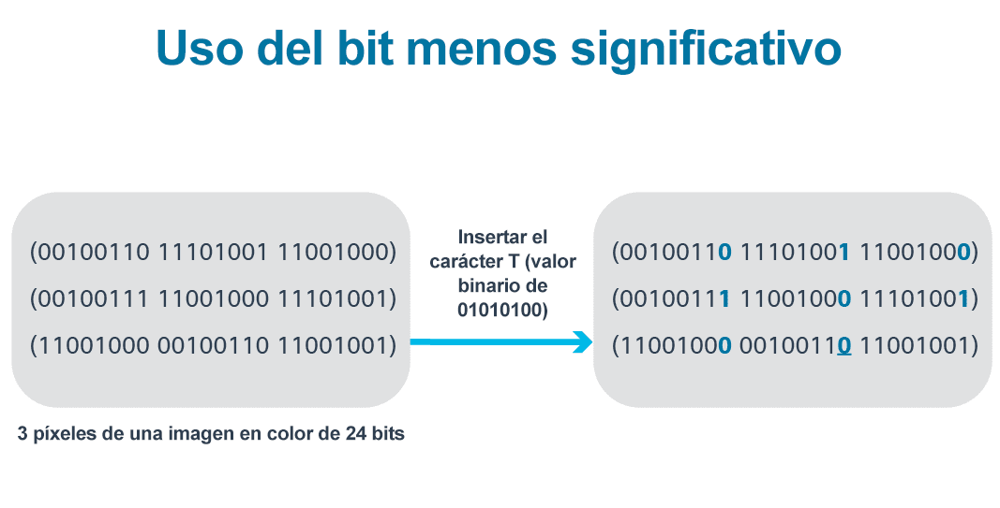

La figura muestra tres píxeles de una imagen de 24 bits. Una de las letras del mensaje secreto es la letra T y la inserción del caracter T solo cambia dos bits del color. El ojo humano no puede reconocer los cambios realizados en los bits menos significativos, por lo que el resultado es un carácter oculto.

En promedio, no más de la mitad de los bits de una imagen tendrán que cambiar para ocultar eficazmente un mensaje secreto.

### Esteganografía social
La esteganografía social oculta información a simple vista mediante la creación de una salida que puede ser leída de cierta manera por algunos para obtener el mensaje secreto, basándose en reglas y/o definiciones previamente establecidas.

En consecuencia, quienes lo vean de forma normal no verán el mensaje. Los adolescentes en las redes sociales utilizan esta táctica para comunicarse con sus amigos más cercanos mientras mantienen a otros, como sus padres, al margen de lo que significa el mensaje. Por ejemplo, la frase «vamos al cine» puede significar «vamos a la playa».

Los individuos de países que censuran los medios de comunicación también utilizan la esteganografía social para difundir sus mensajes, escribiendo mal las palabras a propósito o haciendo referencias poco claras que signifiquen algo para los entendidos. En efecto, se comunican a diferentes audiencias simultáneamente enviando dos mensajes diferentes: el mensaje aparente y el mensaje secreto.

### Detección
El estegoanálisis es el descubrimiento de que existe información oculta. El objetivo del estegoanálisis es detectar información oculta.

Los patrones de la estegoimagen generan sospecha. Por ejemplo, un disco puede tener áreas no utilizadas pero reservadas, que se reservan porque ocultan información. Las utilidades de análisis de disco pueden informar sobre la información oculta en clústeres sin utilizar de dispositivos de almacenamiento. Los filtros pueden capturar los paquetes de datos que contienen información oculta en los encabezados de paquete. Ambos métodos usan las firmas de esteganografía.

Al comparar una imagen original con la estegoimagen, un analista puede captar visualmente patrones repetitivos.

## Práctica de laboratorio: Uso de esteganografía para ocultar datos
* <a href="./notes/lab_esteganogafria_ocultacion.md" target="_blank">Uso de esteganografía para ocultar datos</a>

# Integridad y Autenticidad
## Protección de las comunicaciones
Las organizaciones deben proporcionar soporte para proteger los datos a medida que viajan a través de enlaces. Esto puede incluir el tráfico interno, pero la mayor preocupación es proteger los datos que viajan fuera de la organización a sitios de sucursales, teletrabajadores y socios.

Estos son los cuatro elementos de las comunicaciones seguras:
* __Integridad de los datos__. Garantiza que el mensaje no se haya modificado. Se detecta cualquier cambio en los datos en tránsito. La integridad se garantiza mediante la implementación de los Algoritmos de Seguridad de Hash (Secure Hash Algorithms) SHA-2 o SHA-3 El algoritmo de resumen de mensajes MD5 sigue siendo ampliamente utilizado, sin embargo, es inherentemente inseguro y crea vulnerabilidades en una red. Debe evitarse el uso de MD5.
* __Autenticación de origen__. Garantiza que el mensaje no es una falsificación y que realmente proviene de quien dice. Muchas redes modernas garantizan la autenticación con algoritmos, como el código de autenticación de mensaje basado en hash (hash-based message authentication code HMAC).
* __Confidencialidad de los datos__. Garantiza que solo los usuarios autorizados puedan leer el mensaje. Si se intercepta el mensaje, no se puede descifrar en un plazo razonable. La confidencialidad de los datos se implementa utilizando algoritmos de encriptación simétrica y asimétrica.
* __No repudio de datos__. Garantiza que el remitente no puede repudiar, o refutar, la validez de un mensaje enviado. La imposibilidad de negación se basa en el hecho de que solamente el remitente tiene características o una firma únicas relacionadas con el tratamiento del mensaje.

La criptografía puede usarse casi en cualquier lugar donde haya comunicación de datos. De hecho, estamos yendo hacia un mundo donde toda la comunicación se encriptará.

## Funciones hash criptográficas
Los hash criptográficos se usan para comprobar y garantizar la integridad de los datos. El hashing se basa en una función matemática unidireccional que es relativamente fácil de computar, pero mucho más difícil de revertir. El café molido es una buena analogía de una función unidireccional. Es fácil moler los granos de café, pero es casi imposible volver a unir todas las partes minúsculas para reconstruir los granos originales. La función de hash criptográfico puede utilizarse también para verificar la autenticación.

	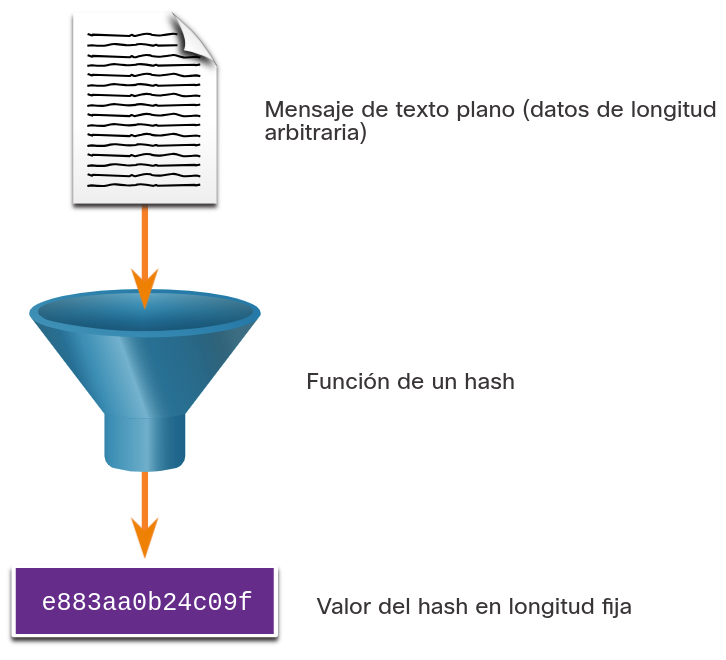

Como se ve en la figura, una función de hash toma un bloque variable de datos binarios, llamado "mensaje", y produce una representación condensada de longitud fija, denominada hash. El hash resultante, a veces, también se denomina síntesis del mensaje, síntesis o huella digital.

Con las funciones de hash, es informáticamente inviable que dos conjuntos diferentes de datos tengan el mismo resultado de hash. Cada vez que se cambian o se modifican los datos, el valor hash también cambia. Debido a esto, los valores hash criptográficos se conocen a menudo como huellas dactilares digitales. Pueden usarse para detectar archivos de datos duplicados, cambios en las versiones de los archivos y otros usos similares. Estos valores se usan para proteger los datos de un cambio accidental o intencional, y del daño accidental.

La función hash criptográfica se aplica en muchas situaciones diferentes con fines de autenticación de entidades, integridad de los datos y autenticidad de los datos.

## Funcionamiento del hash criptográfico
Matemáticamente, la ecuación `h= H(x)` se utiliza para explicar cómo funciona un algoritmo de hash. Como se ve en la figura, la función de hash `H` toma un valor de entrada `x` y arroja un valor hash `h` de cadena de tamaño fijo.

	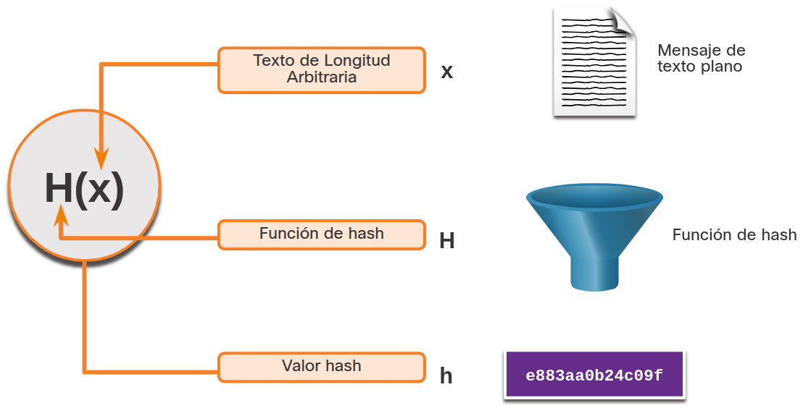

En el ejemplo de la figura, se resume la operación matemática. Una función de hash criptográfica tiene las siguientes propiedades:
* La entrada puede ser de cualquier longitud.
* La salida tiene una longitud fija.
* `H(x)` es relativamente fácil de calcular para cualquier valor x dado.
* `H(x)` es unidireccional y no reversible.
* `H(x)` está libre de colisiones, lo que significa que dos valores diferentes de entrada darán como resultado valores diferentes de hash.

Si una función de hash es difícil de invertir, se considera un hash unidireccional. Difícil de invertir significa que, dado un valor hash de h. es computacionalmente inviable encontrar una entrada para x tal que h=H(x).

## MD5 y SHA
Las funciones de hash se utilizan para garantizar la integridad de un mensaje. Garantizan que los datos no hayan cambiado accidental o intencionalmente. En la imagen , el remitente envía una transferencia de USD $100 a Alex. El remitente quiere asegurarse de que el mensaje no se modifique accidentalmente en su recorrido hasta el receptor. Los cambios deliberados realizados por un agente de amenazas siguen siendo posibles.

	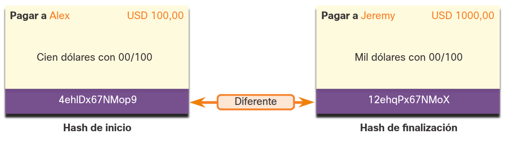

Existen tres funciones de hash muy conocidas.
* __MD5 con longitud de 128-bit__. Desarrollada por Ron Rivest y utilizada en una variedad de aplicaciones de Internet, MD5 es una función unidireccional que produce un mensaje hash de 128-bits. MD5 se considera un algoritmo obsoleto y se debe evitar o usar solamente cuando no haya mejores alternativas disponibles. se recomienda utilizar SHA-2 o SHA-3 en su lugar.
* __SHA-1__. Desarrollado por la Agencia Nacional de Seguridad de los Estados Unidos (National Security Agency NSA) en 1995. Es muy similar a las funciones de hash MD5. Existen numerosas versiones. SHA-1 crea un mensaje hash de 160 bits y es un poco más lento que MD5. SHA-1 tiene defectos conocidos y es un algoritmo obsoleto.
* __SHA-2__. Desarrollado por la NSA. Esto incluye SHA-224 (224 bit), SHA-256 (256 bit), SHA-384 (384 bit) y SHA-512 (512 bit). Si está utilizando SHA-2, se deben usar los algoritmos SHA-256, SHA-384 y SHA-512 siempre que sea posible.
* __SHA-3__. SHA-3 es el algoritmo hash más nuevo y fue introducido por el Instituto Nacional de Estándares y Tecnología (NITS) como una alternativa y eventual sustitución para la familia SHA-2 de algoritmos hash. SHA-3 incluye SHA3-224 (224 bit), SHA3-256 (256 bit), SHA3-384 (384 bit) y SHA3-512 (512 bit). La familia SHA-3 son la próxima generación de algoritmos y deben usarse siempre que sea posible.

Mientras que el hash se puede utilizar para detectar modificaciones accidentales, no brinda protección contra cambios deliberados hechos por un atacante. No existe información de identificación única del emisor en el procedimiento de hash. Esto significa que cualquier persona puede calcular un hash para los datos, siempre y cuando tengan la función de hash correcta.

Por ejemplo, cuando un mensaje pasa por la red, un atacante potencial puede interceptarlo, cambiarlo, o recalcular el hash y añadirlo al mensaje. El dispositivo receptor solo validará el hash que esté añadido.

Por lo tanto, el hash es vulnerable a los ataques man-in-the-middle y no proporciona seguridad a los datos transmitidos. Para proporcionar integridad y autenticación de origen, se necesita algo más.

__Nota__: Los algoritmos hash solo protegen contra cambios accidentales y no protegen los datos de los cambios realizados deliberadamente por un actor de amenazas.

## Autenticación de origen
Para agregar autenticación y control de integridad, se usa un código de autenticación de mensajes hash con clave (hash message authentication code HMAC). Los HMAC utilizan una clave secreta adicional como entrada para la función de hash.

__Nota__: También se utilizan otros métodos de Código de Autenticación de Mensajes ( Message Authentication Code MAC). Sin embargo, HMAC se utiliza en muchos sistemas, incluidos SSL, IPSec y SSH.

### Algoritmo de hashing de HMAC
Como se muestra en la figura, un HMAC se calcula utilizando cualquier algoritmo criptográfico que combine una función hash criptográfica con una clave secreta. Las funciones de hash son la base del mecanismo de protección de HMAC.

Solo el emisor y el receptor conocen la clave secreta y el resultado de la función de hash ahora depende de los datos de entrada y la clave secreta. Solo las partes que tienen acceso a esa clave secreta pueden calcular el compendio de una función de HMAC. Esta característica derrota los ataques Man-in-the-middle y proporciona autenticación del origen de los datos.

Si las dos partes comparten una clave secreta y utilizan funciones HMAC para la autenticación, una síntesis HMAC construida correctamente de un mensaje que ha recibido un tercero indica que la otra parte fue la que originó el mensaje. Esto se debe a que la otra parte posee la clave secreta.

	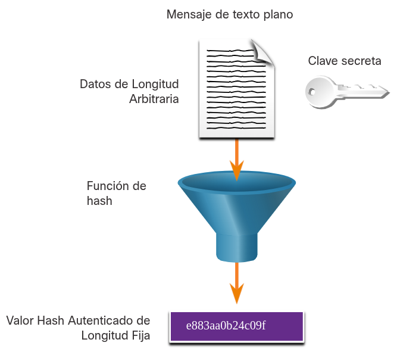

### Creando un valor HMAC
Como se ve en la figura, el dispositivo emisor introduce datos (como el pago de Terry Smith de $100 y la clave secreta) en el algoritmo de hash y calcula la síntesis de HMAC de longitud fija. Este resumen autenticado se adjunta al mensaje y se envía al receptor.

	

### Verificando un valor de HMAC
En la figura, el dispositivo receptor elimina la síntesis del mensaje y utiliza el mensaje de texto plano con su clave secreta como valor de entrada para la misma función de hash. Si la síntesis que calcula el dispositivo receptor es igual a la síntesis que se envió, el mensaje no se modificó. Además, el origen del mensaje se autentica porque solamente el emisor posee una copia de la clave secreta compartida. La función HMAC ha asegurado la autenticidad del mensaje. La figura muestra la verificación.

	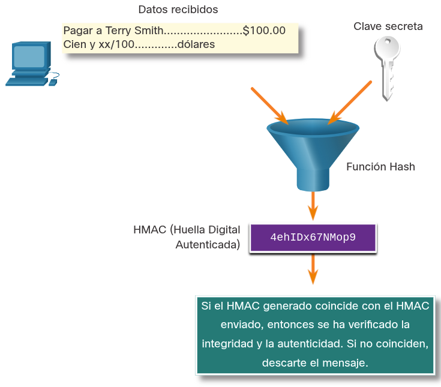

### Ejemplo de HMAC en Cisco Router

	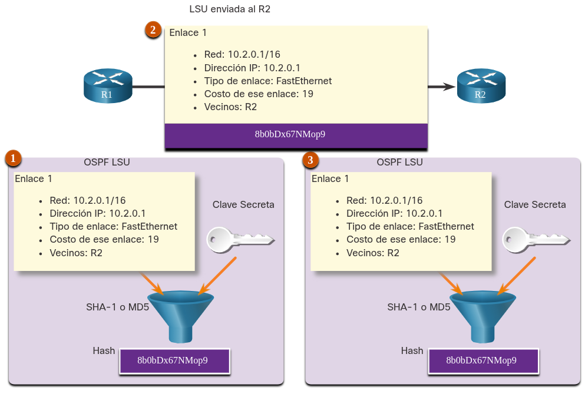

# Uso de _hashes_
## Hashing de archivos y medios digitales
La integridad garantiza que los datos y la información estén completos y sin alteraciones al momento de la adquisición. Esto es importante para que los usuarios tengan confianza cuando descarguen un archivo de Internet, o si un examinador forense está buscando pruebas en medios digitales, etc.

Para verificar la integridad de todas las imágenes de IOS, Cisco proporciona checksums de MD5 y SHA en el sitio web de descarga de software de Cisco. El usuario puede hacer una comparación de este resumen MD5 con el resumen MD5 de una imagen de Cisco IOS instalada en un dispositivo. El usuario puede estar tranquilo ahora de que nadie alteró ni modificó el archivo de imagen de IOS.

	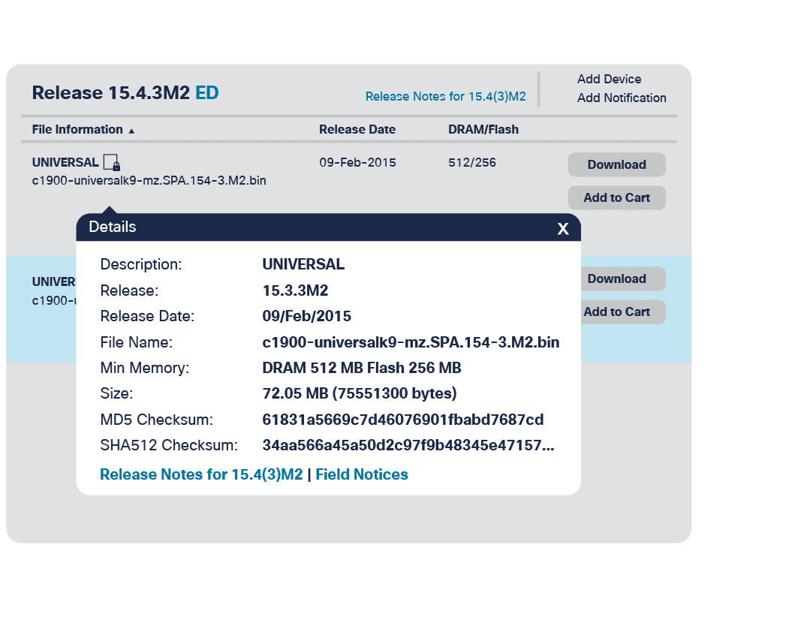

El campo del análisis forense digital utiliza hashing para verificar todos los medios digitales que contienen archivos. Por ejemplo, el examinador crea un hash y una copia de bit por bit de los medios que contienen archivos para producir un clon digital. El examinador compara el hash de los medios originales con la copia. Si los dos valores coinciden, las copias son idénticas. El hecho de que un conjunto de bits sea idéntico al conjunto original de bits establece fijación. La fijación ayuda a responder algunas preguntas:
* ¿El examinador tiene los archivos que espera?
* ¿Los datos están dañados o modificados?
* ¿Puede el examinador probar que los archivos no están dañados?

Ahora el experto en informática forense puede examinar la copia en busca de cualquier evidencia digital mientras deja el archivo original intacto y sin modificar.

	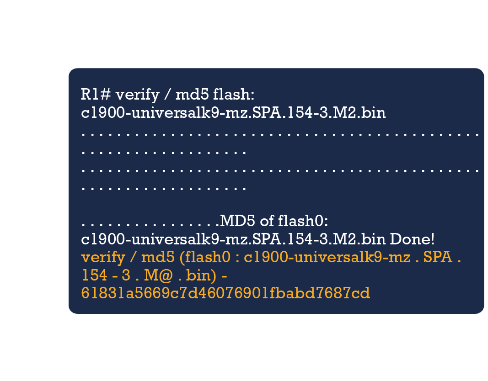

## Hashing de contraseñas
Los algoritmos de hash convierten cualquier cantidad de datos en una huella digital o hash digital de longitud fija. Nadie puede revertir un hash digital para descubrir la entrada original. Si la entrada cambia por completo, puede dar lugar a un hash diferente.

Esto funciona para proteger las contraseñas. Un sistema necesita almacenar una contraseña de forma que la proteja y la mantenga alejada de miradas indiscretas, a la vez que pueda verificar que la contraseña de un usuario es correcta.

La figura muestra el flujo de trabajo para el registro y la autenticación de cuentas de usuarios mediante un sistema basado en hash. Se puede ver que el sistema nunca escribe la contraseña del usuario en el disco duro, solo almacena el hash digital. De esta manera, la contraseña solo la conoce el usuario que la configuró.

	

   

## Descifrado de hashes
Para descifrar un hash, un atacante debe adivinar la contraseña. Los dos ataques principales utilizados para adivinar las contraseñas son los ataques de diccionario y de fuerza bruta.

Un ataque de diccionario utiliza un archivo que contiene palabras, frases y contraseñas comunes. El archivo tiene calculados los hash de estas contraseñas comunes. Un ataque de diccionario compara los hashes del archivo con los hashes de la contraseña. Si un hash coincide, el atacante conocerá un grupo de contraseñas potencialmente buenas utilizadas en este sistema.

Un ataque de fuerza bruta intenta cada combinacíón posible de caracteres hasta una longitud determinada. Un ataque de fuerza bruta requiere mucha potencia tiempo del procesador. En teoría, es solo cuestión de tiempo antres de que este métido descubra la contraseña. Las contraseñas deben ser lo suficientemente largas para compensar el tiempo que tarda en realizarse un ataque de fuerza bruta demasiado prolongado para ser provechoso. El hash de las contraseñas dificulta a los delincuentes la recuperación de las mismas mediante fuerza bruta.

## Salting
La técnica de _salting_ permite que el hash de la contraseña sea más seguro.

Si dos usuarios tienen la misma contraseña, también tendrán los mismos hashes de la contraseña. Un _salt_, que es una cadena aleatoria de caracteres, es una entrada adicional agregada a la contraseña antes del hash.

Esto crea un resultado hash diferente incluso cuando las dos contraseñas son idénticas, como se muestra aquí. Entonces, la base de datos almacena tanto el hash como el _salt_. La misma contraseña genera un hash diferente para diferentes usuarios porque el _salt_ en cada instancia es diferente. Mientras tanto, el _salt_ no tiene que ser secreto ya que es un número aleatorio.

	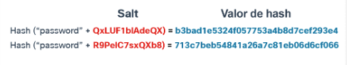

## Implementación de Salting
Un generador criptográficamente seguro de números pseudoaleatorios (CSPRNG) es la mejor opción para generar un _salt_.

CSPRNGs genera un número aleatorio que tiene un alto nivel de aleatoriedad y es totalmente impredecible, por lo que es criptográficamente seguro.

Las siguientes recomendaciones ayudarán a garantizar la implementación exitosa de _salting_:
* El _salt_ debe ser único para cada contraseña de usuario.
* Nunca reutilice un _salt_.
* La longitud del _salt_ debe coincidir con la extensión del resultado de la función de _hash_.
* En una aplicación web siempre realice el _hash_ en el servidor.

El uso de una técnica llamada ___key stretching___ (estiramiento de la llave) también ayudará a protegerse contra los ataques. El _key stretching_ hace que los intentos de descifrar contraseñas funcionen muy lentamente. Esto hace que el hardware de alta gama de los atacantes que pueden intentar descifrar miles de millones de hashes por segundo sea menos eficaz.

* Para almacenar una contraseña
	* Utilice CSPRNG para generar un _salt_ largo y aleatorio.
	* Agregue el _salt_ al comienzo de la contraseña.
	* Realice el _hash_ de esta con SHA-256, una función de _hash_ criptográfica estándar.
	* Guarda el _salt_ y el _hash_ en el registro de BBDD del usuario.
* Para validar una contraseña
	* Extraiga el _salt_ de un usuario y el _hash_ de la base de datos.
	* Agregue el _salt_ a la contraseña y realice el _hash_ de esta con la misma función de _hash_.
	* Compara el _hash_ de la contraseña que acaba de enviar el usuario que intenta conectarse con la que está almacenada en la base de datos.
	* Si los _hash_ no coinciden, la contraseña con la que el usuario acaba de intentar conectarse es incorrecta.

## Prevención de ataques
La técnica de _salting_ evita que un atacante utilice un ataque de diccionario para adivinar las contraseñas. El _salting_ también hace imposible usar las tablas de búsqueda y las tablas de arcoíris para descifrar un hash.

### Tablas de búsqueda
Una tabla de búsqueda almacena en un diccionario de contraseñas los hashes previamente calculados de cada contraseña junto con la contraseña correspondiente. Una tabla de búsqueda es una estructura de datos que procesa cientos de búsquedas de hash por segundo.

### Tablas de búsqueda inversa
Este ataque permite que el delincuente cibernético inicie un ataque de diccionario o de fuerza bruta en muchos hashes sin la tabla de búsqueda previamente computada. El delincuente cibernético crea una tabla de búsqueda que grafica cada hash de contraseña de la base de datos de la cuenta vulnerada a una lista de usuarios. El ciberdelincuente aplica un hash a cada una de las contraseñas adivinadas y utiliza la tabla de búsqueda para obtener una lista de usuarios cuya contraseña coincida con la adivinada. Debido a que muchos usuarios tienen la misma contraseña, el ataque funciona bien.

### Tablas arcoiris
Las tablas de arcoíris sacrifican la velocidad de descifrado de hash para que las tablas de búsqueda sean más pequeñas. Una tabla más pequeña significa que la tabla puede almacenar las soluciones para más hashes en la misma cantidad de espacio.

## Práctica de Laboratorio - Convertir elementos en hashes (Hashing)
* <a href="./notes/lab_conversion_elementos_hashes.md" target="_blank">Convertir elementos en hashes (Hashing)</a>

# Criptografía de clave pública
## Uso de la firma digital
Las firmas digitales son una técnica matemática empleada para brindar autenticidad, integridad, y no repudio. Las firmas digitales tienen propiedades específicas que permiten la autenticación de entidades y la integridad de los datos. Además, las firmas digitales proporcionan no repudio a la transacción. En otras palabras, la firma digital sirve como prueba legal de que el intercambio de datos tuvo lugar. Las firmas digitales usan criptografía asimétrica.
* __Auténtica__. No es posible falsificarlas y permiten demostrar que el firmante fue el único que firmó el documento.
* __Inalterable__. Después de firmar un documento, no puede modificarse.
* __No reutilizable__. La firma del documento no se puede transferir a otro documento.
* __No repudio__. Se considera que el documento firmado es el mismo que un documento físico. La firma es prueba de que el documento ha sido firmado por la persona real.

Las firmas digitales se utilizan comúnmente en las siguientes dos situaciones:
1. __Firma de código__. Se utiliza para la integridad de los datos y la autenticación. La firma de código se utiliza para verificar la integridad de los archivos ejecutables descargados del sitio web de un proveedor. También utiliza certificados digitales firmados para autenticar y verificar la identidad de un sitio de donde provienen los archivos.
2. __Certificados digitales__. Son similares a un documento de identidad virtual y se utilizan para autenticar la identidad del sistema con un sitio web del proveedor y establecer una conexión cifrada para intercambiar datos confidenciales.

Se utilizan tres algoritmos del Estándar de firmas digitales (Digital Signature Standard, DSS) para generar y verificar firmas digitales:
* __Algoritmo de firmas digitales (DSA)__. DSA es el estándar original para generar pares de claves públicas y privadas, y para generar y verificar firmas digitales.
* __Algoritmo de Rivest-Shamir Adelman (RSA)__. RSA es un algoritmo asimétrico que se utiliza habitualmente para generar y verificar firmas digitales.
* __Algoritmo de firma digital de curva elíptica (ECDSA)__. ECDSA es una variante más reciente de DSA y proporciona autenticación de firma digital y no repudio con las ventajas añadidas de la eficiencia computacional, el pequeño tamaño de las firmas y un ancho de banda mínimo.

En los noventa, RSE Security Inc. comenzó a publicar estándares de criptografía de clave pública (PKCS, Public-Key Cryptography Standard). Hubo 15 PKCS, aunque se ha retirado uno desde el momento en que se escribió el presente contenido. RSE publicó estos estándares porque tenía las patentes para los estándares y deseaba promocionarlos. Los PKCS no son estándares del sector, pero son bien reconocidos en el sector de la seguridad y, últimamente, han comenzado a llamar la atención de organizaciones de estándares, como IETF y el grupo de trabajo PKIX.

## Firmas digitales para la firma de código
Las firmas digitales suelen usarse para proporcionar certeza de la autenticidad e integridad del código de software. Los archivos ejecutables están dentro de un sobre firmado digitalmente, lo que le permite al usuario final verificar la firma antes de instalar el software.

Firmar código en forma digital proporciona varias garantías con respecto al código:
* El código es auténtico y realmente es provisto por el editor.
* El código no se ha modificado desde que salió del editor de software.
* El editor definitivamente editó el código. Esto proporciona la imposibilidad de negar la acción de la publicación.

La publicación 140-3 de los Estándares Federales de Procesamiento de la Información (_Federal Information Processing Standard FIPS_) del gobierno de EE.UU. especifica que el software disponible para descargar de Internet debe estar firmado y verificado digitalmente. El propósito del software firmado digitalmente es asegurar que no se alteró y que, como se dice, proviene de una fuente de confianza. Las firmas digitales sirven como verificación de que el código no ha sido manipulado por atacantes y que un tercero no insertó código malicioso en el archivo.
* __Propiedades de archivo__. El archivo ejecutable fue descargado de internet. El archivo contiene una herramienta de software de Cisco Systems.

	

* __Firmas digitales__. Hacer clic en la solapa Firmas digitales revela que el archivo procede de una organización de confianza, Cisco Systems Inc. El resumen del archivo fue creado con el algoritmo sha256. También se proporciona la fecha en la que se firmó el archivo. Al hacer clic en el botón Details se abre la ventana Detalles de Firmas Digitales (Digital Signatures Detail DSD).

	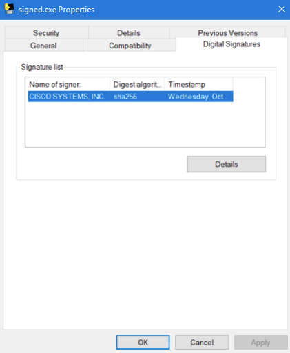

* __Detalles de la firma digital__. La ventana Detalles de la firma digital revela que el archivo fue firmado por Cisco Systems, Inc en octubre de 2019. Esto se verificó mediante un refrendo proporcionado por Entrust Time Stamping Authority el mismo día en que fue firmada por Cisco. Haga clic en Ver certificado para ver los detalles del propio certificado.

	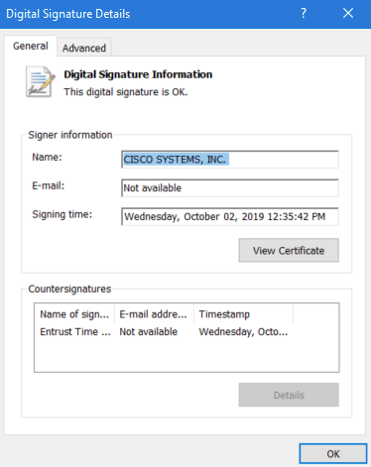

* __Información sobre certificados__. En la pestaña General se informa del propósito del certificado, a quién se emitió el certificado y quién lo emitió. También muestra el período para el que el certificado es válido. Los certificados no válidos pueden impedir que se ejecute el archivo.

	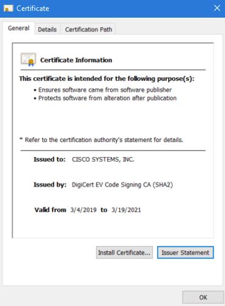

* __Ruta de certificación__. Haga clic en la pestaña Ruta de Certificacióncertificación para ver que el archivo fue firmado por Cisco Systems, como se verificó en DigiCert. En algunos casos, una entidad adicional puede verificar independientemente el certificado.

	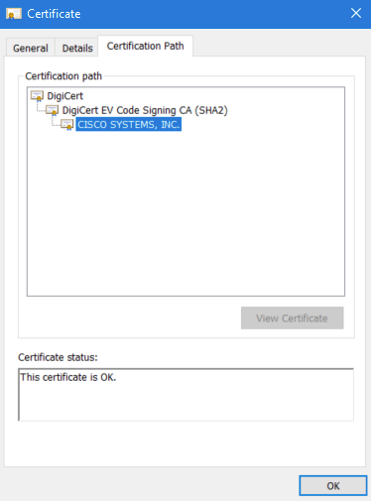

## Firmas digitales para certificados digitales
Un certificado digital es equivalente a un pasaporte electrónico. Permite que los usuarios, hosts y organizaciones intercambien información de manera segura en Internet. Específicamente, un certificado digital se usa para autenticar y verificar que los usuarios que envían un mensaje son quienes afirman ser. Los certificados digitales también pueden usarse para garantizar la confidencialidad del receptor con los medios necesarios para encriptar una respuesta.

Los certificados digitales son similares a los certificados físicos. Por ejemplo, el certificado Cisco Certified Network Associate Security (CCNA-S) en papel (Figura 1) permite identificar a quién se emitió el certificado, quién lo autorizó y el plazo de validez. Los certificados digitales también proporcionan información similar.

	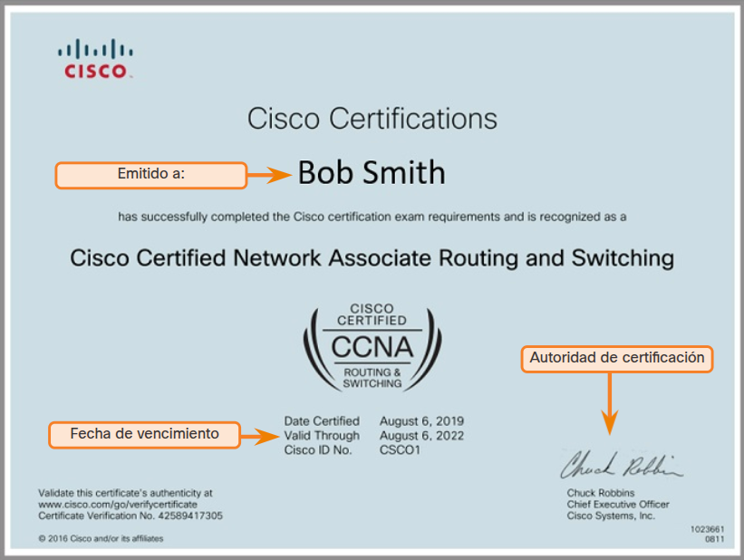

El certificado digital verifica de forma independiente una identidad. Las firmas digitales se utilizan para verificar que un artefacto, como un archivo o mensaje, se envía desde la persona verificada. En otras palabras, un certificado verifica la identidad, una firma verifica que algo proviene de esa identidad.

Este ejemplo le ayudará a comprender cómo se utiliza una firma digital. Bob confirma un pedido con Alice. Alice está ordenando desde el sitio web de Bob. Alice se ha conectado con el sitio web de Bob, y después de verificar el certificado, el certificado de Bob se almacena en el sitio web de Alice. El certificado contiene la clave pública de Bob. La clave pública se utiliza para verificar la firma digital de Bob.

Consulte la figura para ver cómo se utiliza la firma digital.

	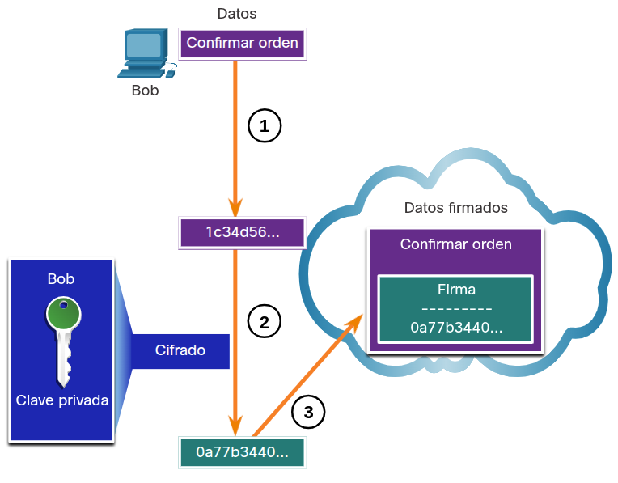

Bob confirma la orden y su computadora crea un hash de la confirmación. La computadora encripta el hash con la clave privada de Bob. El hash encriptado, conocido como la firma digital, se adjunta al documento. La confirmación del pedido se envía a Alice por medio de Internet.

Cuando Alice recibe la firma digital, se produce el siguiente proceso.

	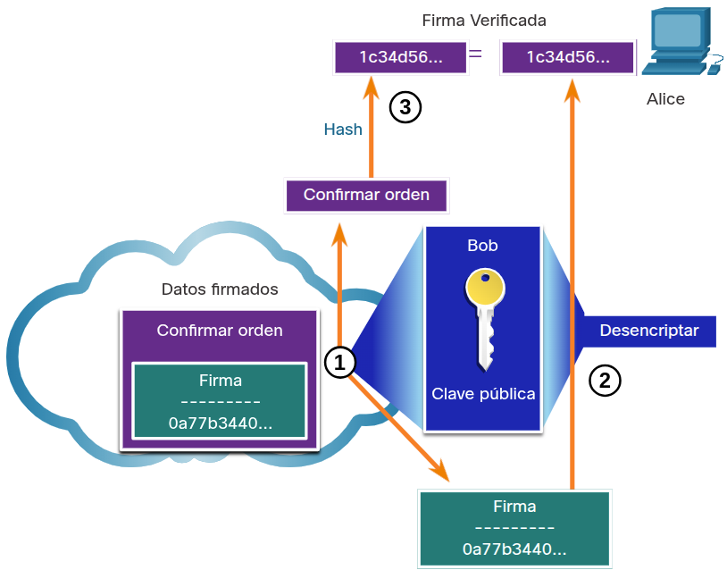

1. El dispositivo receptor de Alice acepta la confirmación del pedido con la firma digital y obtiene la clave pública de Bob.
2. Despues de eso, la computadora de Alice desencripta la firma utilizando la clave pública de Bob. Este paso revela el valor supuesto del hash del dispositivo remitente.
3. La computadora de Alice crea un hash del documento recibido (sin su firma) y lo compara con el hash de la firma desencriptada. Si los hashes coinciden, el documento es auténtico. Es decir, se confirma que fue enviado por Bob y que no se modificó desde que se firmó.

## Práctica de laboratorio - Generación y uso de una firma digital
* <a href="./notes/lab_generacion_uso_firma_digital.md" target="_blank">Generación y uso de una firma digital</a>

# Las autoridades y el sistema de confianza PKI
## Gestión de la clave pública
El tráfico de Internet se compone de tráfico entre dos participantes. Cuando se establece una conexión asimétrica entre dos hosts, estos intercambian su información de clave pública.

Un certificado SSL es un certificado digital que confirma la identidad de dominio de un sitio web. Para implementar SSL en un sitio web propio, debemos comprar un certificado SSL para nuestro dominio a un proveedor de Certificados SSL. El tercero de confianza realiza una investigación exhaustiva antes de emitir las credenciales. Después de esta investigación exhaustiva, el tercero emite credenciales (es decir, el certificado digital) que son difíciles de falsificar. Desde ese momento, todas las personas que confían en el tercero simplemente aceptan las credenciales que emite el tercero. Cuando las computadoras intentan conectarse a un sitio web a través de HTTPS, el navegador web comprueba el certificado de seguridad del sitio web y comprueba que es válido y se originó con una CA confiable. Esto valida que la identificación del sitio web es verdadera. El certificado se guarda localmente por el navegador web y luego se utiliza en transacciones posteriores. La clave pública del sitio web se incluye en el certificado y se utiliza para verificar futuras comunicaciones entre el sitio web y el cliente.

Estos terceros de confianza ofrecen servicios similares a las agencias gubernamentales de concesión de licencias. En la figura, se muestra la analogía entre una licencia de conducir y un certificado digital.

	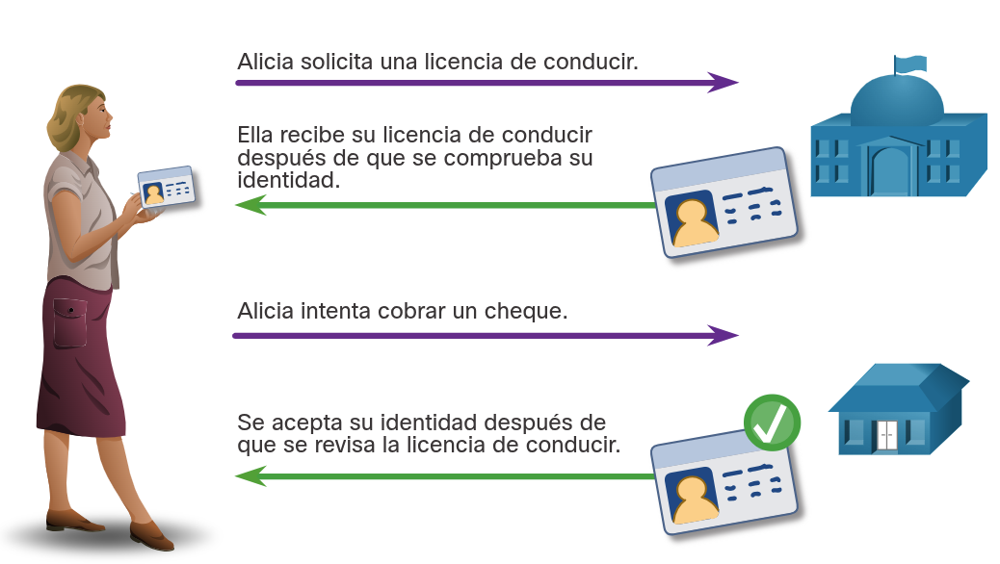

La infraestructura de claves públicas (Public Key Infrastructure, PKI) consiste en especificaciones, sistemas, y herramientas que se utilizan para crear, administrar, distribuir, utilizar, almacenar, y revocar certificados digitales. La autoridad de certificación (Certificate Authority, CA) es una organización que crea certificados digitales vinculando una clave pública a una identificación confirmada, como un sitio web o un individuo. La PKI es un sistema intrincado que está diseñado para salvaguardar las identidades digitales contra el hacking, incluso por los agentes de amenaza más sofisticados o estados nacionales.

Algunos ejemplos de CA son IDentrust, DigiCert, Sectigo, GlobalSign y GoDaddy. Estas CA pueden cobrar una tarifa por sus servicios. Let's Encrypt es una CA sin fines de lucro que ofrece certificados de forma gratuita.

## La infraestructura de clave pública
La PKI es necesaria para admitir la distribución e identificación a gran escala de claves de encriptación públicas. El marco de trabajo de la PKI permite una relación de confianza altamente escalable.

Se compone del hardware, el software, las personas, las políticas y los procedimientos necesarios para crear, administrar, almacenar, distribuir y revocar certificados digitales.

La figura muestra los principales elementos de la PKI.

	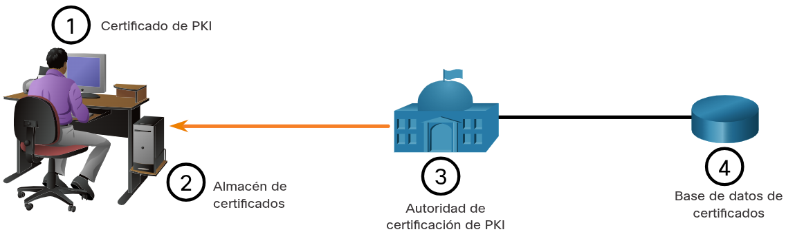

1. Los certificados PKI contienen la clave pública de una entidad o individuo, su propósito, la autoridad de certificación (CA) que validó y emitió el certificado, el rango de fechas durante el cual el certificado es válido y el algoritmo utilizado para crear la firma.
2. El almacén de certificados reside en una computadora local y almacena certificados emitidos y claves privadas.
3. La autoridad de certificación (CA) de PKI es un tercero de confianza que emite certificados PKI a entidades y personas luego de verificar sus respectivas identidades. Firma este certificado utilizando su clave privada.
4. En la base de datos de certificados se almacenan todos los certificados aprobados por la CA.

La siguiente figura muestra cómo interoperan los elementos de la PKI:
* En el ejemplo, Bob ha recibido su certificado digital de la CA. Este certificado se utiliza cada vez que Bob se comunica con otros participantes.
* Bob se comunica con Alice.
* Cuando Alice recibe el certificado de Bob, ella se comunica con la CA de confianza para validar la identidad de Bob.

	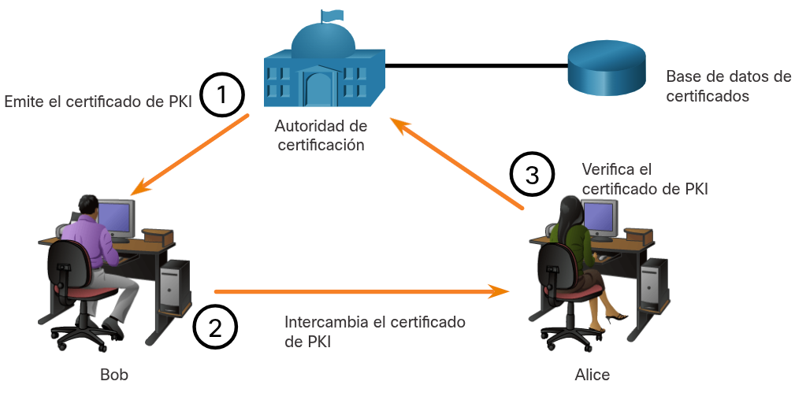

__Nota__: No todos los certificados de PKI se reciben directamente de una CA. Una autoridad de registro (RA, Registration Authority) es una CA secundaria y está certificada por una CA principal para emitir certificados para usos específicos.

## El sistema de autoridades PKI
Muchos proveedores proporcionan servidores de CA como un servicio administrado o como un producto para usuarios finales. Algunos de estos proveedores incluyen Symantec Group (VeriSign), Comodo, Go Daddy Group, GlobalSign y DigiCert, entre otros.

Las organizaciones también pueden implementar PKI privadas utilizando Microsoft Server u Open SSL.

Las cA, especialmente aquellas tercerizadas, emiten certificados basados en clases que determinan cuán confiable es un certificado.

La tabla proporciona una descripción de clases. El número de clase es determinado por el nivel de rigurosidad del procedimiento al momento de verificar la identidad del titular cuando se emitió el certificado. Por lo tanto, un certificado de clase 5 es mucho más confiable que un certificado de una clase inferior.

|__Clase__|__Descripción__|
|:-:|:-|
|0|Se utiliza para la verificación en situaciones en las que no se han realizado comprobaciones.|
|1|Utilizado por personas que requieren la verificación del correo electrónico.|
|2|Utilizado por organizaciones para las que se requiere una prueba de identidad.|
|3|Utilizado para servidores y firma de software. La autoridad de certificación realiza una verificación y comprobación independientes de la identidad y la autoridad.|
|4|Se utiliza para las transacciones comerciales en línea entre empresas.|
|5|Utilizado por organizaciones privadas o por la seguridad del gobierno.|

### Prueba del componente _iframe_
Por ejemplo, un certificado de clase 1 podría requerir una respuesta de correo electrónico del titular para confirmar que desea inscribirse. Este tipo de confirmación es una autenticación débil del titular. En el caso de un certificado de clase 3 o 4, el futuro titular debe probar su identidad y autenticar la clave pública presentándose en persona con, al menos, dos documentos de identificación oficiales.

Algunas claves públicas de la CA están precargadas, como las que aparecen en los navegadores web. La imagen muestra varios certificados de VeriSign que están guardados en el almacén de certificados en el host. El navegador considerará como legítimo cualquier certificado firmado por cualquiera de las CA de la lista y confiará automáticamente.

	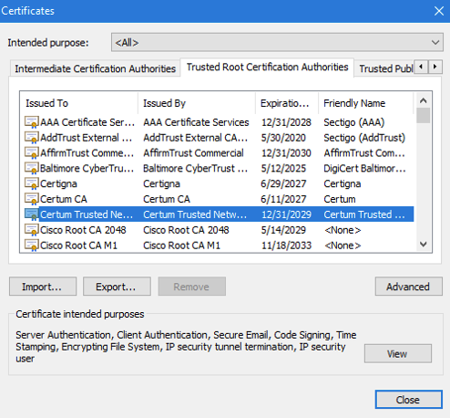

__Nota__: Una empresa también puede implementar una PKI para uso interno. La PKI puede utilizarse para autenticar a los empleados que tengan acceso a la red. En este caso, la empresa es su propia CA.

## El sistema de confianza PKI
Las PKI pueden formar distintas topologías de confianza. La más simple es la topología de PKI de raíz única.

Como se ve en la figura abajo, una sola CA, llamada la CA raíz, emite todos los certificados a los usuarios finales, que suelen encontrarse dentro de la misma organización. El beneficio de este enfoque es su sencillez. Sin embargo, es difícil llevar esta estructura a un entorno grande, ya que requiere una administración estrictamente centralizada que crea un punto único de falla.

	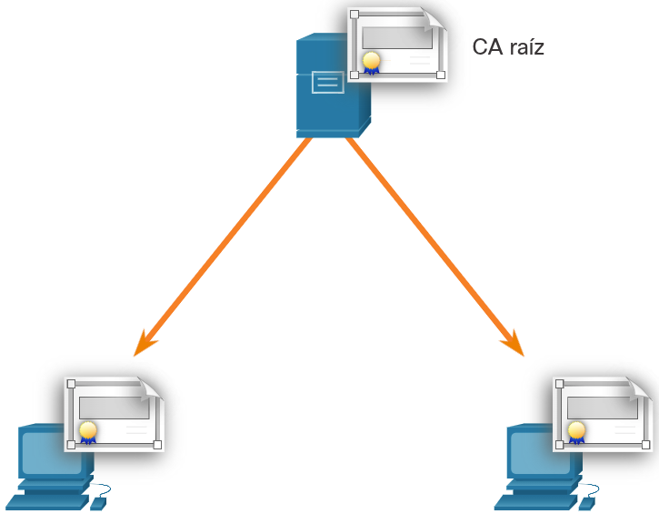

En redes mayores, las CA de la PKI pueden vincularse con dos arquitecturas básicas:

### Topologías de CA con certificación cruzada
Como se muestra en la figura siguiente, se trata de un modelo peer-to-peer en el que las CAs individuales establecen relaciones de confianza con otras CAs mediante la certificación cruzada de certificados de CA. Los usuarios de cualquiera de los dos dominios de CA pueden estar seguros de que pueden confiar en el otro. Esto proporciona redundancia y elimina el punto único de falla.

	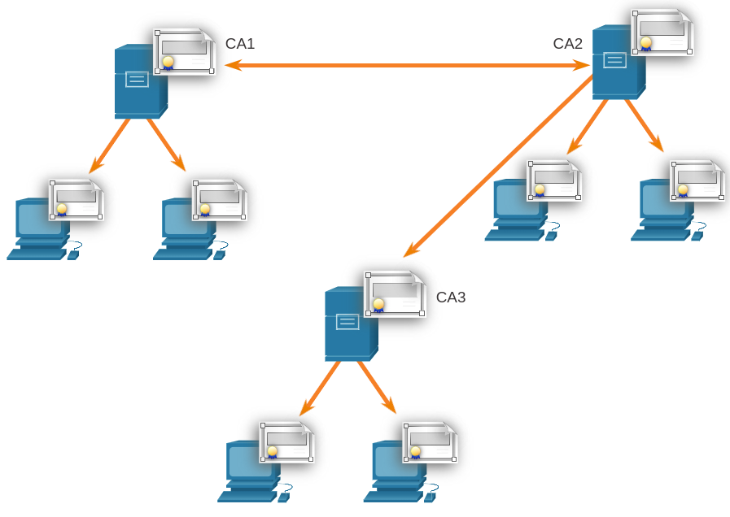

### Topologías de CA jerárquicas
Como se ve en la figura abajo, la CA de máximo nivel se llama CA raíz. Puede emitir certificados a usuarios finales y a una CA secundaria. Las CA pueden crearse para respaldar diversas unidades de negocio, dominios o comunidades de confianza. La CA raíz mantiene la “comunidad de confianza” establecida al asegurar que cada entidad de la jerarquía respete un conjunto mínimo de prácticas. Algunos beneficios de esta topología son los niveles superiores de escalabilidad y manejabilidad. Esta topología funciona bien en la mayoría de las organizaciones grandes. Sin embargo, puede ser difícil determinar la cadena del proceso de firma.

Las topologías jerárquica y de certificación cruzada pueden combinarse para crear una infraestructura híbrida. Un ejemplo sería cuando dos comunidades jerárquicas quieren realizar la certificación cruzada entre ellas para que los miembros de cada comunidad tengan mutua confianza.

	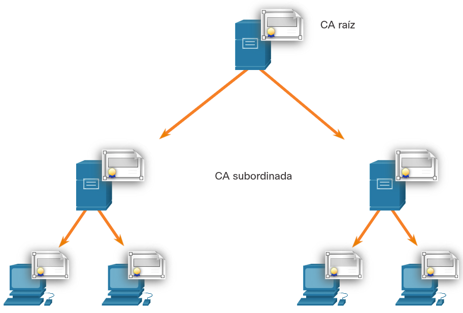

## Interoperabilidad de los distintos proveedores de PKI
Existe una preocupación acerca de la interoperabilidad entre una PKI y sus servicios de respaldo, tales como el protocolo ligero de acceso a directorios (LDAP) y los directorios X.500, dado que muchos proveedores de CA han propuesto e implementado soluciones propias en lugar de esperar a que se desarrollen estándares.

__Nota__: LDAP y X.500 son protocolos que se utilizan para consultar un servicio de directorios, como Microsoft Active Directory, para comprobar un nombre de usuario y una contraseña.

Para abordar esta preocupación sobre la interoperabilidad, la IETF publicó el Marco de trabajo de prácticas de certificación y políticas de certificación de infraestructuras de claves públicas X.509 de Internet (RFC 2527). El estándar X.509 versión 3 (X.509v3) define el formato de un certificado digital.

Consulte la figura para obtener más información sobre las aplicaciones X.509 v3. Como se ve en la figura, el formato X.509 ya se usa ampliamente en la infraestructura de Internet.

	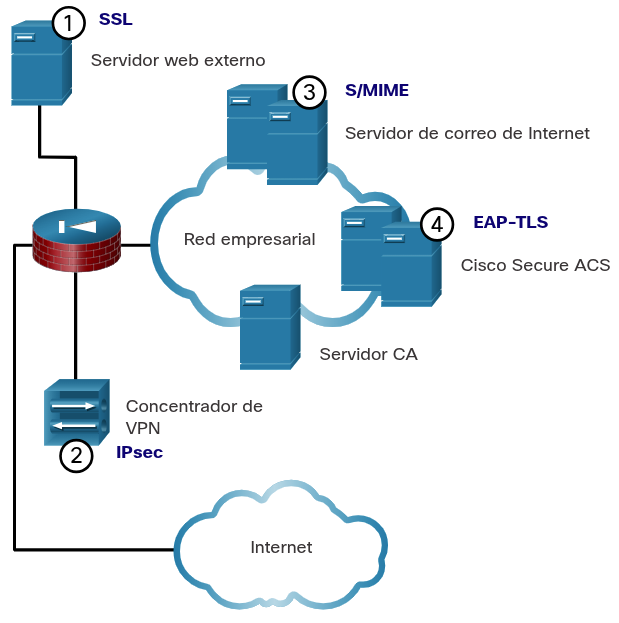

1. __SSL__. Lo servidores web seguros utilizan X.509.v3 para la autenticación de sitios web en los protocolos SSL y TLS mientras que los navegadores web utilizan X.509v3 para implementar certificados de clientes HTTP. SSL es la autenticación basada en certificados más utilizada.
2. __IPsec__. Las VPNs IPsec utilizan certificados X.509 cuando se utiliza la autenticación basada en RSA para el intercambio de claves de Internet (IKE).
3. __S/MIME__. Los agentes de correo de usuarios que admiten la protección de correo con el protocolo de Extensiones Seguras Multipropósito de Correo de Internet (S/MIME, siglas en inglés) utilizan certificados X.509.
4. __EAP-TLS__. Los switches de Cisco pueden utilizar los certificados para autenticar los dispositivos finales que se conectan a puertos de LAN utilizando 802.1.X entre los dispositivos adyacentes. La autenticación se puede transmitir por proxy a un ACS central a través del Protocolo de autenticación extensible con TLS (Extensible Authentication Protocol with TLS, EAP-TLS).

## Inscripción, autenticación y revocación de certificados
En el procedimiento de autenticación de CA, el primer paso es obtener una copia segura de la clave pública de la CA. Todos los sistemas que utilizan el PKI deben tener la clave pública de la CA, que se llama certificado autofirmado. La clave pública de la CA verifica todos los certificados emitidos por la CA y es vital para el correcto funcionamiento del PKI.

__Nota__: Solo una CA raíz puede emitir un certificado autofirmado que sea reconocido o verificado por otras CA dentro de la PKI.

Para muchos sistemas, como los navegadores web, la distribución de los certificados de CA se maneja automáticamente. El navegador web trae preinstalado un conjunto de certificado raíz de CA públicos. Las organizaciones y sus dominios de sitios web envian sus certificados públicos a los visitantes del sitio web. Las CA y los registradores de dominios de certificados crean y distribuyen certificados privados y públicos a los clientes que compran certificados.

Un sistema de host utiliza el proceso de inscripción de certificado para inscribirse en una PKI. Para hacerlo, se recuperan los certificados de CA en banda en una red y la autenticación se realiza fuera de banda utilizando el teléfono. El sistema que se inscribirá en la PKI se pone en contacto con una CA para solicitar y obtener un certificado de identidad digital para sí mismo y para obtener el certificado firmado automáticamente de la CA. En la etapa final, se verifica la autenticidad del certificado de CA utilizando un método fuera de banda como el Sistema de Servicio Telefónico Analógico (Plain OLd Telephone System POTS), para obtener la huella digital del certificado de identidad válido de CA.

La autenticación ya no requiere la presencia del servidor de CA y cada usuario intercambia sus certificados que contienen las claves públicas.

A veces, se debe revocar el certificado. Por ejemplo, un certificado digital se puede revocar si la clave está en riesgo o si ya no es necesario.
* __Lista de revocación de certificados (CRL)__. Una lista de números de serie de certificados revocados que se han invalidado porque caducaron. Las entidades de PKI sondean periódicamente el repositorio de CRL para recibir la CRL más actuales.
* __Protocolo de estado de certificado en línea (_Online Certificate Status Protocol_ - OCSP)__. Protocolo de Internet utilizado para consultar a un servidor OCSP sobre el estado de revocación de un certificado digital X.509. La información sobre revocación se publica inmediatamente en una base de datos en línea.

## Práctica de laboratorio: Almacenes de la autoridad de certificación
* <a href="./notes/lab_almacenes_autoridad_certificacion.md" target="_blank">Almacenes de la autoridad de certificación</a>

# Aplicaciones e impactos de la criptografía
## Aplicaciones PKI
¿Dónde puede usar PKI en una empresa? A continuación, se detalla una breve lista de usos comunes de las PKI:
* Autenticación de pares basada en certificados SSL/TLS.
* Asegurar tráfico de red utilizando redes VPN IPsec.
* Tráfico web HTTPS.
* Control de acceso a la red mediante la autenticación 802.1x.
* Protección de correo electrónico utilizando el protocolo S/MIME.
* Protección de mensajería instantánea.
* Aprobación y autorización de aplicaciones con firma de código.
* Protección de datos de usuarios con el sistema de archivos de encriptación (EFS).
* Implementación de autenticación de dos factores con tarjetas inteligentes.
* Protección de dispositivos de almacenamiento USB.

## Transacciones de red encriptadas
Un analista de seguridad debe ser capaz de reconocer y resolver problemas potenciales relacionados a permitir el uso de soluciones relacionadas con PKI en la red empresarial.

Tenga en cuenta la manera en que el crecimiento del tráfico de SSL/TLS constituye un riesgo grave de seguridad para las empresas, ya que el tráfico está encriptado y no puede interceptarse ni monitorearse con los métodos normales. Los usuarios pueden introducir malware o filtrar información confidencial en una conexión SSL/TLS.

Los agentes de amenaza pueden utilizar SSL/TLS para introducir violaciones de cumplimiento reglamentario, virus y malware, o provocar pérdida de datos e intentos de intrusión en una red.

Otros problemas relacionados con SSL/TLS pueden vincularse a la validación del certificado de un servidor web. Cuando esto ocurre, los navegadores web muestran una advertencia de seguridad. Los problemas relacionados con la PKI que están vinculados a advertencias de seguridad incluyen los siguientes:
* __Rango de fechas de validez__. Los certificados X.509v3 especifican fechas "no antes" y "no después". Si la fecha actual está fuera del rango, el navegador web muestra un mensaje. Los certificados caducados pueden deberse simplemente a una distracción del administrador, pero también pueden reflejar problemas más graves.
* __Error de validación de la firma__. Si un navegador no puede validar la firma del certificado, no hay garantía de que la clave pública del certificado sea auténtica. Ocurrirá un error con la validación de la firma si el certificado raíz de la jerarquía de la CA no está disponible en el almacén de certificados del navegador.

En la figura, se ve un ejemplo de un error de validación de firma con Cisco AnyConnect Mobility VPN Client.

	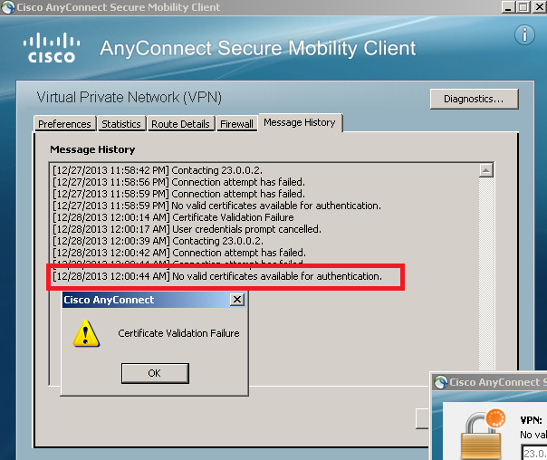

Algunos de estos problemas pueden evitarse gracias a que los protocolos SSL/TLS son extensibles y modulares. Esto se conoce como un conjunto de cifrado. Los componentes clave del conjunto de cifrado son el algoritmo de código de autenticación de mensajes (MAC), el algoritmo de cifrado, el algoritmo de intercambio de claves y el algoritmo de autenticación. Estos pueden cambiarse sin reemplazar todo el protocolo. Esta función resulta muy útil, ya que los diferentes algoritmos continúan evolucionando. A medida que el criptoanálisis sigue revelando defectos en estos algoritmos, el conjunto de cifrado se puede actualizar para colocar parches en estos defectos. Cuando las versiones del protocolo dentro del conjunto de cifrado cambian, el número de versión de SSL/TLS también lo hace.

## Cifrado y supervisión de la seguridad
El monitoreo de red se vuelve más difícil cuando los paquetes están encriptados. Sin embargo, los analistas de seguridad deben conocer esas dificultades y resolverlas lo mejor posible. Por ejemplo, cuando se utilizan VPN de sitio a sitio, el IPS debe colocarse de modo que pueda monitorear el tráfico sin encriptar.

Sin embargo, el aumento de HTTPS en la red empresarial supone nuevos desafíos. Dado que HTTPS introduce tráfico HTTP encriptado de extremo a extremo (vía TLS/SSL), no es tan fácil observar el tráfico de los usuarios.

Los analistas especializados en seguridad deben saber cómo sortear y resolver estos problemas. Aquí vemos una lista de algunas de las medidas que podría tomar un analista especializado en seguridad:
* Configurar reglas para distinguir entre tráfico SSL y no SSL, o entre tráfico SSL HTTPS y no HTTPS.
* Aumentar la seguridad mediante la validación de certificados de servidor usando CRL y OCSP.
* Implementar protección antimalware y filtrado URL de contenido HTTPS.
* Implementar un dispositivo Cisco SSL Appliance para descifrar el tráfico SSL y enviarlo a dispositivos de un Sistema de prevención de intrusiones (Intrusion Prevention System, IPS) para identificar riesgos normalmente ocultos para SSL.

La criptografía es dinámica y siempre cambia. Un analista de seguridad debe comprender bien los algoritmos y las operaciones criptográficas para poder investigar los incidentes de seguridad relacionados con la criptografía.

Hay dos maneras principales en las que la criptografía afecta las investigaciones de seguridad. En primer lugar, los ataques pueden dirigirse específicamente a los algoritmos de encriptación propiamente dichos. Después de que se desencripta el algoritmo y el atacante obtiene las claves, es posible desencriptar y leer todos los datos encriptados que recopile el atacante, lo que expone los datos privados. Luego de esto, la investigación de seguridad también se ve afectada porque los datos se pueden ocultar a plena vista, encriptándolos. Por ejemplo, es muy probable que un firewall no vea el tráfico de comando y control que se encripte con TLS/SSL. Si no es posible ver y comprender el tráfico de comando y control entre un servidor de comando y control y una computadora infectada en una red segura, tampoco se puede detener. El atacante podría continuar usando comandos encriptados para infectar más computadoras y, posiblemente, crear una botnet. Es posible detectar este tipo de tráfico si se desencripta el tráfico y se lo compara con firmas de ataques conocidos, o si se detecta tráfico anómalo de TLS/SSL. Esto es muy difícil y lento, y la eficacia del proceso no está garantizada.

# Resumen
## Confidencialidad
Hay dos clases de encriptación utilizadas para brindar confidencialidad de los datos: asimétrica y simétrica. Estas dos clases se diferencian en cómo utilizan las claves. Los algoritmos de encriptpación simétricos como DES, 3DES y el estándar AES se basan en la premisa de que cada parte que se comunica conoce la clave precompartida. La confidencialidad de los datos también se puede garantizar utilizando algoritmos asimétricos, incluidos RSA y PKI. Los algoritmos simétricos se usan normalmente con el tráfico de VPN porque utilizan menos recursos de CPU que los algoritmos de encriptación asimétrica. Los algoritmos de encriptación simétrica a menudo se clasifican como: cifrados por bloque o cifrados de flujo. Los algoritmos asimétricos, también llamados algoritmos de claves públicas, están diseñados para que la clave de encriptación y la de desencriptación sean diferentes. Los algoritmos asimétricos utilizan una clave pública y una privada. Algunos ejemplos de protocolos que utilizan algoritmos de claves asimétricos son: IKE, SSL, SSH, y PGP. Ejemplos comunes de algoritmos de encriptación asimétricos incluyen DSS, DSA, RSA, EIGaMal y técnicas de curva elíptica. Los algoritmos asimétricos se usan para brindar confidencialidad sin compartir previamente una contraseña. El proceso se puede resumir mediante la fórmula: Clave pública (Encriptar) + Clave privada (Desencriptar) = Confidencialidad El objetivo de autenticación de los algoritmos asimétricos se inicia cuando comienza el proceso de encriptación con la clave privada. El proceso se puede resumir mediante la fórmula: Clave privada (Encriptar) + Clave pública (Desencriptar) = Autenticación. Combinar los dos procesos de encriptación asimétrica proporciona confidencialidad, autenticación e integridad de los mensajes. Diffie-Hellman (DH) es un algoritmo de ecuación matemática asimétrico que permite que dos computadoras generen una clave secreta idéntica compartida sin antes haberse comunicado. Dos ejemplos de instancias cuando se utiliza DH son cuando los datos son intercambios mediante una VPN IPsec y cuando se intercambian datos SSH.

## Ocultamiento de datos
El enmascaramiento de datos puede reemplazar los datos confidenciales en los entornos no productivos para proteger la información subyacente. Los métodos incluyen la sustitución, la combinación aleatoria y la anulación. La esteganografía oculta datos en otro archivo, tal como un archivo gráfico, de audio o de video. La ventaja de la esteganografía sobre la criptografía es que el mensaje secreto no atrae ninguna atención especial.

## Integridad y autenticidad
Las organizaciones deben proporcionar soporte para proteger los datos a medida que viajan a través de enlaces. Los cuatro elementos de las comunicaciones seguras son: integridad de datos, autenticación de origen, confidencialidad de datos y no repudio de datos. La criptografía puede usarse casi en cualquier lugar donde haya comunicación de datos. Los hash criptográficos se usan para comprobar y garantizar la integridad de los datos. El hashing se basa en una función matemática unidireccional que es relativamente fácil de computar, pero mucho más difícil de revertir. La función de hash criptográfico puede utilizarse también para verificar la integridad Una función de hash toma un bloque variable de datos binarios, denominado mensaje, y produce una representación condensada de longitud fija, denominada hash. Hay cuatro funciones hash conocidas: MD5 con resumen de 128 bits, SHA-1, SHA-2 y SHA-3. Mientras que el hash se puede utilizar para detectar modificaciones accidentales, no brinda protección contra cambios deliberados hechos por un agente de amenaza. El hash es vulnerable a los ataques MITM. Para proporcionar integridad y autenticación de origen, se necesita algo más. Para agregar autenticación al control de integridad, se usa un Código de Autenticación de Mensajes basado en Hash (Hashed Message Authentication Codes HMAC) con clave. Los HMAC utilizan una clave secreta adicional como entrada para la función de hash.

## Uso de hashes
Las funciones de hash son funciones unidireccionales utilizadas para verificar y garantizar la integridad de los datos. Una herramienta de hash también puede verificar la autenticación. Cada vez que los datos cambian, el valor hash también cambia. Una función criptográfica tiene las siguientes propiedades: la entrada puede tener cualquier longitud, la salida tiene una longitud fija, la función hash es unidireccional e irreversible, y dos valores de entrada diferentes casi nunca darán como resultado el mismo hash. Los dos algoritmos hash más comunes son MD5 y SHA. Para descifrar un hash, un atacante debe adivinar la contraseña. Los dos principales ataques utilizados son los de diccionario y los de fuerza bruta. Un salt es una entrada adicional agregada a la contraseña. Esto crea un resultado de hash diferente incluso cuando las dos contraseñas son idénticas. Un generador criptográficamente seguro de números pseudoaleatorios (CSPRNG) es la mejor opción para generar un salt. El salting evita que un atacante utilice un ataque de diccionario para adivinar las contraseñas. El uso de una clave secreta en el hash mediante un algoritmo llamado HMAC o KHMAC ayuda a proteger contra ataques de diccionario o de fuerza bruta.

## Criptografía de clave pública
Las firmas digitales son una técnica matemática empleada para brindar 3 servicios de seguridad básicos: autenticidad, integridad, y no repudio (osea, que no se rechaze el mensaje al negar ser el remitente o el receptor) Las propiedades de la firma digital son: que son auténticas, inalterables, no reutilizables y no repudiadas. Las firmas digitales se utilizan comúnmente en las siguientes dos situaciones: firma de código y certificados digitales Existen tres algoritmos DSS que se utilizan para generar y verificar firmas digitales: Algoritmo de Firma Digital (Digital Signature Algorithm DSA), algoritmo Rivet-Shamir Adelman (Rivet-Shamir Adelman Algorithm RSA) y Algoritmo de Firma Digital de Curva Elíptica (Elliptical Curve Digital Signature Algorithm ECDSA). El código de firma digital proporciona garantías sobre el código de software: el código es auténtico y en realidad es originado por el editor, el código no ha sido modificado desde que salió del editor del software, y el editor innegablemente publicó el código. Un certificado digital es equivalente a un pasaporte electrónico. Permite que los usuarios, hosts y organizaciones intercambien información de manera segura en Internet. Específicamente, un certificado digital se usa para autenticar y verificar que los usuarios que envían un mensaje son quienes afirman ser.

## Autoridades y el sistema de confianza de PKI
Cuando se establece una conexión segura entre dos hosts, estos intercambian su información de clave pública. Existen terceros de confianza de Internet que validan la autenticidad de estas claves públicas mediante certificados digitales. La Infraestructura de Claves Públicas (Public Key Infrastructure PKI) consiste en especificaciones, sistemas, y herramientas que se utilizan para crear, administrar, almacenar, distribuir, utilizar, y revocar certificados digitales. La PKI es necesaria para admitir la distribución e identificación a gran escala de claves de encriptación públicas. El marco de trabajo de PKI permite una relación de confianza altamente escalable. Muchos proveedores proporcionan servidores de CA como un servicio administrado o como un producto para usuarios finales. Algunos de estos proveedores incluyen Symantec Group (VeriSign), Comodo, Go Daddy Group, GlobalSign y DigiCert, entre otros. El número de clase (entre 0 y 5) es determinado por el nivel de rigurosidad del procedimiento al momento de verificar la identidad del titular cuando se emitió el certificado, siendo que 5 es el mayor. Las PKI pueden formar distintas topologías de confianza. La más simple es la topología de PKI de raíz única. La interoperabilidad entre una PKI y sus servicios de soporte, por ejemplo el protocolo LDAP y los directorios X.500, es una preocupación porque muchos proveedores de CA han propuesto e implementado soluciones propias en lugar de esperar a que se desarrollen estándares. Para resolver el problema de la interoperabilidad, el IETF publicó la Política de Certificados de Infraestructura de Clave Pública de Internet y el Marco de Certificación X.509 (RFC 2527).

## Aplicaciones e impactos de la criptografía
Hay muchos usos comunes de PKI, incluidos algunos mencionados aquí: autenticación de pares basada en certificados SSL/TLS, tráfico web HTTPS, mensajes instantáneos seguros y protección de dispositivos de almacenamiento USB. Un analista de seguridad debe ser capaz de reconocer y resolver problemas potenciales relacionados a permitir el uso de soluciones relacionadas con PKI en la red empresarial. Por ejemplo: los agentes de amenaza pueden utilizar SSL/TLS para introducir violaciones de cumplimiento reglamentario, virus y malware, o provocar pérdida de datos e intentos de intrusión en una red. Otros problemas relacionados con SSL/TLS pueden asociarse a la validación del certificado de un servidor web. Algunos de los problemas relacionados con la PKI que están asociados a advertencias de seguridad son los siguientes: Algunos de estos problemas pueden evitarse gracias a que los protocolos SSL/TLS son extensibles y modulares. Esto se conoce como el conjunto de cifrado. Los componentes clave del conjunto de cifrado son el algoritmo MAC, el algoritmo de encriptación, el algoritmo de intercambio de claves y el algoritmo de autenticación. La criptografía es dinámica y siempre cambia. Debemos comprender bien los algoritmos y las operaciones para poder investigar los incidentes de seguridad relacionados con la criptografía. Las comunicaciones encriptadas pueden hacer que las cargas útiles de datos de seguridad de red sean ilegibles por los analistas de ciberseguridad. La encriptación se puede utilizar para ocultar comandos de malware y controlar el tráfico entre los hosts infectados y los servidores de control y comando. Además, el malware puede ocultarse mediante la encriptación y los datos pueden encriptarse durante la exfiltración, lo que dificulta su detección.

# Enlaces de interés
<a target="_blank" href="http://project-rainbowcrack.com/">Uso de tablas arcoiris con RainbowCrack</a>
<a target="_blank" href="https://ophcrack.sourceforge.io/">Uso de tablas arcoiris con Ophcrack</a>
 
 
 
 
 
 
 
 
 
<a href="#8-criptografía">⬆️</a>
<a href="./00-Curso.md"><< Menú principal del módulo</a>