<a href="./00-Curso.md"><< Menú principal del módulo</a>

# 9. Tecnologías y protocolos
# Monitoreo de protocolos comunes
## Syslog y NTP
Diversos protocolos que comúnmente aparecen en las redes tienen características que los hacen particularmente interesantes para el monitoreo de la seguridad. Por ejemplo, syslog y el protocolo de tiempo de red (NTP) son esenciales para el trabajo del analista de ciberseguridad.

El estándar syslog se usa para registrar mensajes de eventos provenientes de terminales y dispositivos de red, como se ve en la figura. El estándar habilita un medio independiente del sistema para transmitir, almacenar y analizar mensajes. Muchos tipos de dispositivos de muchos proveedores diferentes pueden utilizar syslog para enviar entradas del registro a servidores centrales que ejecutan un daemon de syslog. Esta centralización de la recopilación de registros ayuda a poner en práctica el monitoreo de la seguridad. Los servidores que ejecutan syslog suelen escuchar en el puerto UDP 514.

Debido a que syslog es tan importante para el monitoreo de la seguridad, los servidores syslog pueden ser un blanco de los agentes de amenaza. Algunos exploits, como los que implican la exfiltración de datos, pueden tardar mucho tiempo en completarse. Esto se debe a que las formas en que los datos se roban en secreto de la red pueden ser muy lentas. Algunos atacantes pueden intentar ocultar la exfiltración. Atacan los servidores syslog que contienen la información que podría conducir a la detección del ataque. Los hackers pueden intentar bloquear la transferencia de datos de los clientes syslog a los servidores. Pueden alterar o destruir datos de registro o el software que crea y transmite los mensajes de registro. La siguiente generación de implementación de syslog, conocida como syslog-ng, ofrece mejoras que pueden ayudar a evitar algunos de los ataques cuyo objetivo es syslog.

Busque en Internet para obtener más información acerca de syslog-ng.

	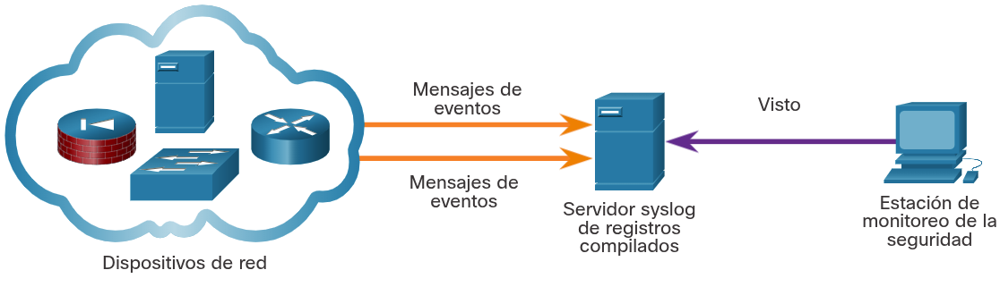

## NTP
Los mensajes de syslog suelen tener marca de hora. Esto permite organizar por hora los mensajes de distintas fuentes para brindar un panorama de los procesos de comunicación de red. Dado que los mensajes pueden provenir de muchos dispositivos, es importante que los dispositivos compartan un reloj único. Una forma de lograr esto es que los dispositivos usen el protocolo de tiempo de red (NTP). El NTP utiliza una jerarquía de fuentes horarias autorizadas para compartir información entre dispositivos de la red, como se ve en la figura. De esta manera, es posible enviar al servidor de syslog mensajes de dispositivos que compartan información horaria uniforme. El NTP funciona en el puerto UDP 123.

Dado que los eventos conectados a un ataque pueden dejar rastros en cada dispositivo de la red mientras recorren su camino al sistema de destino, las marcas de tiempo son esenciales para la detección. Los agentes de amenaza pueden intentar atacar la infraestructura de NTP para dañar la información horaria utilizada para correlacionar los eventos registrados de la red. Esto puede servir para ocultar rastros de ataques en curso. Además, se han conocido agentes de amenaza que utilizan sistemas de NTP para dirigir ataques de DDoS aprovechando vulnerabilidades en el software del cliente o del servidor. Mientras que estos ataques no necesariamente dañan los datos de monitoreo de seguridad, pueden interrumpir la disponibilidad de la red.

	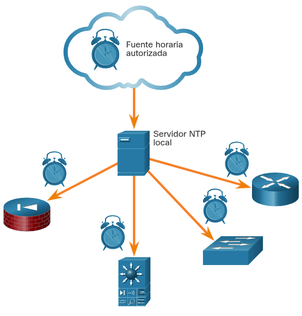

## DNS
Millones de personas usan el servicio de nombres de dominio (DNS) diariamente. Debido a esto, muchas organizaciones tienen políticas menos rigurosas para protegerse contra amenazas basadas en DNS que las que tienen para protegerse contra otros tipos de ataques. Los atacantes lo saben y, comúnmente, encapsulan distintos protocolos de red en el DNS para evadir los dispositivos de seguridad. Actualmente, muchos tipos de malware usan el DNS. Algunas variantes de malware emplean el DNS para comunicarse con servidores de comando y control (CnC) y para exfiltrar datos de tráfico disfrazados de consultas de DNS normales. Diversos tipos de codificación, tales como Base64, binaria de 8 bits y hexadecimal, pueden usarse para camuflar datos y evadir las medidas básicas de prevención de pérdida de datos (DLP, Data Loss Prevention).

Por ejemplo, el malware podría codificar datos robados como una parte del subdominio de una búsqueda de DNS en un dominio donde el servidor de nombres esté bajo control de un atacante. Una búsqueda de DNS para ‘cadena-larga-de-datos-exfiltrados.ejemplo.com’ remitirá al servidor de nombres ejemplo.com, que podría registrar ‘cadena-larga-de-datos-exfiltrados’ y responder al malware con una respuesta codificada. Este uso del subdominio de DNS se ve en la figura. Los datos exfiltrados son el texto codificado que se ve en el cuadro. El agente de amenaza recoge estos datos codificados, los decodifica y los combina, y obtiene acceso a un archivos de datos completo, por ejemplo, una base de datos de nombres de usuario y contraseñas.

Es probable que la parte de subdominio de tales solicitudes sea mucho más larga que las solicitudes habituales. Los ciberanalistas pueden utilizar la distribución de las longitudes de subdominios dentro de solicitudes de DNS para construir un modelo matemático que describa la normalidad. Este modelo puede resultar útil para comparar sus observaciones e identificar un abuso del proceso de consulta de DNS. Por ejemplo, no sería normal ver un host en la red enviando una consulta a aW4gcGxhY2UgdG8gcHJvdGVjdC.ejemplo.com.

Las consultas de DNS para nombres de dominio generados aleatoriamente o subdominios extremadamente largos que aparecen aleatorios se deben considerar sospechosas, especialmente si su aparición provoca aumentos excesivos de utilización de la red. Los registros de proxy de DNS pueden analizarse para detectar estas condiciones. Otra opción es usar servicios, como el servicio de DNS pasivo Cisco Umbrella, para bloquear solicitudes a dominios sospechosos de CnC y ataque.

	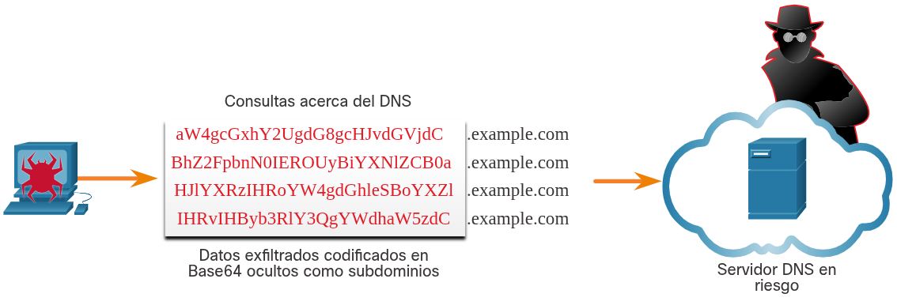

## HTTP y HTTPS
El protocolo de transferencia de hipertexto (HTTP) es el protocolo troncal de la red informática mundial (World Wide Web). Sin embargo, toda la información que se transporta mediante HTTP se transmite como texto sin formato desde la computadora de origen hasta el destino en Internet. HTTP no protege los datos de atacantes que deseen alterarlos o interceptarlos, lo que constituye una grave amenaza a la privacidad, identidad y seguridad de la información. Toda la actividad de navegación debe considerarse en riesgo.

Un ataque común de HTTP se denomina inyección de iFrame (inline Frame). La mayoría de las amenazas con base en la web se componen de secuencias de comando de malware plantadas en servidores web. Estos servidores web cargan iFrames para dirigir a los navegadores a servidores infectados. Durante la inyección de iFrames, un agente de amenaza ataca un servidor web y planta código malicioso que genera un iFrame invisible en una página web comúnmente visitada. Cuando se carga el iFrame, se descarga malware, normalmente desde una dirección URL diferente de la de la página web que contiene el código del iFrame. Los servicios de seguridad de red, como el Cisco Web Reputation filtering, pueden detectar cuándo un sitio web intenta enviar contenido desde un sitio web que no es de confianza al host, incluso cuando se envía desde un iFrame, como se muestra en la figura.

	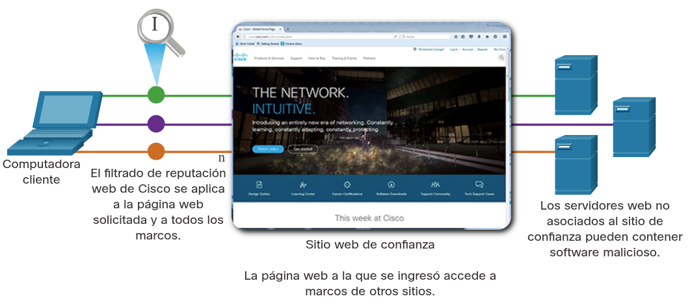

Para hacer frente a la alteración o la interceptación de datos confidenciales, muchas organizaciones comerciales han adoptado HTTPS o implementado políticas exclusivas de HTTPS para proteger a quienes visitan sus sitios web y servicios.

HTTPS agrega una capa de cifrado al protocolo HTTP mediante el uso de Capa de conexión segura (SSL), como se muestra en la figura. Esto hace que los datos HTTP sean ilegibles cuando dejan la computadora de origen y hasta que llegan al servidor. Tenga en cuenta que HTTPS no es un mecanismo de seguridad del servidor web. Solamente protege el tráfico del protocolo HTTP mientras está en tránsito.

	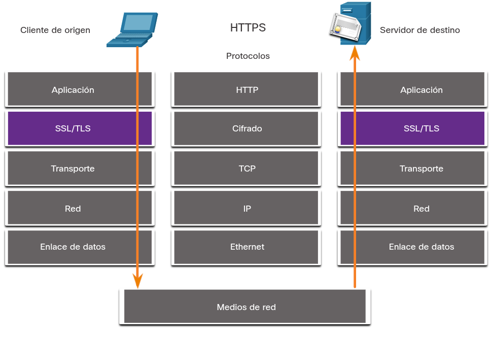

Por desgracia, el tráfico HTTPS encriptado complica el monitoreo de seguridad de la red. Algunos dispositivos de seguridad incluyen la decriptación e inspección de SSL; sin embargo, esto puede traer problemas de procesamiento y privacidad. Además, HTTPS añade complejidad a las capturas de paquetes debido a la mensajería adicional implicada en el establecimiento de la conexión encriptada. Este proceso se resume en la figura y representa una sobrecarga adicional sobre HTTP.

	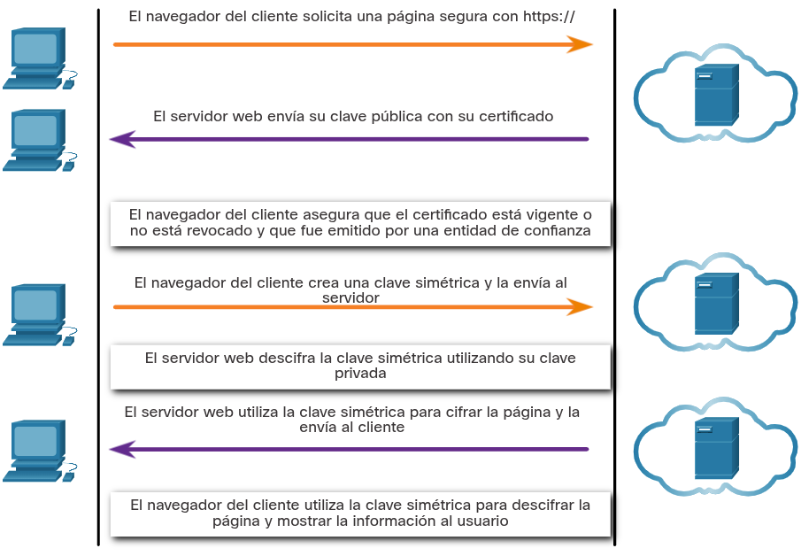

## Protocolos de correo electrónico
Los protocolos de correo electrónico, como SMTP, POP3 e IMAP, pueden usarse para propagar malware, exfiltrar datos u ofrecer canales a servidores de CnC de malware, como se ve en la figura.

El SMTP envía datos desde un host hacia un servidor de correo y entre servidores de correo. Al igual que DNS y HTTP, es un protocolo común que suele verse saliendo de la red. Dado que hay tanto tráfico de SMTP, no siempre se monitorea. Sin embargo, el malware ha usado el SMTP en el pasado para exfiltrar datos de la red. En el ataque de 2014 a Sony Pictures, uno de los ataques usó SMTP para exfiltrar detalles de usuarios desde hosts atacados a servidores de CnC. Es posible que esta información se haya utilizado para ayudar a desarrollar ataques de recursos protegidos dentro de la red de Sony Pictures. El monitoreo de la seguridad podría revelar este tipo de tráfico según las características del mensaje de correo electrónico.

IMAP y POP3 se usan para descargar mensajes de correo electrónico de un servidor de correo a una computadora host. Por esto, son los protocolos de aplicaciones responsables de traer malware al host. El monitoreo de la seguridad puede identificar cuándo ingresa un archivo adjunto con malware en la red y qué host se infecta primero. Luego, el análisis retrospectivo puede rastrear el comportamiento del malware desde ese momento. De esta manera, puede entenderse mejor el comportamiento del malware y se puede identificar la amenaza. Las herramientas de monitoreo de seguridad pueden también permitir la recuperación de archivos adjuntos infectados para enviarlos a sandbox de malware para su análisis.

	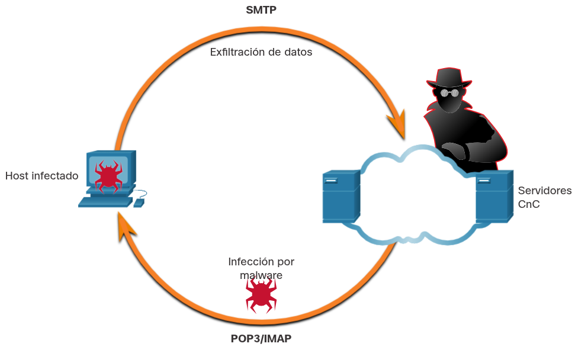

## ICMP
ICMP tiene muchos usos legítimos, sin embargo, la funcionalidad ICMP también se ha utilizado para crear varios tipos de exploits. ICMP puede emplearse para identificar los hosts de una red o la estructura de una red, y determinar los sistemas operativos utilizados en la red. También puede usarse como vehículo para varios tipos de ataques de DoS.

ICMP también puede usarse para la exfiltración de datos. Debido a la preocupación de que ICMP puede utilizarse para vigilar o denegar un servicio desde el exterior de la red, suele dejarse de lado el tráfico ICMP desde el interior de la red. Sin embargo, algunas variedades de malware utilizan paquetes ICMP diseñados para transferir archivos de hosts infectados a los agentes de amenaza usando este método, que se conoce como tunelización de ICMP.

Busque en Internet una explicación detallada del conocido exploit LOKI.

__Nota__: Uno o todos los sitios disponibles en su búsqueda pueden estar bloqueados por el firewall de su institución.

Existe una serie de herramientas para crear túneles. Busque en Internet Ping Tunnel para explorar una de estas herramientas.

# Tecnologías de seguridad
## ACL
Muchos protocolos y tecnologías pueden afectar el monitoreo de la seguridad. Las listas de control de acceso (ACL, Access Control List) se encuentran entre estas tecnologías. Las listas ACL pueden dar una falsa sensación de seguridad si se confía demasiado en ellas. Las ACL y el filtrado de paquetes en general son tecnologías que forman parte de un conjunto de protecciones de seguridad de la red en constante evolución.

En la figura, se ejemplifica el uso de ACL para autorizar solamente determinados tipos de tráfico de protocolo de mensajería de control de Internet (ICMP). El servidor en 192.168.1.10 forma parte de la red interna y tiene permitido enviar solicitudes de ping al host externo en 209.165.201.3. El tráfico ICMP de retorno del host externo está autorizado si se trata de una respuesta de ICMP, un mensaje source quench (le indica al origen que reduzca el ritmo del tráfico) o cualquier mensaje de ICMP inalcanzable. Todos los demás tipos de tráfico de ICMP se niegan. Por ejemplo, el host externo no puede iniciar una solicitud de ping al host interno. La ACL de salida autoriza los mensajes de ICMP que informan diversos tipos de problemas. Esto permite la tunelización de ICMP y la exfiltración de datos.

Los atacantes pueden determinar qué direcciones IP, protocolos y puertos están autorizados por las ACL. Esto se puede hacer mediante escaneo de puertos, pruebas de penetración o mediante otras formas de reconocimiento. Los atacantes pueden crear paquetes que utilicen direcciones IP de orígenes falsificados. Las aplicaciones pueden entablar conexiones en puertos arbitrarios. Otras características del tráfico de protocolo también pueden manipularse, como el marcador establecido en segmentos de TCP. Las reglas no pueden preverse y configurarse para todas las técnicas de manipulación de paquetes que surgen.

Para detectar la manipulación de paquetes y reaccionar ante ella, deben tomarse medidas más sofisticadas con base en el comportamiento y el contexto. Los firewalls de última generación de Cisco, la protección avanzada contra malware (AMP) y los dispositivos de correo electrónico y contenido web son capaces de abordar las deficiencias de las medidas de seguridad con base en las reglas.

	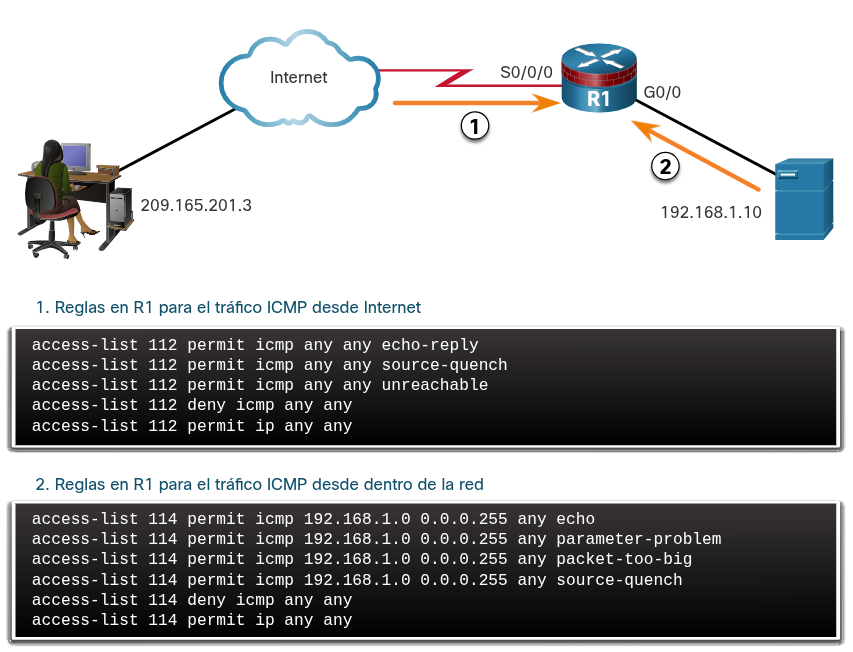

## NAT y PAT
La traducción de direcciones de red (NAT) y la traducción de direcciones de puerto (PAT) pueden complicar el monitoreo de la seguridad. Varias direcciones IP se asignan a una o más direcciones públicas que son visibles en Internet, ocultando las direcciones IP individuales que están dentro de la red (direcciones internas).

En la figura, se ejemplifica la relación entre las direcciones internas y externas que se utilizan como direcciones de origen (SA, Source Address) y direcciones de destino (DA, Destination Address). Estas direcciones internas y externas están en una red que usa NAT para comunicarse con un destino en Internet. Si PAT está en efecto, y todas las direcciones IP que salen de la red utilizan la dirección global interna 209.165.200.226 para el tráfico a Internet, podría ser difícil registrar el dispositivo interno específico que solicita y recibe el tráfico cuando ingresa a la red.

Este problema puede ser particularmente importante con los datos de NetFlow. Los flujos de NetFlow son unidireccionales y se definen por las direcciones y puertos que comparten. Básicamente, NAT romperá un flujo que pase por un gateway de NAT y hará que la información del flujo no esté disponible desde ese momento en adelante. Cisco ofrece productos de seguridad que “cosen” los flujos para unirlos, incluso si NAT reemplazó las direcciones IP.

NetFlow se analiza en mayor detalle más adelante en este capítulo.

	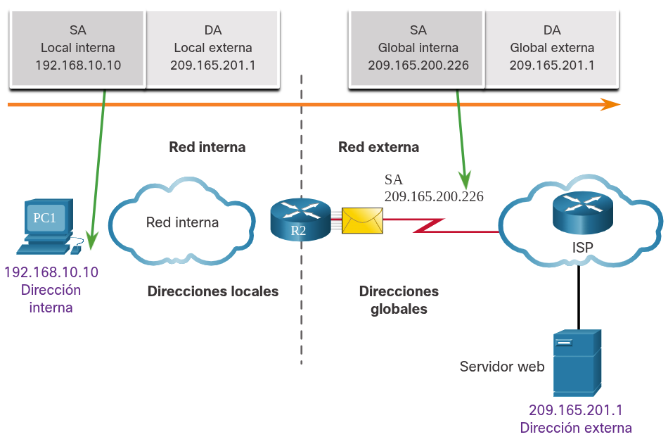

## Encriptación, encapsulación y tunelización
Como se mencionó con HTTPS, la encriptación puede presentar desafíos para el monitoreo de la seguridad tornando ilegibles los detalles de un paquete. La encriptación es parte de las tecnologías de VPN. En las VPN, un protocolo común (como IP) se utiliza para transportar tráfico encriptado. Fundamentalmente, el tráfico encriptado establece una conexión de punto a punto virtual entre redes en instalaciones públicas. La encriptación hace que el tráfico sea ilegible para todos los dispositivos, salvo los terminales de la VPN.

Una tecnología similar se puede utilizar para crear una conexión virtual de punto a punto entre un host interno y los dispositivos del agente de amenaza. El malware puede establecer un túnel cifrado que transita por un protocolo común y de confianza, y utilizarlo para exfiltrar datos desde la red. Un método similar de exfiltración de datos se analizó anteriormente para DNS.

## Redes Peer-to-Peer y Tor
En las redes peer-to-peer (P2P), que se muestran en la figura, los hosts pueden operar tanto en roles de cliente como de servidor. Existen tres tipos de aplicaciones P2P: uso compartido de archivos, uso compartido de procesadores y mensajería instantánea. En las redes P2P de uso compartido de archivos, los archivos de una máquina participante se comparten con los miembros de la red P2P. Ejemplos de esto son los programas alguna vez populares Napster y Gnutella. El bitcóin tiene un funcionamiento de red P2P que consiste en compartir una base de datos distribuida (o libro) que registra transacciones y saldos de bitcóin. BitTorrent es una red P2P para compartir archivos.

Cada vez que se les otorga acceso a los recursos de la red a usuarios desconocidos, la seguridad está en riesgo. No se deben permitir aplicaciones P2P de intercambio de archivos en redes corporativas. La actividad de redes P2P puede sortear las protecciones de firewall y es un medio habitual para propagar malware. La red P2P es intrínsecamente dinámica. Puede funcionar conectándose a numerosas direcciones IP de destino y también puede utilizar la numeración dinámica de puertos. Los archivos compartidos suelen estar infectados con malware y los agentes de amenaza pueden colocar su malware en clientes P2P para distribuirlo a otros usuarios.

Las redes P2P de uso compartido de procesadores donan ciclos del procesador para tareas de informática distribuida. La investigación científica y sobre el cáncer, y la búsqueda de extraterrestres, utilizan ciclos de procesador donados para distribuir tareas informáticas.

La mensajería instantánea (IM) también se considera una aplicación P2P. La IM tiene valor legítimo dentro de las organizaciones que tienen equipos de proyectos distribuidos geográficamente. En este caso, hay disponibles aplicaciones de mensajería instantánea especializadas, como la plataforma Webex Teams, que son más seguras que la mensajería instantánea que usa servidores públicos.

	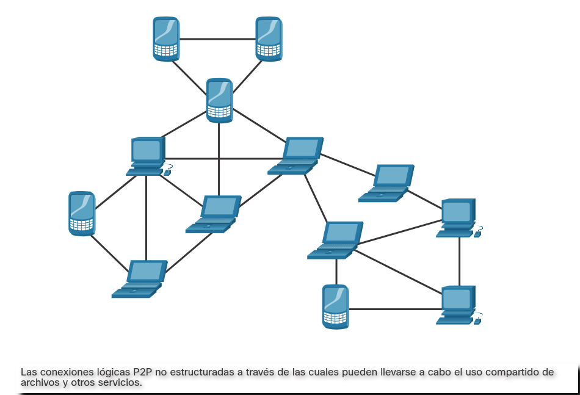

Tor es una plataforma de software y una red de hosts P2P que funcionan como enrutadores de Internet en la red Tor. La red Tor permite a los usuarios navegar por Internet de forma anónima. Los usuarios tienen acceso a la red Tor mediante un navegador especial. Cuando se inicia una sesión de navegación, el navegador construye una ruta de extremo a extremo en capas a través de la red del servidor Tor que está encriptada, como se muestra en la figura. Cada capa encriptada se “pela” como las capas de una cebolla (por eso el nombre “enrutamiento tipo cebolla”) a medida que el tráfico atraviesa un retransmisor de Tor. Las capas contienen información encriptada de siguiente salto que solamente puede leer el router que necesita leer la información. De esta manera, ningún dispositivo conoce toda la ruta al destino, y la información de enrutamiento solo puede ser leída por el dispositivo que la necesita. Finalmente, al final de la ruta Tor, el tráfico llega a su destino de Internet. Cuando el tráfico regresa al origen, se crea una ruta con capas encriptadas nuevamente.

Tor presenta una serie de desafíos para los analistas de ciberseguridad. Primero, Tor es ampliamente utilizado por organizaciones delictivas en la “red oscura”. Además, Tor se ha utilizado como un canal de comunicaciones para CnC de malware. Como la dirección IP de destino del tráfico de Tor está ofuscada por la encriptación y solo se conoce el nodo Tor de siguiente salto, el tráfico de Tor evita las listas de bloqueo que se han configurado en los dispositivos de seguridad.

	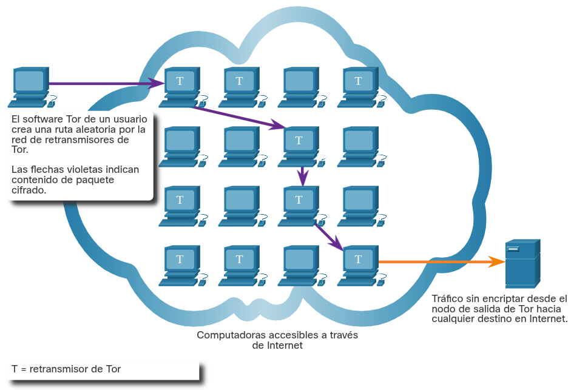

## Balance de carga
El equilibrio de carga implica la distribución del tráfico entre dispositivos o rutas de redes para no sobrecargar los recursos de redes con demasiado tráfico. Si existen recursos redundantes, un algoritmo o dispositivo de equilibrio de carga se encargará de distribuir el tráfico entre esos recursos, como se ve en la figura.

Una forma de hacerlo en Internet es a través de varias técnicas que utilizan DNS para enviar tráfico a recursos que tienen el mismo nombre de dominio pero varias direcciones IP. En algunos casos, la distribución puede realizarse a servidores distribuidos geográficamente. Esto puede resultar en que una sola transacción de Internet esté representada por múltiples direcciones IP en los paquetes entrantes. Esto puede hacer que aparezcan características sospechosas en las capturas de paquetes. Además, algunos dispositivos de administración del equilibrio de carga (LBM, Load Balancing Manager) utilizan sondas para evaluar el desempeño de diferentes rutas y la condición de distintos dispositivos. Por ejemplo, un dispositivo de LBM puede enviar sondas a los diferentes servidores en los que equilibra la carga para detectar si los servidores están funcionando. Esto se hace para evitar el envío de tráfico a un recurso que no esté disponible. Estas sondas pueden parecer tráfico sospechoso si el analista de ciberseguridad no está al tanto de que este tráfico es parte del funcionamiento del dispositivo de LBM.

	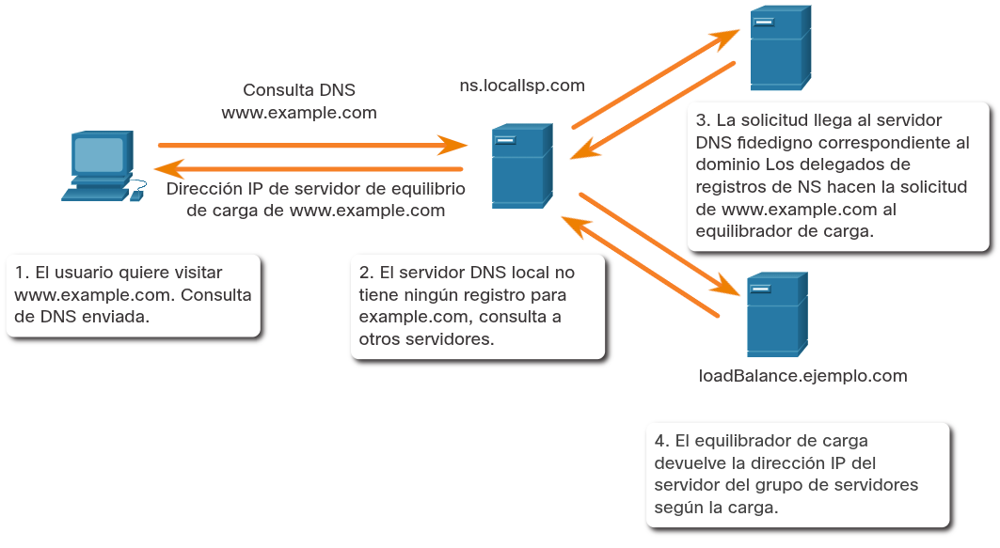

# Resumen de tecnologías y protocolos
## Monitoreo de protocolos comunes
Muchos tipos de dispositivos de muchos proveedores diferentes pueden utilizar syslog para enviar entradas del registro a servidores centrales que ejecutan un daemon de syslog. Esta centralización de la recopilación de registros ayuda a poner en práctica el monitoreo de la seguridad. Debido a que syslog es tan importante para el monitoreo de la seguridad, los servidores syslog pueden ser un blanco de los agentes de amenaza. Los hackers pueden intentar bloquear la transferencia de datos de clientes syslog a servidores, manipular o destruir los datos de registro, o manipular el software que crea y transmite los mensajes de registro. Los mensajes de syslog suelen tener marca de hora. Dado que los mensajes pueden provenir de muchos dispositivos, es importante que los dispositivos compartan un reloj único. Una forma de lograr esto es que los dispositivos usen el protocolo de tiempo de red (NTP). Dado que los eventos conectados a un ataque pueden dejar rastros en cada dispositivo de la red mientras recorren su camino al sistema de destino, las marcas de tiempo son esenciales para la detección. Los actores de amenazas pueden intentar atacar la infraestructura NTP para corromper la información de tiempo que se usa para correlacionar eventos de red registrados o usar sistemas NTP para dirigir ataques DDoS a través de vulnerabilidades en el software del cliente o servidor.

Los atacantes comúnmente encapsulan diferentes protocolos de red dentro del DNS para evadir los dispositivos de seguridad. Actualmente, muchos tipos de malware usan el DNS. Algunas variantes de malware emplean el DNS para comunicarse con servidores de comando y control (CnC) y para exfiltrar datos de tráfico disfrazados de consultas de DNS normales. Se pueden utilizar varios tipos de codificación para camuflar los datos y evadir las medidas básicas de prevención de pérdida de datos (DLP). Es probable que la parte del subdominio de dichas consultas sea mucho más larga que las solicitudes habituales.

El protocolo de transferencia de hipertexto (HTTP) es el protocolo troncal de la red informática mundial (World Wide Web). HTTP no protege los datos de atacantes que deseen alterarlos o interceptarlos, lo que constituye una grave amenaza a la privacidad, identidad y seguridad de la información. Un ataque común de HTTP se denomina inyección de iFrame (inline Frame). Un actor de amenazas pone en peligro un servidor web y planta un código malicioso que crea un iFrame invisible en una página web visitada con frecuencia. Cuando se carga el iFrame, se descarga el malware. Para hacer frente a la alteración o la interceptación de datos confidenciales, muchas organizaciones comerciales han adoptado HTTPS o implementado políticas exclusivas de HTTPS para proteger a quienes visitan sus sitios web y servicios. HTTPS agrega una capa de cifrado al protocolo HTTP mediante el uso de capa de socket seguro (SSL), lo que hace que los datos HTTP sean ilegibles ya que dejan el equipo de origen hasta que llega al servidor. Por desgracia, el tráfico HTTPS encriptado complica el monitoreo de seguridad de la red. Algunos dispositivos de seguridad incluyen la decriptación e inspección de SSL; sin embargo, esto puede traer problemas de procesamiento y privacidad. Además, HTTPS añade complejidad a las capturas de paquetes debido a la mensajería adicional implicada en el establecimiento de la conexión encriptada.

Los protocolos de correo electrónico como SMTP, POP3 e IMAP pueden usarse para diseminar malware, exfiltrar datos u ofrecer canales a servidores de CnC de malware. El SMTP envía datos desde un host hacia un servidor de correo y entre servidores de correo. Dado que hay tanto tráfico de SMTP, no siempre se monitorea. Sin embargo, el malware ha usado el SMTP en el pasado para exfiltrar datos de la red. El monitoreo de la seguridad podría revelar este tipo de tráfico según las características del mensaje de correo electrónico. IMAP y POP3 se usan para descargar mensajes de correo electrónico de un servidor de correo a una computadora host. El monitoreo de seguridad puede identificar cuándo un archivo adjunto de correo electrónico malicioso ingresó a la red y qué host infectó primero. Luego, el análisis retrospectivo puede rastrear el comportamiento del malware desde ese momento.

La funcionalidad ICMP se ha utilizado para crear varios tipos de exploits. ICMP puede emplearse para identificar los hosts de una red o la estructura de una red, y determinar los sistemas operativos utilizados en la red. También puede usarse como vehículo para varios tipos de ataques de DoS. También puede usarse para la exfiltración de datos. Debido a la preocupación de que ICMP puede utilizarse para vigilar o denegar un servicio desde el exterior de la red, suele dejarse de lado el tráfico ICMP desde el interior de la red. Sin embargo, algunas variedades de malware utilizan paquetes ICMP diseñados para transferir archivos de hosts infectados a los agentes de amenaza usando este método, que se conoce como tunelización de ICMP.

## Tecnologías de seguridad
Las listas ACL pueden dar una falsa sensación de seguridad si se confía demasiado en ellas. Los atacantes pueden determinar qué direcciones IP, protocolos y puertos están autorizados por las ACL. Esto puede realizarse mediante análisis de puertos o pruebas de penetración, o mediante otros métodos de reconocimiento. Los atacantes pueden crear paquetes que utilicen direcciones IP de orígenes falsificados. Las aplicaciones pueden entablar conexiones en puertos arbitrarios. Otras características del tráfico de protocolo también pueden manipularse, como el marcador establecido en segmentos de TCP. Las reglas no pueden preverse y configurarse para todas las técnicas de manipulación de paquetes que surgen.

La traducción de direcciones de red (NAT) y la traducción de direcciones de puerto (PAT) pueden complicar el monitoreo de la seguridad. Varias direcciones IP se asignan a una o más direcciones públicas que son visibles en Internet, ocultando las direcciones IP individuales que están dentro de la red (direcciones internas). Este problema puede ser particularmente importante con los datos de NetFlow. Los flujos de NetFlow son unidireccionales y se definen por las direcciones y puertos que comparten. Básicamente, NAT romperá un flujo que pase por un gateway de NAT y hará que la información del flujo no esté disponible desde ese momento en adelante.

El cifrado puede presentar desafíos para la supervisión de la seguridad al hacer ilegibles los detalles del paquete. La encriptación es parte de las tecnologías de VPN. En las VPN, un protocolo común (como IP) se utiliza para transportar tráfico encriptado. Fundamentalmente, el tráfico encriptado establece una conexión de punto a punto virtual entre redes en instalaciones públicas. La encriptación hace que el tráfico sea ilegible para todos los dispositivos, salvo los terminales de la VPN. Una tecnología similar se puede utilizar para crear una conexión virtual de punto a punto entre un host interno y los dispositivos del agente de amenaza. El malware puede establecer un túnel cifrado que transita por un protocolo común y de confianza, y utilizarlo para exfiltrar datos desde la red.

En las redes peer-to-peer (P2P), los hosts pueden operar tanto en roles de cliente como de servidor. Existen tres tipos de aplicaciones P2P: uso compartido de archivos, uso compartido de procesadores y mensajería instantánea. En las redes P2P de uso compartido de archivos, los archivos de una máquina participante se comparten con los miembros de la red P2P. Cada vez que se les otorga acceso a los recursos de la red a usuarios desconocidos, la seguridad está en riesgo. No se deben permitir aplicaciones P2P de intercambio de archivos en redes corporativas. La actividad de redes P2P puede sortear las protecciones de firewall y es un medio habitual para propagar malware. La red P2P es intrínsecamente dinámica. Los archivos compartidos suelen estar infectados con malware y los agentes de amenaza pueden colocar su malware en clientes P2P para distribuirlo a otros usuarios.

Tor es una plataforma de software y una red de hosts P2P que funcionan como enrutadores de Internet en la red Tor. Esto permite a los usuarios navegar por Internet de forma anónima. Los usuarios tienen acceso a la red Tor mediante un navegador especial. El navegador construye una ruta en capas de extremo a extremo a través de la red del servidor Tor que está encriptada. Cada capa encriptada se “pela” como las capas de una cebolla (por eso el nombre “enrutamiento tipo cebolla”) a medida que el tráfico atraviesa un retransmisor de Tor. Las capas contienen información encriptada de siguiente salto que solamente puede leer el router que necesita leer la información. Cuando el tráfico regresa al origen, se crea una ruta con capas encriptadas nuevamente. Tor presenta una serie de desafíos para los analistas de ciberseguridad. Primero, Tor es ampliamente utilizado por organizaciones delictivas en la “red oscura”. Además, Tor se ha utilizado como un canal de comunicaciones para CnC de malware. Como la dirección IP de destino del tráfico de Tor está ofuscada por la encriptación y solo se conoce el nodo Tor de siguiente salto, el tráfico de Tor evita las listas de bloqueo que se han configurado en los dispositivos de seguridad.

El equilibrio de carga implica la distribución del tráfico entre dispositivos o rutas de redes para no sobrecargar los recursos de redes con demasiado tráfico. Una forma de hacerlo en Internet es a través de varias técnicas que utilizan DNS para enviar tráfico a recursos que tienen el mismo nombre de dominio pero varias direcciones IP. Esto puede resultar en que una sola transacción de Internet esté representada por múltiples direcciones IP en los paquetes entrantes, lo que puede hacer que aparezcan características sospechosas en las capturas de paquetes. Algunos dispositivos de administrador de equilibrio de carga (LBM) usan sondas para probar el rendimiento de diferentes rutas y el estado de diferentes dispositivos. Estas sondas pueden parecer tráfico sospechoso si el analista de ciberseguridad no está al tanto de que este tráfico es parte del funcionamiento del dispositivo de LBM.

<a href="./00-Curso.md"><< Menú principal del módulo</a>