<a href="./00-Curso.md"><< Menú principal del módulo</a>

# 10. Datos de seguridad de red
# Tipos de datos de seguridad
## Datos de alerta
Los datos de alertas son mensajes generados por sistemas de prevención de intrusiones (IPS) o sistemas de detección de intrusiones (IDS) para responder al tráfico que viola una regla o coincide con la firma de un ataque conocido. Un IDS de red (NIDS), como Snort, viene configurado con reglas para ataques conocidos. Las alertas son generadas por Snort y es posible leerlas y buscarlas por las aplicaciones de Sguil y Squert, las cuales son parte de la Security Onion suite de la herramienta NSM.

Un sitio de prueba que se utiliza para determinar si el Snort que está operando es [testmynids](https://github.com/3CORESec/testmynids.org). Buscar información de él en Internet. Consiste en una sola página web que solo muestra el siguiente texto uid=0(root) gid=0(root) groups=0(root). Si Snort funciona correctamente y un host visita este sitio, una firma coincidirá y se activará una alerta. Esta es una manera sencilla e inofensiva de verificar que el NIDS está funcionando.

La regla de Snort que se activa es la siguiente:
```shell
alert ip any any -> any any (msg:"GPL ATTACK\_RESPONSE id check returned root"; content:"uid=0|28|root|29|"; fast\_pattern:only; classtype:bad-unknown; sid:2100498; rev:8;)
```

Esta regla genera una alerta si cualquier dirección IP en la red recibe datos desde una fuente externa que contengan texto que coincida con el patrón de `uid=0(root)`. La alerta contiene el mensaje `GPL ATTACK_RESPONSE id check returned root`. El identificador de la regla de Snort que se activó es 2100498.

La línea resaltada en la figura muestra una alerta Sguil que se generó al visitar el sitio web _testmyids_. La regla Snort y los datos del paquete para el contenido recibido de la página web _testmyvids_ se muestran en el área inferior derecha de la interfaz Sguil.

La consola Sguil muestra alerta de prueba de Snort IDS

<div style="width: 60%;padding-left: 18%;">
	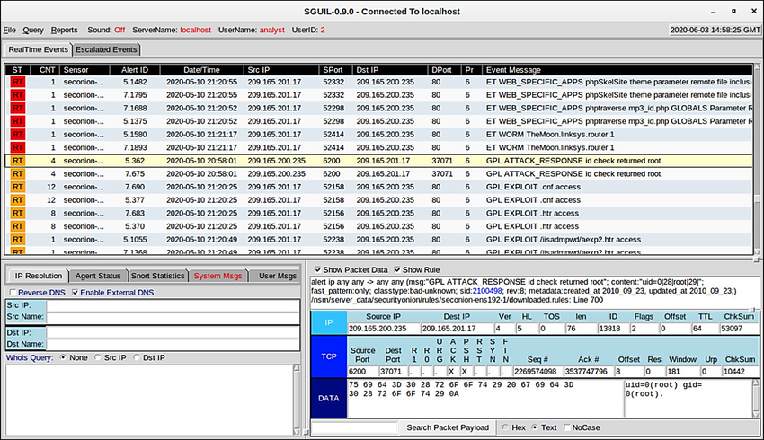
</div>

## Datos de la sesión y de la transaccíón

Los datos de sesión son un registro de una conversación entre dos terminales de red que suelen ser un cliente y un servidor. El servidor puede encontrarse dentro de la red empresarial o en un lugar al que se tiene acceso por Internet. Los datos de sesión son datos sobre la sesión, no los datos que recupera y utiliza el cliente. Los datos de la sesión incluyen información de identificación, como las cinco tuplas de direcciones IP de origen y destino, los números de puerto de origen y de destino, y el código IP del protocolo en uso. Los datos sobre la sesión suelen incluir un identificador de la sesión, la cantidad de datos transferidos por el origen y el destino, e información relativa a la duración de la sesión.

Zeek, antes Bro, es una herramienta de monitoreo de seguridad en la red que se utilizara más adelante en laboratorios de este curso. La figura muestra un resultado parcial para estas tres sesiones de HTTP desde un registro de conexión de Zeek. Las explicaciones de los campos se muestran debajo de la figura.

<div style="width: 60%;padding-left: 18%;">
	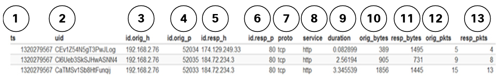
</div>

1. __ts__: _timestamp_ de comienzo de sesión.
2. __uid__: identificador único de sesión.
3. __id.orig_h__: dirección IP del host que originó la sesión (dirección de origen).
4. __id.orig_p__: puerto de protocolo del host de origen (puerto de origen).
5. __id.resp_h__: dirección IP del host que responde al host de origen (dirección de destino).
6. __id.resp_p__: protocolo de host que responde (puerto de destino).
7. __proto__: protocolo de la capa de transporte para la sesión.
8. __service__: protocolo de la capa de aplicación.
9. __duration__: duración de la sesión.
10. __orig_bytes__: bytes del host de origen.
11. __resp_bytes__: bytes del host que responde.
12. __orig_packets__: paquetes del host de origen.
13. __resp_packets__: paquetes del host que responde.

Los datos de transacciones son los mensajes que se intercambian durante sesiones de red. Es posible ver estas transacciones en las transcripciones de captura de paquetes. Los registros de dispositivos que conservan los servidores también contienen información sobre las transacciones que se producen entre clientes y servidores. Por ejemplo, una sesión podría incluir la descarga de contenido desde un servidor web, como se muestra en la figura. Las transacciones que representan las solicitudes y respuestas deberían de ser registradas en un acceso de registro en el servidor o mediante un NIDS como Zeek. La sesión se compone de todo el tráfico involucrado en la creación de la solicitud, y la transacción es la solicitud misma.

<div style="width: 50%;padding-left: 20%;">
	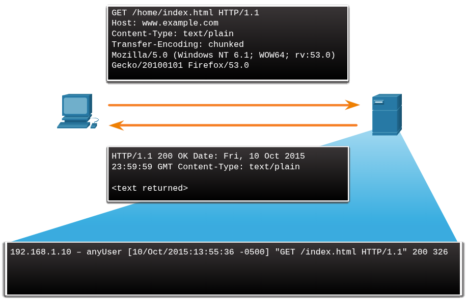
</div>

## Capturas de paquetes completos
La captura de paquetes completos es el tipo de captura que obtiene los datos más detallados de la red. Debido al nivel de detalle, estos tipos de datos tienen el uso más intensivo del almacenamiento y la recuperación en NSM. Las capturas de paquetes completos no solo contienen datos sobre conversaciones de red, como datos de la sesión. Las capturas de paquetes completos también contienen el material real de la conversación. Las capturas de paquetes completos contienen el texto de mensajes de correo electrónico, el código HTML de páginas web y los archivos que entran en la red o salen de ella. El contenido que se extrae de las capturas de paquetes completos puede recuperarse y analizarse en busca de malware o comportamiento del usuario que viole las políticas de la empresa y de seguridad. La conocida herramienta Wireshark es muy popular para ver capturas de paquetes completos y tener acceso a los datos relacionados con las conversaciones de red.

En la figura, se ejemplifica la interfaz de Network Monitor, un componente del sistema de la infraestructura Cisco Prime que, como Wireshark, puede mostrar capturas de paquetes completos.

<div style="width: 50%;padding-left: 20%;">
	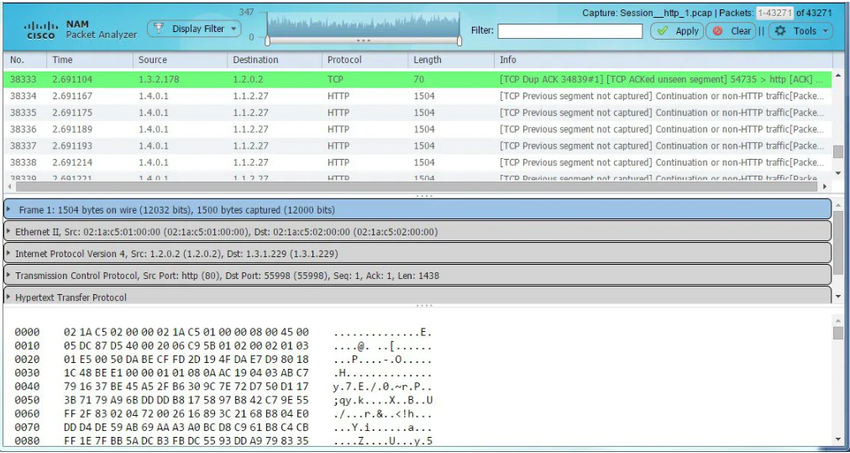
</div>

## Datos estadísticos
Al igual que los datos de sesiones, los datos estadísticos están relacionados con el tráfico de red. Los datos estadísticos se crean a través del análisis de otras formas de datos de red. A partir de este análisis se pueden sacar conclusiones que describan o predigan el comportamiento de la red. Las características estadísticas del comportamiento normal de una red se pueden comparar con el tráfico de red actual en un esfuerzo por detectar anomalías. Las estadísticas pueden utilizarse para caracterizar volúmenes normales de variación en los patrones de tráfico de red con el fin de identificar las condiciones de red que están significativamente fuera de esos rangos. Las diferencias estadísticamente significativas deben desencadenar alarmas e impulsar la investigación.

El análisis de comportamiento de red (NBA, Network Behavior Analysis) y la detección de anomalías de comportamiento de red (NBAD, Network Behavior Anomaly Detection) son enfoques de monitoreo de la seguridad de la red que utilizan avanzadas técnicas analíticas para analizar los datos de telemetría de red de NetFlow o de Internet Protocol Flow Information Export (IPFIX). Técnicas como el análisis predictivo y la inteligencia artificial realizan análisis avanzados de datos de sesión detallados para detectar posibles incidencias de seguridad.

__Nota__: IPFIX es la versión estándar de IETF de Cisco NetFlow versión 9.

Un ejemplo de una herramienta de NSM que utiliza el análisis estadístico es Cisco Cognitive Threat Analytics. Es capaz de encontrar actividad maliciosa que ha evitado los controles de seguridad o que ingresó por canales no monitoreados (incluidos medios extraíbles) y está funcionando dentro del entorno de una organización. Cognitive Threat Analytics es un producto con base en la nube que utiliza el aprendizaje mecanizado y el modelado estadístico de las redes. Crea una línea de base del tráfico en una red e identifica las anomalías. Analiza el comportamiento del usuario y el dispositivo, además del tráfico web, para detectar comunicaciones de comando y control, exfiltración de datos y el funcionamiento de aplicaciones potencialmente no deseadas en la infraestructura. En la figura, se ve una arquitectura de Cisco Cognitive Threat Analytics.

<div style="width: 50%;padding-left: 20%;">
	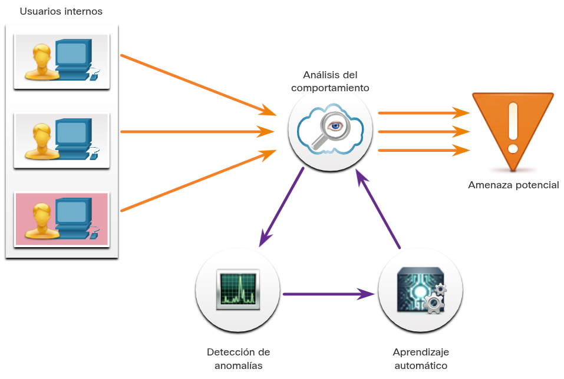
</div>

# Registros de terminales
## Registros de hosts
Como se discutió anteriormente, el sistema de detección de intrusiones basado en host (host-based intrusion detection systems, HIDS) se ejecuta en hosts individuales. HIDS no solo detecta intrusiones sino que, en la forma de firewalls con base en hosts, también puede prevenirlas. Este software crea registros y los guarda en el host. Esto puede obstaculizar la visión de lo que está sucediendo en los hosts en la empresa, por lo que muchas protecciones con base en el host tienen una funcionalidad para enviar registros a servidores de administración centralizada de registros. De esta manera, es posible realizar búsquedas en los registros desde una ubicación centralizada utilizando herramientas de NSM.

Los sistemas de HIDS pueden utilizar agentes para enviar registros a servidores de administración. OSSEC, un HIDS de código abierto muy conocido, incluye una funcionalidad muy resistente de recopilación y análisis de registros. Busque OSSEC en Internet para obtener más información. Microsoft Windows incluye numerosos métodos para la recopilación y el análisis automatizados de registros del host. Tripwire, un HIDS para Linux, incluye una funcionalidad similar. Todos se pueden escalar para usarlos en grandes empresas.

Los archivos de registro de los hosts Microsoft Windows pueden verse a nivel local en el Visor de eventos. El Visor de Eventos guarda cinco tipos de registros:
* __Registro de aplicaciones__. Contiene eventos registrados por varias aplicaciones.
* __Registros del sistema__. Incluyen eventos relacionados al funcionamiento de los controladores, procesos y hardware.
* __Registros de configuración__. Registran información sobre la instalación de software, incluyendo actualizaciones de Windows.
* __Registros de seguridad__. Registra eventos relacionados a la seguridad, como los intentos de inicio de sesión y operaciones relacionadas con el acceso y administración de archivos u objetos.
* __Registros de línea de comandos__. Los atacantes que han obtenido acceso a un sistema, y algunos tipos de malware, ejecutan comandos desde la interfaz de línea de comandos (CLI) en lugar de una GUI. La ejecución de la línea de comandos de registro proporcionará visibilidad de este tipo de incidente.

Los diversos registros pueden tener diferentes tipos de eventos. Los registros de seguridad incluyen solamente mensajes de éxito o fracaso de las auditorías. En computadoras con Windows, el Servicio de subsistema de autoridad de seguridad local (LSASS, Local Security Authority Subsystem Service) lleva a cabo el registro y también es responsable de implementar las políticas de seguridad en un host de Windows. LSASS funciona como lsass.exe. Con frecuencia, se usa malware para hacerse pasar por este servicio. Debe ejecutarse desde el directorio System32 de Windows. Si un archivo con este nombre, o uno camuflado como 1sass.exe, se está ejecutando o se está corriendo desde otro directorio, podría ser malware.

Los eventos de Windows se identifican mediante números de identificación y descripciones breves. Una enciclopedia de ID de eventos de seguridad, algunos con detalles adicionales, está disponible en Ultimate Windows Security en la Web.

La tabla explica el significado de los cinco tipos de eventos de registro de host de Windows.

|__Tipo de evento__|__Descripción__|
|:-|:-|
|Error|Evento que indica un problema importante, como la pérdida de datos o la pérdida de funcionalidad. Por ejemplo, si un servicio no se carga durante el inicio, se registra un evento `Error`.
|Advertencia|Evento que no es necesariamente significativo, pero puede indicar un posible problema futuro. Por ejemplo, cuando el espacio en disco es bajo, se registra un evento `Advertencia`. Si un aplicación puede recuperarse de un evento sin pérdida de funcionalidad ni datos, generalmente puede claificarlo como un evento de advertencia.
|Información|Evento que describe el funcionamiento correcto de la aplicación, controlador o servicio. Por ejmplo, cuando un controlador de red se carga correctamente, puede ser adecuado registrar un evento de información. Tenga en cuenta que, por lo general, una aplicación de escritorio no puede registrar un evento cada vez que inicia.
|Auditoría de aciertos|Evento que registra un intento de acceso de seguridad quditado que se realiza correctamente. Por ejemplo, el intento correcto de un usuario de iniciar sesión en el sistema se registra como un evento de auditoría exitoso.
|Auditoría de errores|Evento que registra un intento d eacceso de seguridad auditado que produce un error. Por ejemplo, si un usuario intenta acceder a una unidad de red y produce un error, el intento se registra como un evento de auditoría de errores.

## Syslog
Syslog incluye especificaciones para formatos de mensajes, una estructura de aplicación de cliente y servidor, y un protocolo de red. Muchos tipos diferentes de dispositivos de red pueden configurarse para utilizar el estándar de syslog a fin de registrar eventos en los servidores de syslog centralizados.

Syslog es un protocolo entre cliente y servidor. Syslog se definió dentro del grupo de trabajo de Syslog de la IETF (RFC 5424) y es compatible con una amplia variedad de dispositivos y receptores en múltiples plataformas.

El emisor de Syslog envía un mensaje de texto breve (menos de 1 KB) al receptor de Syslog. El receptor de Syslog es comúnmente llamado "syslogd, "Syslog daemon," o "Syslog server". Es posible enviar mensajes de syslog mediante UDP (puerto 514) o TCP (normalmente, el puerto 5000). Aunque hay algunas excepciones, como los contenedores SSL, estos datos suelen enviarse por la red como texto sin formato.

El formato completo de un mensaje de Syslog que se ve en la red tiene tres partes distintas, como se muestra en la figura.
* PRI (prioridad)
* ENCABEZADO
* MSG (texto del mensaje)

El PRI consiste de dos elementos, la instalación y la gravedad del mensaje, los cuales son valores enteros. El componente consta de categorías amplias de fuentes que generaron el mensaje, como el sistema, el proceso o la aplicación. Los servidores de registro pueden usar el valor del componente para dirigir el mensaje al archivo de registro correspondiente. La gravedad es un valor de 0 a 7 que define la gravedad del mensaje.

<div style="width: 50%;padding-left: 20%;">
	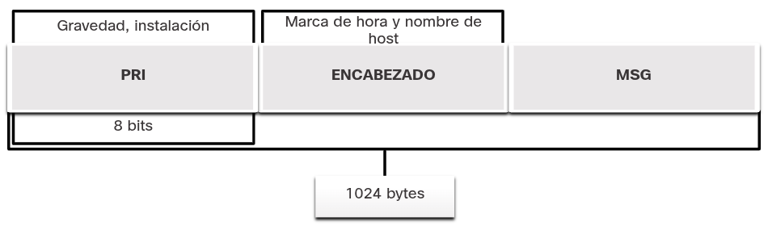
</div>

__Buscar información sobre los paquetes__

* __Instalación__. Los códigos de instalación entre 15 y 23 (local0-local7) no estan asignados con un nombre clave o nombre. Se pueden asignar a otros significados dependiendo del contexto de uso. Además, se ha descubierto que diversos sistemas operativos utilizan los componentes 9 y 15 para los mensajes de reloj.
* __Gravedad__.
	|Valor|Gravedad|
	|:-:|:-|
	|0|__Emergencia__: el sistema no puede utilizarse
	|1|__Alerta__: se debe tomar alguna medida inmediatamente
	|2|__Críticas__: condiciones críticas que deben corregirse inmediatemente e indican un fallo en un sistema
	|3|__Error__: un fallo que no es urgente, debe resolverse dentro de un plazo determinado
	|4|__Advertencia__: actualmente no existe un error; sin embargo, se producirá un error en el futuro si no se soluciona la condición
	|5|__Aviso__: ¿qué herramienta incluida en Security Onion utiliza Snort para descargar automáticamente nuevas reglas?
	|6|__Información__: mensajes emitidos sobre el funcionamiento normal
	|7|__Depuración__: mensajes de interés para los desarrolladores
* __Prioridad__. El valor de prioridad (PRI) se calcula multiplicando el valor de componente por ocho y sumando el resultado al valor de gravedad, como se muestra a continuación.
	```javascript
	Prioridad = (componente * 8) + gravedad
	```
	El valor de la prioridad es el primer valor de un paquete y aparece entre corchetes `<>`.

La sección `HEADER` del mensaje contiene la marca de tiempo en formato `MMM DD HH:MM:SS`. Si la marca de hora está precedida por los símbolos de punto o de asterisco, se indica que hay un problema con NTP. La sección `HEADER` incluye también el nombre del host o la dirección IP del dispositivo que origina el mensaje.

La sección `MSG` contiene el significado del mensaje de _syslog_. Esto puede variar entre los fabricantes de dispositivos y puede personalizarse. Por lo tanto, esta parte del mensaje es la más significativa y útil para el analista de ciberseguridad.

## Registros de servidor
Los registros del servidor son una fuente esencial de información para el monitoreo de la seguridad de la red. Los servidores de aplicaciones de una red, como los web y los de correo electrónico, tienen archivos de registro de acceso y de errores. Los registros de servidores proxy de DNS son particularmente importantes, dado que documentan todas las consultas y respuestas de DNS que tienen lugar en la red. Los registros del proxy de DNS son útiles para la identificación de hosts que podrían haber visitado sitios web peligrosos y para la identificación de exfiltración de datos de DNS y conexiones a servidores de comando y control de malware. Muchos servidores UNIX y Linux utilizan syslog, y otros usan funciones de registro patentadas. El contenido de los eventos de los archivos de registro depende del tipo de servidor.

Hay dos archivos de registro importantes que se deben conocer: los archivos de registro de servidores web Apache y los archivos de registro de acceso de Microsoft Internet Information Server (IIS). A continuación se muestran ejemplos de cada uno.
* Apache
```shell
203.0.113.127 – dsmith [10/Oct/2016:10:26:57 - 0500] "GET /logo_sm.gif HTTP/1.0" 200 2254 "http://www.example.com/links.html" "Mozilla/5.0 (Windows NT 6.1; Win64; x64; rv:47.0) Gecko/20100101 Firefox/47.0"
```
* IIS
```shell
6/14/2016, 16:22:43, 203.0.113.24, -, W3SVC2, WEB3, 198.51.100.10, 80, GET, /home.htm, -, 200, 0, 15321, 159, 15, HTTP/1.1, Mozilla/5.0 (compatible; MSIE 9.0; Windows Phone OS 7.5; Trident/5.0; IEMobile/9.0), -, http://www.example.com
```

## SIEM y recopilación de servicios
La tecnología de administración de información y eventos de seguridad (SIEM) es utilizada en muchas organizaciones para proporcionar informes en tiempo real y análisis a largo plazo de eventos de seguridad, como se ve en la Figura.

Entradas y salidas SIEM

<div style="width: 55%;padding-left: 20%;">
	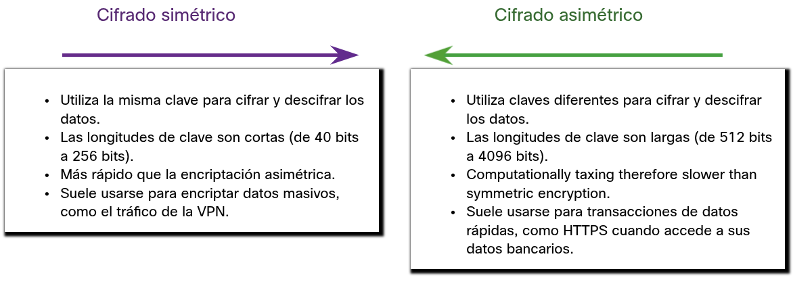
</div>

SIEM combina las funciones esenciales de las herramientas de administración de eventos de seguridad (SEM) y administración de información de seguridad (SIM) para brindar una perspectiva integral de las redes empresariales mediante las siguientes funciones:
* __Recopilación de registros__. Estos registros de eventos obtenidos de fuentes en toda la organización proporcionan importante información de informática forense y ayudan a abordar requisitos de los informes de cumplimiento.
* __Normalización__. Esta función integra mensajes de registro de diferentes sistemas en un modelo común de datos, lo que le permite a la organización conectar y analizar eventos relacionados, incluso si inicialmente se registraron en diferentes formatos de origen.
* __Correlación__. Esta función vincula registros y eventos de sistemas o aplicaciones separados, lo que acelera la detección de las amenazas de seguridad y la capacidad de reacción ante ellas.
* __Agregación__. Esta función reduce el volumen de datos de eventos mediante la consolidación de registros de eventos duplicados.
* __Generación informes__. Esta función presenta los datos del evento correlacionado y unificados en el monitoreo en tiempo real y en resúmenes a largo plazo, incluidos tableros gráficos interactivos.
* __Cumplimiento__. Esta función permite generar informes para satisfacer los requerimientos de diferentes reglas de cumplimiento.

Una SIEM muy conocida es Splunk, diseñada por un Cisco partner. La figura muestra un panel de amenazas Splunk. Splunk es ampliamente utilizado en los SOC. Otra popular solución de SIEM es Security Onion con ELK, la cual consiste en integrar las aplicaciones de Elasticsearch, Logstash y Kibana. Security Onion incluye otras herramientas de supervisión de seguridad de red de código abierto.

<div style="width: 55%;padding-left: 20%;">
	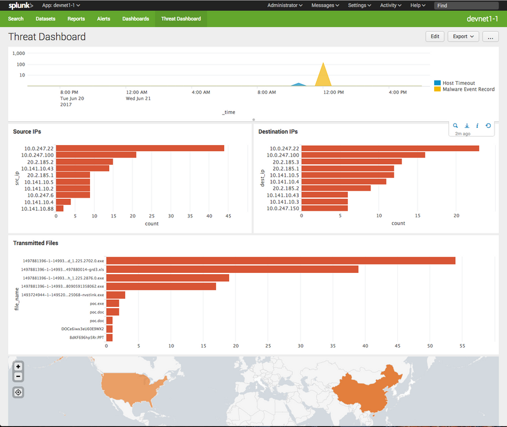
</div>
<br />

Como sabemos, la orquestación de seguridad, automatización y respuesta (SOAR) lleva SIEM y va más allá de la automatización de los flujos de trabajo de respuesta de seguridad y la facilitación de la respuesta de incidencia. Debido a la importancia de la seguridad de la red, numerosas empresas han traído excelentes productos al mercado de herramientas de seguridad. Sin embargo, estas herramientas carecen de compatibilidad y requieren la supervisión de múltiples paneles de productos independientes para procesar las numerosas alertas que generan. Debido a la falta de profesionales de ciberseguridad para monitorear y analizar el gran volumen de datos de seguridad, es importante que las herramientas de varios proveedores se puedan integrar en una sola plataforma. Las plataformas de seguridad integradas van más allá del SIEM y el SOAR para unificar múltiples tecnologías de seguridad, procesos y personas en un equipo unificado cuyos componentes se complementan en lugar de obstaculizarse mutuamente. Las plataformas de seguridad como Cisco SecureX, Fortinet Security Fabric y Paloalto Networks Cortex XDR prometen abordar la complejidad de la supervisión de la seguridad de la red mediante la integración de múltiples funciones y fuentes de datos en una sola plataforma que mejorará enormemente la precisión de las alertas al tiempo que ofrece una defensa sólida.

# Registros de redes
## Tcpdump
La herramienta de línea de comando tcpdump es un analizador de paquetes muy popular. Puede mostrar capturas de paquetes en tiempo real o escribir capturas de paquetes en un archivo. Captura datos detallados sobre los protocolos y el contenido de los paquetes. Wireshark es una GUI diseñada sobre la base de la funcionalidad tcpdump.

La estructura de las capturas de tcpdump varía según el protocolo capturado y los campos solicitados.

## Netflow
NetFlow es un protocolo desarrollado por Cisco como herramienta para la solución de problemas de red y la auditoría con base en la red. NetFlow proporciona de manera eficiente un importante conjunto de servicios para aplicaciones IP, en el que se incluye auditoría de tráfico de red, facturación de redes con base en el uso, planificación de la red, seguridad, funcionalidades de monitoreo de denegación de servicio y monitoreo de la red. NetFlow brinda información valiosa acerca de los usuarios y las aplicaciones de la red, horarios pico de uso y routing de tráfico.

NetFlow no realiza una captura completa de paquetes ni captura el contenido real del paquete. NetFlow registra información sobre el flujo de paquetes, incluidos los metadatos. Cisco desarrollo NetFlow y luego permitió que se utilizara como base para un estándar de IETF llamado IPFIX<sup><a href="#">1</a></sup>. IPFIX está basado en Cisco NetFlow, versión 9.

La información de NetFlow puede ser visualizada con herramientas como nfdump. De manera similar a tcpdump, nfdump proporciona una utilidad de línea de comando para visualizar datos de NetFlow desde el daemon de captura o recopilador de nfcapd. Existen herramientas que agregan funcionalidad de GUI a la visualización de flujos. La Figura muestra una pantalla de la herramienta de código abierto FlowViewer.

<div style="width: 55%;padding-left: 20%;">
	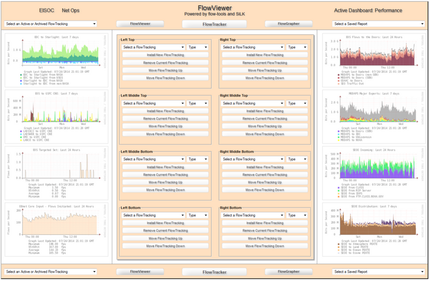
</div>

Tradicionalmente, un flujo de IP está basado en un conjunto de 5 a 7 atributos de paquetes IP que fluye en una sola dirección. Un flujo se compone de todos los paquetes transmitidos hasta que finaliza la conversación de TCP. Los atributos de paquete IP que usa NetFlow son los siguientes:
* Dirección IP de origen
* Dirección IP de destino
* Puerto de origen
* Puerto de destino
* Tipo de protocolo de capa 3
* Clase de servicio
* Interfaz de router o switch

Todos los paquetes con la misma información sobre dirección IP de origen o destino, puertos de origen o destino, interfaz de protocolo y clase de servicio se agrupan en un flujo y, luego, se cuentan los paquetes y bytes. Esta metodología de tomar las huellas digitales de un flujo o determinarlo es escalable, ya que se condensa una gran cantidad de información de la red en una base de datos de información de NetFlow denominada caché de NetFlow.

Todos los registros de flujo de NetFlow contendrán los cinco primeros elementos de la lista de arriba y las marcas de tiempo de inicio y final del flujo. La información adicional que puede aparecer es muy variable y se puede configurar en el dispositivo exportador NetFlow Exporter. Los exportadores son dispositivos que se pueden configurar para crear registros de flujo y transmitirlos para su almacenamiento en un dispositivo recopilador de NetFlow. Un ejemplo de un registro de flujo básico de NetFlow en dos presentaciones diferentes, es mostrado en la figura.

```shell
Date flow start Duration Proto Src IP Addr:Port Dst IP Addr:Port Flags Tos Packets Bytes Flows2017-08-30 00:09:12.596 00.010 TCP 10.1.1.2:80 -> 13.1.1.2:8974 .AP.SF 0 62 3512 1

---

Traffic Contribution: 8% (3/37)Flow information:IPV4 SOURCE ADDRESS:10.1.1.2IPV4 DESTINATION ADDRESS:13.1.1.2INTERFACE INPUT:Se0/0/1TRNS SOURCE PORT:8974TRNS DESTINATION PORT:80IP TOS:0x00IP PROTOCOL:6FLOW SAMPLER ID:0FLOW DIRECTION:Inputipv4 source mask:/0ipv4 destination mask:/8counter bytes:205ipv4 next hop address:13.1.1.2tcp flags:0x1binterface output:Fa0/0counter packets:5timestamp first:00:09:12.596timestamp last:00:09:12.606ip source as:0ip destination as:0
```

Hay disponible una gran cantidad de atributos para un flujo. El registro IANA de entidades IPFIX enumera varios cientos, y los primeros 128 son los más comunes.

Aunque NetFlow no se diseñó inicialmente como una herramienta para el monitoreo de seguridad de la red, es vista como una herramienta útil en el análisis de incidentes de seguridad de la red. Puede ser utilizada para crear una línea de tiempo de los ataques, comprender el comportamiento de un host individual, o rastrear el movimiento de un atacante o un ataque de host a host dentro de una red. La tecnología Cisco/Lancope Stealthwatch mejora el uso de los datos de NetFlow para NSM.

## Visibilidad y control de las aplicaciones
El sistema Cisco Application Visibility and Control (AVC), el cual se muestra en la figura, combina varias tecnologías para reconocer, analizar y controlar más de 1000 aplicaciones. Estas incluyen voz y vídeo, correo electrónico, uso compartido de archivos, juegos, P2P y con base en la nube. AVC utiliza el reconocimiento de aplicaciones basadas en la red (NBAR2) de última generación de Cisco para detectar y clasificar las aplicaciones en uso en la red. El motor de reconocimiento de aplicaciones NBAR2 admite más de 1000 aplicaciones de red.

Para entender realmente la importancia de esta tecnología, analicemos la Figura. La identificación de aplicaciones de red por puerto no permite ver en detalle el comportamiento de los usuarios. Sin embargo, la visibilidad de la aplicación mediante la identificación de firmas de las aplicaciones permite identificar qué hacen los usuarios, ya sea participar de una teleconferencia o descargar películas en sus teléfonos.

<div style="width: 55%;padding-left: 20%;">
	
</div>

Un sistema de administración y generación de informes, como Cisco Prime, analiza y presenta los datos de análisis de las aplicaciones en informes de tipo tablero para que los use el personal de monitoreo de la red. También es posible controlar el uso de aplicaciones mediante la clasificación y las políticas de calidad de servicio con base en la información de AVC.

Supervisión de puertos contra supervisión de aplicaciones

<div style="width: 55%;padding-left: 20%;">
	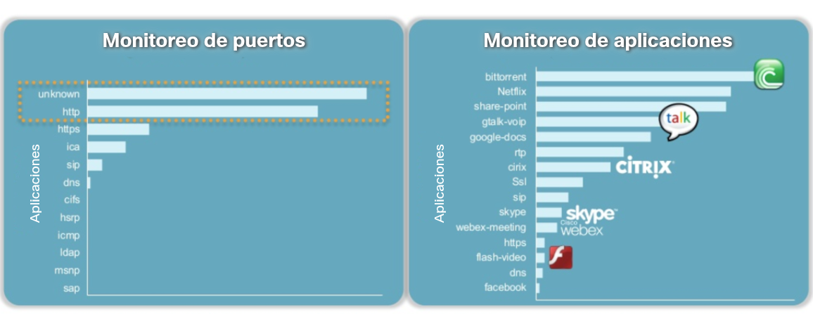
</div>

## Registros del filtro de contenidos
Los dispositivos que proporcionan filtrado de contenido, como Cisco Email Security Appliance (ESA) y Cisco Web Security Appliance (WSA), ofrecen una amplia gama de funcionalidades para el monitoreo de la seguridad. Se pueden generar archivos de registro para muchas de estas funcionalidades.

ESA, por ejemplo, tiene más de 30 registros que pueden utilizarse para supervisar la mayoría de los aspectos de la entrega de correo electrónico, el funcionamiento del sistema, el antivirus, las operaciones antispam y las decisiones sobre listas de bloqueo y listas de permitidos. La mayoría de los registros se almacena en archivos de texto y puede recogerse en servidores syslog o puede enviarse a servidores FTP o SCP. Además, las alertas sobre el funcionamiento del dispositivo en sí mismo y de sus subsistemas pueden monitorearse mediante el envío de correo electrónico a los administradores que son responsables del monitoreo y el funcionamiento del dispositivo.

Los dispositivos WSA ofrecen un funcionamiento detallado similar. WSA se desempeña con eficacia como un proxy web, lo que significa que registra toda la información de transacciones entrantes y salientes para el tráfico HTTP. Estos registros pueden ser bastante detallados y personalizables. Pueden configurarse en un formato de compatibilidad W3C. WSA puede configurarse para enviar los registros a un servidor de diversas maneras, entre ellas, <a href="./notes/syslog-servers.md" target="_blank">syslog</a>, FTP y SCP.

Otros registros que están disponibles para WSA son los registros de decisiones de la ACL, registros de análisis de malware y registros de filtrado de reputación de la web.

En la figura, se ven los tableros desglosados disponibles en los dispositivos de filtrado de contenido de Cisco. Al hacer clic en los componentes de los informes de descripción general, se muestran detalles más relevantes. Las búsquedas de destino proporcionan la información más centrada.

<div style="width: 55%;padding-left: 20%;">
	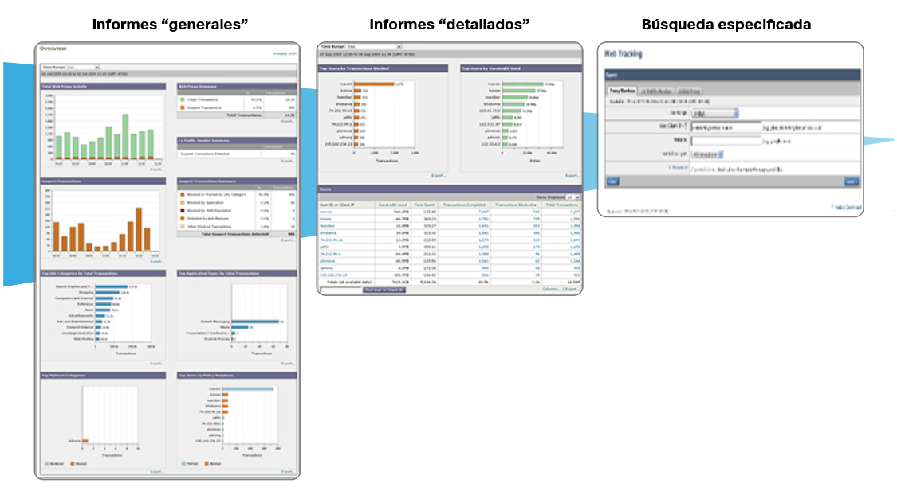
</div>

## Registro desde dispositivos Cisco
Los dispositivos de seguridad de Cisco se pueden configurar para que envíen eventos y alertas a las plataformas de administración de la seguridad utilizando SNMP o syslog. En la figura, se ejemplifica un mensaje de syslog generado por un dispositivo Cisco ASA y un mensaje de syslog generado por un dispositivo Cisco IOS.

<div style="width: 55%;padding-left: 20%;">
	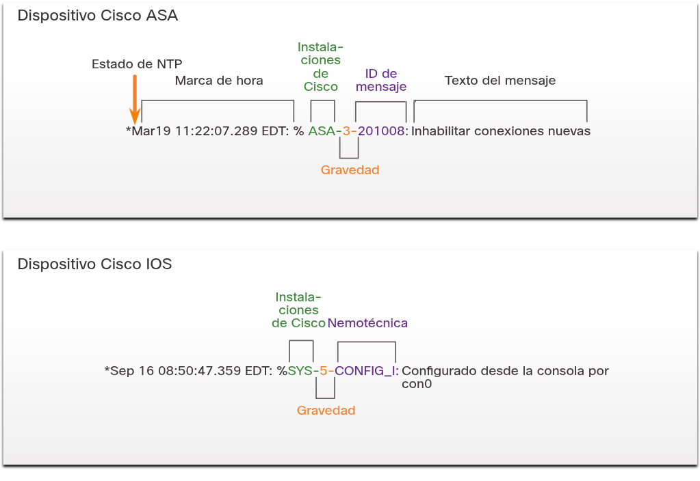
</div>

Debemos tener en cuenta que hay dos significados utilizados para el término "componente" en los mensajes de syslog de Cisco. El primero es el conjunto estándar de valores de componentes que establecieron los estándares de syslog. Estos valores se utilizan en la parte del mensaje PRI del paquete de syslog para calcular la prioridad del mensaje. Cisco utiliza algunos de los valores entre 15 y 23 para identificar los componentes del registro de Cisco, de acuerdo con la plataforma. Por ejemplo, los dispositivos Cisco ASA usan el componente 20 de syslog de manera predeterminada, que corresponde a local4. El otro valor de instalación lo asigna Cisco y tiene lugar en la parte de MSG del mensaje de syslog.

Los dispositivos Cisco pueden utilizar formatos de mensajes de syslog ligeramente diferentes y pueden usar la nemotécnica en lugar de identificaciones de mensajes, como se ve en la figura. Un diccionario de mensajes syslog ASA de Cisco está disponible en el sitio web de Cisco.

## Registros del proxy
Los servidores proxy, como los utilizados para las solicitudes web y de DNS, contienen registros valiosos que son una fuente principal de datos para el monitoreo de seguridad de la red.

Los servidores proxy son dispositivos que actúan como intermediarios para los clientes de la red. Por ejemplo, una empresa puede configurar un proxy web para manejar las solicitudes web en nombre de los clientes. En lugar de enviar las solicitudes de recursos web directamente al servidor desde el cliente, la solicitud se envía primero a un servidor proxy. El servidor proxy solicita los recursos y los devuelve al cliente. El servidor proxy genera registros de todas las solicitudes y respuestas. Luego, estos registros pueden analizarse para determinar qué hosts realizan las solicitudes y si los destinos son seguros o podrían ser maliciosos, y también para entender mejor qué tipos de recursos se descargan.

Los proxies web proporcionan datos que ayudan a determinar si las respuestas de la web se generaron en respuesta a solicitudes legítimas o si se manipularon para parecer respuestas, pero en realidad son ataques. También es posible usar proxies web para inspeccionar el tráfico saliente como medio de prevención de pérdida de datos (DLP). La DLP implica analizar el tráfico saliente para detectar si los datos que están dejando la web contienen información confidencial o secreta. Ejemplos de proxies web populares son Squid, CCProxy, Apache Traffic Server y WinGate.

Un ejemplo de un registro de proxy web Squid en el formato nativo de Squid es el siguiente. Explicación del valor de cada campo que aparece en la siguiente tabla de registros de entradas.

```shell
1265939281.764 19478 172.16.167.228 TCP_MISS/200 864
GEThttp://www.example.com//images/home.png - NONE/- image/png
```

**Valor del registro del proxy**|**Explicación**
:-|:-
1265939281.764|**Hora** - en formtao de marca de itempo Unix con milisegundos
19478|**Duración** - el tiempo transcurrido para la solicitud y la respuesta de Squid
172.16.167.228|Dirección IP del **cliente**
TCP_MISS/200|**Resultado** - cósigos de resultado de Squid y código de estado HTTP saparados por una barra
864|**Tamaño** - los bytes de datos entregados
GET|**Solicitud** - solicitud HTTP realizada por el cliente
http://www.example.com//images/home.png|**URI/URL** - dirección del recurso solicitado
\- |**Identidad del cliente** - valor `RFC 1413` para el cliente que hizo la solicitud. No se utiliza por defecto
NONE/-|**Código de peering/Host de peer** - servidor de cahé vecino consultado
image/png|**Tipo** - tipo de contenido MIME del valor Content-Type de la cabecera de respuesta HTTP

__Nota__: Los proxies web abiertos, son proxies que están disponible para cualquier usuario de Internet, se pueden utilizar para ocultar direcciones IP de agentes de amenaza. Las direcciones proxy abiertas pueden utilizarse en la lista de bloqueo del tráfico de Internet.

**Cisco Umbrella**

Cisco Umbrella, antes OpenDNS, ofrece un servicio de DNS en el host que extiende la capacidad de DNS para incluir mejoras en la seguridad. En lugar de que las organizaciones alojen y mantengan la lista de bloqueo, la protección contra la suplantación de identidad y otras medidas de seguridad relacionadas con el DNS, Cisco Umbrella proporciona estas protecciones en su propio servicio de DNS. Cisco Umbrella aplica muchos más recursos de administración DNS que la mayoría de las organizaciones puede ofrecer. Cisco umbrella funciona en parte como un súper proxy de DNS. El suite de productos de seguridad de Cisco Umbrella aplica inteligencia de amenazas a tiempo real para administrar el acceso a DNS y la seguridad de los registros de DNS Los registros de acceso DNS estan disponibles en Cisco Umbrella para las empresas suscritas. En lugar de utilizar los servidores de DNS de ISP locales, una organización puede elegir suscribirse a Cisco Umbrella para los servicios de DNS. A continuación aparece un ejemplo de un registro de proxy DNS. La tabla explica el significado de los campos en la entrada de registro.

```shell
"2015-01-16 17:48:41","ActiveDirectoryUserName",
"ActiveDirectoryUserName,ADSite,Network",
"10.10.1.100","24.123.132.133","Allowed","1 (A)",
"10.10.1.100","24.123.132.133","Allowed","1 (A)",
"Chat,Photo Sharing,Social Networking,Allow List"
```

**Campo**|**Ejemplo**|**Explicación**
:-|:-|:-
Timestamp|2015-01-16 17:48:41|Esta es la hora en la que se realizó esta solicitud en UTC. Esto es diferente del panel de control de UImbrella, que convierte lahora  a la zona horaria especificada.
Policy Identity|ActiveDirectdoryUserName|La primera identidad que conicidió con la solicitud
Identities|ActiveDirectdoryUserName, ADSite, Network|Todas las identidades asociadas a esta solicitud
Internal IP|10.10.1.100|La dirección IP interna que realizó la solicitud
External IP|24.123.132.133|La dirección IP externa que realizó la solicitud
Action|Allowed|Si la solicitud fue permitida o bloqueada
QueryType|1 (A)|El tipo de solicitud DNS que se ha realizado
RespnseCode|NOERROR|El código de retorno DNS para esta solicitud
Domain|domain-visited.com|El dominio solicitado
Categories|Chat, PHoto Sharing, Social Networking|Las categorías de seguridad o contenido a las que corresponde el destino

## Firewalls de próxima generación
Los dispositivos de Firewall Next-Generation o NextGen extienden la seguridad en la red más allá de las direcciones IP y los números de puerto de capa 4 hasta la capa de aplicación y más allá. Los Firewall NextGen son dispositivos avanzados que proporcionan mucha más funcionalidad que las generaciones anteriores de dispositivos de seguridad de red. Una de esas funcionalidades son los tableros de informes con funciones interactivas que permiten obtener informes rápidos con un solo clic sobre información muy específica sin la necesidad de SIEM u otros correlacionadores de eventos.

La linea de dispositivos FireWall NextGen de Cisco (NGFW) utiliza servicios FirePower para consolidar multiples capaz de seguridad en una sola plataforma. Esto ayuda a contener los costos y simplificar la administración. Los servicios FirePower incluyen visibilidad y control de las aplicaciones, FirePower NextGen IPS (NGIPS), filtrado de URL por categorías y reputación, y protección avanzada contra malware (AMP). Los dispositivos FirePower permiten el monitoreo de seguridad de la red con una GUI habilitada para la web y denominada Visor de eventos.

Los eventos NGFW comunes incluyen:
* __Evento de conexión__. Los registros de conexión contienen datos sobre las sesiones que NIGPS detecta directamente. Los eventos de conexión incluyen propiedades de conexión básica, como marcas de tiempo, IP de origen y destino, y metadatos sobre por qué la conexión se registró, por ejemplo, qué regla de control de acceso registró el evento.
* __Evento de intrusión__. El sistema examina los paquetes que atraviesan la red en busca de actividades maliciosas que podrían afectar la disponibilidad, integridad y confidencialidad de un host y sus datos. Cuando el sistema identifica una posible intrusión, genera un evento de intrusión, que es un registro de la fecha, la hora, el tipo de ataque y la información contextual sobre el origen del ataque y su destino.
Host o evento de terminal - Cuando un host aparece en la red, el sistema puede detectarlo y registrar detalles del hardware del dispositivo, las direcciones IP y la última presencia conocida en la red.
* __Evento de detección de red__. Los eventos de detección de red representan cambios que se han detectado en la red monitoreada. Estos cambios se registran en respuesta a las políticas de descubrimiento de la red que especifican los tipos de datos que se recopilarán, los segmentos de la red que se monitorearán y las interfaces de hardware del dispositivo que deben utilizarse para la recopilación de eventos.
* __Evento de NetFlow__. La detección de la red puede utilizar una serie de mecanismos; uno de ellos es utilizar registros de flujo de NetFlow exportados para generar eventos nuevos para hosts y servidores.

**Servicios prestados por NGFW**

<div style="width: 55%;padding-left: 20%;">
	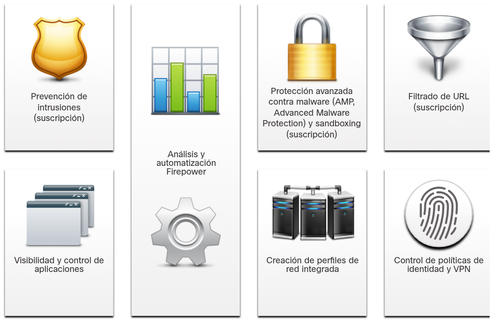
</div>

## Packet Tracer - Explorar una implementación de NetFlow
* <a href="./notes/pt_explorar_implementacion_netflow.md" target="_blank">Explorar una implementación de NetFlow</a>

## Packet Tracer - Registro desde varias fuentes
* <a href="./notes/pt_registro_varias_fuentes.md" target="_blank">Registro desde varias fuentes</a>

# Resumen
## Tipos de datos de seguridad
Los datos de alertas son mensajes generados por sistemas de prevención de intrusiones (IPS) o sistemas de detección de intrusiones (IDS) para responder al tráfico que viola una regla o coincide con la firma de un ataque conocido. Snort genera las alertas y es posible leerlas y buscarlas con aplicaciones como Sguil, Squert y Kibana que forman parte del conjunto Security Onion de herramientas de NSM.

Los datos de sesión son un registro de una conversación entre dos terminales de red que suelen ser un cliente y un servidor. El servidor puede encontrarse dentro de la red empresarial o en un lugar al que se tiene acceso por Internet. Los datos de la sesión incluyen información de identificación, como las cinco tuplas de direcciones IP de origen y destino, los números de puerto de origen y de destino, y el código IP del protocolo en uso. Los datos sobre la sesión suelen incluir un identificador de la sesión, la cantidad de datos transferidos por el origen y el destino, e información relativa a la duración de la sesión.

La captura de paquetes completos es el tipo de captura que obtiene los datos más detallados de la red. Las capturas completas de paquetes requieren el mayor almacenamiento. La captura completa de paquetes contiene todo el material de las conversaciones, como los mensajes de texto o correo electrónico, el HTML de las páginas web y los archivos que ingresan o salen de la red. El contenido que se extrae de las capturas de paquetes completos puede recuperarse y analizarse en busca de malware o comportamiento del usuario que viole las políticas de la empresa y de seguridad.

Los datos estadisticos son creados a través del analisis de varias formas de datos de red Las características estadísticas del comportamiento normal de una red se pueden comparar con el tráfico de red actual en un esfuerzo por detectar anomalías. Las estadísticas pueden utilizarse para caracterizar volúmenes normales de variación en los patrones de tráfico de red con el fin de identificar las condiciones de red que están significativamente fuera de esos rangos. Las diferencias estadísticamente significativas deben desencadenar alarmas e impulsar la investigación.

## Registros de terminales
El sistema de detección de intrusiones basado en hosts(Host-based Intrusion detection system, HIDS), se ejecuta en hosts individuales. HIDS no solo detecta intrusiones sino que, en la forma de firewalls con base en hosts, también puede prevenirlas. Este software crea registros y los guarda en el host. Muchas protecciones basadas en host tienen una forma de enviar registros a servidores de administración de registros centralizados, lo que proporciona una forma de buscar registros desde una ubicación central mediante herramientas de NSM. OSSEC, un HIDS de código abierto muy conocido, incluye una funcionalidad muy resistente de recopilación y análisis de registros.

Syslog incluye especificaciones para formatos de mensajes, una estructura de aplicación de cliente y servidor, y un protocolo de red. Muchos tipos diferentes de dispositivos de red pueden configurarse para utilizar el estándar de syslog a fin de registrar eventos en los servidores de syslog centralizados.

Los registros del servidor son una fuente esencial de información para el monitoreo de la seguridad de la red. Los servidores de aplicaciones de una red, como los web y los de correo electrónico, tienen archivos de registro de acceso y de errores. El servidor proxy DNS registra todas las consultas y respuestas de DNS que ocurren dentro de la red. Los registros del proxy de DNS son útiles para la identificación de hosts que podrían haber visitado sitios web peligrosos y para la identificación de exfiltración de datos de DNS y conexiones a servidores de comando y control de malware.

SIEM combina las funciones esenciales de las herramientas de administración de eventos de seguridad (SEM) y administración de información de seguridad (SIM) para brindar una perspectiva comprensible de las redes empresariales usando recolectores de registros, normalización, correlación, agregación, reporte y conformidad

## Registros de redes
La herramienta de línea de comando tcpdump es un analizador de paquetes muy popular. Puede mostrar capturas de paquetes en tiempo real o escribir capturas de paquetes en un archivo. Las capturas incluyen protocolos de paquetes detallados y datos de contenido que se pueden ver con Wireshark.

NetFlow proporciona de manera eficiente un importante conjunto de servicios para aplicaciones IP, en el que se incluye auditoría de tráfico de red, facturación de redes con base en el uso, planificación de la red, seguridad, funcionalidades de monitoreo de denegación de servicio y monitoreo de la red. NetFlow brinda información valiosa acerca de los usuarios y las aplicaciones de la red, horarios pico de uso y routing de tráfico.

Control y visibilidad de aplicaciones de Cisco utiliza el reconocimiento version 2 basado en la red (NBAR2), también conocido como Next-Generation NBAR, para descubrir y clasificar las aplicaciones en uso en la red. El motor de reconocimiento de aplicaciones NBAR2 admite más de 1000 aplicaciones de red.

Los dispositivos como Cisco Email Security Appliance (ESA) y Cisco Web Security Appliance (WSA), ofrecen una amplia gama de funcionalidades para el monitoreo de la seguridad utilizando filtro de contenido. Se pueden generar archivos de registro para muchas de estas funcionalidades.

Los servidores proxy son dispositivos que actúan como intermediarios para los clientes de la red. Una empresa puede configurar un proxy web para manejar las solicitudes web en nombre de los clientes. En lugar de enviar las solicitudes de recursos web directamente al servidor desde el cliente, la solicitud se envía primero a un servidor proxy. El servidor proxy solicita los recursos y los devuelve al cliente. El servidor proxy genera registros de todas las peticiones y respuestas que luego pueden analizarse para determinar qué hosts realizan las solicitudes y si los destinos son seguros o podrían ser maliciosos, y también para entender mejor qué tipos de recursos se descargan.

Los dispositivos de Firewall NextGen extienden la seguridad en la red más allá de las direcciones IP y los números de puerto de capa 4 hasta la capa de aplicación y más allá. Los Firewall NextGen son dispositivos avanzados que proporcionan mucha más funcionalidad que las generaciones anteriores de dispositivos de seguridad de red. Los NextGen tiene tableros de reporte Firewall con funciones interactivas que permiten un rápido sistema de reportes en un clic sobre información muy específica sin la necesidad de SIEM u otros eventos de correlación.

# Enlaces de interés
1. <a href="https://www.iana.org/assignments/ipfix/ipfix.xhtml" target="_blank">IP Flow Information Export (IPFIX) Entities</a>
<br />
<br />
<br />
<br />
<br />
<br />
<br />
<br />
<br />
<br />
<a href="#10-datos-de-seguridad-de-red">⬆️</a>
<a href="./00-Curso.md"><< Menú principal del módulo</a>