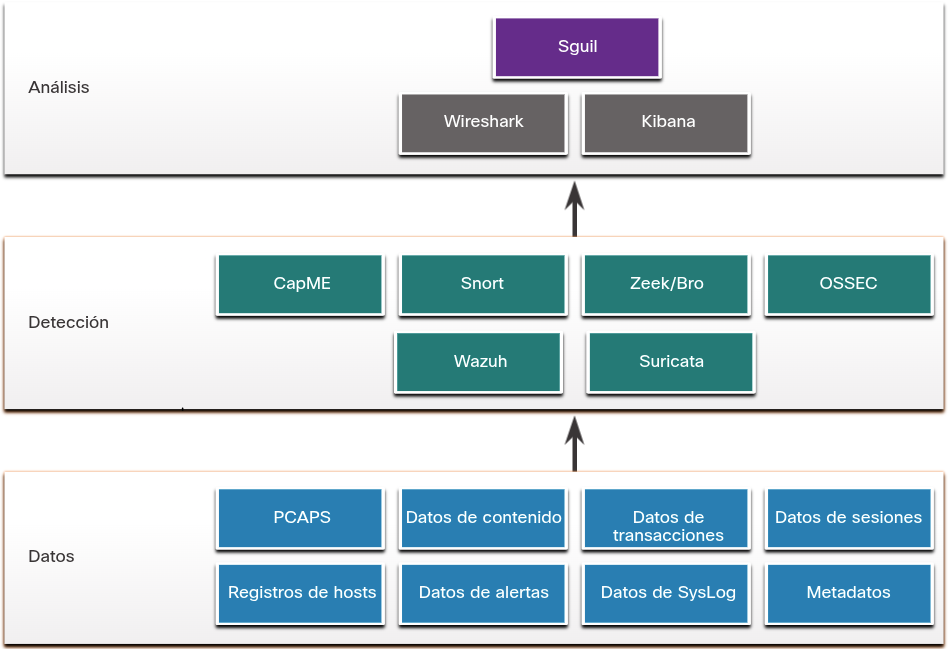
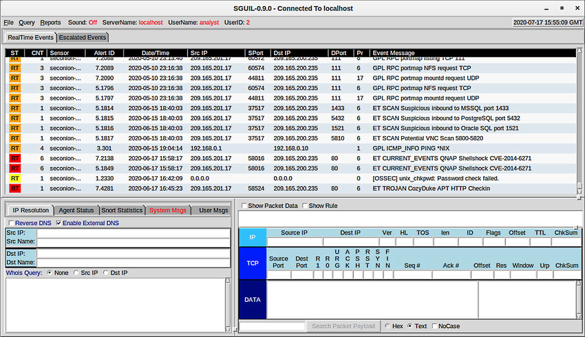
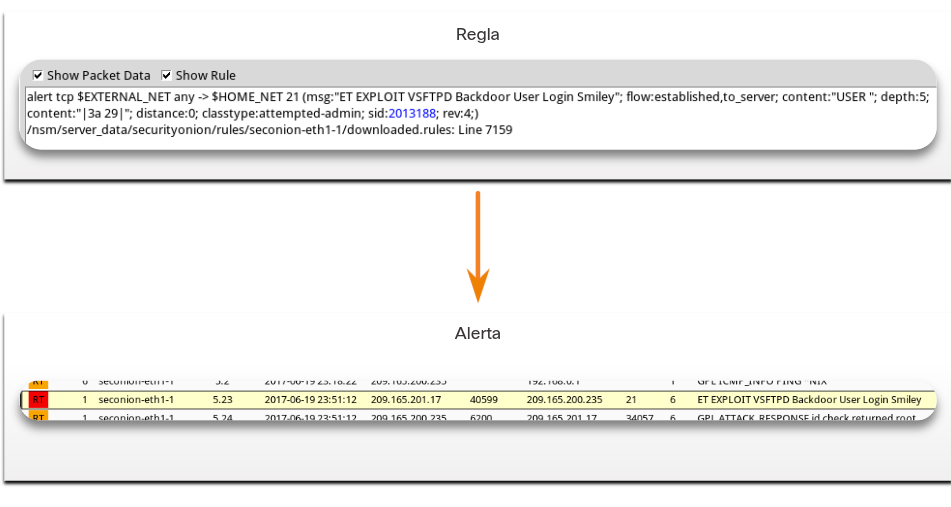
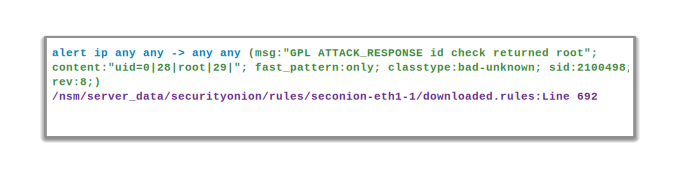
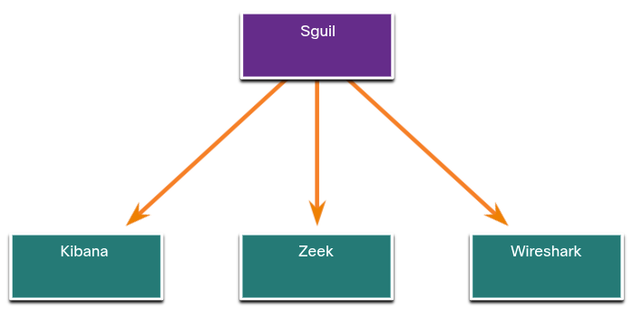

<a href="./00-Curso.md"><< Menú principal del módulo</a>

# 11. Evaluar alertas
# Fuentes de las alertas
## Cebolla de seguridad
Cebolla de seguridad (_Security Onion_) es una suite de código abierto de herramientas de Monitoreo de la seguridad de la red (Network Security Monitoring, NSM) que se ejecuta en una distribución Ubuntu de Linux. Las herramientas de Cebolla de seguridad ofrecen tres funciones principales para el análisis de ciberseguridad como la captura completa de paquetes y tipos de datos, sistemas de detección de intrusión basados en el host y basados en la red, y herramientas de análisis de alerta. Cebolla de seguridad puede instalarse como una plataforma independiente o como una plataforma de sensor y servidor. Algunos de los componentes de Cebolla de seguridad son propiedad de corporaciones que los mantienen, como Cisco y Riverbend Technologies, pero está disponible como una plataforma de código abierto.

Para obtener más información, y para obtener Cebolla de seguridad, busque en Internet el sitio web de Cebolla de seguridad.

__Nota__: En algunos recursos es posible que vea Cebolla de seguridad abreviado como SO. En este curso, usaremos Cebolla de seguridad.

## Herramientas de detección para recopilar dfatos de alertas
Security Onion contiene muchos componentes. Es un entorno integrado diseñado para simplificar la implementación de una solución integral de NSM. En la figura, se ejemplifica una vista simplificada de la manera en que algunos de los componentes de Cebolla de seguridad funcionan juntos.

	

* __CapME__. Es una aplicación web que permite la visualización de transcripciones PCAP producidas con las herramientas _tcpflow_ o _Zeek_. Es posible tener acceso a CapME desde la herramienta _Enterprise Log Search and Archive_ (ELSA). CapME le proporciona al analista de ciberseguridad un medio fácil de leer para visualizar una sesión completa de la capa 4. CapME actúa como un complemento de ELSA y proporciona acceso a archivos PCAP relevantes que se pueden abrir en Wireshark.
	* __Nota__. Los archivos PCAP son formatos de datos utilizados para almacenar paquetes de red capturados, permitiendo un análisis detallado del tráfico de red fuera de línea.Estos archivos contienen información binaria precisa sobre la comunicación en red, incluyendo direcciones IP de origen y destino, encabezados de protocolo, datos de carga útil y marcas de tiempo. Principalmente se utilizan para solucionar problemas de red, analizar cuellos de botella de rendimiento, detectar intrusiones, validar implementaciones de protocolo y realizar auditorías de cumplimiento, como demostrar el cifrado en tránsito. El formato PCAP es independiente del protocolo y se puede crear con herramientas como _Wireshark_, _tcpdump_ o _WinDump_, siendo ampliamente compatible con software de análisis de red.
* __Snort__. Un sistema de detección de intrusiones en la red (NIDS, _Network Intrusion Detection System_). Es una fuente importante de los datos de alerta que se indexan en la herramienta de análisis _Sguil_. Snort utiliza reglas y firmas para generar alertas. Snort puede descargar automáticamente reglas nuevas utilizando el componente _PulledPork_ de Security Onion. Snort y _PulledPork_ son herramientas de código abierto patrocinadas por Cisco.
* __Zeek__. Anteriormente conocido como _Bro_. Es un NIDS que utiliza más de un enfoque con base en el comportamiento para detectar intrusiones. En lugar de utilizar firmas o reglas, Zeek utiliza políticas en forma de secuencias de comando que determinan qué datos registrar y cuándo emitir notificaciones de alerta. Zeek también puede enviar archivos adjuntos para someterlos a análisis de malware, bloquear el acceso a sitios maliciosos y apagar una computadora que parezca estar violando las políticas de seguridad. 
	* __Nota__: Algunas interfaces dentro de Security Onion aún no se han actualizado con el cambio de nombre Bro a Zeek.
* __OSSEC__. Es un sistema de detección de intrusiones con base en el host (HIDS, _Host-based Intrusion Detection System_) que se integra en Security Onion. Monitorea activamente las operaciones del sistema del host, entre ellas, el monitoreo de integridad de archivos, el monitoreo de registros locales, el monitoreo de procesos del sistema y la detección de _rootkits_. Las alertas y los datos de registro de OSSEC están disponibles para _Sguil_ y _Kibana_. OSSEC requiere la ejecución de un agente en las computadoras con Windows de la empresa.
* __Wazuh__. Wazuh es un HIDS que reemplazará a OSSEC en la Security Onion. Es una solución completa que proporciona un amplio espectro de mecanismos de protección de _endpoints_, incluyendo análisis de archivos de registro de host, supervisión de la integridad de archivos, detección de vulnerabilidades, evaluación de configuración y respuesta a incidentes. Al igual que OSSEC, requiere que los agentes se ejecuten en hosts de red.
* __Suricata__. Es un NIDS que utiliza un enfoque basado en firmas. También puede usarse para la prevención de intrusiones en línea. Es similar a _Zeek_; Sin embargo, Suricata utiliza la creación nativa de subprocesos, que permite la distribución del procesamiento de flujos de paquetes en múltiples núcleos de procesador. También incluye algunas características adicionales, como el bloqueo con base en la reputación y la compatibilidad con la creación de subprocesos de unidades de procesamiento de gráficos (GPU, Graphics Processing Unit) para mejorar el rendimiento.

## Herramientas de análisis
Security Onion integra estos diferentes tipos de datos y registros del sistema de detección de intrusiones (IDS) en una única plataforma mediante las siguientes herramientas:
* __Sguil__. Proporciona una consola de alto nivel para investigar alertas de seguridad de una amplia variedad de fuentes. Sguil sirve como punto de partida para la investigación de alertas de seguridad. Hay disponible una amplia variedad de fuentes de datos para el analista de ciberseguridad si se utiliza Sguil directamente con otras herramientas.
* __Kibana__. Es una interfaz de tablero interactivo para los datos de Elasticsearch. Permite la consulta de datos de NSM y proporciona visualizaciones flexibles de esos datos. Proporciona funciones de exploración de datos y análisis de datos de aprendizaje automático. Es posible pivotar desde Sguil directamente a Kibana para ver pantallas contextualizadas basadas en las direcciones IP de origen y destino asociadas a una alerta. Busque en Internet y visite el sitio web elastic.co para obtener más información sobre las muchas características de Kibana.
* __Wireshark__. Es una aplicación de captura de paquetes que está integrada en el conjunto de productos de Security Onion. Puede abrirse directamente con otras herramientas y permite ver capturas de paquetes completos relevantes para un análisis.
* __Zeek__ - Es un analizador de tráfico de red que sirve como monitor de seguridad. Zeek inspecciona todo el tráfico en un segmento de red y permite un análisis detallado de esos datos. El giro de Sguil a Zeek proporciona acceso a registros de transacciones muy precisos, contenido de archivos y salida personalizada.

__Nota__: Las herramientas de Security Onion que no se ven en la figura están fuera del alcance de este curso. Una descripción completa de Cebolla de seguridad y sus componentes puede ser encontrada en la página web de Security Onion.

## Generación de alertas
Las alertas de seguridad son los mensajes de notificación que generan las herramientas, los sistemas y los dispositivos de seguridad de NSM. Las alertas pueden adoptar muchas formas según la fuente. Por ejemplo, syslog admite clasificaciones de gravedad que se pueden utilizar para alertar a los analistas de ciberseguridad sobre eventos que requieran atención.

En Security Onion, Sguil proporciona una consola que integra alertas de varias fuentes en una cola con marca de hora. Un analista de ciberseguridad puede navegar por la cola de seguridad investigando, clasificando, derivando o retirando alertas. En lugar de un sistema de administración del flujo de trabajo dedicado como _Request Tracker for Incident Response_ (RTIR), un analista de ciberseguridad utilizaría el resultado de una aplicación como Sguil para organizar una investigación NSM.

Las alertas suelen incluir información de cinco tuplas cuando esté disponible, así como marcas de hora y la información necesaria para identificar qué dispositivo o sistema generó la alerta. Es importante recordar que las cinco tuplas incluyen la siguiente información para el seguimiento de una conversación entre una aplicación de origen y una de destino:
* __SrcIP__. La dirección IP de origen para el evento.
* __SPort__. El puerto de capa 4 de origen (local) para el evento.
* __DstIP__. La dirección IP de destino para el evento.
* __DPort__. El puerto de capa 4 de destino para el evento.
* __Pr__. El número de protocolo IP para el evento.

La información adicional podría incluir la aplicación de una decisión de permitir o negar el tráfico, datos capturados de la carga útil del paquete, o un valor hash para un archivo descargado, o una variedad de datos diferentes.

En la figura, se ve la ventana de la aplicación Sguil con la cola de alertas que esperan ser investigadas en la parte superior de la interfaz.

	

Los campos disponibles para los eventos en tiempo real son los siguientes:
* __ST__. Este es el estado del evento. RT significa tiempo real. La prioridad del evento se categoriza usando colores. Las prioridades dependen de la categoría de la alerta. Hay cuatro niveles de prioridad: muy baja, baja, media y alta. Los colores van del amarillo claro al rojo a medida que la prioridad aumenta.
* __CNT__. Este es el recuento de la cantidad de veces que se ha detectado este evento para la misma dirección IP de origen y de destino. El sistema determina que este conjunto de eventos está correlacionado. En lugar de informar cada evento de una serie posiblemente larga de eventos correlacionados en esta ventana, el evento aparece una vez en esta columna con la cantidad de ocasiones en que se lo detectó. Un número elevado puede representar un problema de seguridad o la necesidad de modificar las firmas del evento para limitar la cantidad de eventos potencialmente irrelevantes que se está informando.
* __Sensor__. Es el agente que reporta el evento. Los sensores disponibles y sus números de identificación pueden encontrarse en la ficha de estado del agente (_Agent status_) del panel que aparece debajo de la ventana de eventos a la izquierda. Estos números también se utilizan en la columna de identificación de la alerta. Desde el panel de estado del agente, podemos ver que los sensores de OSSEC, PCAP y Snort envían informes a Sguil. Además, podemos ver los nombres de host predeterminados de estos sensores, lo que incluye la interfaz de monitoreo. Es necesario tener en cuenta que cada interfaz de monitoreo tiene datos PCAP y Snort asociados con ella.
* __Alert ID__. Este número de dos partes representa el sensor que informa el problema y el número de evento para ese sensor. En la figura, podemos ver que la mayor cantidad de eventos visualizados provienen del sensor de OSSEC (1). El sensor de OSSEC ha informado ocho conjuntos de eventos correlacionados. De estos eventos, 232 se informaron con la identificación de evento 1.24.
* __Date/Time__. Es la marca de tiempo del evento. En el caso de eventos correlacionados, es la marca de tiempo del primer evento.
* __Event Message__. Es el texto que identifica el evento. Se configura en la regla que desencadenó la alerta. La regla asociada puede verse en el panel derecho, justo encima del paquete de datos. Para mostrar la regla, la casilla de verificación Show Rule debe estar activada.

Según la tecnología de seguridad, es posible generar alertas con base en reglas, firmas, anomalías o comportamientos. Sin importar cómo se generan, las condiciones que desencadenan una alerta deben definirse previamente de algún modo.

## Reglas y alertas
Las alertas pueden provenir de una serie de fuentes:
* __NIDS__. Snort, Zeek y Suricata.
* __HIDS__. OSSEC, Wazuh.
* __Administración y monitoreo de activos__. Sistema de detección de activos pasivos (PADS: Passive Asset Detection System).
* __Transacciones HTTP, DNS y TCP__. Registradas por Zeek y PCAP's.
* __Mensajes de syslog__. Fuentes múltiples.

La información encontrada en las alertas que estan en Sguil diferirá en cuanto al formato del mensaje, ya que provienen de fuentes diferentes.

La alerta de Sguil en la figura se activó por una regla configurada en Snort. Es importante que el analista de ciberseguridad pueda interpretar lo que desencadenó la alerta para poder investigarla. Por esta razón, el analista de ciberseguridad debe entender los componentes de las reglas de Snort, que son una importante fuente de alertas en Cebolla de seguridad.

	

## Estructura de la regla de Snort
### Estructura de la regla de Snort e información suministrada por Sguil
Las reglas de Snort constan de dos secciones, como se ve en la Figura: el encabezado de la regla y las opciones de la regla. El encabezado de la regla contiene la acción, el protocolo, las direcciones IP y máscaras de red de origen y destino, y la información del puerto de origen y de destino. La sección de opciones de la regla contiene mensajes de alerta e información sobre qué partes del paquete deben ser inspeccionadas para determinar si debe adoptarse la acción de la regla. A veces, Sguil añade la ubicación de la regla. La ubicación de la regla es la ruta al archivo que contiene la regla y el número de línea en la que la regla aparece para que sea posible encontrarla y modificarla o eliminarla si hace falta.

	

__Componente__|__Ejemplo (abreviado...)__|__Explicación__
:-|:-|:-
Cabecera de la regla|<code>alert ip any any -> any any</code>|coneitne la acción a realizar, las direcciones de origen y destino y el puerto, y la dirección del flujo de tráfico
Opciones de la regla|<code>(msg:"GPL ATTACK_RESPONSE ID CHECK RETURNED ROOT";...)</code>|Incluye el mensaje que se mostrará, los detalles del contenido del paquete, el tipo de alerta, el ID de origen y detalles adicionales, como una referencia para la regla o la vulnerabilidad
Ubicación de la regla|<code>/nsm/server_data/securityonion/rules/...</code>|Añadido por Sguil para indicar la ubicación de la regla en la estructura de archivos de Security Onion y en el archivo de reglas especificado

### Estructura de encabezado de la regla de Snort
#### El encabezado de las reglas
El encabezado de la regla contiene la acción, el protocolo, las direcciones y el puerto, como se muestra en la figura. Además, se indica la dirección del flujo que desencadenó la alerta. La estructura de la parte del encabezado es la misma entre las reglas de alerta de Snort.

Snort puede configurarse para utilizar variables a fin de representar direcciones IP internas y externas. Estas variables, <code>$HOME_NET</code> y <code>$EXTERNAL_NET</code>, aparecen en las reglas de Snort. Permiten simplificar la creación de reglas eliminando la necesidad de detallar direcciones y máscaras específicas para cada regla. Los valores de estas variables se configuran en el archivo snort.conf. Snort también permite especificar en las reglas direcciones IP individuales, bloques de direcciones o listas de cualquiera de estos. Es posible especificar los rangos de puertos separando los valores superiores e inferiores del rango con dos puntos. También hay disponibles otros operadores.

#### Estructura de encabezado de la regla de Snort

	

__Componente__|__Explicación__
:-|:-
<code>alert</code>|La acción a realizar es emitir una alerta, otras acciones son registrar y pasar.
<code>ip</code>|El protocolo.
<code>any any</code>|El origen especificado es cualquier dirección IP y cualquier puerto de Capa 4.
<code>-></code>|La dirección del flujo es del origen al destino.
<code>any any</code>|El destino especificado es cualquier dirección IP y cualquier puerto de Capa 4.

#### Estructura de opciones de la regla de Snort
##### Las opciones de las reglas
La estructura de la sección de opciones de la regla es variable. Es la parte de la regla que está entre paréntesis, como se ve en la Figura. Contiene el mensaje de texto que identifica la alerta. También contiene metadatos sobre la alerta, como una dirección URL que proporciona información de referencia para la alerta. Es posible incluir otra información, como el tipo de regla y un identificador numérico único para la regla y su revisión. Además, es posible especificar características de la carga útil del paquete en las opciones. El manual de usuario de Snort, que se puede encontrar en Internet, proporciona detalles sobre las reglas y cómo crearlas.

Los mensajes de reglas de Snort pueden incluir la fuente de la regla. Tres fuentes comunes de reglas de Snort son las siguientes:
* __GPL__. Reglas de Snort anteriores que fueron creadas por Sourcefire y distribuidas mediante GPLv2. El conjunto de reglas GPL no cuenta con certificación de Cisco Talos. Incluye las SID de Snort 3464 e inferiores. El conjunto de reglas de la GPL se puede descargar desde el sitio web de Snort, y se incluye en Cebolla de seguridad.
* __ET__. Reglas de Snort para amenazas emergentes. Las amenazas nuevas son un punto de recopilación para las reglas de Snort desde múltiples fuentes. Las reglas de ET son de código abierto y se distribuyen bajo licencia de BSD. El conjunto de reglas de ET contiene reglas de múltiples categorías. Un conjunto de reglas de ET se incluye con Security Onion. Las amenazas emergentes es una división de _Proofpoint, Inc_.
* __VRT__. Estas reglas están inmediatamente disponibles para los suscriptores y se publican para los usuarios registrados 30 días después de que se crean, con algunas limitaciones. Ahora las crea y mantiene Cisco Talos.
Las reglas pueden descargarse automáticamente de Snort.org con la utilidad de administración de reglas _PulledPork_ que se incluye con Security Onion.

Las alertas que no generan las reglas de Snort se identifican con etiquetas de OSSEC o PADS, entre otras. Además, es posible crear reglas locales personalizadas.

##### Estructura de opciones de la regla de Snort

	

__Componente__|__Explicación__
:-|:-
<code>msg:</code>|Texto que describe la alerta.
<code>content:</code>|Se refiere al contenido del paquete. en este caso, se enviará auna alerta si el texto literal <code>uid=O(root)</code> aparece en cualquier lugar de los datos del paquete. Se pueden proporcionar valores que especifiquen la ubicación del texto en la carga de datos.
<code>reference:</code>|Esto no se muestra en la figura. Suele ser un enlace a una URL que proporciona más información sobre la regla. En este caso, el sid está hipervinculado a la fuente de la regla en Internet.
<code>classtype:</code>|Una categoría para el ataque. Snort incluye un conjunto de categorías por defecto que tiene uno de los cuatro valores de prioridad.
<code>sid:</code>|Un identificador numérico único para la regla.
<code>rev:</code>|La revisión de laregla que está representada por el sid.

## Práctica de laboratorio: Reglas de Snort y Firewall
* <a href="./notes/lab_reglas_snort_firewall.md" target="_blank">Reglas de Snort y Firewall</a>

# Descripción general de la evalucación de alertas
## La necesidad de evaluar las alertas
El panorama de amenazas cambia constantemente con la detección de nuevas vulnerabilidades y la evolución de nuevas amenazas. A medida que las necesidades de usuarios y organizaciones cambian, también lo hace la superficie de ataque. Los agentes de amenaza han aprendido a cambiar rápidamente las características de sus ataques para evadir la detección.

Es imposible diseñar medidas para evitar todos los ataques. Inevitablemente, los ataques terminan evadiendo las medidas de protección, sin importar lo sofisticadas que puedan ser. A veces, lo mejor que se puede hacer es detectar los ataques mientras ocurren o posteriormente. Las reglas de detección deben ser excesivamente conservadoras. En otras palabras, es mejor que se generen alertas ocasionales por tráfico inocente que tener reglas que no detecten tráfico malicioso. Por este motivo, es necesario tener analistas de ciberseguridad calificados que investiguen las alertas para determinar si realmente se produjo un ataque.

Analistas de ciberseguridad de categoría 1, analizarán colas de alertas en una herramienta como Sguil, alternando a herramientas como Zeek, Wireshark y Kibana para verificar que una sea realmente un ataque.

__Principales herramientas para el analista de ciberseguridad de nivel 1__

	

## Evaluación de alertas
Los incidentes de seguridad se clasifican con un esquema adoptado del ámbito de los diagnósticos médicos. Este esquema de clasificación se utiliza para guiar acciones y evaluar los procedimientos de diagnóstico. Por ejemplo, cuando un paciente visita a un médico para un examen de rutina, una de las tareas del médico es determinar si el paciente está enfermo. Uno de los resultados puede ser determinar correctamente que la enfermedad está presente y que el paciente está enfermo. Otro resultado puede ser determinar que no hay ninguna enfermedad y el que paciente está sano.

Entonces, la inquietud radica en que el diagnóstico sea exacto (verdadero) o inexacto (falso). Por ejemplo, el médico podría pasar por alto síntomas de la enfermedad y tomar la determinación incorrecta de que el paciente está bien cuando, en realidad, está enfermo. Otro error posible es determinar que un paciente está enfermo cuando en realidad no lo está. Los diagnósticos falsos son costosos o peligrosos.

Durante el análisis de seguridad de la red, el analista de ciberseguridad recibe una alerta. Esto se asemeja a un paciente que va al médico y dice “estoy enfermo”. El analista de ciberseguridad, como el médico, debe determinar si este diagnóstico es cierto. El analista de ciberseguridad piensa: “El sistema dice que se ha producido un ataque. ¿Es cierto?”

Las alertas pueden clasificarse de la siguiente manera:

* __Verdadero positivo__: se ha verificado que la alerta es un incidente de seguridad real.
* __Falso positivo__: la alerta no indica un incidente de seguridad real. La actividad benigna que resulta en un falso positivo a veces se conoce como un desencadenante benigno.

Otra situación puede ser que no se haya generado una alerta. La ausencia de una alerta puede clasificarse del siguiente modo:

* __Verdadero Negativo__: No ha ocurrido ningún incidente de seguridad. La actividad es benigna.
* __Falso negativo__: Se ha producido un incidente no detectado.

Cuando se emite una lerta , recibirá una de las cuatro clasificaciones posibles:

||__Verdadero__|__Falso__
:-|:-|:-
__Positivo (la alerta existe)__|Se ha producido un incidente|No se ha producido ningún incidente
__Negativo (No existe ninguna alerta)__|No se ha producido ningún incidente|Se ha producido un incidente

__Nota__: Los eventos "verdaderos" son deseables. Los eventos "falsos" son indeseables y potencialmente peligrosos.

Los __positivos verdaderos__ son el tipo de alerta deseado. Si ocurren, significa que las reglas que generan alertas funcionan correctamente.

Los __falsos positivos__ no son deseables. Aunque no indican que se ha producido un ataque no detectado, son costosos porque los analistas de ciberseguridad deben investigar las falsas alarmas; por lo tanto, le quitan tiempo a la investigación de alertas que indican la presencia de ataques reales.

Los __negativos verdaderos__ también son deseables. Indican que el tráfico benigno normal se ignora correctamente y que no se emiten alertas erróneas.

Los __falsos negativos__ son peligrosos. Indican que los sistemas de seguridad implementados no detectan ataques. Estos incidentes podrían pasar inadvertidos durante mucho tiempo y causar daños y pérdidas de datos constantes.

Los eventos benignos son aquellos que no deben desencadenar alertas. Los eventos benignos excesivos indican que es necesario mejorar o eliminar algunas reglas u otros detectores.

Cuando se sospecha que hay positivos verdaderos, un analista de ciberseguridad es requerido para escalar la alerta a un nivel mayor de investigación. El investigador avanzará con la investigación para confirmar el incidente e identificar cualquier daño que podría haber ocurrido. Esta información será utilizada por personal de seguridad de mayor categoría que trabajará para aislar el daño, solucionar las vulnerabilidades, mitigar la amenaza y cumplir los requisitos de creación de informes.

Es posible que un analista de ciberseguridad también sea deba informar al personal de seguridad que se producen falsos positivos si estos le están quitando demasiado tiempo. Esta situación indica que los sistemas de seguridad deben ajustarse para ser más eficientes. Los cambios legítimos en la configuración de la red o la descarga de reglas de detección recientes podrían ocasionar un aumento repentino de falsos positivos.

Los falsos negativos pueden detectarse mucho después de que se produzca un ataque. Esto se puede lograr mediante el análisis retrospectivo de seguridad (RSA, Retrospective Security Analysis). El RSA puede tener lugar cuando se aplican reglas recién obtenidas u otra inteligencia de amenazas a datos de seguridad de la red archivados. Por este motivo, es importante monitorear la inteligencia de amenazas para conocer vulnerabilidades y ataques nuevos y para evaluar la probabilidad de que la red fuera vulnerable. Además, es necesario evaluar el ataque en relación con el posible daño que podría sufrir la empresa. Se puede determinar que añadir nuevas técnicas de mitigación es suficiente o que debería efectuarse un análisis más detallado.

## Análisis determinístico y análisis probabilístico
Se pueden utilizar técnicas estadísticas para evaluar el riesgo de que los ataques tengan éxito en una red dada. Este tipo de análisis puede ayudar a los encargados de la toma de decisiones a evaluar mejor el costo de mitigar una amenaza respecto del daño que podría causar un ataque.

Hay dos enfoques generales para esto el análisis determinista y el análisis probabilístico. El análisis determinista evalúa el riesgo según lo que se conoce acerca de una vulnerabilidad. Supone que, para que un ataque tenga éxito, todos los pasos anteriores del ataque también deben tener éxito. Este tipo de análisis de riesgo solamente puede describir el peor de los casos. Sin embargo, muchos agentes de amenaza, aunque son conscientes del proceso para llevar a cabo un ataque, pueden carecer del conocimiento o la experiencia para completar correctamente cada paso en el camino a un ataque exitoso. Esto puede darle al analista de ciberseguridad una oportunidad para detectar el ataque y detenerlo antes de que avance más.

El análisis probabilístico evalúa el éxito potencial de un ataque calculando la probabilidad de que, si un paso de un ataque concluye con éxito, el siguiente paso también lo hará. El análisis probabilístico es especialmente útil en los análisis de seguridad de la red en tiempo real, en los que numerosas variables están en juego y un agente de amenaza puede tomar decisiones desconocidas a medida que se persigue un ataque.

El análisis probabilístico usa técnicas estadísticas que sirven para calcular la probabilidad que ocurra un evento de acuerdo con la probabilidad de que ocurran eventos anteriores. Con este tipo de análisis, es posible calcular las trayectorias más probables de un ataque y el personal de seguridad puede concentrar su atención en prevenir o detectar el ataque más probable.

En un análisis determinista, se da por sabida toda la información para llevar a cabo un ataque. Las características del ataque, como el uso de números de puerto específicos, se conocen por otras instancias del ataque o porque se usan puertos estandarizados. En el análisis probabilístico, se da por sentado que los números de puerto que se utilizarán solamente pueden predecirse con un cierto grado de seguridad. En esta situación, por ejemplo, no es posible aplicar un análisis determinista a un ataque que utiliza números de puerto dinámicos. Tales ataques se han optimizado para evitar que los firewalls que utilizan reglas estáticas los detecten.

Los dos enfoques se resumen a continuación.
* __Análisis determinístico__: para que un ataque tenga éxito, todos los pasos anteriores del ataque también deben tener éxito. El analista especializado en ciberseguridad conoce los pasos de un ataque exitoso.
* __Análisis probabilístico__: se utilizan técnicas estadísticas para determinar la probabilidad de que se produzca un ataque (exploit) con éxito, basándose en la probabilidad de que cada paso del ataque tenga éxito.

## Práctica de laboratorio: Clasificar alertas
* <a href="./notes/lab_clasificar_alertas.md" target="_blank">Clasificar alertas</a>

# Resumen
## Fuente de las alertas
Cebolla de seguridad (_Security Onion_) es una suite de código abierto de herramientas de Monitoreo de la seguridad de la red (_Network Security Monitoring_, NSM) que se ejecuta en una distribución Ubuntu de Linux. Las herramientas de Cebolla de seguridad ofrecen tres funciones principales para el análisis de ciberseguridad como la captura completa de paquetes y tipos de datos, sistemas de detección de intrusión basados en el host y basados en la red, y herramientas de análisis de alerta. Algunos de los componentes de Cebolla de seguridad son propiedad de corporaciones que los mantienen, como Cisco y Riverbend Technologies, pero está disponible como una plataforma de código abierto.

Cebolla de seguridad contiene muchos componentes. Es un entorno integrado diseñado para simplificar la implementación de una solución integral de NSM. Cebolla de seguridad integra estos diferentes tipos de datos y registros del sistema de detección de intrusiones (IDS) en una única plataforma mediante las siguientes herramientas: Sguil - Sirve para punto de inicio de investigación de alertas de seguridad Kibana - Kibana es una interfaz interactiva para datos de Elasticsearch. Permite la consulta de datos de NSM y proporciona visualizaciones flexibles de esos datos. La aplicación capturadora de paquetes Wireshark está integrada en el conjunto de Cebolla de seguridad. Zeek es un analizador de tráfico de red que sirve como monitor de seguridad. Zeek inspecciona todo el tráfico en un segmento de red y permite un análisis detallado de esos datos.

Las alertas de seguridad son los mensajes de notificación que generan las herramientas, los sistemas y los dispositivos de seguridad de NSM. En Cebolla de seguridad, Sguil proporciona una consola que integra alertas de varias fuentes en una cola con marca de hora. Un analista de ciberseguridad puede navegar por la cola de seguridad investigando, clasificando, derivando o retirando alertas.

Las alertas suelen incluir información de cinco tuplas cuando esté disponible, así como marcas de hora y la información necesaria para identificar qué dispositivo o sistema generó la alerta. Según la tecnología de seguridad, es posible generar alertas con base en reglas, firmas, anomalías o comportamientos. Las alertas pueden provenir de varios orígenes, como NIDS, administración y supervisión de activos, transacciones HTTP, DNS y TCP, y mensajes Syslog.

Snort es un sistema de detección de intrusiones en la red (NIDS, Network Intrusion Detection System). Es una fuente importante de los datos de alerta que se indexan en la herramienta de análisis Sguil. Utiliza reglas para identificar el tráfico potencialmente malicioso. Las reglas de Snort consisten de dos secciones: el encabezado de la regla y las opciones de la regla. El encabezado de la regla contiene la acción, el protocolo, las direcciones IP y máscaras de red de origen y destino, y la información del puerto de origen y de destino. La sección de opciones de la regla contiene mensajes de alerta e información sobre qué partes del paquete deben ser inspeccionadas para determinar si debe adoptarse la acción de la regla. La estructura de la sección de opciones de la regla es variable.

## Descripción general de la evaluación de alertas
El panorama de amenazas cambia constantemente con la detección de nuevas vulnerabilidades y la evolución de nuevas amenazas. A medida que las necesidades de usuarios y organizaciones cambian, también lo hace la superficie de ataque. Los agentes de amenaza han aprendido a cambiar rápidamente las características de sus ataques para evadir la detección. Las reglas de detección deben ser excesivamente conservadoras. Es mejor que se generen alertas ocasionales por tráfico inocente que tener reglas que no detecten tráfico malicioso. Por este motivo, es necesario tener analistas de ciberseguridad calificados que investiguen las alertas para determinar si realmente se produjo un ataque.

Los incidentes de seguridad se clasifican con un esquema adoptado del ámbito de los diagnósticos médicos. Este esquema de clasificación se utiliza para guiar acciones y evaluar los procedimientos de diagnóstico. La inquietud radica en que el diagnóstico sea exacto (verdadero) o inexacto (falso). Las alertas se pueden clasificar como Verdadero Positivo (se ha verificado que la alerta es un incidente de seguridad real) o Falso Positivo (La alerta no indica un incidente de seguridad real). Otra situación puede ser que no se haya generado una alerta. La ausencia de una alerta se puede clasificar como: Verdadero negativo (no se ha producido ningún incidente de seguridad. La actividad es benigna.) y falso negativo (Un incidente no detectado que ha ocurrido) Los verdaderos positivos y los verdaderos negativos son deseables. Los falsos positivos no son deseables, pero inevitables, y los falsos negativos son peligrosos.

Se pueden utilizar técnicas estadísticas para evaluar el riesgo de que los ataques tengan éxito en una red dada. Este tipo de análisis puede ayudar a los encargados de la toma de decisiones a evaluar mejor el costo de mitigar una amenaza respecto del daño que podría causar un ataque. Hay dos enfoques generales para esto el análisis determinista y el análisis probabilístico. El análisis determinista evalúa el riesgo según lo que se conoce acerca de una vulnerabilidad. Supone que, para que un ataque tenga éxito, todos los pasos anteriores del ataque también deben tener éxito. Este tipo de análisis de riesgo solamente puede describir el peor de los casos. El análisis probabilístico evalúa el éxito potencial de un ataque calculando la probabilidad de que, si un paso de un ataque concluye con éxito, el siguiente paso también lo hará. El análisis probabilístico es especialmente útil en los análisis de seguridad de la red en tiempo real, en los que numerosas variables están en juego y un agente de amenaza puede tomar decisiones desconocidas a medida que se persigue un ataque.

# Enlaces de interés
1. <a href="https://securityonionsolutions.com/software" target="_blank">Security Onion</a>
2. 
 
 
 
 
 
 
 
 
 
<a href="#11-evaluar-alertas">⬆️</a>
<a href="./00-Curso.md"><< Menú principal del módulo</a>