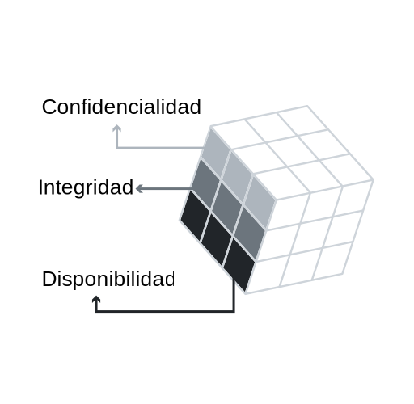
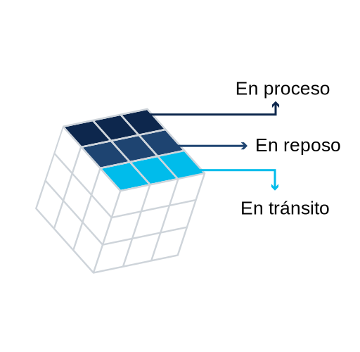
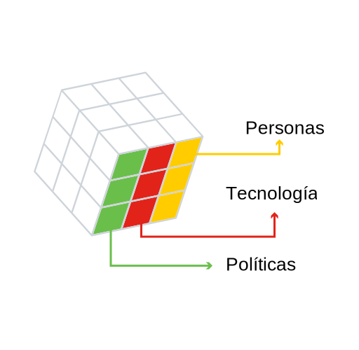

<a href="./00-Curso.md"><< Menú principal del módulo</a>

# Gestión y cumplimiento
Bienvenido a este módulo, cuyo objetivo es explorar los objetivos principales de la gobernanza de la ciberseguridad, así como las leyes que afectan la tecnología y los requisitos de ciberseguridad.

La gobernanza es un tema importante en la ciberseguridad, ya que describir las políticas y los procesos vigentes dentro de una organización que definen las responsabilidades por la aplicación y la rendición de cuentas para mitigar el riesgo cibernético. Estos también deben alinearse con las regulaciones clave.

Como profesional de la ciberseguridad, debe tener conocimiento de las diferentes leyes que regulan la seguridad de la información, la ciberseguridad y la privacidad dentro de su país para garantizar el cumplimiento de la organización. Y no olvidemos su obligación ética de hacer siempre lo correcto.

# Gobernanza
## Gestión
La gobernanza de seguridad de TI determina quién está autorizado a tomar decisiones sobre los riesgos de ciberseguridad dentro de una organización. Demuestra responsabilidad y proporciona supervisión para garantizar que cualquier riesgo se mitigue adecuadamente y que las estrategias de seguridad estén alineadas con los objetivos comerciales de la organización y cumplan con las regulaciones.

La gobernanza de la seguridad de TI no debe confundirse con la administración de la seguridad de TI, la cual define e implementa los controles que una organización necesita para mitigar los riesgos. De manera similar, la gobernanza de datos en particular determina quién está autorizado a tomar decisiones sobre los datos dentro de una organización.

Hay varios roles clave en los buenos programas de gobernenza de datos.  
* __Propietario de datos__. Una persona que garantiza el cumplimiento de políticas y procedimientos, asigna la clasificación adecuada a los recursos de información y determina los criterios para acceder a los recursos de información. 
* __Controlador de datos__. Una persona que determina los fines para los cuales, y la manera en la cual, son procesan los datos personales.
* __Procesador de datos__. Una persona u organización que procesa datos personales en nombre del controlador de datos.
* __Custodio de datos__. Una persona que implementa la clasificación y los controles de seguridad de los datos de acuerdo con las reglas establecidas por el propietario de los datos. En otras palabras, los custodios de datos son responsables del control técnico de los datos.
* __Administrador de datos__. Una persona que garantiza que los datos cumplan las necesidades empresariales de una organización y cumplan con los requisitos reglamentarios.
* __Funcionario de protección de datos__. Una persona que supervisa la estrategia de protección de datos de una organización.

## Políticas de ciberseguridad
Una política de ciberseguridad es un documento de alto nivel que describir la visión de una organización para la ciberseguridad, incluidos sus objetivos, necesidades, alcance y responsabilidades. Específicamente, esta:
* Demuestra el compromiso de una organización con la seguridad.
* Establece los estándares de comportamiento y requisitos de seguridad para llevar a cabo actividades, procesos y operaciones, y proteger los activos de tecnología e información dentro de una organización.
* Garantiza que la adquisición, el uso, el mantenimiento de la operación del sistema, software y hardware sean consistentes dentro de la organización.
* Definir las consecuencias legales de las violaciones a las políticas.
* Brinda al equipo de seguridad el soporte que necesitan de la alta gerencia.

Existen diversos tipos de políticas de ciberseguridad.
* __Política maestra de ciberseguridad__. Como modelo para el programa de ciberseguridad de una organización, esta política sirve como plan estratégico para implementar controles de ciberseguridad.
* __Política específica del sistema__. Este tipo de política se desarrolla para dispositivos o sistemas informáticos específicos y tiene como objetivo establecer la estandarización para aplicaciones aprobadas, software, configuraciones de sistemas operativos, hardware y contramedidas de refuerzo dentro de una organización.
* __Política de problemas específicos__. Este tipo de política se desarrolla para ciertos problemas operativos, circunstancias o condiciones que pueden requerir requisitos e instrucciones más detallados.

## Tipos de políticas de seguridad
Una organización debe establecer políticas de seguridad claras y detalladas que todos los empleados conozcan. Es fundamental que estas políticas también cuenten con el respaldo del equipo de alta gerencia.
* Política de identifación y autenticación. Especifica quién debe tener acceso a los recursos de red y qué procedimientos de verificación existen para facilitar esto.
* Política de contraseñas. Definir los requisitos mínimos de contraseña, como la cantidad y el tipo de caracteres utilizados y la frecuencia con la que deben cambiarse.
* Política de uso aceptable. Destaca un conjunto de reglas que determinan el acceso y el uso de los recursos de red. También puede definir las consecuencias de infringir las políticas.
* Política de acceso remoto. Establece cómo conectarse de forma remota a la red interna de una organización y explica qué información es accesible de forma remota.
* Política de mantenimiento de la red. Describir los procedimientos para actualizar los sistemas operativos y las aplicaciones de usuario final de una organización.
* Política de manejo de incidentes. Proporciona orientación sobre cómo reportar y responder a incidentes relacionados con la seguridad dentro de una organización.
* Política de datos. Establece reglas mensurables para procesar datos dentro de una organización, como especificar dónde se almacenan los datos, cómo se clasifican los datos (alto, medio, bajo, confidencial, público o privado) y cómo se manejan y eliminan los datos.
* Política de credenciales. Aplica las reglas para crear credenciales, como la longitud mínima y máxima de una contraseña.
* Política organizacional. Proporciona orientación sobre cómo se debe realizar el trabajo en una organización. Los ejemplos pueden incluir políticas de administración de cambios, control de cambios o administración de activos.

## Práctica de laboratorio - Desarrollando políticas y procedimientos de ciberseguridad
* <a href="./notes/lab_politicas_procedimientos_ciberseguridad.md" target="_blank">Desarrollando políticas y procedimientos de ciberseguridad</a>

## Manejo de amenazas al usuario
Es posible que haya aprendido que, como profesional de ciberseguridad, tiene las mismas habilidades que un ciberdelincuente. De hecho, la ética es el código de comportamiento que lo distingue.

# La ética de la ciberseguridad
En ocasiones, es posible que se enfrente a un dilema o una situación difícil en la que el curso de acción correcto no esté claro de inmediato. En tales casos, debe actuar con responsabilidad y utilizar su criterio o ética para guiarlo por el camino correcto.

## Ética de un especialista en ciberseguridad
La ética es la pequeña voz en su cabeza que le dice lo que está bien y lo que está mal, y lo guía para tomar las decisiones correctas. Como especialista en ciberseguridad, debe comprender tanto la ley como los intereses de una organización para poder tomar tales decisiones.

La ética puede verse desde muchas perspectivas diferentes.
* __Ética utilitarista__. Durante el siglo diecinueve, los filósofos Jeremy Bentham y John Stuart Mill articularon la teoría de la ética utilitarista. Esto se basa en el principio rector de que la consecuencia de una acción es el factor más importante para determinar si la acción es moral o no. Por ejemplo, una acción que maximice el mayor bien para la mayor cantidad de personas es una opción ética.
* __El enfoque de los derechos__. El enfoque de derechos se guía por el principio que establece que un individuo tiene derecho a tomar sus propias decisiones, que no pueden ser violadas por la decisión de otra persona. Esta decisión debe respetar y considerar los derechos fundamentales del individuo. Estos derechos fundamentales incluyen el derecho a la verdad, la privacidad, la seguridad y que la sociedad aplique las leyes de manera justa a todos los miembros de la sociedad.
* __El enfoque del bien común__. El enfoque del bien común propone que las acciones éticas son las que benefician a toda la comunidad. Desafía a las personas a reconocer y perseguir los valores y objetivos compartidos con otros miembros de una comunidad.

Como especialista en ciberseguridad, a menudo no habrá una respuesta obvia a los problemas éticos con los que se encuentre. El curso de acción correcto dependerá de la situación y la perspectiva ética que utilice para guiar su decisión.

## Los diez mandamientos de la ética informática
Situado en Washington, DC, el Instituto de Ética Informática es un recurso que identifica, evalúa y responde a problemas éticos en el sector de la tecnología de la información.

Fue una de las primeras organizaciones en reconocer los problemas de políticas públicas y éticas que surgían del rápido crecimiento del campo de la tecnología de la información.

Crearon los diez mandamientos de ética informática presentados aquí.

	

## Delito cibernético
El delito cibernético se divide en tres categorías:
* El delito informático es donde una computadora es el blanco de actividades delictivas. Los ejemplos incluyen ataques de malware, el hackeo o ataques de denegación de servicio.
* El delito asistido por computadora ocurre cuando una computadora se utiliza para cometer un delito, como robo o fraude.
* Un delito incidental informático es cuando una computadora proporciona información incidental a un delito real. Por ejemplo, una computadora se utiliza para almacenar videos descargados ilegalmente, no la herramienta real utilizada para cometer el delito.

Hay muchas herramientas conectadas a Internet, muchas de las cuales no requieren mucha experiencia para su uso, que están contribuyendo al crecimiento exponencial del delito cibernético. De hecho, el delito cibernético está creciendo mucho más rápido que la capacidad del sistema legal para crear las leyes y regulaciones que lo prohíben.

Existen varias agencias que trabajan para combatir el delito cibernético, incluido el Centro de Quejas por Delitos en Internet (IC3) de la Oficina Federal de Investigaciones, InfraGard y la Asociación de la Industria de Software e Información (SIIA) en los Estados Unidos.

## Derecho cibernético
Las leyes existen para prohibir los comportamientos no deseados. En los Estados Unidos, hay tres fuentes principales de leyes y regulaciones, las cuales involucran aspectos de seguridad informática.
* __Ley estatutaria__. El Congreso de los Estados Unidos ha establecido agencias administrativas federales y un marco de trabajo regulatorio que incluye sanciones civiles y penales para quienes incumplen las reglas. Los derechos penales aplican un código moral comúnmente aceptado respaldado por la autoridad gubernamental. Por ejemplo, la Ley de Fraude y Abuso Informático es una ley estatutaria que prohíbe el acceso a una computadora sin autorización o en exceso de autorización. La violación de estas reglas puede dar lugar a una multa o una pena de prisión.
* __Derecho administrativo__. Un marco legal que rige las actividades de las agencias administrativas del gobierno, el derecho administrativo garantiza que los organismos públicos actúen de conformidad con la ley. Por ejemplo, la Comisión Federal de Comunicaciones (FCC) y la Comisión Federal de Comercio (FTC) se ocupan de problemas tales como el fraude y el robo de la propiedad intelectual. 
* __Derecho común__. Los casos de derecho común resuelven sus problemas a través del sistema judicial que proporciona precedentes y bases constitucionales para la elaboración de leyes.

## Ley Federal de Administración de Seguridad de la Información (FISMA)
Los sistemas federales de TI contienen y utilizan una gran cantidad de información valiosa y, por lo tanto, se consideran objetivos de alto valor para los ciberdelincuentes.

En 2002, el Congreso de los Estados Unidos creó FISMA para cubrir los sistemas de TI de las agencias federales. Específicamente, FISMA estipula que las agencias federales deben crear un programa de seguridad de la información que incluya:
* Evaluación de riesgos.
* Un inventario anual de los sistemas de TI.
* Políticas y procedimientos para reducir el riesgo.
* Capacitaciones de concientización en seguridad.
* Prueba y evaluación de todos los controles del sistema de TI.
* Procedimientos de respuesta a incidentes.
* Un plan de continuidad de operaciones.

## Leyes específicas de la industria
Muchas leyes específicas de la industria tienen un componente de privacidad y/o seguridad. Depende de los especialistas en ciberseguridad como nosotros interpretar estos requisitos legales en las políticas y prácticas de seguridad de las organizaciones en las que trabajamos.
* __Finanzas__. La Ley Gramm-Leach-Bliley (GLBA) es una ley que afecta principalmente la industria financiera. Sin embargo, una parte de esta legislación también proporciona disposiciones de exclusión voluntaria para las personas, lo que les otorga el control de cómo se utiliza la información que comparten con una organización durante una transacción comercial. La GLBA restringe el intercambio de información con organizaciones de terceros.
* __Contabilidad corporativa__. Luego de varios escándalos contables corporativos de alto perfil en los Estados Unidos, el Congreso aprobó la Ley Sarbanes-Oxley (SOX) en 2002 para revisar los estándares contables financieros y corporativos. Específicamente, apuntó a los estándares y prácticas financieras de las empresas que cotizan
* __Tarjeta de crédito__. La industria privada también reconoce la importancia de las normas uniformes y exigibles y, en 2006, un Consejo de Normas de Seguridad compuesto por las principales organizaciones de la industria de las tarjetas de pago diseñó una iniciativa del sector privado para mejorar la confidencialidad de las comunicaciones de red. El Estándar de seguridad de Datos de la Industria de Tarjetas de Pago (PCI DSS) es un conjunto de reglas contractuales que buscan proteger los datos de pago del titular de la tarjeta de pago durante una transacción y reducir el fraude. En teoría, el PCI DSS es un estándar voluntario. Sin embargo, en la práctica, cualquier organización que almacene, procese o transmita datos de titulares de tarjetas que no cumplan con el estándar PCI DSS puede enfrentar tarifas de transacción significativamente más altas, multas de hasta USD 500 000 y, en circunstancias extremas, perder la capacidad de procesar tarjetas de pago.
* __Criptografía__. Las organizaciones que importan o exportan productos de cifrado comerciales están sujetas a regulaciones supervisadas por la Oficina de Industria y Seguridad del Departamento de Comercio. Las restricciones a la exportación a estados dudosos y organizaciones terroristas pueden estar vigentes debido a preocupaciones de seguridad nacional. Además, algunos países pueden decidir restringir la importación de tecnologías de criptografía debido a preocupaciones que:
	* La tecnología contiene una puerta trasera o una vulnerabilidad de seguridad.
	* Los ciudadanos pueden utilizar esta tecnología para comunicarse de forma anónima y eludir el monitoreo por parte de las autoridades.
	* Los niveles de privacidad podrían aumentar por encima de un nivel aceptable.

## Leyes de Notificación de Infracciones de Seguridad
Las organizaciones grandes y pequeñas reconocen el valor de recopilar y analizar datos y, como resultado, recopilan una cantidad cada vez mayor de información personal sobre sus clientes. Los ciberdelincuentes siempre están buscando formas de obtener acceso a estos datos valiosos y aprovecharlos para su propio beneficio personal. Por lo tanto, todas las organizaciones que recopilan datos confidenciales deben ser buenos guardianes de estos datos.

Existen varias leyes en los Estados Unidos que exigen que las organizaciones notifiquen a las personas si se produce una violación de sus datos personales.
* __Ley de privacidad de las comunicaciones electrónicas__. El objetivo de la ley ECPA es garantizar la privacidad en el lugar de trabajo y proteger una variedad de comunicaciones electrónicas, como correo electrónico y conversaciones telefónicas, contra la intercepción, el acceso, el uso y la divulgación no autorizados.
* __Fraude informático y abuso__. Promulgada en 1986 como enmienda a la Ley de Control Integral del Delito de 1984, CFAA prohíbe el acceso no autorizado a los sistemas informáticos. A sabiendas, el acceso a una computadora del gobierno sin permiso o el acceso a cualquier computadora utilizada en el comercio interestatal o internacional es un delito penal. La ley también penaliza el tráfico de contraseñas o información de acceso similar y la transmisión intencionada de un programa, un código o un comando que de como resultado un daño.

## Protección de la privacidad
No existe una única ley de privacidad a nivel federal central en los Estados Unidos, sino una serie de leyes y regulaciones que sirven para proteger los datos personales de los ciudadanos estadounidenses.
* __Ley de Privacidad de 1974__. Esta ley establece un código de prácticas de información justa que rigen la recopilación, el mantenimiento, el uso y la transmisión de la información de identificación personal de los individuos conservada en sistemas de registro por las agencias federales.
* __Ley de Libertad de Información (FOIA)__. La FOIA permite el acceso público a los registros del gobierno estadounidense. Implica una presunción de divulgación, lo que significa que la carga recae en el gobierno para proporcionar una buena razón de por qué no se puede divulgar alguna información. Hay nueve exenciones de divulgación relacionadas con la FOIA: 
	1. Información de políticas externas y seguridad nacional.
	2. Prácticas y reglas para el personal interno de una agencia.
	3. Información específicamente exenta por estatuto.
	4. Información empresarial confidencial.
	5. Comunicación interinstitucional o intrainstitucional sujeta a procesos deliberativos, litigaciones y otros privilegios.
	6. Información que, si se divulga, constituirá una clara invasión infundada a la privacidad personal.
	7. Registros de aplicación de las leyes que implican uno de varios problemas enumerados.
	8. Información de agencias de instituciones financieras.
	9. Información geológica y geofísica relacionada con los pozos.
* __Ley de Privacidad y Registros de Educación Familiar (FERPA)__. Esta ley federal rige el acceso a los registros educativos. Opera sobre una base opcional. Esto significa que los padres deben aprobar la divulgación de la información educativa de un estudiante a entidades públicas antes de la divulgación real. Cuando un estudiante cumple 18 años de edad o ingresa en una institución post secundaria a cualquier edad, sus derechos de la FERPA pasan de los padres del estudiante al estudiante.
* __Ley de Protección de la Privacidad Infantil en Líneas de los Estados Unidos (COPPA)__. Esta ley federal se creó para proteger la privacidad de los niños menores de 13 años mediante la imposición de ciertos requisitos a los operadores de sitios web y los servicios en línea bajo la jurisdicción de los Estados Unidos. Por ejemplo, el consentimiento de los padres debe obtenerse antes de que una organización pueda recopilar y utilizar información de niños menores de 13 años.
* __Ley de Protección Infantil en Internet de los Estados Unidos (CIPA)__. 
El Congreso de los Estados Unidos aprobó la CIPA en el año 2000 para proteger a los niños menores de 17 años de la exposición a contenidos ofensivos y material obsceno de Internet.
* __Ley de Protección de Privacidad de Videos (VPPA)__. Esta ley se promulgó originalmente para evitar el intercambio de información de alquiler de cintas de video, DVD y video juegos a terceros. Esta se modificó en 2013 para permitir que organizaciones como Netflix recopilen el consentimiento del cliente que les permita almacenar sus historiales de alquiler o hacerlos públicos durante un máximo de dos años. Esta enmienda significa que estas organizaciones pueden proporcionar recomendaciones a sus usuarios o en su nombre.
* __Ley de Trasferibilidad y Responsabilidad del Seguro Médico (HIPAA, Health Insurance Portability and Accountability Act)__. Esta ley requirió la creación de estándares nacionales para imponer salvaguardas para el almacenamiento físico, mantenimiento, transmisión y acceso a la información médica de las personas. Cualquier organización que utilice firmas electrónicas debe cumplir con estos estándares que garanticen la integridad de la información, la autenticación del firmante y el no repudio (lo que significa que no se puede negar la validez de la firma).
* __Ley del Senado de California 1386 (SB 1386)__. California fue el primer estado de los Estados Unidos en aprobar una ley que exige la divulgación de cualquier violación a la seguridad de los datos personales. Desde entonces, muchos otros estados han seguido el ejemplo. Esta ley requiere que todas las personas afectadas reciban un aviso y se les informe de sus derechos y responsabilidades en caso de que su información personal se pierda o divulgue.
* __Políticas de privacidad__. Un resultado directo de la variedad de estatutos legales relacionadas con la privacidad y la recopilación de datos ha sido la generación de políticas de privacidad que ayudan a garantizar el cumplimiento de la ley por parte de las organizaciones.
* __Evaluación de impacto de privacidad (PIA)__. PIA es un proceso que ayuda a garantizar que la información de identificación personal (PII) se maneje correctamente en toda una organización. Generalmente implican un proceso simple:
1. Establezca el alcance de la PIA.
2. Identifique las partes interesadas clave.
3. Documente cómo la organización maneja la PII.
4. Revise los requisitos legales y normativos.
5. Documente cualquier problema potecial al comparar los requisitos y prácticas actuales.
6. Revise los resultados con las partes interesadas clave.

## Leyes internacionales
Con el crecimiento de Internet, el delito cibernético se ha convertido en una preocupación de seguridad, con consecuencias tanto nacionales como internacionales. Las leyes nacionales sobre ciberseguridad existen en muchos países, pero varían considerablemente, lo que dificulta la investigación y el procesamiento del delito cibernético que opera a través de las fronteras de los países.

Los esfuerzos internacionales para atacar el delito cibernético están creciendo. Con la ratificación de 65 estados, la Convención sobre el Delito Cibernético es el primer tratado internacional que busca abordar los delitos digitales y de Internet, en particular los relacionados con la infracción de derechos de autor, el fraude informático, la pornografía infantil y las violaciones de la seguridad de la red.

Mientras tanto, el Centro de Información de Privacidad Electrónica (EPIC) es un centro de investigación sin fines de lucro en Washington, cuyo objetivo es promover la privacidad y políticas y leyes de gobierno abierto. Con fuertes lazos con organizaciones de todo el mundo, EPIC tiene un enfoque global en la privacidad digital.

## Práctica de laboratorio - Cree su código personal de conducta ética
* <a href="./notes/lab_codigo_personal_etica.md" target="_blank">Cree su código personal de conducta ética</a>

## Práctica de laboratorio - Recomendar medidas de seguridad para cumplir con los requisitos de cumplimiento
* <a href="./notes/lab_recomendar_medidas.md" target="_blank">Recomendar medidas de seguridad para cumplir con los requisitos de cumplimiento</a>

# Marco de trabajo para la administración de la seguridad de TI
## Los doce dominios de ciberseguridad
ISO/IEC 27000 es una serie de estándares de seguridad de la información o mejores prácticas para ayudar a las organizaciones a mejorar la seguridad de la información. Las normas ISO 27000, publicadas por la Organización Internacional de Normalización (ISO) y la Comisión Electrotécnica Internacional (ICO), establecen los requisitos integrales del sistema de administración de seguridad de la información (SGSI). Un SGSI incluye todos los controles administrativos, técnicos y operacionales para mantener la información segura dentro de una organización.

El estándar ISO 27000 es representado por doce dominios independientes. Estos doce dominios proporcionan la base para desarrollar estándares de seguridad y prácticas eficaces de administración de la seguridad dentro de las organizaciones, además de ayudar a facilitar la comunicación entre las organizaciones.
* __Evaluación de riesgos__. Este es el primer paso en el proceso de administración de riesgos, el cual determina el valor cuantitativo y cualitativo del riesgo relacionado con una situación o amenaza específica.
* __Política de seguridad__. Este documento aborda las restricciones y los comportamientos de los miembros dentro de una organización y especifica a menudo cómo se puede acceder a los datos y quién puede acceder a determinados datos.
* __Organización de la seguridad de la información__. Es el modelo de gobernanza establecido por una organización para la seguridad de la información.
* __Administración de dispositivos__. Este es un esquema de inventario y clasificación de los activos de información dentro de una organización.
* __Seguridad de los recursos humanos__. Se refiere a los procedimientos de seguridad relacionados con empleados que ingresan, se mueven dentro y dejan una organización.
* __Seguridad física y ambiental__. Se refiere a la protección física de las instalaciones y la información de una organización.
* __Administración de operaciones y comunicaciones__. Se refiere a la administración de los controles técnicos de seguridad en los sistemas y las redes de una organización.
* __Adquisición, desarrollo y mantenimiento de sistemas de información__. Se refiere a la seguridad como parte integral de los sistemas de información de una organización.
* __Control de acceso__. Describir cómo una organización restringe los derechos de acceso a redes, sistemas, funciones de aplicaciones y datos para evitar el acceso de usuarios no autorizados.
* __Administración de incidentes de seguridad de la información__. Describir cómo anticipar y responder a las violaciones de seguridad de la información.
* __Administración de la continuidad del negocio__. 
Describir la capacidad de una organización para proteger, mantener y recuperar actividades cruciales para el negocio después de una interrupción en los sistemas de información.
* __Cumplimiento__. Describir el proceso de garantizar el cumplimiento de las políticas, los estándares y las regulaciones de seguridad de la información.

La estructura de este modelo de ciberseguridad de ISO es diferente del modelo de Interconexión del Sistema Abierto (OSI) ya que utiliza dominios en lugar de capas para describir las categorías de seguridad. Cada dominio tiene una relación directa con los otros dominios. Es importante que los especialistas en ciberseguridad conozcan y comprendan ambos modelos.

## Objetivos de control y controles
Estos doce dominios están formados por objetivos de control (ISO 27001) y controles (ISO 27002).
* __Objetivos de control__. Los objetivos de control definen los requisitos de alto nivel para implementar un sistema integral de administración de seguridad de la información dentro de una organización, y generalmente proporcionan una lista de verificación para usar durante una auditoría de SGSI. Pasar esta auditoría indica que una organización cumple con la norma ISO 27001 y le brinda a los socios confianza en la seguridad de los datos y en las operaciones de la organización.
* __Controles__. Los controles establecen cómo lograr los objetivos de control de una organización. Establecen pautas para implementar, mantener y mejorar la administración de la seguridad de la información en una organización.
* __Un ejemplo__. Un objetivo de control de una organización es controlar el acceso a las redes usando mecanismos de autenticación adecuados para los usuarios y los equipos. Un control relevante, por lo tanto, es utilizar contraseñas seguras que consten de al menos ocho caracteres y una combinación de letras mayúsculas y minúsculas, números y símbolos.

Recuerde, los controles son como pautas. No son obligatorias y, a menudo, hay más de una manera de cumplir con un objetivo de control. Pero los controles siempre deben ser neutrales y no respaldar un producto u organización específicos.

## ISO 27000 y la triada de CIA
La norma ISO 27000 es un marco de trabajo universal aplicable a todo tipo de organización. Para utilizarlo eficientemente, una organización debe identificas cuales dominios, objetivos de control y controles debe aplicar a su entorno y sus operaciones.

La mayoría de las organizaciones hace esto mediante la elaboración de una declaración de aplicabilidad (SOA) que le permite adaptar los objetivos de control y los controles disponibles para satisfacer mejor sus prioridades en cuanto a confidencialidad, integridad y disponibilidad. 

	

Diferentes organizaciones priorizarán la confidencialidad, la integridad y la disponibilidad de manera diferente.

Por ejemplo, la Confidencialidad y la Disponibilidad de los datos son las prioridades más altas en Google, mientras que la Integridad es una prioridad más baja (Google no verifica los datos del usuario). 

Amazon pone mayor énfasis en la Disponibilidad, ya que si el sitio web no está disponible, no hay ventas. Por lo tanto, Amazon puede dedicar más recursos para garantizar que haya más servidores disponibles para manejar las compras de los clientes.

## ISO 27000 y los estados de los datos
Los controles ISO abordan específicamente los objetivos de seguridad de los datos en cada uno de sus tres estados: en proceso, en reposo (en almacenamiento) y en tránsito.  

La responsabilidad de identificar e implementar los controles relevantes puede recaer en diferentes grupos de una organización. Por ejemplo, un equipo de seguridad de red puede ser responsable por controles que garanticen la confidencialidad, integridad y disponibilidad de todos los datos que se transmiten (datos en tránsito), programadores y analistas de entrada de datos para los datos que se procesan (en proceso) y especialistas en soporte de hardware para datos (en reposo/en almacenamiento).

	

## ISO 27000 y salvaguardas
Los controles ISO también proporcionan orientación técnica para los objetivos de control que se relacionan con las políticas, los procedimientos y las pautas de ciberseguridad establecidos por la alta gerencia dentro de una organización.

Por ejemplo, imaginemos que un equipo de alta gerencia establece una política para proteger todos los datos que ingresan o salen de una organización. La responsabilidad de implementar y configurar las redes, los sistemas y los equipos para poder cumplir con las directivas de políticas recaerá en los profesionales de TI correspondientes dentro de la organización, no en el equipo de alta gerencia.

	

## El marco de la fuerza laboral nacional de ciberseguridad
El Instituto Nacional de Estándares y Tecnologías (NIST) creó el Marco de la Fuerza Laboral Nacional de Ciberseguridad para apoyar a las organizaciones que buscan profesionales en ciberseguridad. El marco de trabajo organiza el trabajo de ciberseguridad en siete categorías, delineando los principales roles de trabajo, responsabilidades y habilidades necesarias para cada uno.
* __Operar y mantener__. Brindar el soporte, la administración y el mantenimiento necesario para asegurar un efectivo y eficiente rendimiento de los sistemas de IT y su seguridad.
* __Proteger y defender__. Identificar, analizar y mitigar las amenazas a los sistemas y las redes internos.
* __Investigar__. Investigar eventos de ciberseguridad o ataques cibernéticos que involucran recursos de TI.
* __Recopilar y operar__. Proporcionar operaciones especializadas de denegación y engaño y recopilación de información de ciberseguridad.
* __Analizar__. Realizar una revisión y evaluación altamente especializadas de la información de ciberseguridad para determinar su utilidad para inteligencia.
* __Supervisar y administrar__. Proporcionar liderazgo, administración, dirección o desarrollo y recomendaciones para que una organización pueda realizar efectivamente el trabajo de ciberseguridad.
* __Aprovisionamiento seguro__. Conceptualiza, diseña, adquiere o construye sistemas de TI seguros.

## Los controles críticos de seguridad CIS
El Centro de Seguridad de Internet (CIS) desarrolló un conjunto de controles de seguridad críticos para ayudar a las organizaciones con diferentes niveles de recursos y experiencia a su disposición a fin de mejorar sus ciberdefensas.
* __Controles básico__. Las organizaciones con recursos limitados y experiencia en ciberseguridad disponible deben implementar:
	* Inventario y control de activos de hardware.
	* Inventario y control de activos de software.
	* Administración continua de vulnerabilidades.
	* Uso controlado de privilegios administrativos.
	* Configuraciones seguras para hardware y software.
	* Mantenimiento, monitoreo y análisis de registros de auditoría.
* __Controles fundamentales__. Las organizaciones con recursos moderados y experiencia en ciberseguridad disponible deben implementar los controles básicos, además de:
	* Protección para correo electrónico y navegadores web.
	* Defensa contra malware.
	* Limitación y control de puertos de red, protocolos y servicios.
	* Capacidades de recuperación de datos.
	* Configuraciones seguras para dispositivos de red.
	* Defensa del límite.
	* Protección de datos.
	* Acceso controlado basado en el principio de 'necesidad de saber'.
	* Control de acceso inalámbrico.
	* Monitoreo y control de cuentas.
* __Controles organizacionales__. Las organizaciones con recursos significativos y experiencia en ciberseguridad disponible deben implementar los controles básicos y fundamentales, además de:
* Un programa de concientización y capacitación en seguridad.
* Seguridad del software de aplicación.
* Administración y respuesta ante incidentes.
* Pruebas de penetración y ejercicios de equipo rojo (ejercicios de ataque simulados para medir las capacidades de seguridad de una organización).

## La matriz de controles de la nube
La Alianza de Seguridad en la Nube (CSA) proporciona orientación de seguridad a cualquier organización que utilice computación en la nube o desee evaluar el riesgo de seguridad general de un proveedor de la nube.

Su matriz de controles en la nube (CCM) es un marco de control de ciberseguridad que asigna controles de seguridad específicos de la nube a los estándares principales, mejores prácticas y regulaciones. Está compuesto por 197 objetivos de control que se estructuran en 17 dominios que cubren todos los aspectos de la tecnología de la nube, incluidos la gobernanza y la administración de riesgos, los recursos humanos y la seguridad móvil. 

El CCM se considera un estándar de facto para el aseguramiento y el cumplimiento de la seguridad en la nube.

## Cumplimiento
Es posible que los proveedores de servicios deban brindar garantías a sus organizaciones clientes que los controles de seguridad que implementan están correctamente diseñados y funcionan con eficacia.
* __Declaración de estándares para compromisos de atestación (SSAE) 18 controld e organización de servicios (SOC) 2 audotoría__. Esta es una auditoría independiente de los controles de informes de una organización en relación con la seguridad, la disponibilidad, la integridad del procesamiento, la confidencialidad y la privacidad de un sistema. Una constancia confirmará que los controles están implementados en un momento específico (Tipo I) o administrados durante un período de al menos seis meses (Tipo II). Estos informes proporcionan a la organización cliente la seguridad de que hay controles establecidos y operativos para proteger los datos confidenciales.
* __Certificado del Modelo de Madurez de Ciberseguridad__. Esta certificación está dirigida a cualquier organización que proporcione un servicio al Departamento de Defensa de los Estados Unidos (DoD) y verifica que estas organizaciones cuenten con prácticas y procesos de ciberseguridad adecuados para garantizar al mínimo la higiene cibernética "básica". El CMMC establece cinco niveles de certificación que abarcan desde “prácticas básicas de higiene cibernética” hasta “prácticas mejoradas que proporcionan capacidades más sofisticadas para detectar y responder a los APT". Es probable que los proveedores de servicios tengan que cumplir con el requisito de CMMC apropiado para ser considerados para una adjudicación de un contrato del DoD.

# Resumen
## Gobernanza
La gobernanza de seguridad de TI determina quién está autorizado a tomar decisiones sobre los riesgos de ciberseguridad dentro de una organización. Demuestra responsabilidad y proporciona supervisión para garantizar que cualquier riesgo se mitigue adecuadamente y que las estrategias de seguridad estén alineadas con los objetivos comerciales de la organización y cumplan con las regulaciones. Los buenos programas de gobernanza de datos tienen un propietario de datos, un controlador, un procesador, un custodio, un administrador y un funcionario de protección. Una política de ciberseguridad es un documento de alto nivel que describir la visión de una organización para la ciberseguridad, incluidos sus objetivos, necesidades, alcance y responsabilidades. Las políticas de alto nivel de ciberseguridad incluyen: una política principal, una política específica del sistema y una política específica del problema. Las políticas de seguridad específicas incluyen: ID y autenticación, contraseña, uso aceptable, mantenimiento de la red, manejo de incidentes, datos, credenciales y organización. Los principios rectores de los recursos humanos para la gobernanza de la ciberseguridad incluyen: verificaciones de antecedentes, inducción/desvinculación, escritorio limpio, necesidad de saber, separación de funciones, vacaciones obligatorias y rotación laboral.

## La ética de la ciberseguridad
Como especialista en ciberseguridad, debe comprender tanto la ley como los intereses de una organización. La teoría de la ética utilitarista se basa en el principio de que la consecuencia de una acción es el factor más importante para determinar si la acción es moral o no. El enfoque de derechos se guía por el principio que establece que un individuo tiene derecho a tomar sus propias decisiones, que no pueden ser violadas por la decisión de otra persona. El enfoque del bien común propone que las acciones éticas son las que benefician a toda la comunidad. Hay diez mandamientos de la ética informática. Generalmente cubren las cosas que no debe hacer con una computadora: no uses una computadora para dañar a otros, interfieras con el trabajo de otras personas, no espíes los archivos de otras personas, no uses una computadora para robar (incluidos software y producción intelectual) o mentir, no utilices los recursos informáticos de otras personas sin permiso y sin compensación, piensa en las consecuencias del programa que estás creando y siempre usa una computadora de maneras que demuestren respeto por los demás.
Hay tres categorías de delitos cibernéticos: delito informático, asistidos por computadora e incidental informático. En los Estados Unidos, hay tres fuentes primarias de leyes y regulaciones: derecho estatutario, derecho administrativo y derecho común. FISMA fue creado por el Congreso de los Estados Unidos para cubrir los sistemas de TI de las agencias federales. Algunas industrias también tienen leyes específicas sobre el delito cibernético: finanzas, contabilidad corporativa, tarjetas de crédito y criptografía. Dos leyes de notificaciones de violaciones de seguridad son ECPA y CFAA. Algunas leyes de privacidad de los Estados Unidos incluyen la Ley de Privacidad de 1974, FOIA, FERPA, COPPA, CIPA, VPPA, HIPAA y PIA. Los esfuerzos internacionales para atacar el delito cibernético están creciendo. Ratificada por 65 estados, la Convención sobre el Delito Cibernético es el primer tratado internacional que aborda los delitos digitales y de Internet, en particular los relacionados con la infracción de derechos de autor, el fraude informático, la pornografía infantil y las violaciones a la seguridad de las redes.

## Marco de trabajo para la administración de la seguridad de TI
Los 12 Dominios de la Ciberseguridad son: evaluación de riesgos, política de seguridad, organización de la seguridad de la información, administración de activos, seguridad de recursos humanos, seguridad física y ambiental, administración de comunicaciones y operaciones, adquisición y desarrollo y mantenimiento de sistemas de información, control de acceso, administración de incidentes de seguridad de la información, administración de la continuidad del negocio, y cumplimiento.
Los objetivos de control definen los requisitos de alto nivel para implementar un sistema integral de administración de seguridad de la información dentro de una organización. Los controles muestran cómo lograr los objetivos de control de una organización. Establecen pautas para implementar, mantener y mejorar la administración de la seguridad de la información en una organización.
La norma ISO 27000 es un marco de trabajo universal aplicable a todo tipo de organización. Una organización debe identificar cuales dominios, objetivos de control y controles debe aplicar a su ambiente y sus operaciones. La mayoría de las organizaciones elaboran un SOA que ajuste los objetivos de control y controles disponibles para cumplir mejor sus prioridades en cuanto a confidencialidad, integridad y disponibilidad. Los controles ISO abordan específicamente los objetivos de seguridad de los datos en proceso, en reposo (en almacenamiento) y en tránsito. NIST creó el Marco de la Fuerza Laboral Nacional de Ciberseguridad para apoyar a las organizaciones que buscan profesionales en ciberseguridad. CIS desarrolló un conjunto de controles de seguridad críticos (básicos, fundacionales y organizacionales) para ayudar a las organizaciones con diferentes niveles de recursos y experiencia a su disposición para mejorar sus ciberdefensas.
El CSA proporciona orientación de seguridad a cualquier organización que utilice la computación en la nube o desee evaluar el riesgo general de seguridad de un proveedor de la nube. Su Matriz de Controles en la Nube (CCM) asigna controles de seguridad específicos de la nube a los estándares principales, mejores prácticas y regulaciones. El CSA CCM se considera un estándar de facto para el aseguramiento y el cumplimiento de la seguridad en la nube. Los proveedores de servicios deben garantizar a sus organizaciones clientes que los controles de seguridad que implementan están diseñados correctamente y funcionan con eficacia. Una constancia (SSAE o SOC) confirmará que los controles están implementados en un momento específico (Tipo I) o administrados durante un período de al menos seis meses (Tipo II). El CMMC establece cinco niveles de certificación que abarcan desde “prácticas básicas de higiene cibernética” hasta “prácticas mejoradas que proporcionan capacidades más sofisticadas para detectar y responder a los APT”.

# Enlaces de interés
 
 
 
 
 
 
 
 
 
 
 
<a href="#gesti%C3%B3n-y-cumplimiento">⬆️</a>
<a href="./00-Curso.md"><< Menú principal del módulo</a>