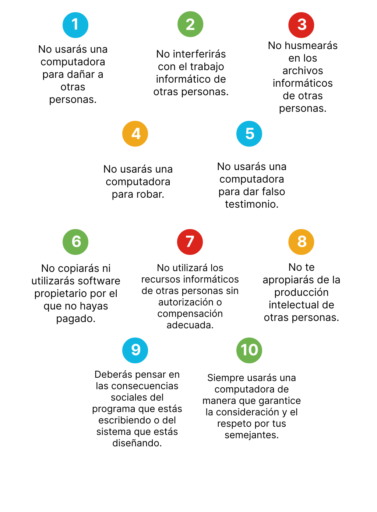

<a href="./00-Curso.md"><< Menú principal del módulo</a>

# Pruebas de seguridad de red
# Evaluaciones de seguridad
## Escáneres de vulnerabilidades
Un escáner de vulnerabilidades evalúa las computadoras, los sistemas informáticos, las redes o las aplicaciones en busca de debilidades. Los escáneres de vulnerabilidades ayudan a automatizar la auditoría de seguridad escaneando la red en busca de riesgos de seguridad y produciendo una lista prioritaria para abordar las debilidades.

Un escáner de vulnerabilidades busca los siguientes tipos de vulnerabilidades:
* Uso de contraseñas predeterminadas o contraseñas comunes.
* Parches faltantes.
* Puertos abiertos.
* Errores en la configuración del software y los sistemas operativos.
* Direcciones IP activas, incluyendo dispositivos inesperados conectados

El escáner de vulnerabilidades es clave para identificar vulnerabilidades, configuraciones incorrectas y la falta de controles de seguridad para las organizaciones con redes que incluyen segmentos, routers, firewalls, servidores y otros dispositivos.

Los escáneres de vulnerabilidades más utilizados en el mercado incluyen Nessus, Retina, Core Impact y GFI LanGuard. Sus funciones incluyen:
* Realizar auditorías de cumplimiento.
* Proporcionar parches y actualizaciones.
* Identificar configuraciones incorrectas.
* Compatibilidad con dispositivos móviles e inalámbricos.
* Rastrear malware.
* Identificar los datos sensibles.

## Tipos de escaneos
Al momento de evaluar un escáner de vulnerabilidades, observe cómo se clasifica su precisión, confiabilidad, escalabilidad y elaboración de informes. Puede elegir un analizador de vulnerabilidades basado en software o basado en la nube.
* __Categorías__. Los escáneres de vulnerabilidad se dividen en varias categorías:
	* Los __escáneres de red__ analizan los hosts en busca de puertos abiertos, enumeran información sobre usuarios y grupos y buscan vulnerabilidades conocidas en la red.
	* Los __escáneres de aplicaciones__ acceden al código fuente de la aplicación para probar una aplicación desde el interior (no ejecutan la aplicación).
	* Los __escáneres de aplicaciones web__ identifican vulnerabilidades en las aplicaciones web.
* __Escaneos intrusivos y con credenciales__. Los escaneos intrusivos intentan aprovechar vulnerabilidades e incluso pueden inutilizar el objetivo, mientras que un análisis no intrusivo intentará no causar daño al objetivo.
En un escaneos con credenciales, los nombres de usuario y las contraseñas proporcionan acceso autorizado a un sistema, lo que permite que el escáner recopile más información. Los escaneos sin credenciales son menos invasivos y ofrecen un punto de vista externo.
Sin embargo, todos los tipos de escáner pueden identificar erróneamente una vulnerabilidad donde no existe ninguna. Esto se conoce como falso positivo, mientras que no identificar una vulnerabilidad existente es un falso negativo. Los escaneos con credenciales arrojan menos falsos positivos y menos falsos negativos.
Debe revisar todos los registros y las configuraciones para solucionar las vulnerabilidades que requieren atención.

## Utilidades de diagnóstivo de la línea de comandos
Hay varias herramientas de la línea de comandos que se pueden utilizar para evaluar la posición de seguridad de una organización.
* __ipconfig__ muestra la configuración de TCP/IP: dirección IP, máscara de red, puerta de enlace predeterminado, DNS de información de MAC. (`ifconfig` es el equivalente de Mac/Linux).
* __ping__ prueba la conectividad de red mediante el envío de una solicitud ICMP a un host y determina si una ruta está disponible para un host.
* __arp__ proporciona una tabla que mapea direcciones MAC conocidas a su dirección IP asociada y es una manera rápida de encontrar la dirección MAC de un dispositivo final.
* __tracert__ rastrea la ruta que toma un paquete hasta un destino y registra los saltos en el camino, lo que ayuda a localizar dónde se detiene un paquete (`traceroute` es el equivalente de Mac/Linux).
* __nslookup__ consulta un servidor DNS pàra ayudar a solucionar problemas de una base de datos DNS (`dig` es el equivalente de Mac/Linux).
* __netstat__ muestra todos los puertos que escucha una computadora y puede determinar las conexiones activas.
* __nbtstat__ ayuda a solucionar problemas de resolución de nombres NetBIOS en un sistema Windows.
* __nmap__ se utiliza en auditorías de seguridad. Localiza hosts de red, detecta sistemas operativos e identifica servicios.
* __netcat__ recopila información de las conexiones de red TCP y UDP y puede utilizarse para escaneo de puertos, monitoreo, captura de banners y copia de archivos.
* __hping__ ensambla y analiza paquetes, y se utiliza para el escaneo de puertos, detección de rutas, identificación de SO y pruebas de firewall.

## Automatización de la seguridad
Veamos ahora cierta información sobre los enfoques automatizados de Información de Seguridad y Gestión de Eventos (SIEM) y Orquestación de Automatización y Respuesta (SOAR).

### SIEM
Los sistemas de Información de Seguridad y Gestión de Eventos (SIEM) utilizan recopiladores de registros para agregar datos de registros de fuentes como dispositivos de seguridad, dispositivos de red, servidores y aplicaciones. Los registros pueden generar muchos eventos en un día, por lo que los sistemas SIEM ayudan a reducir el volumen de eventos mediante la combinación de eventos similares para reducir la carga de datos del evento. SIEM identifica las desviaciones de la norma y luego toma las medidas correspondientes.

Los objetivos de un sistema SIEM para el monitoreo de la seguridad son:
* Identificar amenazas internas y externas.
* Supervisor la actividad y el uso de recursos.
* Realizar informes de cumplimiento para las auditorías.
* Soportar respuesta a incidentes.

Cuando el sistema SIEM detecta un problema potencial, puede registrar información adicional, generar una alerta e instruir a otros controles de seguridad para detener el progreso de una actividad. Los sistemas avanzados de SIEM incluyen análisis de comportamiento de usuarios y entidades que buscan patrones que dependen del sentimiento humano para reconocer una amenaza antes de que se convierta en una amenaza.

La cantidad de datos registrados de sistemas críticos es una consideración importante al implementar un sistema SIEM, ya que usted debe revisar los informes generados. Los sistemas SIEM son costosos de adquirir y mantener, y solo son rentables si la organización genera millones de eventos en un día.

### SOAR
Las herramientas de Orquestación de Automatización y Respuesta (SOAR) permiten que una organización recopile datos sobre amenazas de seguridad de diversas fuentes y responda a eventos de bajo nivel sin intervención humana. SOAR tiene tres funcionalidades importantes:
* Administración de amenazas y vulnerabilidad:
* Respuesta ante incidentes de seguridad:
* Automatización de las operaciones de seguridad:

Una organización puede integrar SOAR en su solución SIEM.

## Packet Tracer - Uso de comandos de diágnostico
* <a href="./notes/pt_comandos_diagnostico.md" target="_blank">Uso de comandos de diágnostico</a>

# Técnicas de pruebas de seguridad de la red
## Seguridad de las operaciones
La seguridad de las operaciones se ocupa de las prácticas diarias necesarias para primero implementar y luego mantener un sistema seguro. Todas las redes son vulnerables a los ataques si la planificación, la implementación, las operaciones y el mantenimiento de la red no cumplen con las prácticas de seguridad operacional.

La seguridad de las operaciones comienza con el proceso de planificación e implementación de una red. Durante estas fases, el equipo de operaciones analiza los diseños, identifica riesgos y vulnerabilidades y realiza las adaptaciones necesarias. Las tareas operativas reales comienzan después de configurar la red e incluyen el mantenimiento continuo del entorno. Estas actividades permiten que el entorno, los sistemas y las aplicaciones sigan ejecutándose de manera correcta y segura.

Algunas técnicas de pruebas de seguridad son predominantemente manuales, y otras están altamente automatizadas. Independientemente del tipo de prueba, el personal que configura y realiza las pruebas de seguridad debe tener conocimientos significativos de seguridad y de redes en estas áreas:
* Sistemas operativos
* Programación básica
* Protocolos de red, como TCP/IP
* Vulnerabilidades de la red y mitigación de riesgos
* Fortalecimiento de dispositivos
* Firewalls
* IPS

## Probando y evaluando la seguridad de la red
La eficacia de una solución de seguridad de operaciones se puede probar sin esperar a que se produzca una amenaza real. Las pruebas de seguridad de la red lo hacen posible. Las pruebas de seguridad de la red se realizan en una red para garantizar que todas las implementaciones de seguridad funcionen como se espera. Por lo general, las pruebas de seguridad de la red se realizan durante la implementación y las etapas operativas, después de que el sistema se haya desarrollado, instalado e integrado.

Las pruebas de seguridad proporcionan información sobre diversas tareas administrativas, como el análisis de riesgos y la planificación de contingencias. Es importante documentar los resultados de las pruebas de seguridad y ponerlas a disposición del personal que participa en otras áreas de TI.

Durante la etapa de implementación, se realizan pruebas de seguridad en partes específicas de la red. Después de que una red está completamente integrada y operativa, se realiza una Prueba y Evaluación de Seguridad (ST&E). Un ST&E es un examen de las medidas de protección que se implementan en una red operativa.

Los objetivos de ST&E incluyen los siguientes:
* Descubrir fallas operativas, de diseño y de implementación que podrían conducir a la violación de la política de seguridad.
* Determinar la idoneidad de los mecanismos de seguridad, las garantías y las propiedades del dispositivo para aplicar la política de seguridad.
* Evaluar el grado de uniformidad entre la documentación del sistema y su implementación.

Las pruebas deben repetirse periódicamente y cada vez que se realice un cambio en el sistema. Para los sistemas de seguridad que protegen la información crítica o los hosts que están expuestos a amenazas constantes, las pruebas de seguridad deben realizarse con más frecuencia.

## Tipos de pruebas de red
Después de que una red esté operativa, debe acceder a su estado de seguridad. Se pueden realizar muchas pruebas de seguridad para evaluar el estado operativo de la red:

* __Pruebas de penetración__: las pruebas de penetración de la red simulan ataques de fuentes maliciosas. El objetivo es determinar la viabilidad de un ataque y las posibles consecuencias si se produjera uno. Algunas pruebas de penetración pueden implicar el acceso a las instalaciones de un cliente y el uso de habilidades de ingeniería social para evaluar su estado general de seguridad.
* __Escaneo de red__: incluye software que puede hacer ping a las computadoras, escanear para detectar puertos TCP y mostrar qué tipos de recursos están disponibles en la red. Algunos software de escaneo también pueden detectar nombres de usuario, grupos y recursos compartidos. Los administradores de redes pueden utilizar esta información para fortalecer sus redes.
* __Análisis de vulnerabilidades__: incluye software que puede detectar posibles debilidades en los sistemas probados. Estas debilidades pueden incluir una configuración incorrecta, contraseñas en blanco o predeterminadas, o posibles objetivos de ataques de denegación de servicio. Algunos software permiten que los administradores intenten inutilizar el sistema a través de la vulnerabilidad identificada.
* __Descifrado de contraseña__: esto incluye el software que se utiliza para probar y detectar contraseñas débiles que deben cambiarse. Las políticas de contraseña deben incluir pautas para evitar contraseñas débiles.
* __Revisión de registros__: los administradores de sistemas deben revisar los registros de seguridad para identificar posibles amenazas a la seguridad. El software de filtrado para analizar archivos de registro extensos se debe utilizar para detectar actividad anormal a investigar.
* __Verificadores de integridad__: un sistema de verificación de integridad detecta e informa sobre cambios en el sistema. La mayor parte del monitoreo se centra en el sistema de archivos. Sin embargo, algunos sistemas de verificación pueden informar sobre actividades de inicio y cierre de sesión.
* __Detección de virus__: se debe utilizar un software de detección de virus o antimalware para identificar y eliminar virus informáticos y otros tipos de malware.

__Nota__: Otras pruebas, incluidas el Wardialng y Wardriving, se consideran descontinuadas, pero aún deben tenerse en cuenta en las pruebas de red.

## Aplicando los resultados de la prueba de la red
Los resultados de las pruebas de seguridad de la red se pueden utilizar de varias maneras:
* Para definir las actividades de mitigación para solventar las vulnerabilidades identificadas.
* Como punto de referencia para rastrear el progreso de una organización para cumplir con los requisitos de seguridad.
* Para evaluar el estado de implementación de los requisitos de seguridad del sistema.
* Realizar análisis de costos y beneficios para mejorar la seguridad de la red.
* Para mejorar otras actividades, como evaluaciones de riesgos, certificación y autorización (C&A), y esfuerzos de mejora del rendimiento.
* Como punto de referencia para la acción correctiva.

# Herramientas de pruebas de seguridad de la red
## Herramientas de pruebas de red
Hay muchas herramientas disponibles para probar la seguridad de los sistemas y las redes. Algunas de estas herramientas son de código abierto, mientras que otras son herramientas comerciales que requieren licencias.

Las herramientas de software que pueden utilizarse para realizar pruebas de red incluyen:
* __Nmap/Zenmap__ - Se utiliza para detectar computadoras y sus servicios en una red y, por lo tanto, crear un mapa de la red.
* __SuperScan__ - Este software de análisis de puertos está diseñado para detectar puertos TCP y UDP abiertos, determinar qué servicios se ejecutan en esos puertos y ejecutar consultas, como búsquedas de whois, ping, traceroute y nombres de host.
* __SIEM (Información de Seguridad y Gestión de Eventos)__ - Es una tecnología utilizada en las organizaciones empresariales para proporcionar informes en tiempo real y análisis a largo plazo de eventos de seguridad.
* __GFI LANguard__ - Es un escáner de red y de seguridad que detecta vulnerabilidades.
* __Tripwire__ - Esta herramienta evalúa y valida las configuraciones de TI en relación con las políticas internas, los estándares de cumplimiento y las mejores prácticas de seguridad.
* __Nessus__ - Se trata de un software de análisis de vulnerabilidades, que se centra en el acceso remoto, las configuraciones incorrectas y la denegación de servicio contra la pila de TCP/IP.
* __L0phtCrack__ - Es una aplicación de auditoría y recuperación de contraseñas.
* __Metasploit__ - Esta herramienta proporciona información sobre vulnerabilidades y ayuda en las pruebas de penetración y el desarrollo de firmas de IDS.

__Nota: Las herramientas de prueba de red evolucionan a un ritmo rápido. La lista anterior incluye herramientas heredadas y su intención es proporcionar un conocimiento de los diferentes tipos de herramientas disponibles.

## Nmap y Zenmap
Nmap es un escáner de bajo nivel de uso general que está disponible para el público. Tiene una variedad de características excelentes que pueden utilizarse para el reconocimiento y el mapeo de redes.

La funcionalidad básica de Nmap permite al usuario realizar varias tareas, de la siguiente manera:
* Escaneo clásico de puertos TCP y UDP - busca diferentes servicios en un host.
* Barrido clásico de puertos TCP y UDP - busca el mismo servicio en varios hosts.
* Escaneo y barrido sigiloso de puertos TCP y UDP - Esto es similar a los análisis y barridos clásicas, pero más difícil de detectar por el host de destino o IPS.
* Identificación remota del sistema operativo - Esto también se conoce como identificación del sistema operativo.

Las funciones avanzadas de Nmap incluyen análisis de protocolo, conocido como análisis de puertos de Capa 3. Esta función identifica el soporte de protocolo de Capa 3 en un host. Entre los ejemplos de protocolos que se pueden identificar se incluyen GRE y OSPF.

Si bien Nmap puede utilizarse para pruebas de seguridad, también puede utilizarse con fines maliciosos. Nmap tiene una función adicional que le permite utilizar hosts de señuelo en la misma LAN que el host de destino para enmascarar el origen del análisis.

Nmap no tiene características de capa de aplicación y se ejecuta en UNIX, Linux, Windows y OS X. Hay disponibles versiones de consola y gráficas. El programa Nmap y la GUI de Zenmap se pueden descargar de Internet.

## SuperScan
SuperScan es una herramienta de análisis de puertos de Microsoft Windows. Se ejecuta en la mayoría de las versiones de Windows y requiere privilegios de administrador.

SuperScan versión 4 tiene una serie de características útiles:
* Velocidad de escaneo ajustable.
* Soporte para rangos de IP ilimitados.
* Detección de host mejorada mediante varios métodos de ICMP.
* Escaneo de TCP SYN.
* Escaneo UDP (dos métodos).
* Generación de informes HTML simple.
* Análisis del puerto de origen.
* Resolución rápida de nombre de host.
* Amplias capacidades de captura de anuncios.
* Base de datos integrada masiva con descripción de la lista de puertos.
* Aleatorización del orden de escaneo de IP y de puertos.
* Una selección de herramientas útiles, como ping, traceroute y whois.
* Amplia capacidad de enumeración de hosts de Windows.

Las herramientas, como Nmap y SuperScan, pueden proporcionar pruebas de penetración eficaces en una red y determinar las vulnerabilidades de la red, a la vez que ayudan a anticipar posibles mecanismos de ataque. Sin embargo, las pruebas de red no pueden preparar a un administrador de red para cada problema de seguridad.

## SIEM
Información de Seguridad y Gestión de Eventos (SIEM) es una tecnología utilizada en las organizaciones empresariales para proporcionar informes en tiempo real y análisis a largo plazo de eventos de seguridad. SIEM evolucionó a partir de dos productos previamente separados: Administración de Información de Seguridad (SIM) y Administración de Eventos de Seguridad (SEM). SIEM puede implementarse como software, integrado con Cisco Identity Services Engine (ISE) o como servicio administrado.

SIEM combina las funciones esenciales de SIM y SEM para brindar:
* __Correlación__. Analiza registros y eventos de diferentes sistemas o aplicaciones, lo que acelera la detección de las amenazas de seguridad y la capacidad de reacción ante ellas.
* __Agregación__. Esta función reduce el volumen de los datos de eventos mediante la consolidación de registros de eventos duplicados.
* __Análisis forense__. - La capacidad de buscar registros de eventos de fuentes en toda la organización proporciona información más completa para el análisis forense.
* __Retención__ - Los registros permiten ver los datos sobre eventos correlacionados y sgregados mediante monitoreo en tiempo real y resúmenes a largo plazo.

SIEM brinda detalles sobre el origen de actividad sospechosa, incluyendo:
* Información del usuario (nombre, estado de autenticación, ubicación, grupo de autorización, estado de cuarentena)
* Información del dispositivo (fabricante, modelo, versión del sistema operativo, dirección MAC, método de conexión a la red y ubicación)
* Información de postura (cumplimiento del dispositivo con la política de seguridad corporativa, versión de antivirus, parches del SO, cumplimiento de la política de administración de dispositivos móviles).

Con esta información, los ingenieros de seguridad de la red pueden evaluar rápidamente y con precisión la importancia de cualquier evento de seguridad y de responder las preguntas criticas:
* ¿Quién está asociado con este evento?
* ¿Es un usuario importante con acceso a la propiedad intelectual o a la información confidencial?
* ¿El usuario está autorizado para acceder a ese recurso?
* ¿El usuario tiene acceso a otros recursos delicados?
* ¿Qué clase de dispositivo se está utilizando?
* ¿Este evento representa un posible problema de cumplimiento?

# Pruebas de penetración
## Pruebas de penetración
Las pruebas de penetración son una forma de probar las áreas de debilidad en los sistemas mediante el uso de diversas técnicas maliciosas. Una prueba de penetración simula los métodos que un atacante usaría para obtener acceso no autorizado a una red y comprometer los sistemas, y permite que una organización comprenda cuán bien toleraría un ataque real.

Es importante tener en cuenta que las pruebas de penetración no son lo mismo que las pruebas de vulnerabilidad, que sólo identifican problemas potenciales. Las pruebas de penetración implican piratear un sitio web, una red o un servidor con el permiso de una organización para intentar obtener acceso a los recursos mediante diversos métodos que utilizarían los piratas informáticos reales.

Uno de los motivos principales por los que una organización utiliza las pruebas de penetración es para buscar y corregir las vulnerabilidades antes de que lo hagan los ciberdelincuentes. La prueba de penetración también se conoce como hackeo ético.

* La __pruebas de caja negra__ son las que consumen menos tiempo y son las menos costosas. Al realizar pruebas de caja negra, el especialista no tiene conocimiento del funcionamiento interno del sistema, e intenta atacarlo desde el punto de vista de un usuario habitual.
* Las pruebas de caja gris son una combinación de pruebas de caja negra y caja blanca. El especialista tendrá un conocimiento limitado sobre el sistema, por lo que es un entorno parcialmente conocido, lo que brinda cierta ventaja a estos intentos de hacking.
* La __prueba de caja blanca__  es la que lleva más tiempo y es más costosa porque la realiza un especialista con conocimiento del funcionamiento del sistema. Por lo tanto, es un entorno conocido cuando intentan hackearlo, emulando un ataque malicioso de una persona interna o de alguien que ha logrado obtener dicha información de antemano, en la etapa de reconocimiento.

## Fases de penetración
Hay cuatro fases que conforman una prueba de penetración.
* __Fase 1__: Planificación. Establece las reglas de participación para realizar la prueba.
* __Fase 2__: Detección. Realiza un reconocimiento del objetivo para obtener información. Esto puede incluir:
	* Las técnicas pasivas, que no requieren una participación activa en el sistema de destino y se denominan huellas, por ejemplo, pueden consultar el sitio web de la organización u otras fuentes públicas para obtener información.
	* Reconocimiento activo, como escaneo de puertos, que requiere una participación activa con el objetivo.
* __Fase 3__: Ataque. En esta fase, se busca obtener acceso o penetrar el sistema mediante la información recopilada en la fase anterior. El probador intenta obtener privilegios mayores y quizás profundizar en la red a través del movimiento lateral. Para moverse lateralmente por la red, el probador debe pivotar a través de varios sistemas. El probador puede intentar instalar herramientas adicionales o plantar una puerta trasera; este proceso se conoce como persistencia. Luego, el probador limpiará el sistema y eliminará cualquier señal que haya quedado.
* __Fase 4__: Elaboración de informes. En esta fase, el probador entrega a la organización documentación detallada que incluye las vulnerabilidades identificadas, las medidas tomadas y los resultados.

## Tipos de ejercicios
Algunas organizaciones crean equipos que compiten para realizar ejercicios de penetración que son más extensos que una prueba de penetración.

Por ejemplo, en tal situación, puede haber tres o cuatro equipos:
* El equipo rojo es el adversario, intenta atacar el sistema pasando desapercibido.
* Los miembros del equipo azul son los defensores e intentan frustrar los esfuerzos del equipo rojo.
* El equipo blanco es un equipo neutral que definir los objetivos y las reglas y supervisa el ejercicio. Los miembros del equipo blanco son menos técnicos, pero poseen conocimientos sobre gestión y cumplimiento. El equipo blanco es el árbitro de este ejercicio.
* A veces, también hay un equipo morado, donde los miembros del equipo rojo y azul trabajan juntos para identificar vulnerabilidades y explorar formas de mejorar los controles.

	

## Analizador de paquetes
Los analizadores de paquetes, o analizadores de protocolos de paquetes, interceptan y registran el tráfico de red. Realizan las siguientes funciones — ya sea con fines legítimos, como la resolución de problemas o con fines ilegítimos, como comprometer los datos:
* Análisis de problemas de red.
* Detección de intentos de intrusión en la red.
* Aislamiento del sistema explotado.
* Registro del tráfico.
* Detección de usos indebidos de la red.

## Resultado del analizador de protocolos
El análisis de paquetes es como espiar a alguien.

Sucede cuando alguien está examinando todo el tráfico de red a medida que pasa a través de su NIC, independientemente de si el tráfico está dirigido a ellos o no. Los delincuentes logran realizar análisis de paquetes de la red utilizando software, hardware o una combinación de ambos.

La imagen muestra cómo el análisis de paquetes puede ver todo el tráfico de la red o apuntar a un protocolo, servicio o incluso una cadena de caracteres específicos, como un nombre de usuario o una contraseña. Algunos analizadores de paquetes de la red observan todo el tráfico y modifican todo el tráfico o parte de este.

La seguridad física es importante para evitar la introducción de analizadores de paquetes en la red interna, pero el análisis no sólo se usa con fines maliciosos. También puede ser usado por administradores de red, los cuales analizan el tráfico de la red, identifican problemas con el ancho de banda y solucionan otros problemas de la red usando analizadores de paquetes. 

## Práctica de laboratorio - Uso de Wireshark para comparar el tráfico de Telnet y SSH
* <a href="./notes/lab_telnet_ssh_wireshark.md" target="_blank">Uso de Wireshark para comparar el tráfico de Telnet y SSH</a>

# Resumen
## Evaluaciones de seguridad
Un escáner de vulnerabilidades evalúa las computadoras, los sistemas informáticos, las redes o las aplicaciones en busca de debilidades. Los escáneres de vulnerabilidades más utilizados en el mercado incluyen Nessus, Retina, Core Impact y GFI LanGuard. Los escáneres de vulnerabilidad pueden ser escáneres de red, escáneres de aplicaciones o escáneres de aplicaciones web. Los escaneos intrusivos intentan aprovechar vulnerabilidades e incluso pueden bloquear el objetivo.escaneos En un escaneos con credenciales, los nombres de usuario y las contraseñas proporcionan acceso autorizado a un sistema, lo que permite que el escáner recopile más información. Las herramientas de línea de comandos que se pueden utilizar para evaluar la vulnerabilidad incluyen ipconfig, ping, arp, tracert, nslookup, netstat, nbtstat, nmap, netcat y hping. Los sistemas SIEM utilizan recopiladores de registros para agregar datos de registros de fuentes como dispositivos de seguridad, dispositivos de red, servidores y aplicaciones. Las herramientas SOAR permiten que una organización recopile datos sobre amenazas de seguridad de diversas fuentes y responda a eventos de bajo nivel sin intervención humana.

## Técnicas de pruebas de seguridad de la red
La seguridad de las operaciones se ocupa de las prácticas diarias necesarias para primero implementar y luego mantener un sistema seguro. La seguridad de las operaciones comienza con el proceso de planificación e implementación de una red. Por lo general, las pruebas de seguridad de la red se realizan durante la implementación y las etapas operativas, después de que el sistema se haya desarrollado, instalado e integrado. Se realiza en una red para garantizar que todas las implementaciones de seguridad funcionen como se espera. Un ST&E es un examen de las medidas de protección que se implementan en una red operativa. Los tipos de pruebas de red incluyen: penetración, escaneo de red, análisis de vulnerabilidad, descifrado de contraseñas, revisión de registros, verificadores de integridad y detección de virus.

## Herramientas de pruebas de seguridad de la red
Las herramientas de software que pueden utilizarse para realizar pruebas de red incluyen: Nmap / Zenmap, SuperScan, SIEM, GFI LANguard, Tripwire, Nessus, L0phtCrack y Metasploit. Nmap proporciona el escaneo y barrido clásico de puertos TCP y UDP, escaneo y barridos sigiloso de puertos UDP y TCP, e identificación de sistema operativo remoto. SuperScan es una herramienta de análisis de puertos de Microsoft Windows. Se ejecuta en la mayoría de las versiones de Windows y requiere privilegios de administrador. SIEM proporciona correlación, agregación, análisis forense y retención.

## Pruebas de penetración
Las pruebas de penetración son una forma de probar las áreas de debilidad en los sistemas mediante el uso de diversas técnicas maliciosas. Una prueba de penetración simula los métodos que un atacante usaría para obtener acceso no autorizado a una red y comprometer los sistemas, y permite que una organización comprenda cuán bien toleraría un ataque real. Hay cuatro fases que conforman una prueba de penetración: 1 Planificación, 2. Detección, 3. Ataque, y 4. Elaboración de Informes Algunas organizaciones crean equipos que compiten para realizar ejercicios de penetración que son más extensos que una prueba de penetración. Generalmente hay un equipo rojo (que intenta atacar el sistema) y un equipo azul (que intenta defender el sistema). Los analizadores de paquetes, o analizadores de protocolos de paquetes, interceptan y registran el tráfico de red. El análisis de paquetes no solo se utiliza con fines maliciosos. También puede ser usado por administradores de red, los cuales analizan el tráfico de la red, identifican problemas con el ancho de banda, y solucionan otros problemas de la red usando analizadores de paquetes.

# Enlaces de interés
 
 
 
 
 
 
 
 
 
 
 
<a href="#pruebas-de-seguridad-de-red">⬆️</a>
<a href="./00-Curso.md"><< Menú principal del módulo</a>