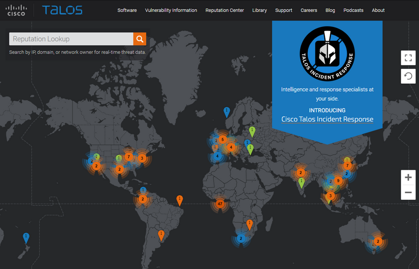

<a href="./00-Curso.md"><< Menú principal del módulo</a>

# Inteligencia contra las amenazas
# Fuentes de información
## Comunidades de inteligencia de la red

<table>
	<tr><th>Organización<th>Descripción
	<tr><td>SANS<td>Los recursos del SysAdmin, Audit, Network, Security (SANS) Institute son en gran medida gratuitos previa solicitud e incluyen: 
		<ul>
			<li>Internet Storm Center: el popular sistema de alerta temprana de Internet
			<li>NewsBites, el resumen semanal de artículos de noticias sobre seguridad informática.
			<li>@RISK, el resumen semanal de vectores de ataque recién descubiertos, vulnerabilidades con explotaciones activas y explicaciones de como funcionaron los ataques recientes
			<li>Alertas de seguridad flash
			<li>Sala de lectura: más de 1200 trabajos de investigación originales y galardonados.
			<li>SANS también desarrolla cursos de seguridad.
		</ul>
	<tr><td>Mitre<td>Mitre Corporation mantiene una lista de vulnerabilidades y exposiciones comunes (CVE) que utilizan organizaciones de seguridad destacadas.
	<tr><td>FIRST<td>Forum of Incident Response and Security Teams (FIRST) es una organización de seguridad que reúne una variedad de equipos de respuesta a incidentes de seguridad informática de organizaciones qubernamentales, comercia educativas para fomentar la cooperación y la coordinación en el intercambio de información, la prevención de incidentes y la reacción rápida.
	<tr><td>SecurityNewsWire<td>Un portal de noticias de seguridad que agrega las últimas noticias relacionadas con alertas, exploits y vulnerabilidades.
	<tr><td>(ISC)2<td>El Consorcio Internacional de Certificación de Seguridad de los Sistemas de Información (ISC2) ofrece productos educativos y servicios profesionales independientes del proveedor a más de 75 000 profesionales de la industria en más de 135 países.
	<tr><td>CIS<td>El Centro para la Seguridad de Internet (CIS) es un punto focal para la prevención, protección, respuesta y recuperación de amenazas cibernéticas para los gobiernos estatales, locales, tribales y territoriales (SLTT) a través de Multi-State Information Sharing and Analysis Center (MSISAC). EI MS-ISAC ofrece advertencias y avisos de amenazas cibernéticas las 24 horas del día, los 7 días de la semana, identificación de vulnerabilidades y mitigación y respuesta a incidentes
.</table>

Para ser siempre eficaz, un profesional de seguridad de la red debe hacer lo siguiente:
* __Mantenerse al tanto de las amenazas más recientes__.  Esto incluye suscribirse a información en tiempo real sobre amenazas, consultar periódicamente sitios web relacionados con la seguridad, seguir blogs y podcasts sobre seguridad, y mucho más.
* __Continuar mejorando sus habilidades__. Esto incluye asistir a capacitaciones, talleres y conferencias relacionados con la seguridad.

__Nota__: La seguridad de la red tiene una curva de aprendizaje muy pronunciada y exige un compromiso con el desarrollo profesional constante.

## Informes sobre ciberseguridad de Cisco
Algunos recursos para ayudar a los profesionales a estar al tanto de las amenazas son: El Informe Anual de Ciberseguridad de Cisco y el de Medio Año de Cisco. Estos informes brindan datos actualizados sobre el estado de preparación para la seguridad, análisis de expertos sobre las vulnerabilidades más importantes, los factores detrás de la aparición de ataques mediante adware y spam, y mucho más.

Los analistas de Ciberseguridad deben suscribirse a estos informes y leerlos para saber cómo los agentes de amenaza están atacando sus redes, y qué puede hacerse para mitigar estos ataques.

Busque en Internet para localizar y descargar los Informes de Ciberseguridad de Cisco desde el sitio web de Cisco.

## Blogs y Podcasts de seguridad
Otro método para mantenerse al día sobre las amenazas más nuevas son los blogs y podcasts. Los blogs y podcasts también brindan asesoramiento, investigación y técnicas de mitigación recomendadas.

Hay varios blogs y podcasts de seguridad disponibles que un analista de ciberseguridad debería seguir para conocer las últimas amenazas, vulnerabilidades y ataques.

Cisco proporciona blogs sobre temas relacionados con la seguridad, redactados por varios expertos del sector y del Grupo Talos de Cisco. Busque blogs de seguridad de Cisco para localizarlos. También puede suscribirse para recibir notificaciones de nuevos blogs por correo electrónico. Cisco Talos también ofrece una serie de más de 80 podcasts que se pueden reproducir desde Internet o descargar en el dispositivo de su elección.

## Práctica de laboratorio - Evalúe informes de ciberseguridad
* <a href="./notes/lab_evaluar_informes_ciberseguridad.md" target="_blank">Evalúe informes de ciberseguridad</a>

# Servicios de inteligencia de amenazas
## Cisco Talos
Los servicios de inteligencia de amenazas permiten el intercambio de información, como vulnerabilidades, indicadores de riesgo (IOC, Indicator of compromise) y técnicas de mitigación. Esta información no solo se comparte con el personal, sino también con los sistemas de seguridad. A medida que surgen las amenazas, los servicios de inteligencia de amenazas crean y distribuyen reglas de firewalls e IOC para los dispositivos que se han suscrito al servicio.

	

Uno de estos servicios es Cisco Talos Threat Intelligence Group (Grupo de Inteligencia de Amenazas), que se muestra en la imagen. Cisco Talos es uno de los equipos de inteligencia de amenazas comerciales más grandes del mundo, compuesto por investigadores, analistas e ingenieros de clase mundial. El objetivo de Talos es ayudar a proteger los usuarios, datos e infraestructura empresariales de adversarios activos. El equipo de Talos recopila información sobre las amenazas activas, existentes y emergentes. Luego, proporciona a sus suscriptores una protección completa contra ataques y malware.

Los productos de seguridad de Cisco pueden usar la inteligencia de amenazas de Talos en tiempo real para brindar soluciones de seguridad rápidas y efectivas. Cisco Talos también ofrece software, servicios, recursos y datos gratuitos. Talos mantiene los conjuntos de reglas de detección de incidentes de seguridad para las herramientas de seguridad de red: Snort.org, ClamAV y SpamCop.

## FireEye
FireEye es otra empresa de seguridad que ofrece servicios para ayudar a las empresas a proteger sus redes. FireEye utiliza un enfoque triple que combina la inteligencia de seguridad, la experiencia en seguridad y la tecnología.

FireEye ofrece SIEM y SOAR con la plataforma de seguridad Helix , que utiliza análisis de comportamiento y detección avanzada de amenazas y cuenta con el apoyo de la red mundial de inteligencia contra Amenazas FireEye Mandiant. Helix es una plataforma de operaciones de seguridad alojada en la nube que combina diversas herramientas de seguridad e información sobre amenazas en una sola plataforma.

Este sistema bloquea ataques de vectores de ataque web y de correo electrónico, y malware latente que reside en recursos compartidos de archivos. Puede bloquear malware avanzado que fácilmente supera las defensas tradicionales basadas en firmas y pone en riesgo la mayoría de las redes empresariales. Aborda todas las etapas del ciclo de vida de un ataque con un motor sin firma que usa análisis de ataques con estado para detectar amenazas en el día cero.

Para ver los recursos de inteligencia de seguridad que ofrece FireEye, buscar "FireEye" en internet.

## Intercambio automático de indicadores
El Departamento de Seguridad Nacional de Estados Unidos (DHS) ofrece un servicio gratuito llamado Intercambio Automático de Indicadores (AIS). AIS permite el intercambio en tiempo real de los indicadores de ciberamenazas (por ejemplo, direcciones IP maliciosas, la dirección del remitente de un correo electrónico de suplantación de identidad, etc.) entre el gobierno federal de EE. UU. y el sector privado.

AIS crea un ecosistema donde, apenas se reconoce una amenaza, se comparte la información inmediatamente con la comunidad para ayudar a proteger las redes de esa amenaza específica.

Busque en Internet el servicio "DHS AIS" para obtener más información.

## Base de datos de vulnerabilidades y exposiciones comunes (CVE)
El gobierno de los Estados Unidos patrocinó la Corporación MITRE para crear y mantener un catálogo de amenazas de seguridad conocidas, denominado Vulnerabilidades y exposiciones comunes (CVE, Common Vulnerabilities and Exposures). El CVE es un diccionario de nombres comunes (es decir, identificadores de CVE) de vulnerabilidades de ciberseguridad públicamente conocidas.

La Corporación MITRE definir identificadores únicos de CVE para vulnerabilidades de seguridad de la información públicamente conocidas a fin de facilitar el uso compartido de datos.

Busque "Mitre Corporation" en Internet y vea información sobre CVE

## Estándares de comunicación de inteligencia de amenazas
Las organizaciones y los profesionales de redes deben compartir información para aumentar el conocimiento sobre agentes de amenaza y los activos a los que desean obtener acceso. Numerosos estándares abiertos de uso compartido de inteligencia han evolucionado para permitir la comunicación en múltiples plataformas de redes. Estos estándares permiten el intercambio de inteligencia de ciberamenazas (CTI, Cyber Threat Intelligence) en un formato legible automatizado, uniforme y que las máquinas puedan leer.

Tres estándares de uso compartido de inteligencia de amenazas son los siguientes:

* __Expresión Estructurada de Información sobre Amenazas (STIX)__. Es un conjunto de especificaciones para intercambiar información sobre ciberamenazas entre organizaciones. El estándar Cyber Observable Expression (CybOX) se ha incorporado a STIX.
* __Intercambio Automatizado y Confiable de Información de Inteligencia (TAXII)__. Es la especificación para un protocolo de la capa de aplicación que permite la comunicación de CTI por HTTPS. TAXII está diseñado para admitir STIX.
* __CybOX__. Este es un conjunto de esquema estandarizado para especificar, capturar, caracterizar y comunicar eventos y propiedades de operaciones de red que admite muchas funciones de ciberseguridad.

Estos estándares abiertos proporcionan las especificaciones que colaboran al intercambio automatizado de información de inteligencia de ciberamenazas en un formato estandarizado. Busque en Internet para obtener más información sobre STIX, TAXII y CybOX.

	

 

La Plataforma de Intercambio de Información sobre Malware (MISP, Malware Information Sharing Platform) es una plataforma de código abierto para compartir indicadores de compromiso para amenazas recién descubiertas. El MISP cuenta con el apoyo de la Unión Europea y es utilizado por más de 6.000 organizaciones de todo el mundo. MISP permite el uso compartido automatizado de IOC entre personas y máquinas mediante STIX y otros formatos de exportación.

## Plataforma de inteligencia de amenazas
Como hemos visto, hay muchas fuentes de información de inteligencia sobre amenazas, cada una de las cuales puede tener su propio formato de datos. El acceso y el uso de múltiples fuentes de información sobre amenazas puede llevar mucho tiempo. Para ayudar al personal de ciberseguridad a hacer el mejor uso de la inteligencia contra amenazas, las Plataformas de Inteligencia Contra Amenazas (TIP) han evolucionado.

Una plataforma de inteligencia contra amenazas centraliza la recopilación de datos sobre amenazas de numerosas fuentes de datos y formatos. Existen tres tipos principales de datos de inteligencia sobre amenazas. El primero corresponde a los Indicadores de Compromiso (IOC, Indicators of Compromise) El segundo corresponde a Herramientas, Técnicas y Procedimientos (TTP, tools, techniques, and procedures). El tercero corresponde a la información de reputación sobre destinos o dominios de Internet. El volumen de datos de inteligencia sobre amenazas puede ser insmenso, por lo que la plataforma de inteligencia sobre amenazas está diseñada para agregar los datos en un solo lugar y, lo que es más importante, presentar los datos en un formato comprensible y utilizable.

Las organizaciones pueden contribuir a la inteligencia contra amenazas compartiendo sus datos de intrusión a través de Internet, normalmente a través de la automatización. Muchos servicios de inteligencia contra amenazas utilizan datos de suscriptores para mejorar sus productos y mantenerse al día con el panorama de amenazas inmersas en constante cambio.

Los honeypots son redes o servidores simulados que están diseñados para atraer atacantes. La información relacionada con los ataques recopilada de los honeypots se puede compartir con los suscriptores de la plataforma de inteligencia contra amenazas. Sin embargo, alojar honeypots puede ser un riesgo. Basar un honeypot en la nube aísla el honeypot de las redes de producción. Este enfoque es una alternativa atractiva para recopilar información sobre amenazas.

## Práctica de laboratorio - Identificar inteligencia relevante de amenazas
* <a href="./notes/lab_identificar_inteligencia_amenazas.md" target="_blank">Identificar inteligencia relevante de amenazas</a>

# Resumen
## Fuentes de información

Exiten muchas organizaciones de seguridad que ofrecen servicios de inteligencia de la red. Las organizaciones de seguridad de red incluyen SANS, Mitre, FIRST, SecurityNewsWire, (ISC)2 y CIS. Debemos estar al tanto de las amenazas más recientes y seguir mejorando nuestras habilidades. El Informe Anual de Ciberseguridad de Cisco y el Informe de Ciberseguridad a mitad de año son excelentes recursos utilizables. También es útil leer blogs y escuchar podcasts.

## Servicios de inteligencia de amenazas
Los servicios de inteligencia de amenazas permiten el intercambio de información, como vulnerabilidades, indicadores de riesgo (IOC, Indicator of compromise) y técnicas de mitigación. Esta información no solo se comparte con el personal, sino también con los sistemas de seguridad. A medida que surgen las amenazas, los servicios de inteligencia de amenazas crean y distribuyen reglas de firewalls e IOC para los dispositivos que se han suscrito al servicio. Uno de estos servicios es el Grupo de Inteligencia de Amenazas Cisco Talos. FireEye es otra empresa de seguridad que ofrece servicios para ayudar a las empresas a proteger sus redes. FireEye utiliza un enfoque triple que combina la inteligencia de seguridad, la experiencia en seguridad y la tecnología. FireEye ofrece SIEM y SOAR con la plataforma de seguridad Helix, que utiliza análisis de comportamiento y detección avanzada de amenazas, y cuenta con el apoyo de la red mundial de inteligencia contra amenazas FireEye Mandiant. El Departamento de Seguridad Nacional de Estados Unidos (DHS) ofrece un servicio gratuito llamado Intercambio Automático de Indicadores (AIS) AIS permite el intercambio en tiempo real de los indicadores de ciberamenazas entre el Gobierno Federal de EE. UU. y el sector privado. El gobierno de los Estados Unidos patrocinó la Corporación MITRE para crear y mantener un catálogo de amenazas de seguridad conocidas, denominado CVE. Tres estándares comunes de intercambio de información de amenazas incluyen la Expresión Estructurada de Información sobre Amenazas (STIX), el Intercambio Automatizado y Confiable de Información de Inteligencia (TAXII) y CybOX. Estos estándares abiertos proporcionan las especificaciones que ayudan en el intercambio automatizado de información de inteligencia de ciberamenazas en un formato estandarizado.

# Enlaces de interés
 
 
 
 
 
 
 
 
 
 
 
<a href="#pruebas-de-seguridad-de-red">⬆️</a>
<a href="./00-Curso.md"><< Menú principal del módulo</a>