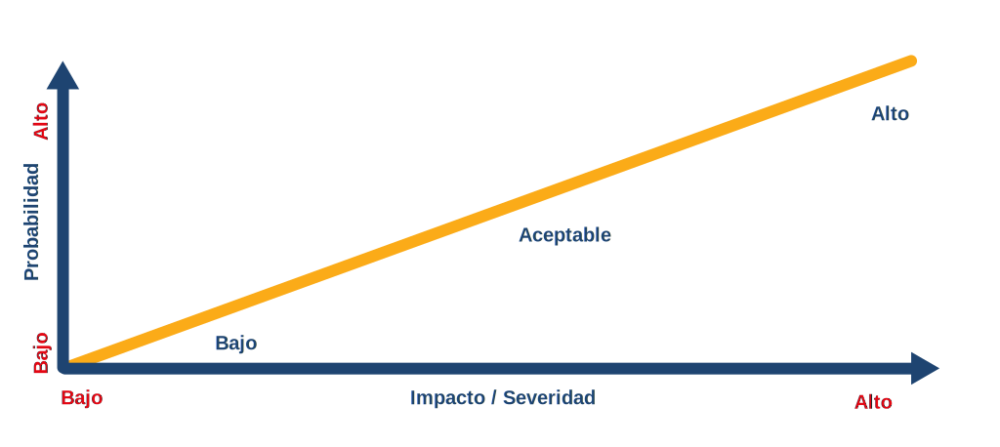
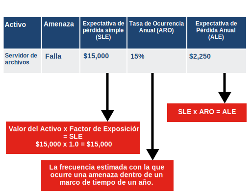
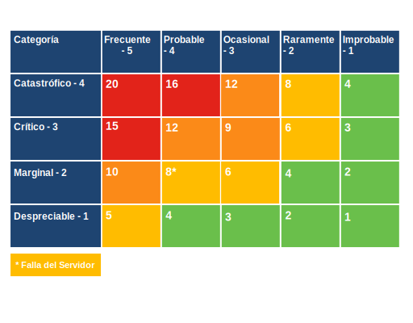

<a href="./00-Curso.md"><< Menú principal del módulo</a>

# Administración de riesgos y controles de seguridad
# Administración de riesgos
## Tipos de riesgos
El riesgo es la probabilidad de pérdida debido a una amenaza — un acto malicioso o un evento inesperado — que daña los sistemas de información o los activos de la organización.

El impacto del riesgo es el daño ocasionado por un evento que causa la pérdida de activos o la interrupción de los servicios. El objetivo de la administración de riesgos es reducir estas amenazas a un nivel aceptable e implementar controles para mantener ese nivel.  

Seguidamente se ofrece más información sobre los niveles cambiantes de amenazas que una organización debe identificar y evaluar continuamente.
* __Alto Riesgo__. Negligencia significa que no se toman medidas o controles para reducir el riesgo. La amenaza es muy alta y el costo de un incidente puede ser catastrófico.
* __Menor Riesgo__. Ejercer el debido cuidado puede ayudar a reducir el nivel de riesgo. El riesgo aún existe pero estos pasos razonables reducen una posible pérdida.
* __Riesgo aceptable__. Ejercer la diligencia debida implica tomar medidas razonables para eliminar el riesgo. Todavía existen algunos riesgos, pero se implementan varios controles para evitar posibles pérdidas.

El riesgo puede ser interno, externo o ambos. Su impacto puede afectar a toda la organización y afectar a otras entidades externas.

Promover la conciencia del riesgo dentro de la organización ayuda a los empleados a desarrollar una comprensión de los riesgos que existen, su impacto potencial y cómo la organización puede administrar esos riesgos.

## Práctica de laboratorio - Gestión de riesgos
* <a href="./notes/lab_gestion_riesgos.md" target="_blank">Gestión de riesgos</a>

## El proceso de administración de riesgos
La administración de riesgos es un proceso formal que mide el impacto de una amenaza y el costo de implementar controles o contramedidas para mitigar esa amenaza.

El riesgo no puede eliminarse por completo, pero aún puede administrarse a un nivel aceptable. Todas las organizaciones aceptan algún riesgo y el costo de una contramedida no debe ser mayor que el valor del activo que se protege.

Proceso de administración de riesgos:
* __Enmarcar el riesgo__. Identifique las amenazas a través de la organización que aumentan el riesgo. Las amenazas identificadas incluyen pérdida o daño en los procesos y productos, ataques, posibles fallos o interrupciones de los servicios, percepción negativa de la reputación de una organización, responsabilidad legal, y pérdida de propiedad intelectual.
* __Evaluar el riesgo__. Una vez que se identifica un riesgo, se lo evalúa y analiza para determinar la gravedad de la amenaza. Algunas amenazas pueden paralizar a toda una organización, mientras que otras amenazas son sólo inconvenientes menores. El riesgo se puede priorizar por el impacto financiero (un análisis cuantitativo) o el impacto a escala en la operación de una organización (un análisis cualitativo).
* __Responder el riesgo__. Desarrolle un plan de acción para reducir la exposición general al riesgo de la organización. La administración clasifica y prioriza las amenazas; un equipo determina cómo responder a cada amenaza. El riesgo se puede eliminar, mitigar, transferir o aceptar.
* __Monitorear el riesgo__. Revisar continuamente las reducciones de riesgo debido a acciones de eliminación, mitigación o transferencia. No todos los riesgos se pueden eliminar, por lo que las amenazas que se aceptan deben ser monitoreadas de cerca. Una organización puede utilizar un registro de riesgos — un programa de software o un servicio en la nube — para registrar información sobre los riesgos identificados. El registro de riesgos contiene detalles sobre el riesgo y los controles implementados o las estrategias de respuesta utilizadas.

# Evaluación de riesgos
## Tipos de fuentes de amenazas
La evaluación de amenazas es la base para la evaluación de riesgos. Una amenaza es el potencial de que una vulnerabilidad sea identificada y explotada, mientras que un vector de amenaza es la ruta que utiliza un atacante para afectar el objetivo.

Los tipos de fuentes de amenazas se clasifican de la siguiente manera y pueden ser internos o externos.
* __Adversarios__:  Amenazas de individuos, grupos, organizaciones o naciones.
* __Accidental__:  Acciones que se producen sin intención maliciosa.
* __Estructural__:  Fallas de equipos y software.
* __Ambiental__: Desastres externos que pueden ser naturales o provocados por el hombre, como incendios e  inundaciones.

## Metodología de evaluación de riesgos
Las organizaciones evalúan y examinan sus riesgos operativos realizando una evaluación de riesgos para garantizar que la administración de riesgos cumpla con todos sus objetivos comerciales.

	

* __Bajo__. Intentar determinar la probabilidad de un ataque de una fuente de amenaza humana puede ser difícil y puede implicar evaluar el nivel de destreza, el motivo, la oportunidad y el tamaño.
* __Aceptable__. Al evaluar la vulnerabilidad, factores como la facilidad de detección, la explotabilidad, el conocimiento y la detección de intrusiones juegan un papel. Utilice una combinación de datos históricos y de estimación para proporcionar la probabilidad más precisa de que se produzca un evento.
* __Alto__. Por último, determine la magnitud del impacto. Una simple medida de impacto puede variar de muy baja a muy alta o de un impacto insignificante a un impacto catastrófico.

## Análisis de riesgos
Análisis de riesgos examina los peligros que plantean los eventos provocados por la naturaleza y los humanos a los activos de la organización. Un usuario debe realizar una identificación de activos para determinar qué activos proteger.

El análisis de riesgos tiene cuatro objetivos:
1. Identificar los activos y su valor.
2. Identificar las vulnerabilidades y amenazas.
3. Cuantificar la probabilidad y el impacto de las amenazas identificadas.
4. Equilibrar el impacto de las amenazas con el costo de las contramedidas.

### Análisis de riesgo cuantitativo

	

Un análisis cuantitativo asigna números al proceso de análisis de riesgos. En este ejemplo, el valor del activo es el costo de reemplazo del servidor de archivos (el activo). El valor de un activo también puede medirse por los ingresos obtenidos a través del uso del activo.

El factor de exposición (EF) es un valor subjetivo expresado como porcentaje de la pérdida del servidor de archivos debido a una amenaza particular. Si se produce una pérdida total, el EF equivale a 1.0 (100%). 

La tasa de ocurrencia anual (ARO) es la probabilidad de que una pérdida ocurra durante el año. La ARO puede ser mayor que 100% si una pérdida ocurre más de una vez al año.

El cálculo de la expectativa de pérdida anual (ALE) brinda a la gerencia cierta orientación sobre lo que debe gastar para proteger el servidor de archivos.
 

### Análisis de riesgo cualitativo

	

El análisis de riesgo cualitativo utiliza opiniones y escenarios que trazan la probabilidad de una amenaza contra su impacto. Por ejemplo, una falla del servidor puede ser probable, pero su impacto será mínimo.

Una matriz de riesgos es una herramienta que ayuda a priorizar los riesgos para determinar para cuales de ellos debe la organización desarrollar una respuesta. Los resultados se pueden clasificar y utilizar como guía para determinar si la organización toma alguna medida.

Cuando la matriz de riesgo está codificada por colores, como se  muestra aquí,  se la denomina mapa de calor de riesgo.

## Práctica de laboratorio - Análisis de riesgos
* <a href="./notes/lab_analisis_riesgos.md" target="_blank">Análisis de riesgos</a>

## Mitigación de riesgos
La mitigación implica reducir la probabilidad o la gravedad de una pérdida por amenazas. Muchos controles técnicos mitigan el riesgo, incluidos sistemas de autenticación, permisos de archivos y los firewalls.

La organización deben comprender que la mitigación de riesgos puede tener tanto un impacto positivo como negativo en la organización. La buena mitigación de riesgos encuentra un equilibrio entre el impacto negativo de las contramedidas y los controles y el beneficio de la reducción del riesgo. 

* __Aceptar el riesgo y reevaluarlo periódicamente__. Una estrategia a corto plazo es aceptar el riesgo necesitando la creación de planes de contingencia para dicho riesgo. Las personas y las organizaciones deben aceptar el riesgo diariamente.
* __Reducir el riesgo mediante la implementación de controles__. Las metodologías modernas reducen el riesgo mediante el desarrollo incremental de software, y la provisión de parches y actualizaciones periódicas para abordar las vulnerabilidades y los errores de configuración.
* __Evitar el riesgo modificando completamente el enfoque__. Un buen plan de mitigación de riesgos puede incluir dos o más estrategias.
* __Transferir el riesgo a terceros__. Subcontratar servicios, la adquisición de seguros y la adquisición de contratos de mantenimiento son ejemplos de transferencia del riesgo. Contratar especialistas para realizar las tareas fundamentales a fin de reducir el riesgo puede ser una buena opción y producir mejores resultados con una menor inversión a largo plazo.

# Controles de seguridad
## Tipos de control
El riesgo inherente de un sistema es el riesgo que el sistema plantea inherentemente — sin ningún control de personas, procesos o tecnología.

Los controles de seguridad son salvaguardas o contramedidas que una organización implementa para evitar, detectar, contrarrestar o minimizar los riesgos de seguridad de los activos de la organización.

* __Controles administrativos__. Los controles administrativos consisten en procedimientos y políticas que una organización implementa cuando se trata con información confidencial. Estos controles determinan cómo actúan las personas.
* __Controles técnicos__. Los controles técnicos implican hardware o software implementado para administrar el riesgo y proporcionar protección.
* __Controles físicos__. Los controles físicos son mecanismos como cercas y cerraduras implementados para proteger sistemas, instalaciones, personal y recursos. Los controles físicos separan físicamente a las personas u otras amenazas de los sistemas.

## Controles de seguridad funcional
El uso  funcional  de una salvaguarda o  contramedida ayudará a determinar el motivo para elegirla e implementarla.
* __Controles preventivos__. Los controles de seguridad preventivos evitan que se produzcan actividades no deseadas o no autorizadas y/o aplican restricciones a los usuarios autorizados.
Por ejemplo, asignar privilegios específicos de usuario en un sistema es un control preventivo, ya que establece límites para evitar que ciertos usuarios accedan y realicen acciones no autorizadas. Un firewall que bloquea el acceso a un puerto o servicio que los delincuentes cibernéticos puedan atacar es también un control preventivo.
* __Controles disuasivos__. Un elemento disuasivo tiene como objetivo desalentar que algo suceda. Los profesionales de ciberseguridad y las empresas utilizan elementos disuasivos para limitar o mitigar una acción o un comportamiento — pero los controles disuasivos no pueden detenerlos por completo.
Los controles disuasivos desalientan a los ciberdelincuentes de obtener acceso no autorizado a los sistemas de información y a los datos confidenciales. Pueden ser eficaces para desalentar muchos tipos diferentes de ataques a los sistemas, así como para robar datos y propagar códigos maliciosos.
* __Controles de detección__. Los controles de detección de acceso identifican diferentes tipos de actividad no autorizada. Los controles de detección no son una medida preventiva, sino que se centran en el descubrimiento de una infracción a la seguridad una vez que ha ocurrido.
Todos los sistemas de detección tienen varias cosas en común. Buscan actividades inusuales o prohibidas y pueden ser muy simples, como un detector de movimiento o un guardia de seguridad, o complejas, como un sistema de detección de intrusiones. Los controles de detección también proporcionan métodos para grabar o alertar a los operadores del sistema sobre un posible acceso no autorizado.
* __Controles correctivos__. Los controles correctivos contrarrestan algo indeseable al restaurar el sistema a un estado de confidencialidad, integridad y disponibilidad. También pueden restaurar los sistemas a la normalidad luego de que se produzca una actividad no autorizada.
Las organizaciones establecen controles de acceso correctivos después de que un sistema experimenta una amenaza. Los ejemplos incluyen políticas de seguridad, alarmas, programas antivirus, sistemas de detección de intrusiones, puertas trampa, y planificación de la continuidad de los negocios.
* __Controles de recuperación__. Los controles de seguridad de recuperación restauran recursos, funciones y capacidades después de una violación de la política de seguridad. Los controles de recuperación pueden reparar el daño, además de detener cualquier otro daño. Estos controles tienen capacidades más avanzadas sobre los controles de acceso correctivos.
Los ejemplos de controles de recuperación incluyen operaciones de respaldo/restauración, sistemas de unidades con tolerancia a fallas, agrupación de servidores y duplicación de bases de datos.
* __Controles compensativos__. Los controles compensativos ofrecen opciones a otros controles para reforzar el cumplimiento en respaldo de la política de seguridad.
Un control compensativo también puede ser una sustitución utilizada en lugar del control que no es posible en determinadas circunstancias. Tal vez puede ser que una organización no tenga un perro guardián, entonces implementa un detector de movimiento con un reflector y un sonido de ladridos.
Entre los ejemplos de controles de seguridad compensativos se incluyen políticas de seguridad, supervisión del personal, monitoreo y procedimientos de tareas de trabajo que se utilizan en ausencia del control ideal que una organización hubiera establecido.

## Controles y cumplimiento
El Centro para la Seguridad de Internet (CIS) ha creado una asignación de sus 18 controles de seguridad críticos con algunos de los marcos de cumplimiento comunes. Esto proporciona orientación útil a los profesionales de seguridad que trabajan para crear y mantener el cumplimiento de los marcos requeridos.

Una búsqueda de Google en el sitio: cisecurity.org mapping and compliance devuelve una página en la que el CIS proporciona orientación sobre los controles de seguridad que son relevantes para los marcos de cumplimiento esenciales de la industria, como PCI DSS, el Marco de Ciberseguridad del NIST, FISMA, HIPAA, GDPR, y el ISO/IEC 27001. Se proporcionan enlaces y referencias útiles para ilustrar cómo los controles de CIS permiten el cumplimiento de los diferentes marcos de trabajo.

Además, los miembros de CIS obtienen acceso a la herramienta de guía y evaluación de controles CIS-CAT Pro que proporciona asistencia para evaluar el cumplimiento a través de las asignaciones de los controles de CIS a los marcos de cumplimiento individuales.

## Práctica de laboratorio - Implementación de controles de seguridad
* <a href="./notes/lab_implementacion_controles.md" target="_blank">Implementación de controles de seguridad</a>

# Resumen
## Administración de riesgos
El riesgo es la probabilidad de pérdida debido a una amenaza, un acto malicioso o un evento inesperado que daña los sistemas de información o los recursos de la organización. El impacto del riesgo es el daño ocasionado por un evento que causa la pérdida de activos o la interrupción de los servicios. El objetivo de la administración de riesgos es reducir estas amenazas a un nivel aceptable e implementar controles para mantener ese nivel. El riesgo puede ser interno, externo o ambos. Su impacto puede afectar a toda la organización y afectar a otras entidades externas. El proceso de administración de riesgos requiere que usted enmarque el riesgo, lo evalúe y responda al riesgo.

## Evaluación de riesgos
La evaluación de amenazas es la base para la evaluación de riesgos. Una amenaza es el potencial de que una vulnerabilidad sea identificada y explotada. Un vector de amenaza es la ruta que utiliza un atacante para afectar el objetivo. Los tipos de fuentes de amenazas se clasifican en adversarios, accidentales, estructurales y ambientales. Pueden ser internas o externas. Las organizaciones evalúan y examinan sus riesgos operativos realizando una evaluación de riesgos para garantizar que la administración de riesgos cumpla con todos sus objetivos comerciales. Determinan si la amenaza es baja, aceptable o alta. Un análisis de riesgos tiene cuatro objetivos: identificar los activos y su valor, identificar vulnerabilidades y amenazas, cuantificar la probabilidad y el impacto de las amenazas identificadas y equilibrar el impacto de la amenaza con el costo de la contramedida.

Un análisis cuantitativo asigna números al proceso de análisis de riesgos. Se utilizan varias fórmulas que requieren el valor del activo, el factor de exposición, la expectativa de pérdida única, la tasa de ocurrencia anual y la expectativa de pérdida anual. El análisis de riesgo cualitativo utiliza opiniones y escenarios que trazan la probabilidad de una amenaza contra su impacto. Una matriz de riesgos es una herramienta que ayuda a priorizar los riesgos para determinar para cuales de ellos debe la organización desarrollar una respuesta. Los resultados se pueden clasificar y utilizar como guía para determinar si la organización toma alguna medida. La buena mitigación de riesgos encuentra un equilibrio entre el impacto negativo de las contramedidas y los controles y el beneficio de la reducción del riesgo. Se pueden considerar varios enfoques, incluidos la aceptación del riesgo y la re-evaluación periódica, la reducción del riesgo mediante la implementación de controles, la eliminación total del riesgo mediante la modificación del enfoque y la transferencia del riesgo a un tercero.

## Controles de seguridad
Los controles de seguridad son salvaguardas o contramedidas que una organización implementa para evitar, detectar, contrarrestar o minimizar los riesgos de seguridad de los recursos de la organización. Los controles administrativos consisten en procedimientos y políticas que una organización implementa cuando se trata con información confidencial. Los controles técnicos implican hardware o software implementado para administrar el riesgo y proporcionar protección. Los controles físicos son mecanismos como cercas y cerraduras implementados para proteger sistemas, instalaciones, personal y recursos. Los controles de seguridad funcional incluyen controles preventivos, disuasivos, de detección, correctivos, de recuperación y compensativos. Los controles de seguridad preventivos evitan que se produzcan actividades no deseadas o no autorizadas y/o aplican restricciones a los usuarios autorizados. Un elemento disuasivo tiene como objetivo desalentar que algo suceda. Los profesionales de ciberseguridad y las empresas utilizan elementos disuasivos para limitar o mitigar una acción o un comportamiento. Los controles de detección de acceso identifican diferentes tipos de actividad no autorizada. Los controles correctivos contrarrestan algo indeseable al restaurar el sistema a un estado de confidencialidad, integridad, y disponibilidad. También pueden restaurar los sistemas a la normalidad luego de que se produzca una actividad no autorizada. Los controles de seguridad de recuperación restauran recursos, funciones y capacidades después de la violación de una política de seguridad. Los controles compensativos ofrecen opciones a otros controles para reforzar el cumplimiento en respaldo de la política de seguridad.

# Enlaces de interés
 
 
 
 
 
 
 
 
 
 
 
<a href="#administración-de-riesgos-y-controles-de-seguridad">⬆️</a>
<a href="./00-Curso.md"><< Menú principal del módulo</a>