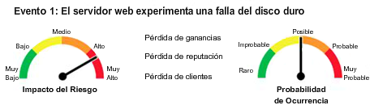

<title coding="utf-8">Análisis de riesgos</title>

# Análisis de riesgos
# Objetivos
* __Parte 1__: Utilizar métodos de Análisis de Riesgos.
* __Parte 2__: Calcular los riesgos.

# Trasfondo/Situación
Un análisis de riesgos determina las posibles vulnerabilidades y amenazas, su probabilidad y consecuencias, y las tolerancias para tales eventos. Los resultados de este proceso pueden expresarse mediante el uso de un método cuantitativo o cualitativo. El análisis cuantitativo de riesgos implica cálculos para asignar un valor a una posible vulnerabilidad o amenaza. Esta opción funciona mejor cuando se trata de activos tangibles, como edificios, computadoras o inventario. El análisis cualitativo de riesgos asigna un nivel utilizado para priorizar el riesgo potencial para que las organizaciones puedan adoptar un enfoque lógico para abordar las amenazas más críticas. Este método funciona mejor para los activos intangibles, como la propiedad intelectual, la reputación de la empresa o las cuentas por cobrar.

# Recursos necesarios
* Computadora personal o dispositivo móvil con acceso a internet.

# Instrucciones
## Parte 1: Uso de métodos de análisis de riesgos
__Riesgo Cuantitativo__.

El análisis cuantitativo de riesgos es el proceso de determinar objetivamente el impacto de un evento mediante el uso de métricas y modelos. Un análisis cuantitativo se basa en información histórica y tendencias para predecir el rendimiento futuro. El resultado del análisis es un valor.

El cálculo de la expectativa de pérdida anualizada (ALE) es un método común para estimar la disminución del valor o la capacidad de un activo después de que se produce un evento adverso.

### Paso 1: Calcule el valor del activo.
En este paso, demostrará cómo calcular el valor del activo.
* __Costo inicial del activo__. El valor del activo es el gasto total necesario para reemplazar un activo. Por ejemplo, el valor total de un activo puede incluir la compra y la licencia o el desarrollo junto con los costos de mantenimiento y soporte. En este ejemplo, el servidor de base de datos de clientes de la organización cuesta aproximadamente $20,000 USD. Esto incluye el hardware, el software y la configuración.
* __Valor Organizacional__. Un valor intangible es más difícil de calcular porque puede incluir el costo de crear, adquirir y recrear información, y el impacto o la pérdida comercial si la información se pierde o se ve comprometida. También puede incluir costos de responsabilidad. En este ejemplo, el costo para crear el sitio web del cliente es de $40,000 USD
* __Valor público__. Un costo intangible que incluye la pérdida de información patentada, o procesos, o la pérdida de reputación comercial. Este valor se estima en $75,000 USD.
	* ¿Cuál es el valor total de los activos del servidor?
	* ¿Por qué el costo intangible es tan alto? ¿Es esto realista?

### Paso 2: Calcular el Factor de Exposición
El factor de exposición se expresa como un porcentaje (o equivalente decimal) de pérdida de un activo si se detecta una amenaza o vulnerabilidad específica. El factor de exposición es un valor subjetivo. Si el activo se pierde por completo, el factor de exposición sería 100% o 1. El factor de exposición podría ser una fracción del valor, como 40% o 0.4, por ejemplo.
* A modo de ejemplo, ¿cuál es el impacto en el servidor si la sala de servidores se inunda y el costo para restaurar el servidor es de $30,000 USD?
	* Valor del activo: $135,000 USD
	* Costo de restauración: $30,000 USD
		* Factor de exposición.

### Paso 3: Calcule la expectativa de pérdida simple
Calcula la expectativa de pérdida simple (SLE) tomando el valor del activo y multiplicándolo por el factor de exposición. El resultado es la pérdida de dólares esperada debido a la ocurrencia de un solo evento. Un solo recurso puede tener múltiples amenazas o vulnerabilidades potenciales, y se puede calcular una sola expectativa de pérdida para cada ocurrencia.

Por ejemplo, se estima que un ataque de denegación de servicio tiene un factor de impacto o de exposición del 20% o 0,2. Esto significa que la SLE es de $135,000 USD x 0,2 = $27,000 USD.

Estime la SLE si se produce una falla en el disco duro o la unidad de almacenamiento donde el mismo valor de activo se estima en $135,000 USD. Este tipo de pérdida daría lugar a un factor de exposición de 0,5.
* ¿Cual es la SLE?
* Calcule la SLE de un ataque de ransomware con un factor de exposición del 100% o 1,0.

### Paso 4: Calcule la tasa anualizada de ocurrencias
La tasa anualizada de ocurrencia (ARO) es una medida de la frecuencia con que se produce un evento en un solo año. ARO siempre se expresa en una calificación anual, incluso si se produce un incidente y se registra en otras medidas de tiempo. En nuestro ejemplo, el servidor de la base de datos del cliente se ve afectado por un ataque de denegación de servicio o DDoS cada 120 días o 4 meses en promedio. Esto significa que el evento ocurrirá tres veces en un año calendario en promedio, por lo que el ataque DoS / DDoS tiene un ARO de 3.
1. En esta situación, calcule el ARO de un ataque de ransomware en el servidor de base de datos de clientes empresariales. En promedio, el servidor experimenta ataques de ransomware cada 24 meses o dos años.
	* ¿Cuál es el ARO de un ataque de ransomware en el servidor de base de datos del cliente?
2. En esta situación, calcule el ARO de una falla de hardware con el servidor de base de datos del cliente. En promedio, el servidor experimenta fallas de hardware cada 30 meses.
	* ¿Cuál es el ARO de las fallas de hardware con el servidor de base de datos del cliente?
	
### Paso 5: Calcular la expectativa de pérdida anualizada
La expectativa de pérdida anualizada (ALE) es el producto del ARO y el SLE. Para calcular el ALE, tome el SLE y multiplíquelo por el ARO. Por ejemplo, si se determina que un corte de energía tiene un SLE de 50,000 USD y un ARO de 0.5, el ALE sería de 25,000 USD.
* ¿Cuál es el ALE de una falla de hardware con el servidor de base de datos del cliente si el SLE = 5000 USD y ARO = 2,5?
* ¿Cuál es el ALE de un ataque de hacking con el servidor de base de datos de clientes si el SLE = 10,000 USD y ARO = 0,5?

### Paso 6: Calcular el análisis de riesgo cualitativo
Un análisis cualitativo compara el impacto de una amenaza con la probabilidad de que ocurra y utiliza etiquetas como baja, media o alta. El impacto de un evento es una medida de la pérdida cuando una amenaza aprovecha una vulnerabilidad. La probabilidad es la probabilidad de que ocurra el evento de amenaza.

El análisis de riesgo cualitativo examina el nivel de impacto general en la organización. Estos problemas incluyen la pérdida de ingresos, la pérdida de reputación y la pérdida de clientes.

	

En el primer evento, el servidor web experimenta una falla en el disco duro que causa una pérdida de ingresos, reputación y clientes. Este es un impacto de muy alto riesgo y una posible probabilidad de ocurrencia.
* Utilizando la siguiente tabla, ¿cuál es el impacto cualitativo?

__Evento 1: Falla el disco duro del servidor web__

Matriz de riesgo-impacto||||||
:-|:-|:-|:-|:-|:-
Probabilidad de ocurrencia|Muy baja|Bajo|Medio|Alta|__Muy alta__
Altamente probable|Moderado|Comandante|Comandante|Severo|Severo
Probable|Moderado|Moderado|Comandante|Comandante|Severo
__Posible__|Menor|Moderado|Moderado|Moderado|Comandante
Poco probable|Menor|Moderado|Moderado|Moderado|Comandante
Raro|Menor|Menor|Menor|Moderado|Moderado

En el segundo evento, se lanza un ataque de denegación de servicio contra el servidor web. Este es un impacto de alto riesgo y una probabilidad probable de ocurrencia.
* Utilizando la siguiente tabla, ¿cuál es el impacto cualitativo?

__Evento 2: Un ataque DoS/DDoS__

Matriz de riesgo-impacto||||||
:-|:-|:-|:-|:-|:-
Probabilidad de ocurrencia|Muy baja|Bajo|Medio|__Alta__|Muy alta
Altamente probable|Moderado|Comandante|Comandante|Severo|Severo
__Probable__|Moderado|Moderado|Comandante|Comandante|Severo
Posible|Menor|Moderado|Moderado|Moderado|Comandante
Poco probable|Menor|Moderado|Moderado|Moderado|Comandante
Raro|Menor|Menor|Menor|Moderado|Moderado

En el tercer evento, hay un incendio en la sala de servidores. Este es un impacto de muy alto riesgo y una rara probabilidad de ocurrencia.
* Utilizando la siguiente tabla, ¿cuál es el impacto cualitativo?

__Evento 3: Incendio en la sala de servidores__

Matriz de riesgo-impacto||||||
:-|:-|:-|:-|:-|:-
Probabilidad de ocurrencia|Muy baja|Bajo|Medio|Alta|__Muy alta__
Altamente probable|Moderado|Comandante|Comandante|Severo|Severo
Probable|Moderado|Moderado|Comandante|Comandante|Severo
Posible|Menor|Moderado|Moderado|Moderado|Comandante
Poco probable|Menor|Moderado|Moderado|Moderado|Comandante
__Raro__|Menor|Menor|Menor|Moderado|Moderado

En el cuarto evento, se robaron datos de tarjetas de crédito. Este es un impacto de muy alto riesgo y una probabilidad poco probable de ocurrencia.
* Utilizando la siguiente tabla, ¿cuál es el impacto cualitativo?

__Evento 4: Violación de datos / Datos de tarjetas de crédito robados__

Matriz de riesgo-impacto||||||
:-|:-|:-|:-|:-|:-
Probabilidad de ocurrencia|Muy baja|Bajo|Medio|Alta|__Muy alta__
Altamente probable|Moderado|Comandante|Comandante|Severo|Severo
Probable|Moderado|Moderado|Comandante|Comandante|Severo
Posible|Menor|Moderado|Moderado|Moderado|Comandante
__Poco probable__|Menor|Moderado|Moderado|Moderado|Comandante
Raro|Menor|Menor|Menor|Moderado|Moderado

En el quinto evento, hay un tornado en el área. Este es un impacto de bajo riesgo y una rara probabilidad de ocurrencia.
* Utilizando la siguiente tabla, ¿cuál es el impacto cualitativo?

__Evento 5: Clima/Tornado__

Matriz de riesgo-impacto||||||
:-|:-|:-|:-|:-|:-
Probabilidad de ocurrencia|Muy baja|__Baja__|Medio|Alta|Muy alta
Altamente probable|Moderado|Comandante|Comandante|Severo|Severo
Probable|Moderado|Moderado|Comandante|Comandante|Severo
Posible|Menor|Moderado|Moderado|Moderado|Comandante
Poco probable|Menor|Moderado|Moderado|Moderado|Comandante
__Raro__|Menor|Menor|Menor|Moderado|Moderado

## Parte 2: Calcular los riesgos
### Paso 1: Escenario de los equipos portátiles de la empresa ABC
ABC Company posee 65 computadoras portátiles. Cada computadora portátil cuesta $1,200 USD. Basará sus cálculos en el valor de una computadora portátil. El equipo identificó tres amenazas. Según los datos internos, calcule el ARO y el ALE con la información proporcionada. Introduzca los valores que faltan en la tabla.

Evento de Amenaza|SLE|EF|Tasa de Ocurrencia|ARO|ALE
:-|:-|:-|:-|:-|:-
Robo de equipos|1.200 USD|100% (1.0)|Una vez cada 2 años|0.5|600 USD
Daño por caída|720 USD|60% (0.6)|Una vez cada 5 años|0.2|144 USD
Malware|240 USD|20% (0.2)|Dos veces al año|2|480 USD
ALE total para todas las amenazas|1.224 USD|

### Paso 2: Escenario de la red de área de almacenamiento de la empresa ABC
Pregunta:
La empresa ABC está realizando un análisis de riesgos para su red de área de almacenamiento. El valor total del activo es de $250,000 USD. El equipo identificó las tres amenazas que se muestran en la tabla. Los datos del fabricante y los registros de la empresa proporcionaron los datos que figuran en la tabla. Introduzca los valores que faltan en la tabla.

Evento de Amenaza|SLE|EF|Tasa de Ocurrencia|ARO|ALE
:-|:-|:-|:-|:-|:-
Falla del disco|12.500 USD|5% (0.05)|Dos veces al año|2|25.000 USD
Corte de energía|250.000 USD|100% (1.0)|Una vez cada 8 años|0.125|31.250 USD
Ataque de DoS/DDoS|25.000 USD|10% (0.1)|Una vez cada 2 años|0.5|12.500 USD
ALE total para todas las amenazas|68.750 USD

### Paso 3: Escenario de amenazas del servidor de base de datos de la empresa ABC:
Compañia ABC gastó $18,000 USD en un servidor de base de datos. La configuración e instalación totalizaron $2,000 USD. Complete la tabla de desafíos de análisis de riesgos según las cuatro amenazas identificadas por el equipo de ABC. Introduzca los valores que faltan en la tabla.

Evento de Amenaza|SLE|EF|Tasa de Ocurrencia|ARO|ALE
:-|:-|:-|:-|:-|:-
Falla del dispositivo|1.000 USD|5% (0.05)|Una vez cada 18 meses|0.66|666 USD
Corte de energía|20.000 USD|100% (1.0)|Una vez cada 5 años|0.2|4.000 USD
Ataque a DoS/DDoS|3.000 USD|15% (0.15)|Una vez cada 4 años|0.25|750 USD
Robo de información|8.000 USD|40% (0.4)|Una vez cada 2 años|0.5|4.000 USD
Errores de configuración|200 USD|1% (0.1)|Una vez al mes|12|2.400 USD
ALE total para todas las amenazas|11.816 USD

### Paso 4: Escenario del desafío del sistema de punto de venta de la empresa ABC
ABC Company gastó $10,000 USD en su sistema de punto de venta remoto. La configuración e instalación totalizaron $5,000 USD. Complete la tabla en función de las cuatro amenazas identificadas por el equipo de ABC. Introduzca los valores que faltan en la tabla.

Evento de Amenaza|SLE|EF|Tasa de Ocurrencia|ARO|ALE
:-|:-|:-|:-|:-|:-
Robo de equipos|15.000 USD|100% (1.0)|Una vez cada 5 años|0.2|3.000 USD
Fallas de equipos|1.500 USD|10% (0.1)|Dos veces al año|2|3.000 USD
Ransomware|3.000 USD|20% (0.2)|Una vez cada 10 años|0.1|300 USD
Vulneración de datos|6.000 USD|40% (0.4)|Una vez cada 5 años|0.2|1.200 USD
ALE total para todas las amenazas|7.500 USD

### Paso 5: Escenario del desafío de las instalaciones de nube privada de la empresa ABC
Pregunta:
BC Company gastó $500,000 USD en el desarrollo y la compra de una instalación de nube privada. La configuración e instalación totalizaron $50,000 USD y la programación y el desarrollo de aplicaciones costaron otros $450,000 USD. Complete la tabla de desafíos de análisis de riesgos en función de las cuatro amenazas identificadas por el equipo de ABC. Introduzca los valores que faltan en la tabla.

Evento de Amenaza|SLE|EF|Tasa de Ocurrencia|ARO|ALE
:-|:-|:-|:-|:-|:-
Corte de energía|500.000 USD|50% (0.5)|Una vez cada 5 años|0.2|100.000 USD
Ataque a DoS/DDoS|400.000 USD|40% (0.4)|Una vez cada 2 años|0.5|200.000 USD
Vulneración de datos|400.000 USD|40% (0.4)|Una vez cada 10 años|0.1|40.000 USD
Saturar|1.000.000 USD|100% (1.0)|Una vez cada 20 años|0.05|50.000 USD
ALE total para todas las amenazas|390.000 USD