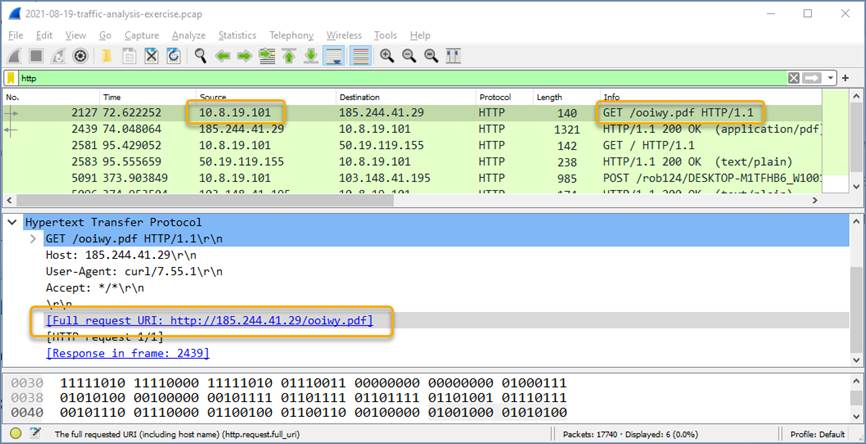

<title coding="utf-8"># Identificar inteligencia relevante de amenazas</title>

# Identificar inteligencia relevante de amenazas
# Objetivos
* __Parte 1__: Investigar las CVE de MITRE.
* __Parte 2__: Acceder a la base de conocimientos MITRE ATT & CK.
* __Parte 3__: Investigar posible malware.

# Trasfondo/Situación
Usted ha sido contratado como analista de ciberseguridad de nivel 1 por XYZ, Inc. Los analistas de nivel 1 generalmente son responsables de responder a los tickets entrantes y las alertas de seguridad. En esta práctica de laboratorio, realizará una investigación de amenazas de inteligencia para varios escenarios que han afectado a XYZ, Inc. Cada escenario requerirá que acceda a sitios web de amenazas de inteligencia y responda preguntas sobre la amenaza encontrada en el escenario.

# Recursos necesarios
* 1 computadora con acceso a Internet.

# Instrucciones
## Parte 1: Investigación de CVE MITRE
La organización MITRE creó la base de datos de vulnerabilidades y exposiciones comunes (CVE) en 1999 para identificar, definir y clasificar vulnerabilidades de ciberseguridad divulgadas públicamente. Fue avalado por el Instituto Nacional de Normas y Tecnología (NIST) La base de datos de CVE ahora es el método estándar de registro e identificación de vulnerabilidades.

En esta parte, investigará el programa CVE y utilizará la lista de CVE para identificar amenazas.

### Paso 1: Investigar el sitio web de CVE.
Vaya a https://cve.mitre.org y vaya a la página About > Terminology para responder las siguientes preguntas.
* ¿Qué es el programa CVE?
* ¿Qué es una autoridad de numeración CVE (CNA)?
* ¿Qué es un Publicador de Datos Autorizado (ADP)?
* ¿Qué es la Lista de CVE?
* ¿Qué es un Registro de CVE?
* ¿Qué es una ID de CVE?

### Paso 2: Investigar las CVE en el sitio web de Avisos de Seguridad de Cisco.
Muchos sitios de seguridad y software hacen referencia a CVE. Por ejemplo, el sitio web de cisco.com proporciona avisos de seguridad de Cisco que identifican las vulnerabilidades asociadas con los productos de Cisco. En este paso, se referirá a este sitio web para identificar una ID de CVE.
1. Deje abierto el sitio web cve.mitre.org. En otra pestaña del navegador, busque en Internet Cisco Security Advisories (Avisos de Seguridad de Cisco) y haga clic en el enlace para ir a la página web tools.cisco.com.
2. Esta página enumera todas las CVE conocidas actualmente. Para la columna Impact (Impacto), haga clic en la flecha hacia abajo y desmarque todo excepto Critical (Crítico), y luego haga clic en Done (Listo).
3. Elija uno de los avisos y responda las siguientes preguntas sobre el asesoramiento seleccionado.
	* ¿Cuál es el nombre del aviso que eligió?
	* ¿Cuál es la ID de CVE? Utilizará esta ID en el próximo paso?
4. Puede hacer clic en el aviso para ir a la página de detalles o hacer clic en la flecha hacia abajo junto al nombre del aviso para obtener más información.
	* ¿Hay alguna solución temporal para el aviso que eligió?

### Paso 3: Regresar al sitio web de CVE e investigue más sobre su Cisco CVE elegido.
1. Vuelva al sitio web cve.mitre.org, que aún debe estar abierto en una pestaña del navegador.
2. Haga clic en Search CVE List (Buscar lista de CVE) para abrir un cuadro de búsqueda.
3. En el campo de búsqueda, introduzca la ID de CVE para el aviso crítico que documentó en el paso anterior. La ID de CVE tiene el siguiente formato: CVE- [año] - [número_ID].
	* Describa brevemente la vulnerabilidad.

## Parte 2: Acceder a la base de conocimientos MITRE ATT & CK
El marco de tácticas adversariales, técnicas y conocimiento común (ATT&CK) de MITRE permite detectar tácticas, técnicas y procedimientos del atacante como parte de la defensa de amenazas y la atribución de ataques. En esta parte, investigará el sitio web de MITER ATT & CK para responder preguntas.

### Paso 1: Vaya al sitio web de MITER ATT & CK.
Vaya al sitio web https://attack.mitre.org.

La página muestra una matriz de ataque para empresas que identifica diversas tácticas y técnicas utilizadas por los agentes de amenazas. Las tácticas son los títulos de las columnas del encabezado (ej., Reconocimiento, desarrollo de recursos, etc.) con las técnicas enumeradas a continuación. Una frase corta para cada técnica resume lo que un agente de amenazas podría hacer para ejecutar un ataque. Al hacer clic en la frase vinculada, accederá a una página para obtener información detallada sobre las técnicas y los métodos de mitigación.

Nota: Es posible que deba ampliar el ancho de la ventana del navegador para ver las 14 tácticas. Alternativamente, puede mantener presionada la tecla Mayús y desplazar la rueda del mouse para desplazar la ventana hacia la izquierda y la derecha.

Esta matriz es un excelente lugar para aprender más sobre las diferentes tácticas y técnicas que los agentes de amenazas utilizan para comprometer los sistemas. Los analistas de ciberseguridad visitan regularmente este sitio para investigar ataques específicos y posibles mitigaciones.

### Paso 2: Investigar la táctica de reconocimiento y la táctica de suplantación de identidad para obtener información.
Utilice la página MITER ATT & CK para responder las siguientes preguntas.
* ¿Cuántas técnicas se atribuyen a la táctica de reconocimiento?
* En Reconocimiento, haga clic en Suplantación de identidad para obtener información y lea la descripción. Describa brevemente cómo un agente de amenazas podría recopilar información de reconocimiento mediante técnicas de suplantación de identidad (phishing).
* Expanda el menú desplegable debajo del encabezado de suplantación de identidad para información o consulte el menú a la izquierda. ¿Cuáles son las sub-técnicas utilizadas al suplantar la información?
* ¿Qué medidas podría tomar para mitigar estas técnicas?

### Paso 3: Investigar la táctica de Comando y Control y la técnica de Codificación de Datos.
Utilice la página MITER ATT & CK para responder las siguientes preguntas.

__Nota__: Comando y Control es la táctica número 12 en la matriz. Es posible que deba ampliar el ancho de la ventana del navegador para verla. Alternativamente, puede mantener presionada la tecla Mayús y desplazar la rueda del mouse para desplazar la ventana hacia la izquierda y la derecha.

* ¿Cuántas técnicas se atribuyen a la táctica de Comando y Control?
* En Comando y Control, haga clic en Codificación de Datos y lea la descripción. Describa brevemente cómo un agente de amenazas podría utilizar la codificación de datos para Comando y Control.
* ¿Qué podría hacer para mitigar esta técnica?

### Paso 4: Investigar la táctica de impacto
Utilice la página MITER ATT & CK para responder las siguientes preguntas.

__Nota__: La táctica de Impacto es la última táctica en el extremo derecho de la matriz.

* ¿Cuántas técnicas se atribuyen a la táctica del Impacto?
* En Impacto, haga clic en Limpiar disco y lea la descripción. Describa brevemente el impacto si un agente de amenazas limpia un disco?
* ¿Qué podría hacer para mitigar esta técnica?

## Parte 3: Investigar posible malware
Hay un número de herramientas que un analista de ciberseguridad puede utilizar para validar software malicioso. En esta parte, investigará una alerta de IPS para ver si se trata de software malicioso.

### Paso 1: Generar un hash SHA256 para un archivo sospechoso.
Como analistas de ciberseguridad de nivel 1, tiene acceso a un sistema de administración de eventos de información de seguridad (SIEM) en su estación de administración de Linux. El SIEM acaba de enviarle una alerta de IPS que hace referencia a una dirección IP local del 10.8.19.101. Decide examinar el tráfico real identificado en la alerta utilizando Wireshark.
1. A medida que se desplaza por las distintas capturas de paquetes de la dirección IP 10.8.19.101, observa que el host descargó un archivo, como se muestra en la figura.

<div style="width: 60%;padding-left: 15%;">
	
</div><br />

2. Decide exportar este archivo desde Wireshark para el análisis de malware mediante el comando File > ExportObjects > HTTP y guardar el archivo con el nombre ooiwy.pdf.
3. A continuación, generará el valor hash SHA256 del archivo guardado con el comando sha256sum como se muestra.
```shell
[analyst@secOps ~]:~$ sha256sum ooiwy.pdf
f25a780095730701efac67e9d5b84bc289afea56d96d8aff8a44af69ae606404 ooiwy.pdf
```

Observe la firma de hash SHA256 que se generó. Esta cadena se puede validar en varios sitios de reputación de archivos para ver si el archivo es malware.

### Paso 2: Buscar el hash en los sitios web de reputación de archivos.
Hay varios sitios de reputación de archivos que pueden utilizarse para investigar este archivo. En este paso, utilizará el sitio web Talos de Cisco y virustotal.com.
1. Busque "Cisco Talos" y haga clic en el primer enlace para acceder al sitio web de Cisco Talos Intelligence Group.
2. Busque los menús en la parte superior y sobre el Reputation Center (Centro de reputación) para desplegar un submenú. Haga clic en el enlace de la página de búsqueda Talos File Reputation (Reputación de Archivos de Talos).
3. Copie el valor hash de SHA resaltado del paso anterior y péguelo en la ventana de búsqueda. Haga clic en la casilla de verificación “I’m not a robot” y luego haga clic en Buscar.
4. Revise la información de este archivo.
	* ¿Cuál es la puntuación de reputación de archivos ponderados de Talos? ¿Es eso bueno o malo?
5. Busque y navegue hasta el sitio web de VirusTotal.
6. Haga clic en Buscar, pegue el hash SHA256 en el campo y presione Intro. La página muestra todos los proveedores de seguridad que han identificado este archivo como malicioso (a la izquierda) y los nombres que estas empresas utilizan para identificar el archivo malicioso.
7. Observe los encabezados de columna DETECTION, DETAILS, RELATIONS, BEHAVIOR, y COMMUNITY. Utilice la información de la página DETAILS para responder las siguientes preguntas.
	* ¿Cuándo fue creado este archivo?
	* ¿Con qué otros nombres se conoce el archivo además de ooiwy.pdf?
	* ¿Cuál es la máquina de destino?