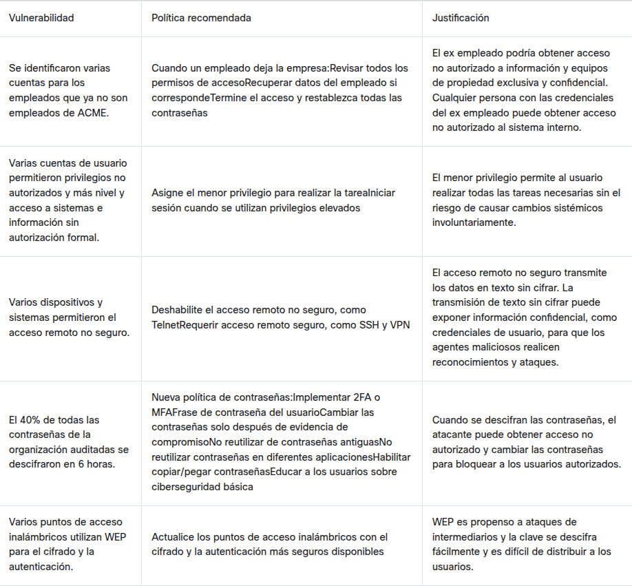

<title coding="utf-8">Desarrollando políticas y procedimientos de ciberseguridad</title>

# Desarrollando políticas y procedimientos de ciberseguridad
# Introducción
Las políticas de seguridad de la información proporcionan un marco para que las organizaciones administren y protejan sus activos, y una protección que las organizaciones emplean para reducir el riesgo. Los estudiantes deberán comparar las políticas de seguridad de la información para determinar las diferencias entre las políticas, los estándares, las pautas y los procedimientos. Luego, los estudiantes desarrollarán una política de seguridad de la información para abordar las vulnerabilidades existentes identificadas por una auditoría interna.

Por ejemplo, una política de contraseñas establece el estándar para crear contraseñas seguras y proteger contraseñas. Una guía de construcción de contraseñas define cómo crear una contraseña segura y proporciona recomendaciones de mejores prácticas. El procedimiento de contraseña proporciona las instrucciones sobre cómo implementar el requisito de contraseña segura. Las organizaciones no actualizan las políticas con tanta frecuencia como actualizan los procedimientos dentro del marco de políticas de seguridad de la información.

# Objetivos
Este proyecto incluye los siguientes objetivos:
* __Parte 1__: Revisar el escenario.
* __Parte 2__: Revisar y priorizar los resultados de la auditoría.
* __Parte 3__: Desarrollar documentos de políticas.
* __Parte 4__: Desarrollar un plan para difundir y evaluar las políticas.

# Requisitos
Necesitará acceso a Internet para los siguientes sitios web, videos y documentos:
* Proyecto de Política de Seguridad de SANS https://www.sans.org/security-resources/policies/
* Política de Seguridad de la Información (video) https://youtu.be/ZlKgMUOpMf8
* Principales Vulnerabilidades de la Seguridad Informática https://www.n-able.com/features/computer-security-vulnerability
* Política de seguridad de la información: Guía de desarrollo para grandes y pequeñas empresas (pdf) https://www.sans.org/reading-room/whitepapers/policyissues/information-security-policy-development-guide-large-small-companies- 1331
* Redacción técnica para políticas de seguridad de TI en cinco sencillos pasos https://www.sans.org/reading-room/whitepapers/policyissues/technical-writing-security-policies-easy-steps-492

# Situación
ACME Healthcare es una empresa de servicios de salud que administra más de 25 centros médicos, incluidos atención para pacientes, diagnósticos, atención ambulatoria y atención de emergencia. La organización ha experimentado varias violaciones de datos en los últimos cinco años. Estas violaciones de datos han costado financieramente a la organización y han dañado su reputación.

El equipo de liderazgo ejecutivo contrató recientemente a un nuevo director de seguridad de la información (CISO). El nuevo CISO ha traído a uno de los principales equipos de penetración de ciberseguridad para realizar una auditoría de seguridad completa en toda la organización. Este contratista independiente realizó la auditoría y descubrió las siguientes vulnerabilidades:
1) Se identificaron varias cuentas de empleados que ya no trabajan en ACME.
2) Varias cuentas de usuario permitieron privilegios no autorizados y de más nivel. Estas cuentas accedían a sistemas e información sin autorización formal.
3) Varios dispositivos y sistemas permitieron el acceso remoto no seguro.
4) El 40% de todas las contraseñas de la organización auditadas se descifraron en 6 horas.
5) El vencimiento de la contraseña no estaba estandarizado.
6) Los archivos confidenciales se encontraron sin cifrar en los dispositivos de los usuarios.
7) Varios puntos de acceso inalámbrico utilizaron WEP para el cifrado y la autenticación.
8) La evidencia indica que se envió correo electrónico confidencial desde y hacia los hogares de los empleados y los dispositivos móviles sin cifrado.
9) Los registros de detección de intrusiones se revisaban y analizaban con poca frecuencia.
10) Los empleados utilizaron dispositivos con datos confidenciales de la empresa para uso privado.
11) Los dispositivos de los empleados quedaban desatendidos y los empleados fallaban en cerrar sesión en la red y los sistemas de datos de la empresa.
12) Se realizaron configuraciones y actualizaciones de dispositivos inconsistentes.
13) Se establecieron varias reglas de firewall para permitir todo el tráfico, a menos que se deniegue específicamente.
14) Los servidores de la empresa no se actualizaron con los últimos parches.
15) El servidor web de la intranet permitió a los usuarios cambiar su información personal, incluida la información de contacto.

# Instrucciones
## Parte 1: Revisión del escenario
Lea el escenario anterior. Mire el video Política de Seguridad de la Información. Tome notas para diferenciar los diferentes niveles y tipos de políticas.

## Parte 2: Revisar y priorizar los resultados de la auditoría
1. Investigue los tipos de vulnerabilidades enumerados para determinar cuáles representan la mayor amenaza. Vaya a Principales Vulnerabilidades de la Seguridad Informática para obtener más información.
2. Según su investigación, enumere los cinco hallazgos principales de auditoría de seguridad que ACME debe abordar, comenzando por la mayor vulnerabilidad.
3. Registre sus clasificaciones en una Tabla de Clasificación de Vulnerabilidades, como la que se muestra a continuación. Enumera las Vulnerabilidades, la Política Recomendada para mitigar esta vulnerabilidad y su Justificación para la clasificación que determinó.
* Tabla de clasificación de vulnerabilidades

__Vulnerabilidad__|__Política recomendada__|__Justificación__
-:|-:|-:
Respuesta|Respuesta|Respuesta
Respuesta|Respuesta|Respuesta
Respuesta|Respuesta|Respuesta
Respuesta|Respuesta|Respuesta
Respuesta|Respuesta|Respuesta

	

## Parte 3: Desarrollar Documentos de Políticas
### Paso 1: Crear una política de seguridad de la información
1. Elija una vulnerabilidad en la tabla para desarrollar una política de seguridad.
2. Utilice las Plantillas de Políticas de Seguridad de la Información para desarrollar una política de seguridad específica para ACME Healthcare que aborde la vulnerabilidad elegida.
__Nota__: Siga la plantilla como guía. Abordar todos los elementos de políticas existentes. Ninguna política debe superar las dos páginas.

### Paso 2: Crear un procedimiento
1. Cree un conjunto de instrucciones paso a paso que respalde su política de seguridad de la información. Vaya a Política de Seguridad de la Información: Guía de Desarrollo y Tedacción Técnica para las Políticas de Seguridad de TI en Cinco Pasos Sencillos para obtener instrucciones y orientación.
	__Nota__: Todos los enlaces anteriores también serán útiles en la Parte 4 de esta práctica de laboratorio. Manténgalos abiertos y márquelos como favoritos.
2. Incluya toda la información que un usuario necesitaría para configurar o completar correctamente la tarea de acuerdo con la política de seguridad.

## Parte 4: Desarrollar un Plan para Difundir y Evaluar Políticas
### Paso 1: Crear un plan de implementación y difusión de políticas de seguridad de la información.
1. Documentar la información requerida para crear un plan de implementación y difusión de políticas de seguridad de la información.
2. Incluya tareas y eventos específicos que ACME Healthcare utilizará para asegurarse de que todos los empleados involucrados conozcan las políticas de seguridad de la información que les concierne.
3. Incluya todos los departamentos específicos que deban participar. ACME Healthcare también debe poder evaluar si las personas tienen el conocimiento adecuado de las políticas relacionadas con sus responsabilidades laborales.

# Conclusión
Las políticas de seguridad de la información proporcionan un marco de trabajo de cómo una organización protege sus activos y es una protección que la organización emplea para reducir el riesgo. Este proyecto examinó por qué una organización desarrolla políticas de seguridad de la información y las diferencias entre las políticas, los estándares, las pautas y los procedimientos de seguridad de la información. Este proyecto también exploró cómo una organización difunde y evalúa las políticas de seguridad de la información.